# OpenAI提供者实现

<cite>
**本文档引用的文件**
- [openai-provider.ts](file://packages/ai/src/providers/openai-provider.ts)
- [provider-factory.ts](file://packages/ai/src/providers/provider-factory.ts)
- [types.ts](file://packages/ai/src/providers/types.ts)
- [ai-config.ts](file://packages/ai/src/models/ai-config.ts)
- [index.ts](file://packages/ai/src/providers/index.ts)
- [ai-config.ts](file://packages/server/src/routes/ai-config.ts)
- [api.ts](file://packages/web/src/lib/api.ts)
</cite>

## 目录
1. [简介](#简介)
2. [项目结构](#项目结构)
3. [核心组件](#核心组件)
4. [架构概览](#架构概览)
5. [详细组件分析](#详细组件分析)
6. [依赖关系分析](#依赖关系分析)
7. [性能考虑](#性能考虑)
8. [故障排除指南](#故障排除指南)
9. [结论](#结论)
10. [附录](#附录)

## 简介

OpenAI提供者实现是AI测试框架中用于与OpenAI API进行交互的核心组件。该实现提供了统一的接口来执行聊天补全和结构化输出任务，支持Zod Schema验证，并包含连接性测试功能。

本实现采用工厂模式设计，通过ProviderFactory类创建不同类型的AI提供者实例，目前主要支持OpenAI和Anthropic服务，同时保留了自定义OpenAI兼容端点的支持。

## 项目结构

AI包的整体结构采用模块化设计，将提供者实现、类型定义和工厂逻辑分离到不同的文件中：

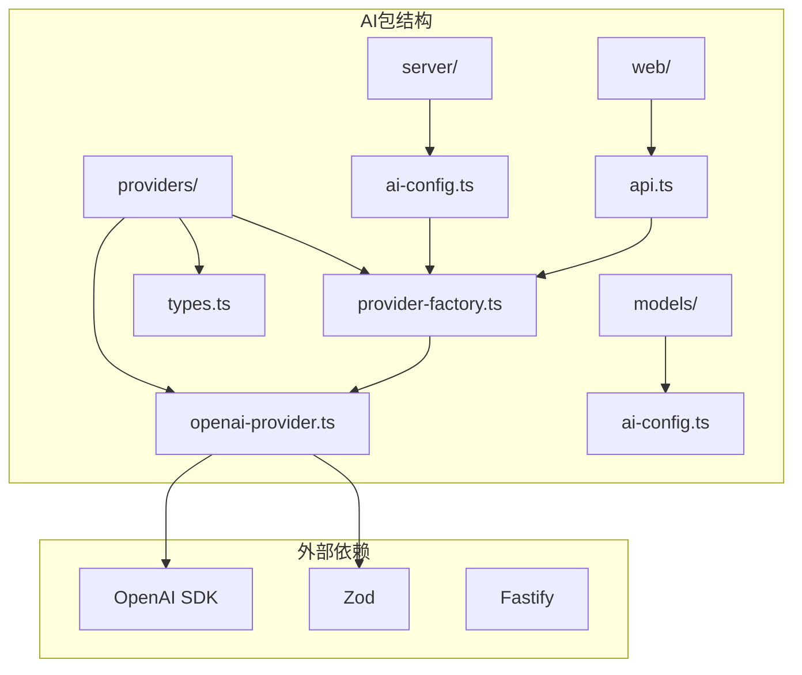

**图表来源**
- [openai-provider.ts:1-79](file://packages/ai/src/providers/openai-provider.ts#L1-L79)
- [provider-factory.ts:1-56](file://packages/ai/src/providers/provider-factory.ts#L1-L56)
- [ai-config.ts:1-34](file://packages/ai/src/models/ai-config.ts#L1-L34)

**章节来源**
- [openai-provider.ts:1-79](file://packages/ai/src/providers/openai-provider.ts#L1-L79)
- [provider-factory.ts:1-56](file://packages/ai/src/providers/provider-factory.ts#L1-L56)
- [types.ts:1-35](file://packages/ai/src/providers/types.ts#L1-L35)

## 核心组件

### OpenAiProvider类

OpenAiProvider类是整个实现的核心，实现了LlmProvider接口，提供了以下关键功能：

#### 构造函数配置
- **API密钥管理**: 支持标准OpenAI API密钥和解密后的密钥
- **模型配置**: 支持多种OpenAI模型（如gpt-4o、gpt-4o-mini等）
- **基础URL设置**: 允许自定义API端点，支持Anthropic代理
- **默认参数**: 温度参数默认0.7，最大令牌数默认4096

#### 私有属性管理
- `client`: OpenAI SDK客户端实例
- `model`: 当前使用的AI模型名称
- `defaultTemperature`: 默认温度参数
- `defaultMaxTokens`: 默认最大令牌数

#### 方法实现

**chatCompletion方法**
- 接收ChatMessage数组和可选的LlmOptions参数
- 将消息格式转换为OpenAI SDK期望的格式
- 支持动态温度和令牌数控制
- 返回纯文本响应内容

**structuredOutput方法**
- 集成Zod Schema验证系统
- 使用OpenAI Beta API的解析功能
- 提供类型安全的结构化输出
- 自动验证和转换响应数据

**testConnection方法**
- 执行简单的连接性测试
- 使用极短的响应限制确保快速验证
- 返回布尔值表示连接状态

**章节来源**
- [openai-provider.ts:14-79](file://packages/ai/src/providers/openai-provider.ts#L14-L79)

### ProviderFactory工厂类

ProviderFactory类负责创建和管理不同类型的AI提供者实例：

#### 工厂输入配置
- `provider`: 指定AI服务提供商类型
- `model`: AI模型名称
- `apiKey`: 解密后的API密钥
- `baseUrl`: 可选的基础URL
- `temperature`: 可选的温度参数
- `maxTokens`: 可选的最大令牌数

#### 提供商支持
- **OpenAI**: 标准OpenAI API
- **Anthropic**: 通过代理或直接SDK支持
- **Custom**: 自定义OpenAI兼容端点

**章节来源**
- [provider-factory.ts:14-55](file://packages/ai/src/providers/provider-factory.ts#L14-L55)

### 类型系统

#### ChatMessage接口
- `role`: 角色类型（system、user、assistant）
- `content`: 消息内容字符串

#### LlmOptions接口
- `temperature`: 温度参数（0-2范围）
- `maxTokens`: 最大令牌数（正整数）

#### LlmProvider接口
- 统一的AI服务接口定义
- 支持自由文本聊天补全
- 支持结构化输出

**章节来源**
- [types.ts:3-35](file://packages/ai/src/providers/types.ts#L3-L35)

## 架构概览

整个OpenAI提供者实现采用了清晰的分层架构：

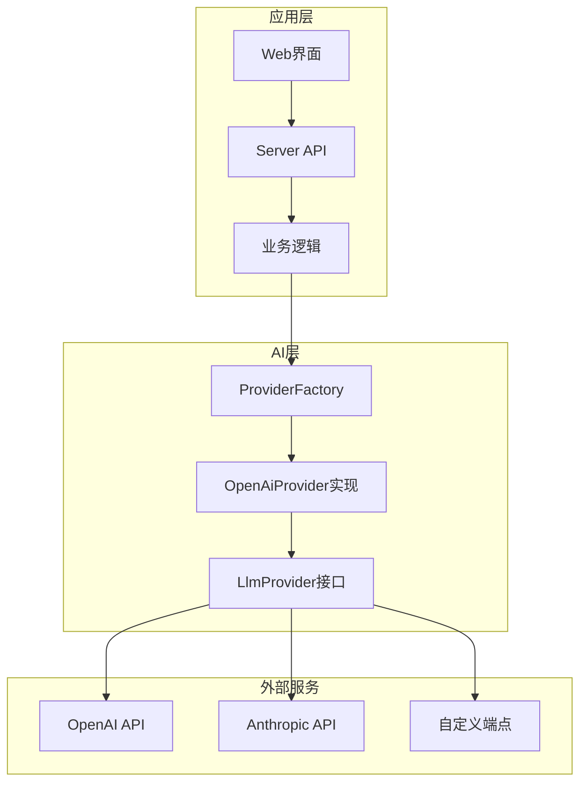

**图表来源**
- [openai-provider.ts:14-79](file://packages/ai/src/providers/openai-provider.ts#L14-L79)
- [provider-factory.ts:14-55](file://packages/ai/src/providers/provider-factory.ts#L14-L55)

### 数据流架构

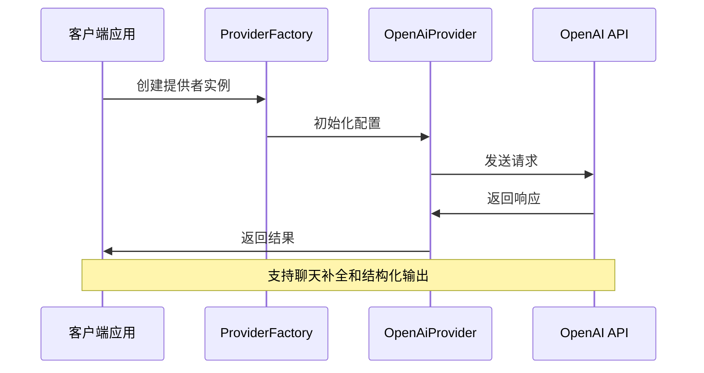

**图表来源**
- [provider-factory.ts:14-55](file://packages/ai/src/providers/provider-factory.ts#L14-L55)
- [openai-provider.ts:30-79](file://packages/ai/src/providers/openai-provider.ts#L30-L79)

## 详细组件分析

### OpenAiProvider类深度分析

#### 类图结构

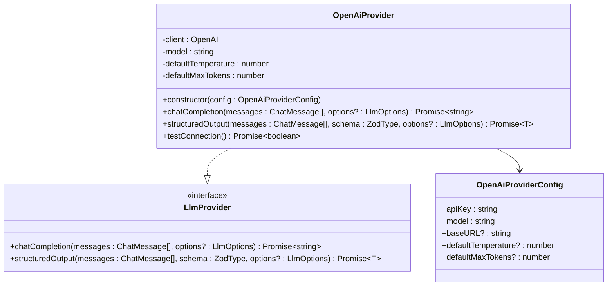

**图表来源**
- [openai-provider.ts:6-79](file://packages/ai/src/providers/openai-provider.ts#L6-L79)
- [types.ts:13-23](file://packages/ai/src/providers/types.ts#L13-L23)

#### 聊天补全方法实现

**消息格式转换流程**

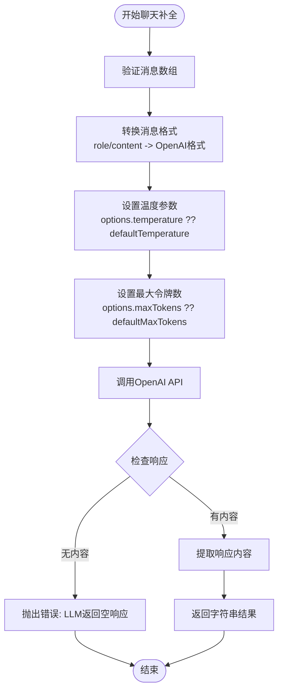

**图表来源**
- [openai-provider.ts:30-43](file://packages/ai/src/providers/openai-provider.ts#L30-L43)

**方法参数处理**

| 参数 | 类型 | 默认值 | 说明 |
|------|------|--------|------|
| messages | ChatMessage[] | 必需 | 用户提供的消息数组 |
| options.temperature | number | 0.7 | 温度参数，控制创造性 |
| options.maxTokens | number | 4096 | 最大生成令牌数 |

#### 结构化输出方法实现

**Zod集成架构**

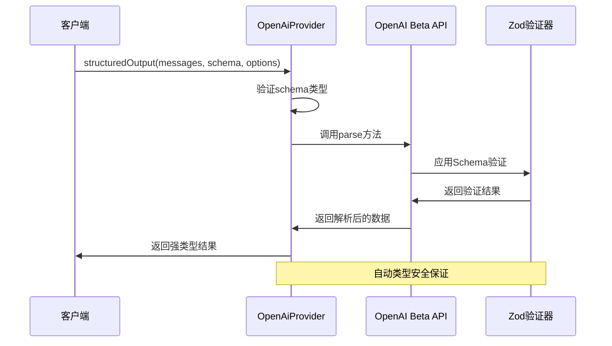

**图表来源**
- [openai-provider.ts:45-63](file://packages/ai/src/providers/openai-provider.ts#L45-L63)

**Schema验证流程**

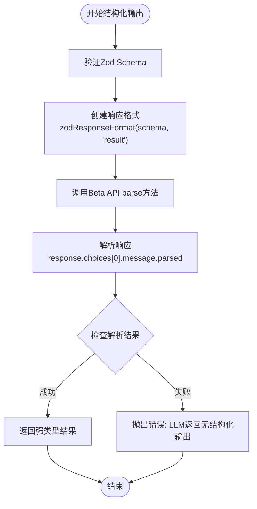

**图表来源**
- [openai-provider.ts:45-63](file://packages/ai/src/providers/openai-provider.ts#L45-L63)

#### 连接测试方法实现

**连接性测试流程**

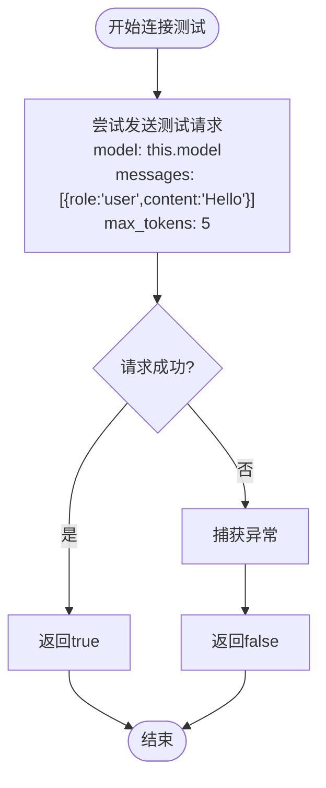

**图表来源**
- [openai-provider.ts:65-77](file://packages/ai/src/providers/openai-provider.ts#L65-L77)

**错误处理策略**
- 捕获所有API调用异常
- 返回布尔值而非抛出异常
- 使用极短的响应限制确保快速失败

**章节来源**
- [openai-provider.ts:30-79](file://packages/ai/src/providers/openai-provider.ts#L30-L79)

### ProviderFactory工厂模式分析

#### 工厂创建流程

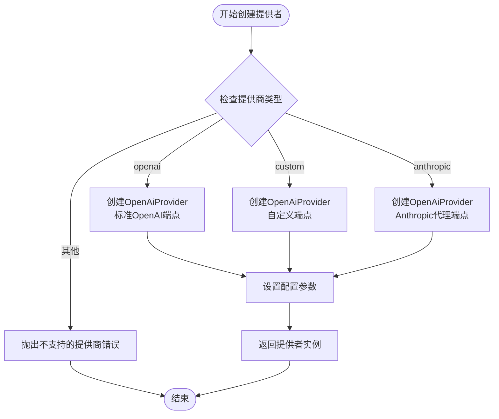

**图表来源**
- [provider-factory.ts:14-55](file://packages/ai/src/providers/provider-factory.ts#L14-L55)

**配置参数映射**

| 工厂输入 | 提供者配置 | 默认值 |
|----------|------------|--------|
| provider | 无变化 | 从AiConfig获取 |
| model | model | 从AiConfig获取 |
| apiKey | apiKey | 从AiConfig获取 |
| baseUrl | baseURL | 从AiConfig获取或undefined |
| temperature | defaultTemperature | 从AiConfig获取 |
| maxTokens | defaultMaxTokens | 从AiConfig获取 |

**章节来源**
- [provider-factory.ts:14-55](file://packages/ai/src/providers/provider-factory.ts#L14-L55)

### 类型安全保证

#### Zod Schema集成

**类型推断机制**

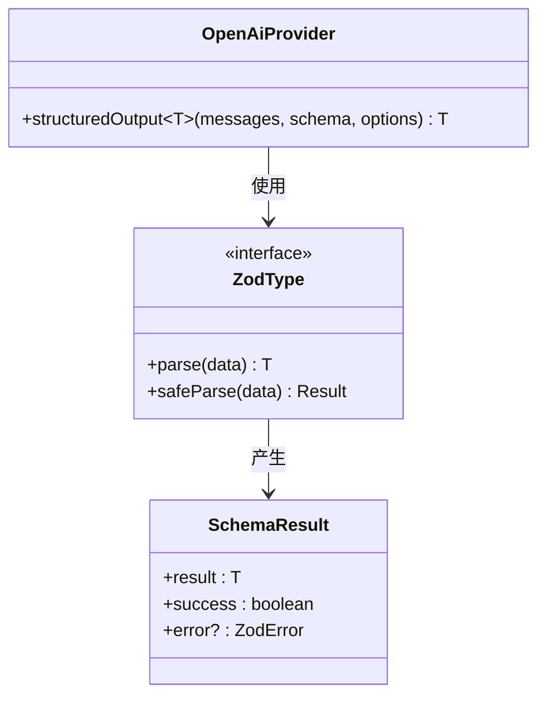

**图表来源**
- [openai-provider.ts:45-63](file://packages/ai/src/providers/openai-provider.ts#L45-L63)
- [types.ts:1-2](file://packages/ai/src/providers/types.ts#L1-L2)

**类型安全特性**
- 编译时类型检查
- 运行时Schema验证
- 强类型返回值
- 错误类型安全

**章节来源**
- [openai-provider.ts:45-63](file://packages/ai/src/providers/openai-provider.ts#L45-L63)
- [types.ts:1-2](file://packages/ai/src/providers/types.ts#L1-L2)

## 依赖关系分析

### 外部依赖关系

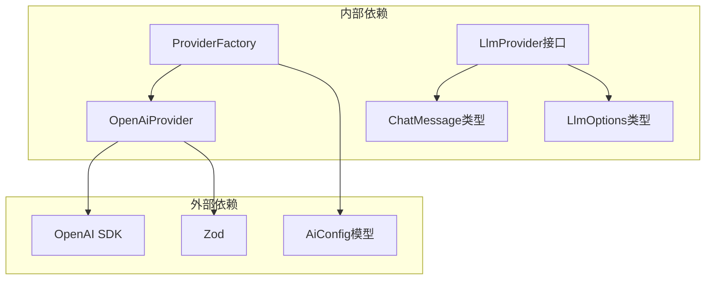

**图表来源**
- [openai-provider.ts:1-4](file://packages/ai/src/providers/openai-provider.ts#L1-L4)
- [provider-factory.ts:1-3](file://packages/ai/src/providers/provider-factory.ts#L1-L3)
- [ai-config.ts:1-34](file://packages/ai/src/models/ai-config.ts#L1-L34)

### 内部模块依赖

**模块导入关系**

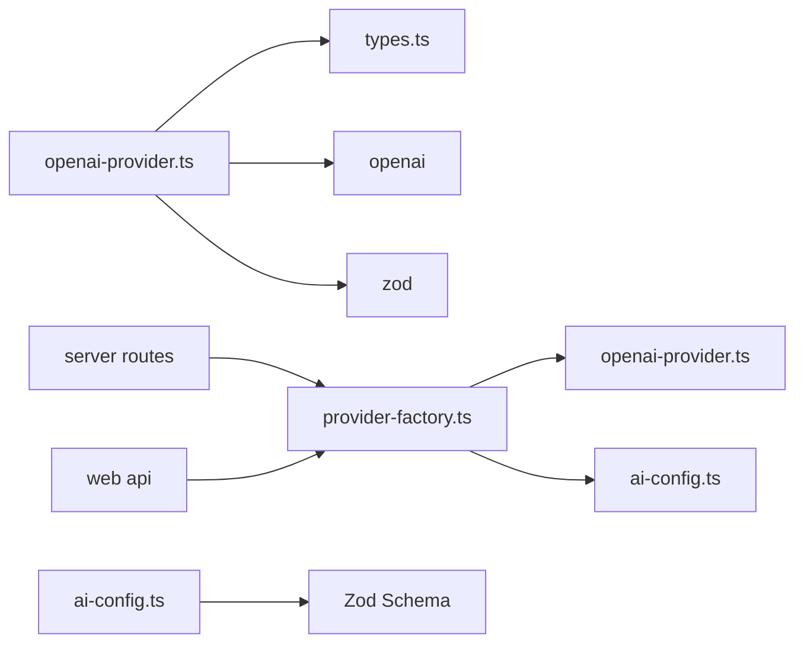

**图表来源**
- [openai-provider.ts:1-4](file://packages/ai/src/providers/openai-provider.ts#L1-L4)
- [provider-factory.ts:1-3](file://packages/ai/src/providers/provider-factory.ts#L1-L3)
- [ai-config.ts:1-3](file://packages/ai/src/models/ai-config.ts#L1-L3)

**章节来源**
- [openai-provider.ts:1-4](file://packages/ai/src/providers/openai-provider.ts#L1-L4)
- [provider-factory.ts:1-3](file://packages/ai/src/providers/provider-factory.ts#L1-L3)
- [ai-config.ts:1-3](file://packages/ai/src/models/ai-config.ts#L1-L3)

## 性能考虑

### 连接池和缓存策略

由于当前实现直接创建新的OpenAI客户端实例，建议在高并发场景下考虑以下优化：

1. **客户端复用**: 在应用级别维护单个OpenAI客户端实例
2. **请求超时设置**: 为API调用设置合理的超时时间
3. **重试机制**: 实现指数退避的重试策略
4. **并发限制**: 控制同时进行的API调用数量

### 内存使用优化

- 合理设置maxTokens参数避免过大的响应
- 及时清理不再使用的消息历史
- 监控Zod Schema编译后的内存占用

### 网络性能优化

- 使用HTTP/2连接复用
- 实现请求压缩
- 优化消息格式减少传输大小

## 故障排除指南

### 常见错误类型

**连接性问题**
- API密钥无效或过期
- 网络连接不稳定
- 基础URL配置错误

**参数配置问题**
- 温度参数超出有效范围(0-2)
- 最大令牌数设置不合理
- 模型名称不存在

**Schema验证问题**
- Zod Schema定义错误
- 响应格式不符合Schema
- 类型转换失败

### 错误处理策略

**API错误处理**
```typescript
try {
  const result = await provider.chatCompletion(messages, options);
} catch (error) {
  if (error instanceof OpenAI.APIError) {
    // 处理API特定错误
  } else if (error instanceof Error) {
    // 处理通用错误
  }
}
```

**连接测试使用**
```typescript
const isConnected = await provider.testConnection();
if (!isConnected) {
  // 处理连接失败
}
```

**章节来源**
- [openai-provider.ts:65-77](file://packages/ai/src/providers/openai-provider.ts#L65-L77)

### 调试技巧

1. **启用SDK日志**: 设置环境变量查看API调用详情
2. **逐步验证**: 分别测试API密钥、网络连接和模型可用性
3. **简化测试**: 使用最小化的消息和Schema进行测试
4. **监控指标**: 跟踪响应时间和错误率

## 结论

OpenAI提供者实现展现了良好的软件工程实践，具有以下特点：

**设计优势**
- 清晰的接口抽象和实现分离
- 完整的类型安全保证
- 灵活的工厂模式设计
- 优雅的错误处理机制

**技术特色**
- Zod Schema集成提供强类型输出
- 支持多种AI服务提供商
- 内置连接性测试功能
- 模块化设计便于扩展

**改进建议**
- 添加连接池和缓存机制
- 实现更完善的重试策略
- 增加性能监控和指标收集
- 提供更多配置选项和灵活性

该实现为AI测试框架提供了稳定可靠的OpenAI集成基础，支持从简单聊天到复杂结构化输出的各种应用场景。

## 附录

### 使用示例

#### 基本配置设置

**服务器端配置**
```typescript
// 从AI配置创建提供者
const provider = createProviderFromConfig(aiConfig, decryptedApiKey);

// 或直接创建
const provider = new OpenAiProvider({
  apiKey: process.env.OPENAI_API_KEY!,
  model: 'gpt-4o',
  baseURL: 'https://api.openai.com/v1',
  defaultTemperature: 0.7,
  defaultMaxTokens: 4096
});
```

**客户端使用**
```typescript
// 聊天补全
const response = await provider.chatCompletion([
  { role: 'user', content: '你好' }
]);

// 结构化输出
const schema = z.object({ name: z.string(), age: z.number() });
const result = await provider.structuredOutput(messages, schema);
```

#### 异常处理最佳实践

```typescript
try {
  const result = await provider.chatCompletion(messages);
} catch (error) {
  if (error.message.includes('API')) {
    // 处理API错误
  } else if (error.message.includes('empty')) {
    // 处理空响应
  }
}
```

#### 性能优化建议

1. **批量处理**: 合并多个小请求
2. **缓存策略**: 缓存常用的提示词和配置
3. **异步处理**: 使用Promise.all处理并行请求
4. **资源管理**: 及时释放不再使用的资源

**章节来源**
- [provider-factory.ts:42-55](file://packages/ai/src/providers/provider-factory.ts#L42-L55)
- [openai-provider.ts:20-28](file://packages/ai/src/providers/openai-provider.ts#L20-L28)