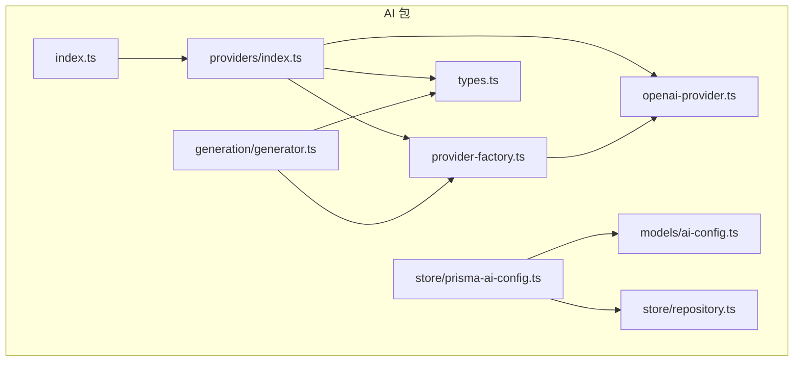
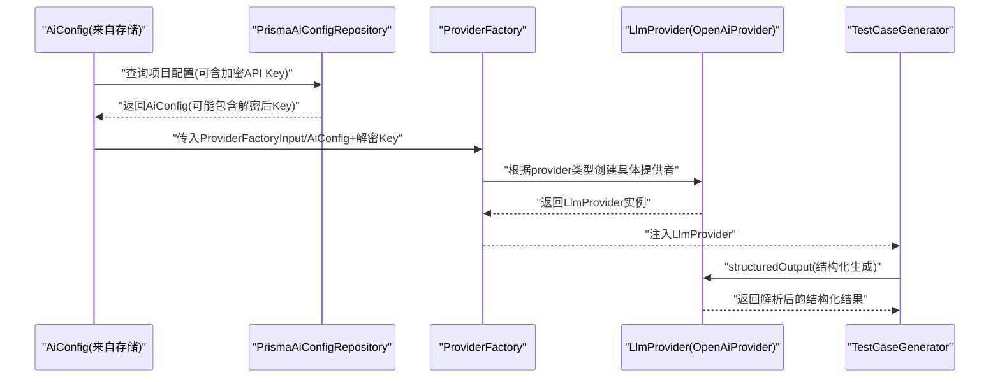
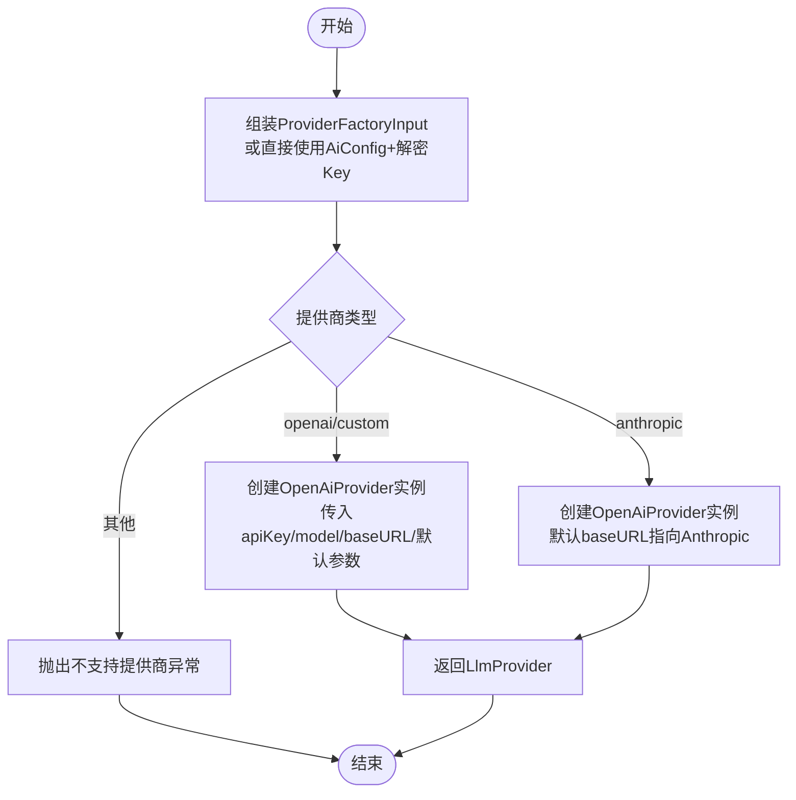
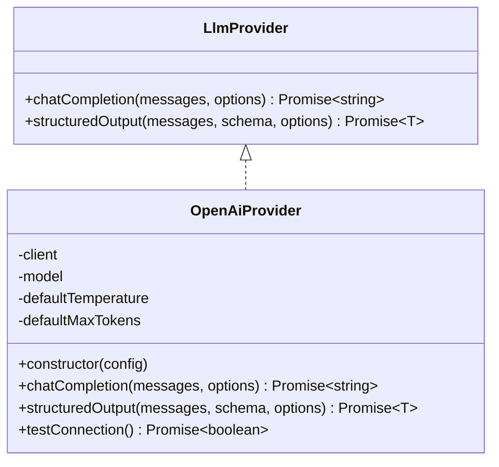
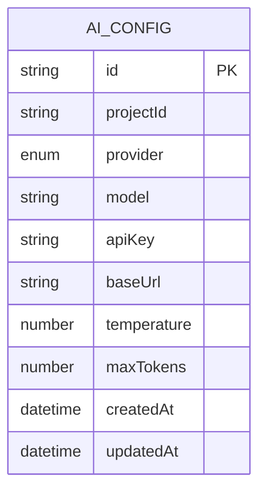
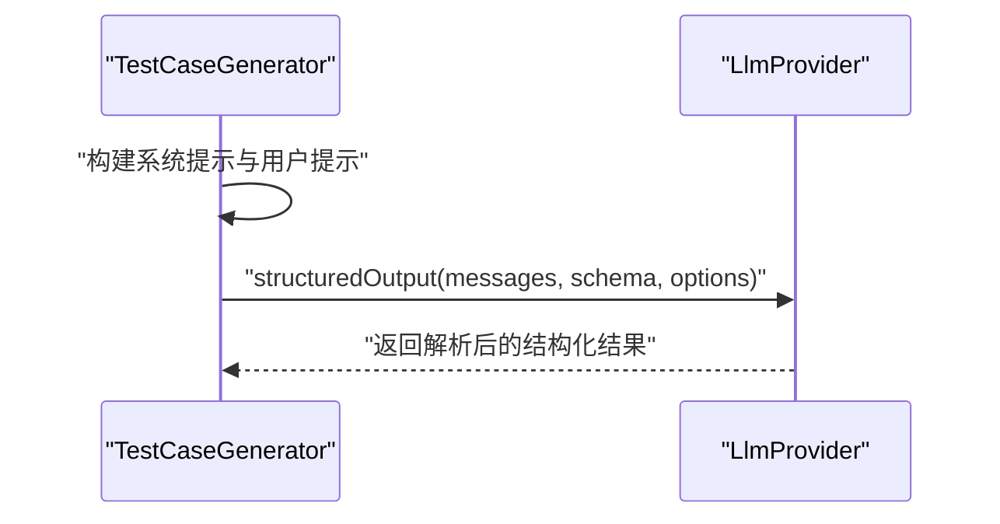
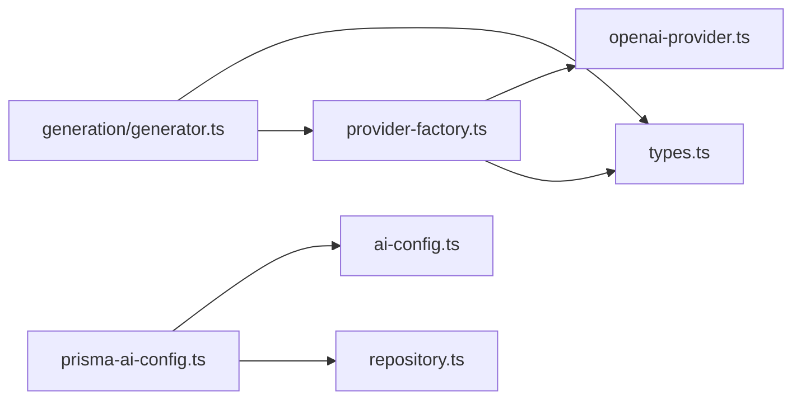

# Provider工厂模式

<cite>
**本文引用的文件**
- [packages/ai/src/providers/provider-factory.ts](file://packages/ai/src/providers/provider-factory.ts)
- [packages/ai/src/providers/types.ts](file://packages/ai/src/providers/types.ts)
- [packages/ai/src/providers/openai-provider.ts](file://packages/ai/src/providers/openai-provider.ts)
- [packages/ai/src/providers/index.ts](file://packages/ai/src/providers/index.ts)
- [packages/ai/src/models/ai-config.ts](file://packages/ai/src/models/ai-config.ts)
- [packages/ai/src/store/prisma-ai-config.ts](file://packages/ai/src/store/prisma-ai-config.ts)
- [packages/ai/src/generation/generator.ts](file://packages/ai/src/generation/generator.ts)
- [packages/ai/src/store/repository.ts](file://packages/ai/src/store/repository.ts)
- [packages/ai/src/index.ts](file://packages/ai/src/index.ts)
</cite>

## 目录
1. [引言](#引言)
2. [项目结构](#项目结构)
3. [核心组件](#核心组件)
4. [架构总览](#架构总览)
5. [详细组件分析](#详细组件分析)
6. [依赖分析](#依赖分析)
7. [性能考虑](#性能考虑)
8. [故障排查指南](#故障排查指南)
9. [结论](#结论)
10. [附录](#附录)

## 引言
本文件系统化阐述本项目中Provider工厂模式在大语言模型（LLM）提供者中的应用与实现，重点覆盖以下方面：
- 动态提供商创建机制：基于配置在运行时选择并实例化具体提供者。
- 类型安全的工厂方法：通过Zod Schema与接口约束确保输入与输出的类型一致性。
- 扩展性设计：新增提供者仅需实现统一接口并在工厂中注册分支逻辑。
- 统一管理多提供商：通过标准化配置参数、集中错误处理与资源清理策略，实现跨提供商的一致行为。
- 使用示例与最佳实践：静态工厂方法、依赖注入与单元测试策略。

## 项目结构
本项目采用按功能域分层的组织方式，Provider工厂位于AI包的providers子模块，配合模型定义、存储与生成器模块协同工作。

图表来源
- [packages/ai/src/providers/index.ts:1-4](file://packages/ai/src/providers/index.ts#L1-L4)
- [packages/ai/src/providers/provider-factory.ts:1-56](file://packages/ai/src/providers/provider-factory.ts#L1-L56)
- [packages/ai/src/providers/types.ts:1-35](file://packages/ai/src/providers/types.ts#L1-L35)
- [packages/ai/src/providers/openai-provider.ts:1-79](file://packages/ai/src/providers/openai-provider.ts#L1-L79)
- [packages/ai/src/models/ai-config.ts:1-34](file://packages/ai/src/models/ai-config.ts#L1-L34)
- [packages/ai/src/store/prisma-ai-config.ts:1-82](file://packages/ai/src/store/prisma-ai-config.ts#L1-L82)
- [packages/ai/src/generation/generator.ts:1-57](file://packages/ai/src/generation/generator.ts#L1-L57)
- [packages/ai/src/store/repository.ts:1-39](file://packages/ai/src/store/repository.ts#L1-L39)
- [packages/ai/src/index.ts:1-7](file://packages/ai/src/index.ts#L1-L7)

章节来源
- [packages/ai/src/index.ts:1-7](file://packages/ai/src/index.ts#L1-L7)
- [packages/ai/src/providers/index.ts:1-4](file://packages/ai/src/providers/index.ts#L1-L4)

## 核心组件
- 工厂函数与输入
  - 工厂输入对象包含提供商类型、模型名、解密后的API Key、可选的基础URL、温度与最大Token数等字段，用于驱动实例化过程。
  - 工厂方法根据提供商类型返回实现统一接口的具体提供者实例。
- 提供商接口
  - 统一接口定义了两类能力：自由文本对话与结构化输出（支持Zod Schema校验），并约定可选的调优参数。
- 具体提供者实现
  - 当前实现为OpenAI兼容提供者，内部封装SDK客户端，并提供连通性测试方法。
- 配置与存储
  - 配置模型使用Zod进行强类型校验；存储层负责加密保存、解密读取与敏感信息掩码。
- 生成器集成
  - 生成器通过依赖注入接收LlmProvider实例，统一调用其结构化输出能力完成测试用例生成。

章节来源
- [packages/ai/src/providers/provider-factory.ts:5-56](file://packages/ai/src/providers/provider-factory.ts#L5-L56)
- [packages/ai/src/providers/types.ts:13-35](file://packages/ai/src/providers/types.ts#L13-L35)
- [packages/ai/src/providers/openai-provider.ts:14-79](file://packages/ai/src/providers/openai-provider.ts#L14-L79)
- [packages/ai/src/models/ai-config.ts:3-34](file://packages/ai/src/models/ai-config.ts#L3-L34)
- [packages/ai/src/store/prisma-ai-config.ts:22-82](file://packages/ai/src/store/prisma-ai-config.ts#L22-L82)
- [packages/ai/src/generation/generator.ts:16-57](file://packages/ai/src/generation/generator.ts#L16-L57)

## 架构总览
下图展示了从配置到提供者实例化再到生成器使用的端到端流程，体现工厂模式在统一抽象下的动态创建与依赖注入。

图表来源
- [packages/ai/src/store/prisma-ai-config.ts:60-80](file://packages/ai/src/store/prisma-ai-config.ts#L60-L80)
- [packages/ai/src/providers/provider-factory.ts:42-56](file://packages/ai/src/providers/provider-factory.ts#L42-L56)
- [packages/ai/src/providers/openai-provider.ts:45-63](file://packages/ai/src/providers/openai-provider.ts#L45-L63)
- [packages/ai/src/generation/generator.ts:20-56](file://packages/ai/src/generation/generator.ts#L20-L56)

## 详细组件分析

### 工厂接口与实现
- 设计要点
  - 输入标准化：统一的ProviderFactoryInput/AiConfig结构，确保不同提供商共享相同的配置键。
  - 分支扩展：通过switch分支映射提供商枚举到具体实现类，便于新增提供商时只增加新分支。
  - 默认值收敛：在工厂或提供者构造函数中设置默认参数，避免调用方遗漏配置。
- 关键流程
  - 从AiConfig与解密Key组装ProviderFactoryInput。
  - 工厂根据provider字段选择对应实现，必要时填充默认baseUrl等。
  - 返回类型为LlmProvider，保证上层调用的一致性。

图表来源
- [packages/ai/src/providers/provider-factory.ts:14-56](file://packages/ai/src/providers/provider-factory.ts#L14-L56)

章节来源
- [packages/ai/src/providers/provider-factory.ts:5-56](file://packages/ai/src/providers/provider-factory.ts#L5-L56)

### 提供商接口与实现
- 接口设计
  - 统一方法签名：chatCompletion与structuredOutput，前者返回字符串内容，后者返回符合Zod Schema的对象。
  - 可选参数：temperature与maxTokens作为调优参数，支持调用时覆盖默认值。
- 实现细节
  - OpenAiProvider内部持有SDK客户端与默认参数，构造时完成初始化。
  - 结构化输出通过SDK提供的解析能力实现，失败时抛出明确异常。
  - 连通性测试方法用于快速验证配置有效性。

图表来源
- [packages/ai/src/providers/types.ts:13-35](file://packages/ai/src/providers/types.ts#L13-L35)
- [packages/ai/src/providers/openai-provider.ts:14-79](file://packages/ai/src/providers/openai-provider.ts#L14-L79)

章节来源
- [packages/ai/src/providers/types.ts:13-35](file://packages/ai/src/providers/types.ts#L13-L35)
- [packages/ai/src/providers/openai-provider.ts:14-79](file://packages/ai/src/providers/openai-provider.ts#L14-L79)

### 配置模型与存储
- 配置模型
  - 使用Zod对提供商枚举、模型名、基础URL、温度与最大Token等字段进行强类型校验与默认值设定。
  - 支持创建、更新与查询场景的Schema分离，确保数据一致性。
- 存储层
  - 加密保存API Key，查询时提供解密版本用于内部实例化。
  - 提供掩码版本用于对外响应，保护敏感信息。
  - 基于Prisma的upsert、查询与删除操作，保证配置的原子性与可追踪性。

图表来源
- [packages/ai/src/models/ai-config.ts:5-34](file://packages/ai/src/models/ai-config.ts#L5-L34)

章节来源
- [packages/ai/src/models/ai-config.ts:3-34](file://packages/ai/src/models/ai-config.ts#L3-L34)
- [packages/ai/src/store/prisma-ai-config.ts:22-82](file://packages/ai/src/store/prisma-ai-config.ts#L22-L82)

### 生成器与依赖注入
- 依赖注入
  - 生成器通过构造函数接收LlmProvider依赖，实现与具体提供商的解耦。
- 调用流程
  - 生成器根据策略构建系统提示与用户提示，调用provider的structuredOutput方法获取结构化结果。
  - 对空响应与未知策略进行显式错误处理，提升健壮性。

图表来源
- [packages/ai/src/generation/generator.ts:20-56](file://packages/ai/src/generation/generator.ts#L20-L56)
- [packages/ai/src/providers/types.ts:18-22](file://packages/ai/src/providers/types.ts#L18-L22)

章节来源
- [packages/ai/src/generation/generator.ts:16-57](file://packages/ai/src/generation/generator.ts#L16-L57)

## 依赖分析
- 模块内聚与耦合
  - 工厂与提供者之间通过统一接口耦合，新增提供商只需实现接口并扩展工厂分支。
  - 生成器仅依赖LlmProvider接口，不关心具体实现，降低变更成本。
- 外部依赖
  - OpenAI SDK用于实际的推理请求与结构化输出解析。
  - Zod用于配置校验与结构化输出的Schema验证。
- 存储与配置
  - 存储层负责敏感信息的加解密与掩码，保障安全性。

图表来源
- [packages/ai/src/providers/provider-factory.ts:1-56](file://packages/ai/src/providers/provider-factory.ts#L1-L56)
- [packages/ai/src/providers/openai-provider.ts:1-79](file://packages/ai/src/providers/openai-provider.ts#L1-L79)
- [packages/ai/src/providers/types.ts:1-35](file://packages/ai/src/providers/types.ts#L1-L35)
- [packages/ai/src/generation/generator.ts:1-57](file://packages/ai/src/generation/generator.ts#L1-L57)
- [packages/ai/src/store/prisma-ai-config.ts:1-82](file://packages/ai/src/store/prisma-ai-config.ts#L1-L82)
- [packages/ai/src/models/ai-config.ts:1-34](file://packages/ai/src/models/ai-config.ts#L1-L34)
- [packages/ai/src/store/repository.ts:1-39](file://packages/ai/src/store/repository.ts#L1-L39)

章节来源
- [packages/ai/src/providers/index.ts:1-4](file://packages/ai/src/providers/index.ts#L1-L4)
- [packages/ai/src/index.ts:1-7](file://packages/ai/src/index.ts#L1-L7)

## 性能考虑
- 连接复用
  - 提供者在构造时初始化SDK客户端，后续多次调用复用连接，减少握手开销。
- 参数默认值
  - 在构造阶段设置默认温度与最大Token，避免每次调用重复计算。
- 调用优化
  - 生成器在调用前进行参数校验与策略检查，减少无效请求。
- 安全与合规
  - API Key在内存中仅在解密后短暂存在，避免长期驻留；存储层对敏感字段进行掩码处理。

## 故障排查指南
- 常见问题与定位
  - 不支持的提供商：工厂在遇到未知提供商枚举时会抛出异常，检查配置中的提供商字段是否在允许集合内。
  - 空响应：当LLM未返回内容或结构化输出为空时，提供者会抛出异常，检查模型名、提示词与Schema是否匹配。
  - 连接失败：可通过提供者的连通性测试方法快速判断配置是否正确。
  - 配置校验失败：Zod Schema会在创建或更新配置时进行严格校验，检查必填字段与取值范围。
- 建议流程
  - 先执行连通性测试，再进行结构化输出调用。
  - 使用存储层的解密查询确认API Key可用且未被篡改。
  - 对生成器调用前后记录日志，定位是提示工程还是模型响应问题。

章节来源
- [packages/ai/src/providers/provider-factory.ts:37-39](file://packages/ai/src/providers/provider-factory.ts#L37-L39)
- [packages/ai/src/providers/openai-provider.ts:39-42](file://packages/ai/src/providers/openai-provider.ts#L39-L42)
- [packages/ai/src/providers/openai-provider.ts:58-62](file://packages/ai/src/providers/openai-provider.ts#L58-L62)
- [packages/ai/src/providers/openai-provider.ts:65-77](file://packages/ai/src/providers/openai-provider.ts#L65-L77)
- [packages/ai/src/models/ai-config.ts:18-26](file://packages/ai/src/models/ai-config.ts#L18-L26)
- [packages/ai/src/store/prisma-ai-config.ts:60-80](file://packages/ai/src/store/prisma-ai-config.ts#L60-L80)

## 结论
本项目通过工厂模式实现了LLM提供者的统一抽象与动态创建，结合Zod Schema与接口契约，确保了类型安全与扩展性。工厂将配置标准化、错误处理与资源清理策略下沉至提供者与存储层，使上层调用（如生成器）保持简洁一致。未来扩展新提供商时，仅需实现统一接口并在工厂中添加分支，即可无缝融入现有体系。

## 附录

### 使用示例与最佳实践
- 静态工厂方法
  - 通过工厂函数从AiConfig与解密Key创建Provider实例，适用于简单场景。
  - 示例路径参考：[packages/ai/src/providers/provider-factory.ts:42-56](file://packages/ai/src/providers/provider-factory.ts#L42-L56)
- 依赖注入
  - 将Provider注入到生成器等业务组件，实现松耦合与可替换性。
  - 示例路径参考：[packages/ai/src/generation/generator.ts:16-25](file://packages/ai/src/generation/generator.ts#L16-L25)
- 单元测试策略
  - 使用Mock Provider实现LlmProvider接口，隔离外部SDK依赖。
  - 针对工厂分支、Schema解析与错误分支编写测试用例，覆盖所有提供商类型与边界条件。
  - 示例路径参考：[packages/ai/src/providers/types.ts:13-23](file://packages/ai/src/providers/types.ts#L13-L23)