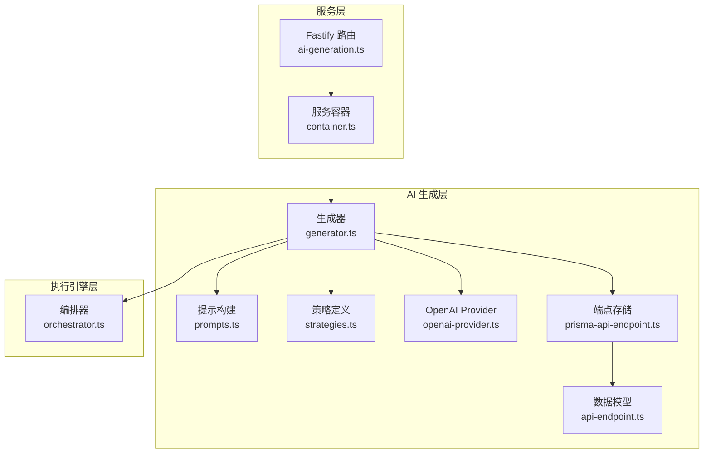
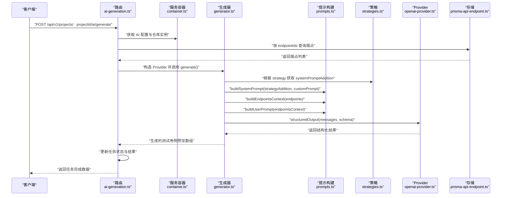
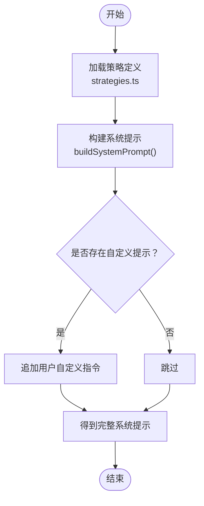
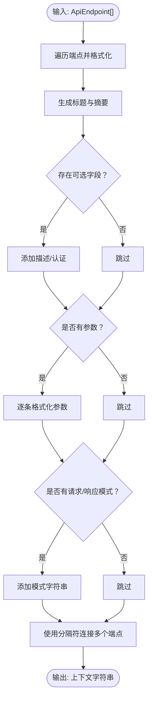
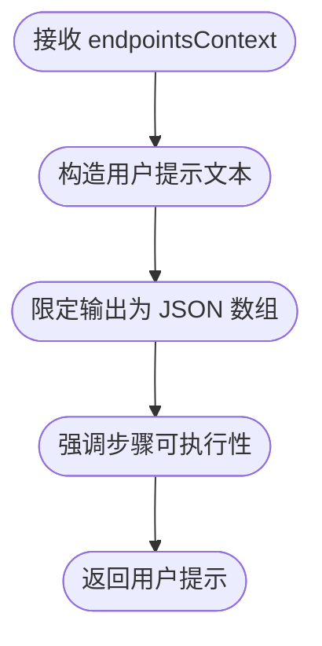
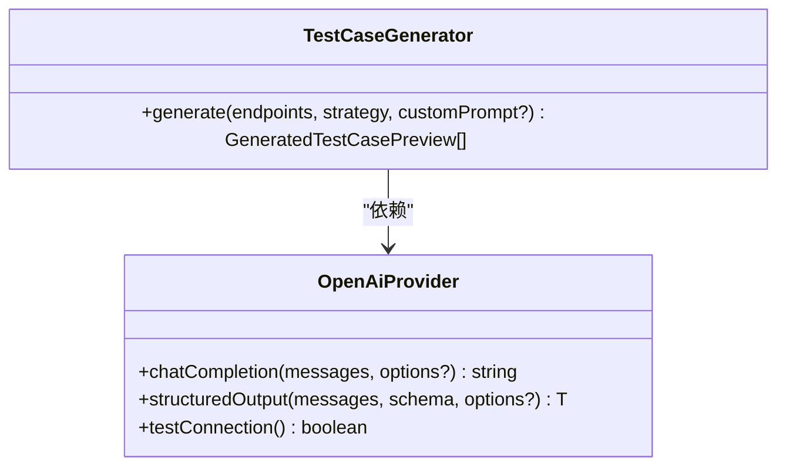
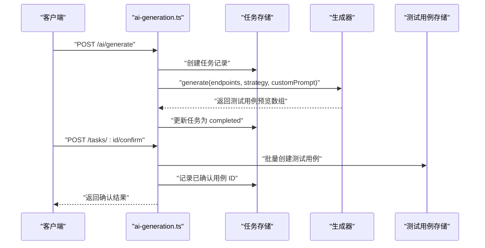
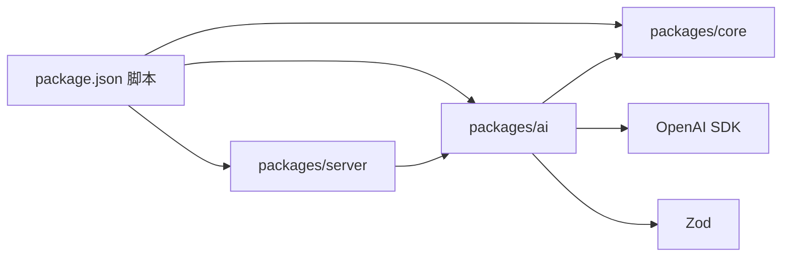

# 提示工程系统

<cite>
**本文引用的文件**
- [packages/ai/src/generation/prompts.ts](file://packages/ai/src/generation/prompts.ts)
- [packages/ai/src/generation/strategies.ts](file://packages/ai/src/generation/strategies.ts)
- [packages/ai/src/generation/generator.ts](file://packages/ai/src/generation/generator.ts)
- [packages/ai/src/providers/openai-provider.ts](file://packages/ai/src/providers/openai-provider.ts)
- [packages/ai/src/models/api-endpoint.ts](file://packages/ai/src/models/api-endpoint.ts)
- [packages/ai/src/store/prisma-api-endpoint.ts](file://packages/ai/src/store/prisma-api-endpoint.ts)
- [packages/server/src/routes/ai-generation.ts](file://packages/server/src/routes/ai-generation.ts)
- [packages/server/src/services/container.ts](file://packages/server/src/services/container.ts)
- [packages/core/src/engine/orchestrator.ts](file://packages/core/src/engine/orchestrator.ts)
- [package.json](file://package.json)
</cite>

## 目录
1. [简介](#简介)
2. [项目结构](#项目结构)
3. [核心组件](#核心组件)
4. [架构总览](#架构总览)
5. [详细组件分析](#详细组件分析)
6. [依赖分析](#依赖分析)
7. [性能考虑](#性能考虑)
8. [故障排查指南](#故障排查指南)
9. [结论](#结论)
10. [附录](#附录)

## 简介
本文件为“提示工程系统”的技术文档，聚焦于以下目标：
- 系统提示构建机制：策略增强提示与自定义提示的组合逻辑
- 端点上下文生成算法：API 信息提取、格式化与优化策略
- 用户提示模板设计：输入参数、约束条件与输出格式要求
- 提示优化技术：上下文压缩、信息筛选与质量提升策略
- 提示调试与测试方法，以及常见问题的解决方案

该系统通过“策略 + 自定义”双通道提示构建，结合结构化输出与端点上下文格式化，最终生成可直接用于测试执行的结构化测试用例。

## 项目结构
本仓库采用多包工作区组织，核心与提示工程相关的模块分布如下：
- packages/ai：提示工程与生成核心（提示构建、策略、LLM Provider、数据模型）
- packages/server：HTTP 接口层（Fastify 路由与服务容器）
- packages/core：执行引擎与运行时（测试套件执行、事件与状态管理）

图表来源
- [packages/server/src/routes/ai-generation.ts:16-179](file://packages/server/src/routes/ai-generation.ts#L16-L179)
- [packages/server/src/services/container.ts:17-41](file://packages/server/src/services/container.ts#L17-L41)
- [packages/ai/src/generation/generator.ts:20-56](file://packages/ai/src/generation/generator.ts#L20-L56)
- [packages/ai/src/generation/prompts.ts:3-72](file://packages/ai/src/generation/prompts.ts#L3-L72)
- [packages/ai/src/generation/strategies.ts:10-49](file://packages/ai/src/generation/strategies.ts#L10-L49)
- [packages/ai/src/providers/openai-provider.ts:14-78](file://packages/ai/src/providers/openai-provider.ts#L14-L78)
- [packages/ai/src/models/api-endpoint.ts:14-45](file://packages/ai/src/models/api-endpoint.ts#L14-L45)
- [packages/ai/src/store/prisma-api-endpoint.ts:29-111](file://packages/ai/src/store/prisma-api-endpoint.ts#L29-L111)
- [packages/core/src/engine/orchestrator.ts:17-295](file://packages/core/src/engine/orchestrator.ts#L17-L295)

章节来源
- [package.json:6-12](file://package.json#L6-L12)

## 核心组件
- 系统提示构建器：负责将策略增强提示与用户自定义提示拼接，形成完整的系统提示
- 端点上下文生成器：将 API 端点集合格式化为自然语言描述，作为用户提示的上下文
- 用户提示模板：将端点上下文注入到用户提示中，要求返回结构化 JSON 数组
- 生成器：协调策略、提示构建、LLM Provider 与结构化输出解析
- LLM Provider：封装 OpenAI 结构化输出能力，支持温度与最大 token 控制
- 数据模型与存储：标准化端点模型与持久化访问
- 服务路由：暴露生成任务触发、查询与确认接口，并与存储与生成器交互
- 执行引擎：在生成后将结构化测试用例写入测试用例库，供后续执行

章节来源
- [packages/ai/src/generation/prompts.ts:3-72](file://packages/ai/src/generation/prompts.ts#L3-L72)
- [packages/ai/src/generation/strategies.ts:10-49](file://packages/ai/src/generation/strategies.ts#L10-L49)
- [packages/ai/src/generation/generator.ts:20-56](file://packages/ai/src/generation/generator.ts#L20-L56)
- [packages/ai/src/providers/openai-provider.ts:14-78](file://packages/ai/src/providers/openai-provider.ts#L14-L78)
- [packages/ai/src/models/api-endpoint.ts:14-45](file://packages/ai/src/models/api-endpoint.ts#L14-L45)
- [packages/ai/src/store/prisma-api-endpoint.ts:29-111](file://packages/ai/src/store/prisma-api-endpoint.ts#L29-L111)
- [packages/server/src/routes/ai-generation.ts:16-179](file://packages/server/src/routes/ai-generation.ts#L16-L179)
- [packages/core/src/engine/orchestrator.ts:17-295](file://packages/core/src/engine/orchestrator.ts#L17-L295)

## 架构总览
下图展示从 HTTP 请求到生成与落库的关键流程：

图表来源
- [packages/server/src/routes/ai-generation.ts:18-92](file://packages/server/src/routes/ai-generation.ts#L18-L92)
- [packages/server/src/services/container.ts:24-41](file://packages/server/src/services/container.ts#L24-L41)
- [packages/ai/src/generation/generator.ts:27-55](file://packages/ai/src/generation/generator.ts#L27-L55)
- [packages/ai/src/generation/prompts.ts:3-72](file://packages/ai/src/generation/prompts.ts#L3-L72)
- [packages/ai/src/generation/strategies.ts:10-49](file://packages/ai/src/generation/strategies.ts#L10-L49)
- [packages/ai/src/providers/openai-provider.ts:45-63](file://packages/ai/src/providers/openai-provider.ts#L45-L63)
- [packages/ai/src/store/prisma-api-endpoint.ts:58-86](file://packages/ai/src/store/prisma-api-endpoint.ts#L58-L86)

## 详细组件分析

### 系统提示构建机制
- 组合逻辑
  - 系统提示由“策略增强提示片段”与“用户自定义提示”拼接而成
  - 若存在自定义提示，则追加到系统提示末尾，作为额外指令
- 关键函数
  - buildSystemPrompt(strategyAddition, customPrompt?)
  - buildEndpointsContext(endpoints[])
  - buildUserPrompt(endpointsContext)

图表来源
- [packages/ai/src/generation/strategies.ts:10-49](file://packages/ai/src/generation/strategies.ts#L10-L49)
- [packages/ai/src/generation/prompts.ts:3-35](file://packages/ai/src/generation/prompts.ts#L3-L35)

章节来源
- [packages/ai/src/generation/prompts.ts:3-35](file://packages/ai/src/generation/prompts.ts#L3-L35)
- [packages/ai/src/generation/strategies.ts:10-49](file://packages/ai/src/generation/strategies.ts#L10-L49)

### 端点上下文生成算法
- 输入：ApiEndpoint[]（包含方法、路径、摘要、描述、认证、参数、请求/响应模式等）
- 处理步骤
  - 对每个端点生成标题与摘要
  - 可选字段：描述、认证方式
  - 参数列表：逐条格式化为“名称(in, 类型[, 必填])：描述”
  - 请求/响应模式：原样保留为字符串
  - 使用分隔符连接多个端点
- 输出：自然语言上下文字符串，作为用户提示的一部分

图表来源
- [packages/ai/src/generation/prompts.ts:37-63](file://packages/ai/src/generation/prompts.ts#L37-L63)
- [packages/ai/src/models/api-endpoint.ts:14-29](file://packages/ai/src/models/api-endpoint.ts#L14-L29)

章节来源
- [packages/ai/src/generation/prompts.ts:37-63](file://packages/ai/src/generation/prompts.ts#L37-L63)
- [packages/ai/src/models/api-endpoint.ts:14-29](file://packages/ai/src/models/api-endpoint.ts#L14-L29)

### 用户提示模板设计
- 目标：引导 LLM 生成结构化测试用例 JSON 数组
- 输入参数
  - endpointsContext：由 buildEndpointsContext 生成的上下文字符串
- 约束条件
  - 明确要求返回 JSON 数组
  - 强调“有意义且可执行”的步骤
- 输出格式要求
  - JSON 数组，元素为测试用例预览对象（名称、描述、模块、标签、优先级、步骤等）

图表来源
- [packages/ai/src/generation/prompts.ts:65-72](file://packages/ai/src/generation/prompts.ts#L65-L72)

章节来源
- [packages/ai/src/generation/prompts.ts:65-72](file://packages/ai/src/generation/prompts.ts#L65-L72)

### 提示优化技术
- 上下文压缩
  - 仅保留必要字段（方法、路径、摘要、认证、参数、模式），避免冗余描述
  - 将复杂 JSON 模式以字符串形式保留，减少格式化开销
- 信息筛选
  - 优先展示与测试相关的信息（认证、参数、请求/响应模式）
  - 忽略对生成测试用例无直接帮助的字段
- 质量提升策略
  - 在系统提示中明确测试用例要素与断言格式
  - 使用结构化输出（Zod Schema）确保 LLM 输出可解析
  - 通过策略选择覆盖不同场景（正常流、错误、鉴权、综合）

章节来源
- [packages/ai/src/generation/prompts.ts:3-35](file://packages/ai/src/generation/prompts.ts#L3-L35)
- [packages/ai/src/generation/strategies.ts:10-49](file://packages/ai/src/generation/strategies.ts#L10-L49)
- [packages/ai/src/generation/generator.ts:12-14](file://packages/ai/src/generation/generator.ts#L12-L14)

### 生成器与 Provider 协作
- 生成器职责
  - 校验输入端点数量与策略有效性
  - 组装 messages（system + user）
  - 调用 Provider 的结构化输出能力
  - 返回结构化的测试用例预览数组
- Provider 能力
  - 支持普通对话与结构化输出两种模式
  - 默认温度与最大 token 可配置
  - 提供连通性测试方法

图表来源
- [packages/ai/src/generation/generator.ts:20-56](file://packages/ai/src/generation/generator.ts#L20-L56)
- [packages/ai/src/providers/openai-provider.ts:14-78](file://packages/ai/src/providers/openai-provider.ts#L14-L78)

章节来源
- [packages/ai/src/generation/generator.ts:20-56](file://packages/ai/src/generation/generator.ts#L20-L56)
- [packages/ai/src/providers/openai-provider.ts:14-78](file://packages/ai/src/providers/openai-provider.ts#L14-L78)

### 服务路由与任务生命周期
- 触发生成
  - 校验 AI 配置与端点 ID 列表
  - 创建任务记录并调用生成器
  - 更新任务状态与结果
- 查询任务
  - 支持按项目与任务 ID 查询
- 确认并落库
  - 校验任务状态与索引范围
  - 将选定的测试用例预览转换为正式测试用例并写入数据库

图表来源
- [packages/server/src/routes/ai-generation.ts:18-92](file://packages/server/src/routes/ai-generation.ts#L18-L92)
- [packages/server/src/routes/ai-generation.ts:118-178](file://packages/server/src/routes/ai-generation.ts#L118-L178)

章节来源
- [packages/server/src/routes/ai-generation.ts:18-92](file://packages/server/src/routes/ai-generation.ts#L18-L92)
- [packages/server/src/routes/ai-generation.ts:118-178](file://packages/server/src/routes/ai-generation.ts#L118-L178)

### 执行引擎与测试用例落地
- 生成完成后，测试用例以结构化形式写入测试用例库
- 执行引擎负责后续的套件执行、步骤执行与结果汇总
- 变量合并与环境配置在执行阶段生效

章节来源
- [packages/core/src/engine/orchestrator.ts:25-140](file://packages/core/src/engine/orchestrator.ts#L25-L140)

## 依赖分析
- 包依赖
  - 工作区脚本统一管理构建、开发、类型检查与测试
- 模块耦合
  - 服务路由依赖容器中的仓库与生成器
  - 生成器依赖策略、提示构建与 Provider
  - 存储层依赖 Prisma 与共享工具
- 外部依赖
  - OpenAI SDK（结构化输出与聊天补全）
  - Zod（结构化输出的响应格式校验）

图表来源
- [package.json:6-12](file://package.json#L6-L12)

章节来源
- [package.json:6-12](file://package.json#L6-L12)

## 性能考虑
- 上下文长度控制
  - 通过精简字段与字符串化模式降低提示长度
  - 限制单次生成的端点数量或分批处理
- 温度与 token 配置
  - 适度提高温度以增强创造性，同时保持结构化输出稳定性
  - 合理设置最大 token 以避免截断
- 并发与重试
  - 服务层串行触发生成，避免 Provider 端压力过大
  - 执行阶段对步骤进行有限重试，减少一次性失败影响

## 故障排查指南
- 常见错误与定位
  - AI 未配置：服务路由在缺少配置时返回明确错误码
  - 端点无效：当传入的端点 ID 无法解析时返回相应错误
  - 生成失败：捕获异常并记录错误信息与耗时
  - 确认用例：校验任务状态与索引范围，避免越界
- 调试建议
  - 使用 Provider 的连通性测试验证 LLM 访问
  - 逐步缩小端点集合，定位特定端点导致的格式问题
  - 检查系统提示与用户提示是否符合预期格式
  - 对比结构化输出的 Zod Schema 与实际返回差异

章节来源
- [packages/server/src/routes/ai-generation.ts:26-90](file://packages/server/src/routes/ai-generation.ts#L26-L90)
- [packages/ai/src/providers/openai-provider.ts:66-77](file://packages/ai/src/providers/openai-provider.ts#L66-L77)

## 结论
本系统通过“策略增强提示 + 自定义提示”的双通道机制，结合结构化输出与端点上下文格式化，实现了从 API 描述到可执行测试用例的自动化生成。配合服务路由的任务生命周期管理与执行引擎的后续执行，形成了从提示到落地的完整链路。建议在生产环境中进一步完善密钥管理与路由规范一致性，并持续优化上下文压缩与输出稳定性。

## 附录
- 数据模型要点
  - ApiEndpoint：包含方法、路径、摘要、描述、认证、参数、请求/响应模式等字段
  - 端点存储：提供按项目与过滤条件查询、创建、更新与删除能力

章节来源
- [packages/ai/src/models/api-endpoint.ts:14-45](file://packages/ai/src/models/api-endpoint.ts#L14-L45)
- [packages/ai/src/store/prisma-api-endpoint.ts:58-86](file://packages/ai/src/store/prisma-api-endpoint.ts#L58-L86)