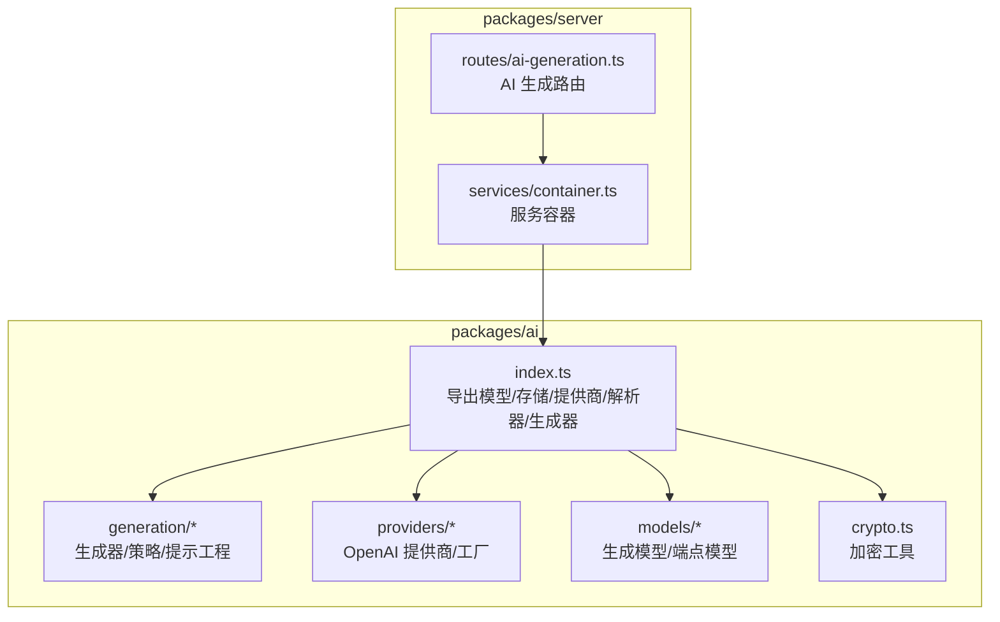
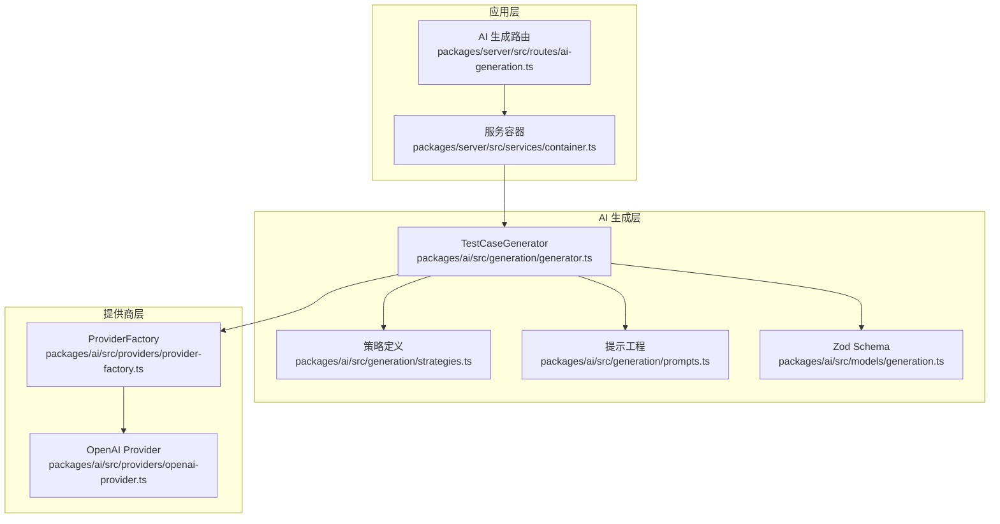
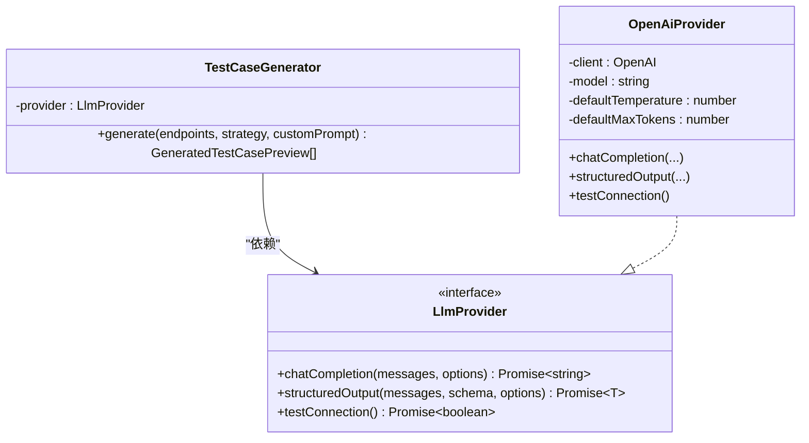
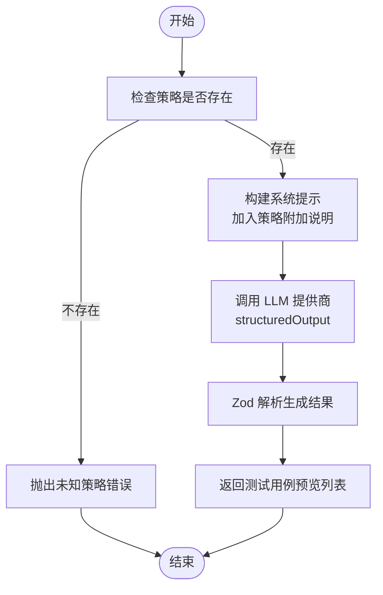
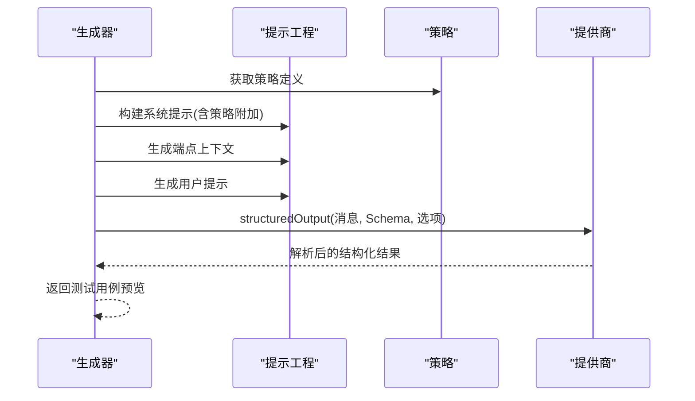
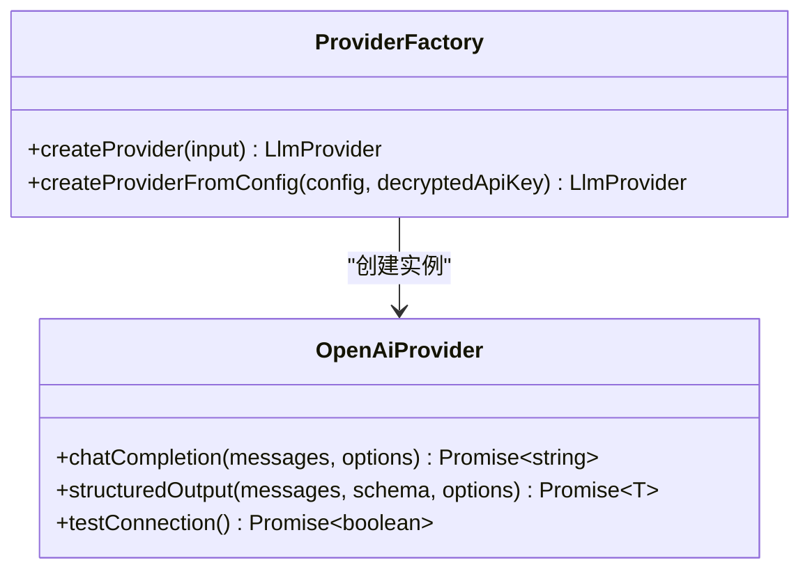
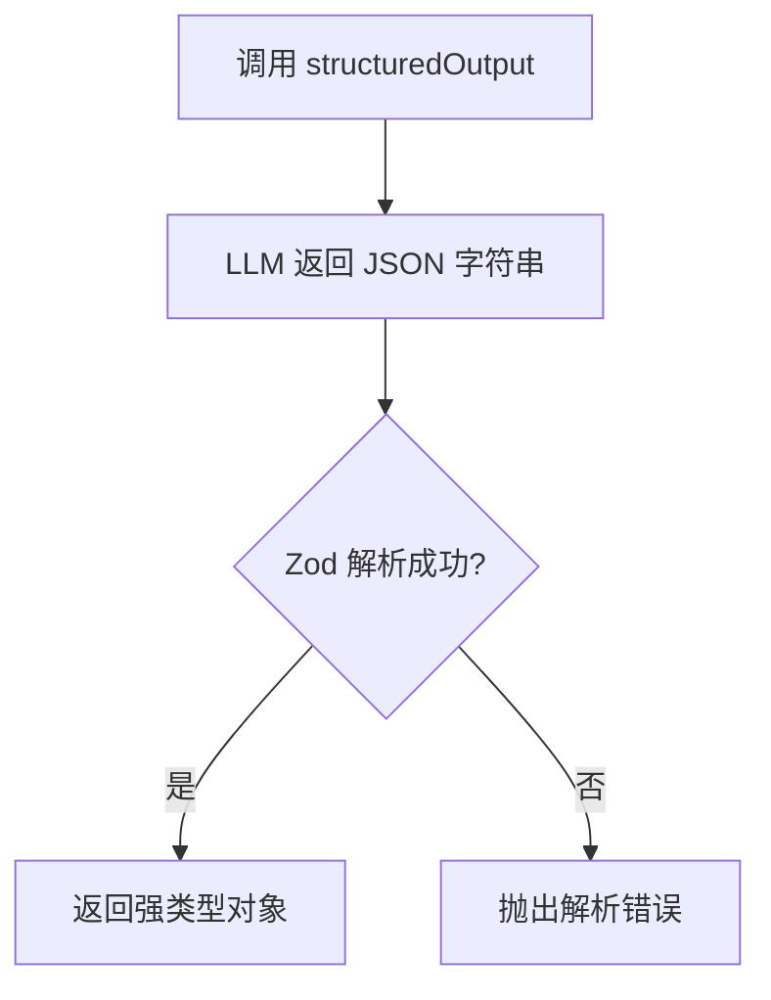
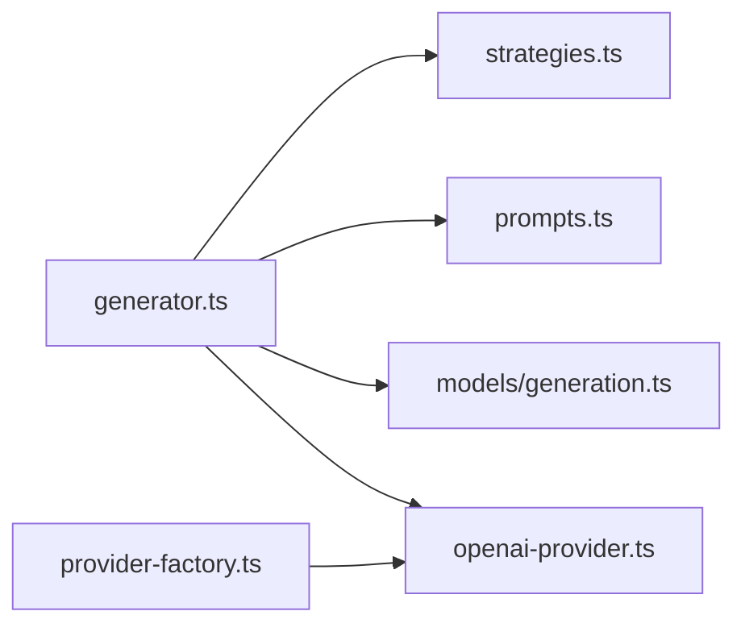

# 测试用例生成器

<cite>
**本文引用的文件**
- [package.json](file://package.json)
- [pnpm-workspace.yaml](file://pnpm-workspace.yaml)
- [specs-review-2026-04-24.md](file://docs/review-report/specs-review-2026-04-24.md)
- [packages/ai/src/index.ts](file://packages/ai/src/index.ts)
- [packages/ai/src/generation/generator.ts](file://packages/ai/src/generation/generator.ts)
- [packages/ai/src/generation/prompts.ts](file://packages/ai/src/generation/prompts.ts)
- [packages/ai/src/generation/strategies.ts](file://packages/ai/src/generation/strategies.ts)
- [packages/ai/src/providers/openai-provider.ts](file://packages/ai/src/providers/openai-provider.ts)
- [packages/ai/src/providers/provider-factory.ts](file://packages/ai/src/providers/provider-factory.ts)
- [packages/ai/src/models/generation.ts](file://packages/ai/src/models/generation.ts)
- [packages/ai/src/models/api-endpoint.ts](file://packages/ai/src/models/api-endpoint.ts)
- [packages/ai/src/crypto.ts](file://packages/ai/src/crypto.ts)
- [packages/server/src/routes/ai-generation.ts](file://packages/server/src/routes/ai-generation.ts)
- [packages/server/src/services/container.ts](file://packages/server/src/services/container.ts)
</cite>

## 目录
1. [简介](#简介)
2. [项目结构](#项目结构)
3. [核心组件](#核心组件)
4. [架构总览](#架构总览)
5. [详细组件分析](#详细组件分析)
6. [依赖分析](#依赖分析)
7. [性能考量](#性能考量)
8. [故障排查指南](#故障排查指南)
9. [结论](#结论)
10. [附录](#附录)

## 简介
本文件为“测试用例生成器”的技术文档，面向希望理解并扩展该系统的开发者与维护者。文档围绕以下目标展开：
- 生成器核心架构：依赖注入模式、LLM 提供商集成、Zod 结构化输出验证
- 生成策略模式：内置策略定义、自定义策略扩展、策略选择机制
- 提示工程设计：系统提示构建、端点上下文生成、用户提示模板
- 结构化输出实现：JSON 模式验证、温度参数调优、结果解析
- 质量控制、错误处理与性能优化策略

## 项目结构
该项目采用 monorepo 结构，核心模块位于 packages 目录下，其中与“AI 测试用例生成”直接相关的是 packages/ai。整体目录组织遵循“功能域 + 层次化”的设计，便于扩展与维护。

图表来源
- [packages/ai/src/index.ts:1-7](file://packages/ai/src/index.ts#L1-L7)
- [packages/server/src/routes/ai-generation.ts](file://packages/server/src/routes/ai-generation.ts)
- [packages/server/src/services/container.ts](file://packages/server/src/services/container.ts)

章节来源
- [pnpm-workspace.yaml:1-3](file://pnpm-workspace.yaml#L1-L3)
- [package.json:1-31](file://package.json#L1-L31)

## 核心组件
- 生成器（TestCaseGenerator）：负责协调策略、构建提示、调用 LLM 提供商并解析结构化输出。
- 策略系统（STRATEGIES）：内置多种生成策略，支持扩展与自定义。
- 提示工程（prompts）：系统提示、端点上下文、用户提示模板三段式构建。
- LLM 提供商（OpenAI Provider）：封装 OpenAI 兼容 API，支持结构化输出解析。
- 工厂（ProviderFactory）：根据配置动态创建不同提供商实例。
- Zod 验证：对生成结果进行强类型校验，保证结构一致性。
- 加密工具（crypto.ts）：用于敏感信息（如 API Key）的安全处理。

章节来源
- [packages/ai/src/generation/generator.ts:1-57](file://packages/ai/src/generation/generator.ts#L1-L57)
- [packages/ai/src/generation/strategies.ts:1-50](file://packages/ai/src/generation/strategies.ts#L1-L50)
- [packages/ai/src/generation/prompts.ts:1-73](file://packages/ai/src/generation/prompts.ts#L1-L73)
- [packages/ai/src/providers/openai-provider.ts:1-79](file://packages/ai/src/providers/openai-provider.ts#L1-L79)
- [packages/ai/src/providers/provider-factory.ts:1-56](file://packages/ai/src/providers/provider-factory.ts#L1-L56)
- [packages/ai/src/models/generation.ts](file://packages/ai/src/models/generation.ts)
- [packages/ai/src/models/api-endpoint.ts](file://packages/ai/src/models/api-endpoint.ts)
- [packages/ai/src/crypto.ts](file://packages/ai/src/crypto.ts)

## 架构总览
生成器采用“策略 + 提示工程 + 结构化输出”的组合架构，通过依赖注入将 LLM 提供商解耦，便于扩展新的提供商与模型。

图表来源
- [packages/server/src/routes/ai-generation.ts](file://packages/server/src/routes/ai-generation.ts)
- [packages/server/src/services/container.ts](file://packages/server/src/services/container.ts)
- [packages/ai/src/generation/generator.ts:1-57](file://packages/ai/src/generation/generator.ts#L1-L57)
- [packages/ai/src/generation/strategies.ts:1-50](file://packages/ai/src/generation/strategies.ts#L1-L50)
- [packages/ai/src/generation/prompts.ts:1-73](file://packages/ai/src/generation/prompts.ts#L1-L73)
- [packages/ai/src/models/generation.ts](file://packages/ai/src/models/generation.ts)
- [packages/ai/src/providers/provider-factory.ts:1-56](file://packages/ai/src/providers/provider-factory.ts#L1-L56)
- [packages/ai/src/providers/openai-provider.ts:1-79](file://packages/ai/src/providers/openai-provider.ts#L1-L79)

## 详细组件分析

### 生成器（TestCaseGenerator）
- 依赖注入：构造函数接收 LlmProvider，通过接口解耦具体提供商。
- 策略选择：根据传入的 GenerationStrategy 查找 STRATEGIES 中的定义。
- 提示构建：调用 buildSystemPrompt、buildEndpointsContext、buildUserPrompt 生成完整对话历史。
- 结构化输出：调用 provider.structuredOutput，并使用 Zod Schema 对结果进行强类型校验。
- 温度参数：固定为 0.7，兼顾创造性与稳定性。

图表来源
- [packages/ai/src/generation/generator.ts:1-57](file://packages/ai/src/generation/generator.ts#L1-L57)
- [packages/ai/src/providers/openai-provider.ts:1-79](file://packages/ai/src/providers/openai-provider.ts#L1-L79)

章节来源
- [packages/ai/src/generation/generator.ts:16-56](file://packages/ai/src/generation/generator.ts#L16-L56)

### 策略系统（STRATEGIES）
- 内置策略：happy_path、error_cases、auth_cases、comprehensive，每种策略通过 systemPromptAddition 影响系统提示。
- 扩展机制：新增策略只需在 STRATEGIES 中添加定义，并在系统提示中描述行为。
- 选择机制：调用方传入策略标识，生成器通过索引获取对应定义。

图表来源
- [packages/ai/src/generation/strategies.ts:1-50](file://packages/ai/src/generation/strategies.ts#L1-L50)
- [packages/ai/src/generation/generator.ts:36-54](file://packages/ai/src/generation/generator.ts#L36-L54)

章节来源
- [packages/ai/src/generation/strategies.ts:10-49](file://packages/ai/src/generation/strategies.ts#L10-L49)

### 提示工程（Prompts）
- 系统提示（buildSystemPrompt）：定义生成目标、测试步骤类型、变量使用规范，并允许追加用户自定义指令。
- 端点上下文（buildEndpointsContext）：将多个 ApiEndpoint 的方法、路径、参数、请求/响应模式拼接为结构化文本。
- 用户提示（buildUserPrompt）：引导 LLM 以 JSON 数组形式输出测试用例。

图表来源
- [packages/ai/src/generation/prompts.ts:3-72](file://packages/ai/src/generation/prompts.ts#L3-L72)
- [packages/ai/src/generation/generator.ts:41-52](file://packages/ai/src/generation/generator.ts#L41-L52)

章节来源
- [packages/ai/src/generation/prompts.ts:3-72](file://packages/ai/src/generation/prompts.ts#L3-L72)

### LLM 提供商与工厂
- OpenAI Provider：封装 chat.completions 与 beta.chat.completions.parse，支持结构化输出与连接测试。
- Provider Factory：根据 AiProvider 类型（openai/custom/anthropic）创建对应实例，支持自定义 base URL 与默认参数。

图表来源
- [packages/ai/src/providers/provider-factory.ts:14-55](file://packages/ai/src/providers/provider-factory.ts#L14-L55)
- [packages/ai/src/providers/openai-provider.ts:14-78](file://packages/ai/src/providers/openai-provider.ts#L14-L78)

章节来源
- [packages/ai/src/providers/provider-factory.ts:14-55](file://packages/ai/src/providers/provider-factory.ts#L14-L55)
- [packages/ai/src/providers/openai-provider.ts:14-78](file://packages/ai/src/providers/openai-provider.ts#L14-L78)

### 结构化输出与 Zod 验证
- 生成结果 Schema：对 testCases 数组进行强类型约束，确保字段完整性与类型正确性。
- Provider 调用：structuredOutput 将 LLM 输出映射为 JSON 并交由 Zod 解析，失败时抛出异常。
- 温度参数：生成器固定为 0.7，兼顾稳定性和多样性。

图表来源
- [packages/ai/src/generation/generator.ts:12-14](file://packages/ai/src/generation/generator.ts#L12-L14)
- [packages/ai/src/generation/generator.ts:45-62](file://packages/ai/src/generation/generator.ts#L45-L62)

章节来源
- [packages/ai/src/generation/generator.ts:12-14](file://packages/ai/src/generation/generator.ts#L12-L14)
- [packages/ai/src/generation/generator.ts:45-62](file://packages/ai/src/generation/generator.ts#L45-L62)

## 依赖分析
- 生成器依赖 LlmProvider 接口，通过依赖注入实现松耦合。
- 提示工程与策略相互独立，便于扩展与组合。
- ProviderFactory 将配置与实例创建解耦，支持多提供商与自定义端点。
- Zod Schema 在生成器内集中定义，确保输出一致性。

图表来源
- [packages/ai/src/generation/generator.ts:1-11](file://packages/ai/src/generation/generator.ts#L1-L11)
- [packages/ai/src/generation/strategies.ts:1-8](file://packages/ai/src/generation/strategies.ts#L1-L8)
- [packages/ai/src/generation/prompts.ts:1-2](file://packages/ai/src/generation/prompts.ts#L1-L2)
- [packages/ai/src/models/generation.ts](file://packages/ai/src/models/generation.ts)
- [packages/ai/src/providers/openai-provider.ts:1-4](file://packages/ai/src/providers/openai-provider.ts#L1-L4)
- [packages/ai/src/providers/provider-factory.ts:1-3](file://packages/ai/src/providers/provider-factory.ts#L1-L3)

章节来源
- [packages/ai/src/generation/generator.ts:1-11](file://packages/ai/src/generation/generator.ts#L1-L11)
- [packages/ai/src/providers/provider-factory.ts:14-40](file://packages/ai/src/providers/provider-factory.ts#L14-L40)

## 性能考量
- 温度与采样：当前固定温度为 0.7，适合稳定输出；如需更高多样性，可在调用侧传入更高温度，但需配合更严格的后处理。
- 上下文长度：端点上下文会随端点数量线性增长，建议在路由层限制单次生成的端点数量，避免超出模型上下文窗口。
- 并发与限流：在服务层实现并发控制与速率限制，避免 LLM 提供商限流或成本过高。
- 缓存策略：对常用端点的上下文与提示模板进行缓存，减少重复计算。
- 异步化：参考评审报告中的建议，将生成任务异步化，避免阻塞 HTTP 请求。

## 故障排查指南
- 未知策略：当传入的策略标识不在 STRATEGIES 中时，生成器会抛出错误。请检查策略名称与枚举值。
- 空响应：LLM 返回空内容或未解析到结构化输出时，会抛出相应错误。检查模型可用性与提示质量。
- 提供商不可用：通过 OpenAiProvider.testConnection 进行连通性测试，确认 API Key、Base URL 与网络状态。
- 提示注入风险：用户自定义提示可能被滥用，建议在路由层对 customPrompt 做最小化白名单过滤或角色隔离。
- Token 消耗：建议在服务层记录每次调用的 token 使用量，并设置日限额，防止意外高额费用。

章节来源
- [packages/ai/src/generation/generator.ts:32-39](file://packages/ai/src/generation/generator.ts#L32-L39)
- [packages/ai/src/generation/generator.ts:39-41](file://packages/ai/src/generation/generator.ts#L39-L41)
- [packages/ai/src/providers/openai-provider.ts:66-77](file://packages/ai/src/providers/openai-provider.ts#L66-L77)
- [specs-review-2026-04-24.md:46-48](file://docs/review-report/specs-review-2026-04-24.md#L46-L48)

## 结论
该生成器以策略 + 提示工程 + 结构化输出为核心，通过依赖注入与工厂模式实现了良好的可扩展性与可维护性。结合 Zod 验证与严格的错误处理，能够在保证输出质量的同时，为后续的异步化与多提供商接入打下坚实基础。建议在服务层补充异步任务、限流与配额控制，并完善密钥管理与提示注入防护，以满足生产环境的安全与稳定性要求。

## 附录
- 评审要点摘要：同步 LLM 调用可能导致超时、加密密钥管理缺失、Anthropic 提供商预留但未实现等问题，建议优先解决并纳入实施路线图。
- 路由与容器：服务层通过容器注入生成器，路由负责参数校验与任务调度，形成清晰的职责边界。

章节来源
- [specs-review-2026-04-24.md:132-139](file://docs/review-report/specs-review-2026-04-24.md#L132-L139)
- [specs-review-2026-04-24.md:124-131](file://docs/review-report/specs-review-2026-04-24.md#L124-L131)
- [specs-review-2026-04-24.md:46-51](file://docs/review-report/specs-review-2026-04-24.md#L46-L51)
- [packages/server/src/routes/ai-generation.ts](file://packages/server/src/routes/ai-generation.ts)
- [packages/server/src/services/container.ts](file://packages/server/src/services/container.ts)