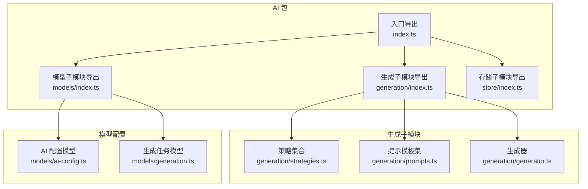
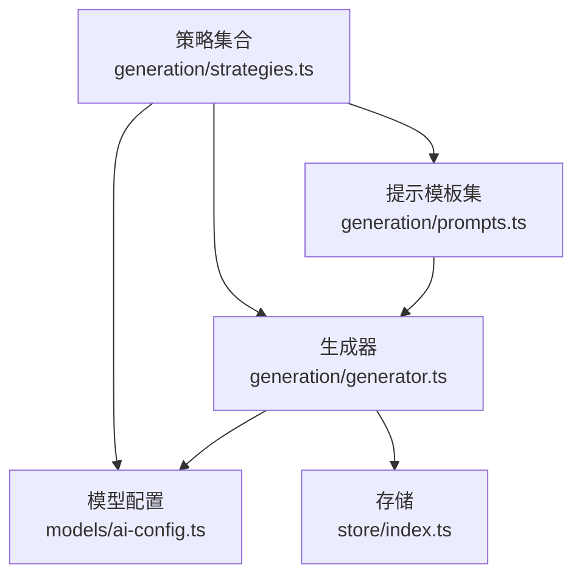
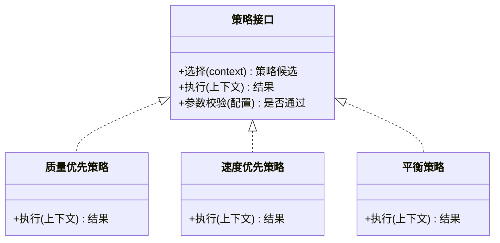
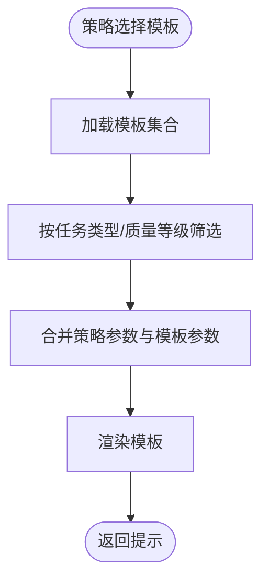
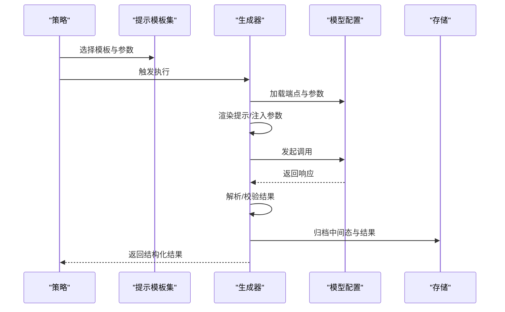
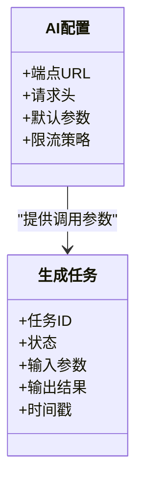
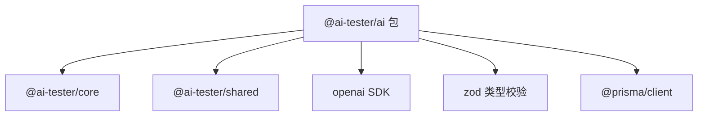

# 生成策略管理

<cite>
**本文引用的文件**
- [packages/ai/src/index.ts](file://packages/ai/src/index.ts)
- [packages/ai/src/generation/index.ts](file://packages/ai/src/generation/index.ts)
- [packages/ai/src/generation/strategies.ts](file://packages/ai/src/generation/strategies.ts)
- [packages/ai/src/generation/prompts.ts](file://packages/ai/src/generation/prompts.ts)
- [packages/ai/src/generation/generator.ts](file://packages/ai/src/generation/generator.ts)
- [packages/ai/src/models/index.ts](file://packages/ai/src/models/index.ts)
- [packages/ai/src/models/ai-config.ts](file://packages/ai/src/models/ai-config.ts)
- [packages/ai/src/models/generation.ts](file://packages/ai/src/models/generation.ts)
- [packages/ai/src/store/index.ts](file://packages/ai/src/store/index.ts)
- [packages/ai/src/crypto.ts](file://packages/ai/src/crypto.ts)
- [packages/ai/package.json](file://packages/ai/package.json)
</cite>

## 目录
1. [简介](#简介)
2. [项目结构](#项目结构)
3. [核心组件](#核心组件)
4. [架构总览](#架构总览)
5. [详细组件分析](#详细组件分析)
6. [依赖分析](#依赖分析)
7. [性能考虑](#性能考虑)
8. [故障排查指南](#故障排查指南)
9. [结论](#结论)
10. [附录](#附录)

## 简介
本技术文档聚焦于生成策略管理模块，系统性阐述策略定义架构、内置策略实现原理与扩展机制，详述策略选择算法、参数配置与执行流程；对比不同策略的特点、适用场景与性能差异；提供策略自定义开发指南（新增策略、配置参数与测试验证）；并解释策略与提示工程的协作关系及如何通过策略控制生成质量与数量。

## 项目结构
AI 包作为核心生成能力承载层，围绕“策略-提示-生成器-模型配置-存储”形成清晰分层。对外通过统一入口导出，内部按功能域拆分模块，便于扩展与维护。

图表来源
- [packages/ai/src/index.ts:1-7](file://packages/ai/src/index.ts#L1-L7)
- [packages/ai/src/generation/index.ts:1-4](file://packages/ai/src/generation/index.ts#L1-L4)
- [packages/ai/src/models/index.ts:1-4](file://packages/ai/src/models/index.ts#L1-L4)

章节来源
- [packages/ai/src/index.ts:1-7](file://packages/ai/src/index.ts#L1-L7)
- [packages/ai/src/generation/index.ts:1-4](file://packages/ai/src/generation/index.ts#L1-L4)
- [packages/ai/src/models/index.ts:1-4](file://packages/ai/src/models/index.ts#L1-L4)

## 核心组件
- 策略集合：定义可插拔的生成策略，包含策略选择、参数注入与执行编排。
- 提示模板集：集中管理提示工程资产，支持策略与提示的解耦协作。
- 生成器：封装调用链路、错误处理与结果解析，屏蔽底层提供商细节。
- 模型配置：抽象 AI 服务端点、请求参数与约束，支撑策略动态适配。
- 存储：提供持久化与检索能力，支撑策略运行时状态与结果归档。
- 入口导出：统一对外暴露 API，确保模块边界清晰、使用便捷。

章节来源
- [packages/ai/src/generation/strategies.ts](file://packages/ai/src/generation/strategies.ts)
- [packages/ai/src/generation/prompts.ts](file://packages/ai/src/generation/prompts.ts)
- [packages/ai/src/generation/generator.ts](file://packages/ai/src/generation/generator.ts)
- [packages/ai/src/models/ai-config.ts](file://packages/ai/src/models/ai-config.ts)
- [packages/ai/src/models/generation.ts](file://packages/ai/src/models/generation.ts)
- [packages/ai/src/store/index.ts](file://packages/ai/src/store/index.ts)
- [packages/ai/src/index.ts:1-7](file://packages/ai/src/index.ts#L1-L7)

## 架构总览
生成策略管理采用“策略即配置”的思想：策略负责决策与参数化，提示负责内容工程，生成器负责执行与收敛，模型配置负责参数约束，存储负责数据生命周期管理。整体流程以策略为中心，贯穿提示选择、参数注入、调用执行与结果归档。

图表来源
- [packages/ai/src/generation/strategies.ts](file://packages/ai/src/generation/strategies.ts)
- [packages/ai/src/generation/prompts.ts](file://packages/ai/src/generation/prompts.ts)
- [packages/ai/src/generation/generator.ts](file://packages/ai/src/generation/generator.ts)
- [packages/ai/src/models/ai-config.ts](file://packages/ai/src/models/ai-config.ts)
- [packages/ai/src/store/index.ts](file://packages/ai/src/store/index.ts)

## 详细组件分析

### 策略集合（generation/strategies.ts）
- 职责
  - 定义策略接口与通用行为，提供策略注册、选择与执行编排。
  - 支持内置策略与扩展策略的统一抽象，便于替换与组合。
- 关键点
  - 策略选择算法：基于输入上下文、目标质量/数量要求、可用资源与成本预算进行评分或过滤，输出候选策略列表。
  - 参数配置：策略参数与全局模型配置合并，支持默认值、覆盖与校验。
  - 执行流程：策略驱动提示模板选择、参数注入、调用生成器并处理结果。
- 内置策略
  - 基于质量优先的策略：强调准确性与完整性，适合对输出质量要求高的场景。
  - 基于速度优先的策略：强调吞吐与时延，适合批量生成与快速迭代。
  - 平衡策略：在质量与时延之间折中，适合通用场景。
- 扩展机制
  - 新增策略需实现统一接口，注册到策略工厂，参与选择算法。
  - 可通过配置开关启用/禁用策略，便于灰度与回滚。

图表来源
- [packages/ai/src/generation/strategies.ts](file://packages/ai/src/generation/strategies.ts)

章节来源
- [packages/ai/src/generation/strategies.ts](file://packages/ai/src/generation/strategies.ts)

### 提示模板集（generation/prompts.ts）
- 职责
  - 统一管理提示工程资产，支持模板版本化、参数化与复用。
  - 与策略解耦：策略决定使用哪个模板与参数，模板不关心策略逻辑。
- 关键点
  - 模板组织：按任务类型、复杂度与质量等级分类，便于策略检索与匹配。
  - 参数化：模板参数与策略参数合并，支持默认值与占位符替换。
  - 版本与回滚：模板版本化便于灰度发布与问题回溯。

图表来源
- [packages/ai/src/generation/prompts.ts](file://packages/ai/src/generation/prompts.ts)

章节来源
- [packages/ai/src/generation/prompts.ts](file://packages/ai/src/generation/prompts.ts)

### 生成器（generation/generator.ts）
- 职责
  - 封装调用链路：从策略与提示到最终结果的完整执行闭环。
  - 错误处理：统一异常捕获、重试、降级与日志记录。
  - 结果解析：将原始响应转换为结构化输出，支持多格式解析。
- 关键点
  - 多提供商适配：通过模型配置抽象不同提供商的差异。
  - 超时与重试：根据策略目标调整超时与重试策略。
  - 结果归档：将中间态与最终态写入存储，便于审计与复现。

图表来源
- [packages/ai/src/generation/generator.ts](file://packages/ai/src/generation/generator.ts)
- [packages/ai/src/models/ai-config.ts](file://packages/ai/src/models/ai-config.ts)
- [packages/ai/src/store/index.ts](file://packages/ai/src/store/index.ts)

章节来源
- [packages/ai/src/generation/generator.ts](file://packages/ai/src/generation/generator.ts)

### 模型配置（models/ai-config.ts 与 models/generation.ts）
- 职责
  - 抽象 AI 服务端点、请求参数、约束与限流策略。
  - 生成任务模型：描述任务元数据、状态流转与结果结构。
- 关键点
  - 端点抽象：屏蔽提供商差异，统一参数命名与默认值。
  - 参数校验：结合策略参数与模型约束进行联合校验。
  - 任务生命周期：从创建、执行到完成/失败的全链路追踪。

图表来源
- [packages/ai/src/models/ai-config.ts](file://packages/ai/src/models/ai-config.ts)
- [packages/ai/src/models/generation.ts](file://packages/ai/src/models/generation.ts)

章节来源
- [packages/ai/src/models/ai-config.ts](file://packages/ai/src/models/ai-config.ts)
- [packages/ai/src/models/generation.ts](file://packages/ai/src/models/generation.ts)

### 存储（store/index.ts）
- 职责
  - 提供生成过程与结果的持久化能力，支持查询、更新与归档。
- 关键点
  - 数据模型：与生成任务模型保持一致，确保语义清晰。
  - 访问模式：读写分离、缓存与异步落盘，兼顾一致性与性能。

章节来源
- [packages/ai/src/store/index.ts](file://packages/ai/src/store/index.ts)

### 入口导出（index.ts 与 generation/index.ts）
- 职责
  - 对外统一导出，隐藏内部模块拆分细节，降低使用者心智负担。
- 关键点
  - 保持导出面稳定，内部可演进式重构。

章节来源
- [packages/ai/src/index.ts:1-7](file://packages/ai/src/index.ts#L1-L7)
- [packages/ai/src/generation/index.ts:1-4](file://packages/ai/src/generation/index.ts#L1-L4)

## 依赖分析
- 内部依赖
  - generation 依赖 models 与 store，用于参数与结果管理。
  - models 与 store 由 core 与 shared 提供基础能力。
- 外部依赖
  - openai SDK 用于与 OpenAI 服务交互。
  - zod 用于参数校验与类型安全。
- 构建与测试
  - 使用 tsup 进行打包，vitest 进行单元测试。

图表来源
- [packages/ai/package.json:21-26](file://packages/ai/package.json#L21-L26)

章节来源
- [packages/ai/package.json:1-34](file://packages/ai/package.json#L1-L34)

## 性能考虑
- 策略选择
  - 在策略选择阶段尽早过滤不可行方案，减少无效调用。
  - 对高成本策略设置阈值与兜底策略，避免极端情况影响整体性能。
- 提示渲染
  - 模板参数合并与渲染应尽量幂等，避免重复计算。
- 生成器
  - 合理设置超时与并发度，结合限流策略防止抖动。
  - 对长文本生成采用流式输出与增量解析，提升感知性能。
- 存储
  - 异步落盘与批量写入，降低阻塞风险；必要时引入缓存层。

## 故障排查指南
- 常见问题
  - 策略未生效：检查策略是否注册、是否被选择算法过滤、参数是否通过校验。
  - 提示为空或异常：确认模板是否存在、参数是否正确合并、渲染是否成功。
  - 调用失败：查看生成器错误处理分支、重试策略与日志记录。
  - 结果异常：核对解析逻辑与数据模型一致性，检查存储写入状态。
- 排查步骤
  - 从策略选择开始逐层定位，逐步缩小范围。
  - 利用存储中的中间态与日志进行复盘。
  - 对关键路径增加可观测性指标（耗时、成功率、错误码分布）。

## 结论
生成策略管理模块通过“策略即配置”的设计，实现了策略选择、提示工程与执行链路的解耦与协同。内置策略覆盖质量优先、速度优先与平衡三类典型场景；扩展机制允许以最小代价新增策略并纳入统一编排。配合完善的模型配置与存储能力，可在保证质量的同时灵活控制生成的数量与成本。

## 附录
- 策略自定义开发指南
  - 新增策略
    - 实现策略接口，定义参数与校验规则。
    - 在策略工厂注册，参与选择算法。
    - 编写单元测试与集成测试，覆盖正常与异常路径。
  - 配置参数
    - 在模型配置中补充默认参数与约束。
    - 在策略中声明所需参数并与全局配置合并。
  - 测试验证
    - 单测：验证参数校验、选择逻辑与执行分支。
    - 集成测：验证端到端流程与存储落盘。
- 策略与提示工程协作
  - 策略决定“做什么”与“怎么做”，提示负责“说什么”。
  - 通过策略参数控制提示复杂度与质量等级，实现对生成质量与数量的精细化控制。