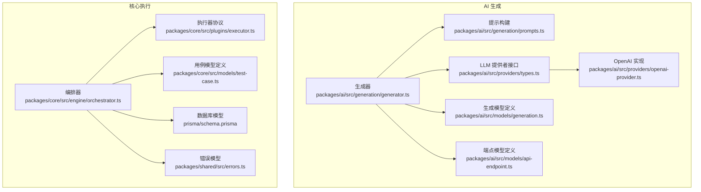
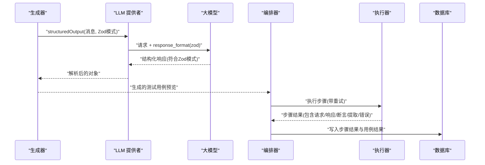
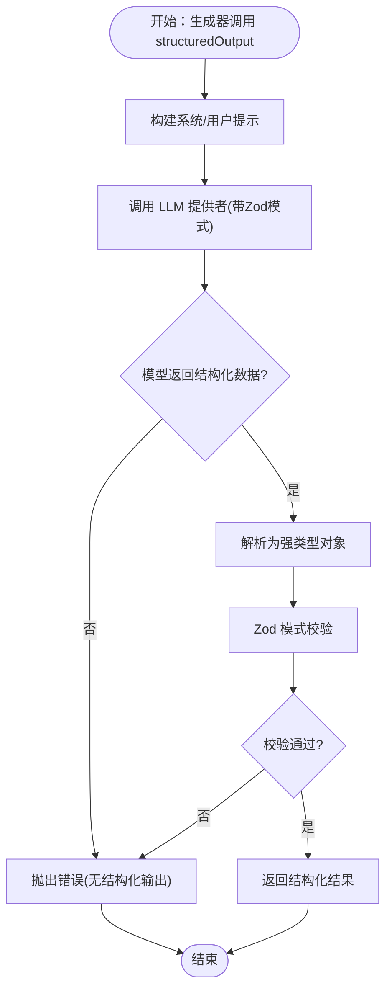
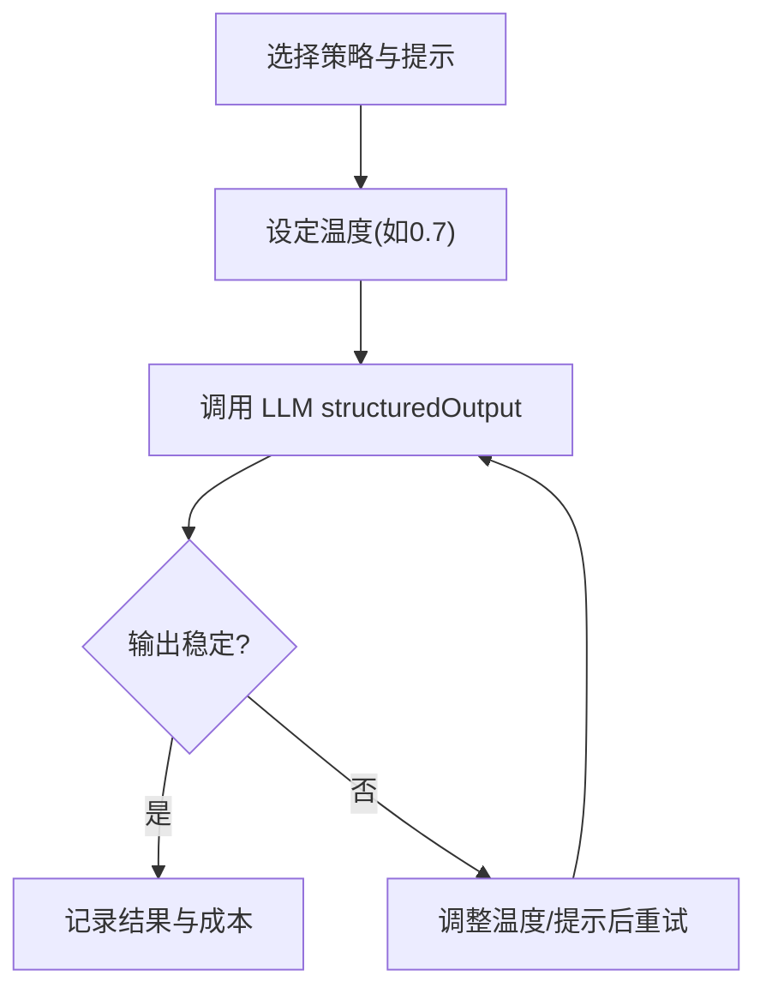
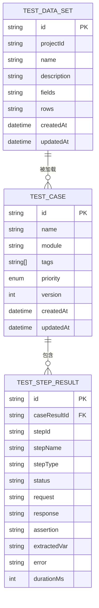
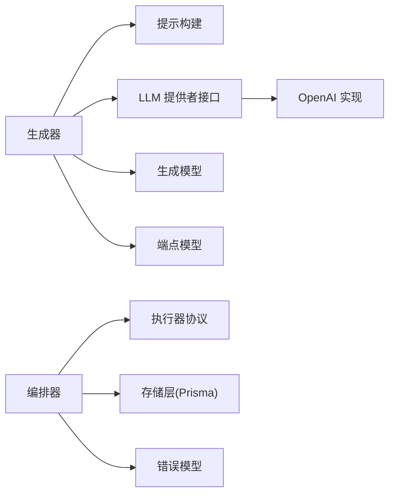

# 结果验证与解析

<cite>
**本文引用的文件**
- [packages/ai/src/providers/openai-provider.ts](file://packages/ai/src/providers/openai-provider.ts)
- [packages/ai/src/providers/types.ts](file://packages/ai/src/providers/types.ts)
- [packages/ai/src/generation/generator.ts](file://packages/ai/src/generation/generator.ts)
- [packages/ai/src/generation/prompts.ts](file://packages/ai/src/generation/prompts.ts)
- [packages/ai/src/models/api-endpoint.ts](file://packages/ai/src/models/api-endpoint.ts)
- [packages/ai/src/models/generation.ts](file://packages/ai/src/models/generation.ts)
- [packages/core/src/engine/orchestrator.ts](file://packages/core/src/engine/orchestrator.ts)
- [packages/core/src/plugins/executor.ts](file://packages/core/src/plugins/executor.ts)
- [packages/core/src/models/test-case.ts](file://packages/core/src/models/test-case.ts)
- [packages/shared/src/errors.ts](file://packages/shared/src/errors.ts)
- [prisma/schema.prisma](file://prisma/schema.prisma)
</cite>

## 目录
1. [引言](#引言)
2. [项目结构](#项目结构)
3. [核心组件](#核心组件)
4. [架构总览](#架构总览)
5. [详细组件分析](#详细组件分析)
6. [依赖关系分析](#依赖关系分析)
7. [性能考虑](#性能考虑)
8. [故障排查指南](#故障排查指南)
9. [结论](#结论)
10. [附录](#附录)

## 引言
本文件聚焦“结果验证与解析”模块，系统阐述以下主题：
- 基于 Zod 的结构化输出验证机制：JSON 模式定义、字段约束与类型安全保证
- 生成结果的解析流程：数据转换、格式标准化与错误处理
- 温度参数调优策略：质量控制、随机性调节与一致性保障
- 验证失败的处理机制：重试策略、错误分类与用户反馈
- 性能优化建议与最佳实践

## 项目结构
该模块横跨 AI 生成与核心执行两大子域：
- AI 侧负责结构化提示与 Zod 验证：提供者接口、生成器、提示构建与模型交互
- 核心执行侧负责运行编排与重试：编排器、执行器协议与步骤结果持久化



图表来源
- [packages/ai/src/generation/generator.ts:1-57](file://packages/ai/src/generation/generator.ts#L1-L57)
- [packages/ai/src/generation/prompts.ts:1-73](file://packages/ai/src/generation/prompts.ts#L1-L73)
- [packages/ai/src/providers/types.ts:1-35](file://packages/ai/src/providers/types.ts#L1-L35)
- [packages/ai/src/providers/openai-provider.ts:1-79](file://packages/ai/src/providers/openai-provider.ts#L1-L79)
- [packages/ai/src/models/generation.ts:1-67](file://packages/ai/src/models/generation.ts#L1-L67)
- [packages/ai/src/models/api-endpoint.ts:1-53](file://packages/ai/src/models/api-endpoint.ts#L1-L53)
- [packages/core/src/engine/orchestrator.ts:1-296](file://packages/core/src/engine/orchestrator.ts#L1-L296)
- [packages/core/src/plugins/executor.ts:1-23](file://packages/core/src/plugins/executor.ts#L1-L23)
- [packages/core/src/models/test-case.ts:1-46](file://packages/core/src/models/test-case.ts#L1-L46)
- [packages/shared/src/errors.ts:1-26](file://packages/shared/src/errors.ts#L1-L26)
- [prisma/schema.prisma:84-139](file://prisma/schema.prisma#L84-L139)

章节来源
- [packages/ai/src/generation/generator.ts:1-57](file://packages/ai/src/generation/generator.ts#L1-L57)
- [packages/core/src/engine/orchestrator.ts:1-296](file://packages/core/src/engine/orchestrator.ts#L1-L296)

## 核心组件
- LLM 提供者接口与实现：统一 chatCompletion 与 structuredOutput 能力，后者通过 Zod schema 与模型响应格式联动进行结构化输出验证
- 生成器：组合系统提示、端点上下文与用户提示，调用 structuredOutput 并返回结构化测试用例预览
- 编排器：对每一步骤执行重试与状态管理，并将结果持久化到数据库
- 执行器协议：定义步骤执行的统一返回结构，便于上层统计与展示
- 错误模型：统一应用级错误类型，便于在各层传递一致的错误语义

章节来源
- [packages/ai/src/providers/types.ts:1-35](file://packages/ai/src/providers/types.ts#L1-L35)
- [packages/ai/src/providers/openai-provider.ts:1-79](file://packages/ai/src/providers/openai-provider.ts#L1-L79)
- [packages/ai/src/generation/generator.ts:1-57](file://packages/ai/src/generation/generator.ts#L1-L57)
- [packages/core/src/engine/orchestrator.ts:242-266](file://packages/core/src/engine/orchestrator.ts#L242-L266)
- [packages/core/src/plugins/executor.ts:1-23](file://packages/core/src/plugins/executor.ts#L1-L23)
- [packages/shared/src/errors.ts:1-26](file://packages/shared/src/errors.ts#L1-L26)

## 架构总览
下图展示了从生成到执行再到结果持久化的整体链路，重点标注了结构化输出验证与重试机制。



图表来源
- [packages/ai/src/generation/generator.ts:45-55](file://packages/ai/src/generation/generator.ts#L45-L55)
- [packages/ai/src/providers/openai-provider.ts:45-63](file://packages/ai/src/providers/openai-provider.ts#L45-L63)
- [packages/core/src/engine/orchestrator.ts:242-266](file://packages/core/src/engine/orchestrator.ts#L242-L266)
- [prisma/schema.prisma:107-124](file://prisma/schema.prisma#L107-L124)

## 详细组件分析

### 组件一：结构化输出验证与解析（Zod）
- Zod 模式定义与字段约束
  - 生成结果模式：包含测试用例数组，每个用例包含名称、描述、模块、标签、优先级、步骤列表、变量等字段，确保生成物结构稳定且可被后续编排使用
  - 端点模型：方法、路径、参数、请求/响应模式、认证方式等字段，用于构建提示上下文
  - 生成任务模型：包含策略、状态、生成结果、令牌用量、耗时等，支撑任务追踪与成本控制
- 类型安全保证
  - 通过 LlmProvider.structuredOutput 的泛型参数与 ZodType，确保返回值在编译期与运行期均满足模式约束
  - OpenAI 提供者在收到模型响应后，使用 zodResponseFormat 将模型输出映射为结构化对象，若解析失败则抛出异常
- 数据转换与格式标准化
  - 生成器将端点信息序列化为提示上下文字符串，再将模型输出反序列化为强类型对象
  - 执行器对 HTTP 步骤的结果进行标准化封装，统一包含请求、响应、断言、提取变量与错误信息
- 错误处理
  - 当模型未返回结构化输出或解析失败时，抛出错误交由上层重试或降级处理
  - 执行器捕获异常并记录错误信息，编排器据此决定是否继续重试



图表来源
- [packages/ai/src/generation/generator.ts:45-55](file://packages/ai/src/generation/generator.ts#L45-L55)
- [packages/ai/src/providers/openai-provider.ts:45-63](file://packages/ai/src/providers/openai-provider.ts#L45-L63)
- [packages/ai/src/models/generation.ts:26-36](file://packages/ai/src/models/generation.ts#L26-L36)
- [packages/ai/src/models/api-endpoint.ts:14-29](file://packages/ai/src/models/api-endpoint.ts#L14-L29)

章节来源
- [packages/ai/src/generation/generator.ts:12-55](file://packages/ai/src/generation/generator.ts#L12-L55)
- [packages/ai/src/providers/openai-provider.ts:45-63](file://packages/ai/src/providers/openai-provider.ts#L45-L63)
- [packages/ai/src/models/generation.ts:1-67](file://packages/ai/src/models/generation.ts#L1-L67)
- [packages/ai/src/models/api-endpoint.ts:1-53](file://packages/ai/src/models/api-endpoint.ts#L1-L53)

### 组件二：温度参数调优策略
- 调优目标
  - 质量控制：降低歧义，提升结构化输出的稳定性与一致性
  - 随机性调节：在创造性与可控性之间取得平衡
  - 一致性保证：固定温度与提示工程，减少漂移
- 实践要点
  - 生成阶段：使用适中的温度（例如 0.7）以兼顾创造性与稳定性
  - 执行阶段：对需要稳定性的步骤（如断言、提取）保持一致的配置
  - 可观测性：结合令牌用量与耗时监控，评估不同温度下的成本与质量
- 参数来源
  - 生成器在调用 structuredOutput 时传入温度参数
  - 提供者实现读取默认温度或覆盖温度



图表来源
- [packages/ai/src/generation/generator.ts:51-51](file://packages/ai/src/generation/generator.ts#L51-L51)
- [packages/ai/src/providers/openai-provider.ts:26-27](file://packages/ai/src/providers/openai-provider.ts#L26-L27)

章节来源
- [packages/ai/src/generation/generator.ts:51-51](file://packages/ai/src/generation/generator.ts#L51-L51)
- [packages/ai/src/providers/openai-provider.ts:26-27](file://packages/ai/src/providers/openai-provider.ts#L26-L27)

### 组件三：验证失败的处理机制
- 重试策略
  - 编排器对每个步骤执行带次数上限的重试，若仍失败则标记为 error 或 failed，并根据 continueOnFailure 决定是否中断后续步骤
- 错误分类
  - 应用错误：通过统一的 AppError/ValidationError/NotFoundError 提供一致的错误语义
  - 执行错误：执行器捕获异常并记录错误详情，便于定位问题
- 用户反馈
  - 在 Web 界面中展示测试结果与错误信息，辅助用户理解失败原因并进行修复

```mermaid
sequenceDiagram
participant Orchestrator as "编排器"
participant Executor as "执行器"
participant DB as "数据库"
Orchestrator->>Executor : "execute(step, context)"
loop 最多 retryCount+1 次
Executor-->>Orchestrator : "结果(可能为 failed/error)"
alt 成功
Orchestrator->>DB : "写入成功步骤结果"
break
else 失败
Orchestrator->>DB : "写入失败步骤结果"
alt 继续执行
Orchestrator->>Executor : "继续下一次尝试"
else 中止
Orchestrator->>DB : "标记后续步骤为 skipped"
end
end
end
```

图表来源
- [packages/core/src/engine/orchestrator.ts:242-266](file://packages/core/src/engine/orchestrator.ts#L242-L266)
- [packages/core/src/plugins/executor.ts:5-13](file://packages/core/src/plugins/executor.ts#L5-L13)
- [packages/shared/src/errors.ts:1-26](file://packages/shared/src/errors.ts#L1-L26)

章节来源
- [packages/core/src/engine/orchestrator.ts:242-266](file://packages/core/src/engine/orchestrator.ts#L242-L266)
- [packages/core/src/plugins/executor.ts:1-23](file://packages/core/src/plugins/executor.ts#L1-L23)
- [packages/shared/src/errors.ts:1-26](file://packages/shared/src/errors.ts#L1-L26)

### 组件四：数据模型与持久化
- 测试用例与步骤结果
  - 用例模型定义包含名称、模块、标签、优先级、步骤与变量等字段，确保生成物可直接落地为可执行用例
  - 步骤结果模型包含请求、响应、断言、提取变量与错误信息，便于回溯与审计
- 数据库映射
  - TestStepResult 的 request/response/assertion/extractedVar/error 字段以 JSON 字符串形式存储，便于灵活承载结构化数据
  - TestRun/TestStepResult 与 TestDataSet 等模型通过 Prisma 进行持久化



图表来源
- [packages/core/src/models/test-case.ts:7-21](file://packages/core/src/models/test-case.ts#L7-L21)
- [prisma/schema.prisma:107-124](file://prisma/schema.prisma#L107-L124)
- [prisma/schema.prisma:126-139](file://prisma/schema.prisma#L126-L139)

章节来源
- [packages/core/src/models/test-case.ts:1-46](file://packages/core/src/models/test-case.ts#L1-L46)
- [prisma/schema.prisma:107-124](file://prisma/schema.prisma#L107-L124)
- [prisma/schema.prisma:126-139](file://prisma/schema.prisma#L126-L139)

## 依赖关系分析
- 组件耦合
  - 生成器依赖 LLM 提供者接口与提示构建模块，耦合度低，便于替换不同模型
  - 编排器依赖执行器协议与存储层，通过接口隔离实现高内聚
- 外部依赖
  - Zod：提供结构化输出的强类型验证
  - Prisma：提供数据库访问与模型映射
- 循环依赖
  - 未发现直接循环依赖；模块间通过接口与数据模型解耦



图表来源
- [packages/ai/src/generation/generator.ts:1-57](file://packages/ai/src/generation/generator.ts#L1-L57)
- [packages/ai/src/generation/prompts.ts:1-73](file://packages/ai/src/generation/prompts.ts#L1-L73)
- [packages/ai/src/providers/types.ts:1-35](file://packages/ai/src/providers/types.ts#L1-L35)
- [packages/ai/src/providers/openai-provider.ts:1-79](file://packages/ai/src/providers/openai-provider.ts#L1-L79)
- [packages/ai/src/models/generation.ts:1-67](file://packages/ai/src/models/generation.ts#L1-L67)
- [packages/ai/src/models/api-endpoint.ts:1-53](file://packages/ai/src/models/api-endpoint.ts#L1-L53)
- [packages/core/src/engine/orchestrator.ts:1-296](file://packages/core/src/engine/orchestrator.ts#L1-L296)
- [packages/core/src/plugins/executor.ts:1-23](file://packages/core/src/plugins/executor.ts#L1-L23)
- [packages/shared/src/errors.ts:1-26](file://packages/shared/src/errors.ts#L1-L26)

章节来源
- [packages/ai/src/generation/generator.ts:1-57](file://packages/ai/src/generation/generator.ts#L1-L57)
- [packages/core/src/engine/orchestrator.ts:1-296](file://packages/core/src/engine/orchestrator.ts#L1-L296)

## 性能考虑
- 温度与提示工程
  - 使用较低温度（如 0.7）提升结构化输出稳定性，减少重试次数
  - 通过精炼提示与上下文减少上下文长度，从而降低令牌消耗与延迟
- 重试与并发
  - 控制每步重试次数，避免过度重试导致资源浪费
  - 对于高延迟的外部服务，适当增加超时与并发限制，但需配合限流策略
- 数据持久化
  - 将复杂对象以 JSON 字符串形式存储，简化写入路径；读取时按需解析
  - 对高频查询字段建立索引，提升查询效率
- 监控与可观测性
  - 记录每次结构化输出的解析耗时与成功率，持续优化提示与参数
  - 关注令牌用量与成本，动态调整温度与上下文规模

## 故障排查指南
- 结构化输出为空或解析失败
  - 检查提示是否足够清晰，必要时提高温度或细化示例
  - 确认模型支持 response_format 与 zodResponseFormat 的使用
- 执行失败与重试
  - 查看步骤结果中的 error 字段，定位具体失败原因
  - 若为网络波动导致的偶发错误，可适当增加 retryCount
- 错误分类与上报
  - 使用统一的 AppError/ValidationError/NotFoundError，便于前端展示与日志检索
- 数据库写入异常
  - 检查 JSON 字段序列化是否正确，避免过大对象导致写入失败

章节来源
- [packages/ai/src/providers/openai-provider.ts:58-62](file://packages/ai/src/providers/openai-provider.ts#L58-L62)
- [packages/core/src/engine/orchestrator.ts:242-266](file://packages/core/src/engine/orchestrator.ts#L242-L266)
- [packages/shared/src/errors.ts:1-26](file://packages/shared/src/errors.ts#L1-L26)
- [prisma/schema.prisma:114-118](file://prisma/schema.prisma#L114-L118)

## 结论
本模块通过 Zod 模式与 LLM 结构化输出相结合，实现了从生成到执行的强类型验证与可靠解析。配合编排器的重试机制与统一错误模型，能够在保证质量的同时提升稳定性与可维护性。建议在实际使用中持续优化提示工程与温度参数，并结合监控指标不断迭代，以达到最佳的质量与性能平衡。

## 附录
- 关键实现参考路径
  - 生成器与提示构建：[packages/ai/src/generation/generator.ts:1-57](file://packages/ai/src/generation/generator.ts#L1-L57)、[packages/ai/src/generation/prompts.ts:1-73](file://packages/ai/src/generation/prompts.ts#L1-L73)
  - LLM 提供者接口与实现：[packages/ai/src/providers/types.ts:1-35](file://packages/ai/src/providers/types.ts#L1-L35)、[packages/ai/src/providers/openai-provider.ts:1-79](file://packages/ai/src/providers/openai-provider.ts#L1-L79)
  - 编排器与执行器协议：[packages/core/src/engine/orchestrator.ts:1-296](file://packages/core/src/engine/orchestrator.ts#L1-L296)、[packages/core/src/plugins/executor.ts:1-23](file://packages/core/src/plugins/executor.ts#L1-L23)
  - 数据模型与持久化：[packages/ai/src/models/generation.ts:1-67](file://packages/ai/src/models/generation.ts#L1-L67)、[packages/ai/src/models/api-endpoint.ts:1-53](file://packages/ai/src/models/api-endpoint.ts#L1-L53)、[prisma/schema.prisma:84-139](file://prisma/schema.prisma#L84-L139)