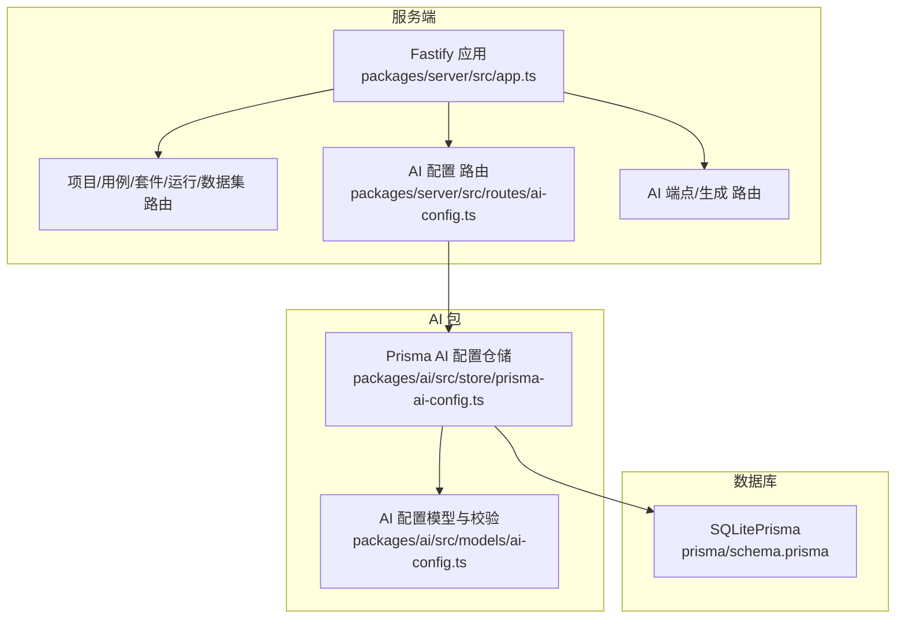
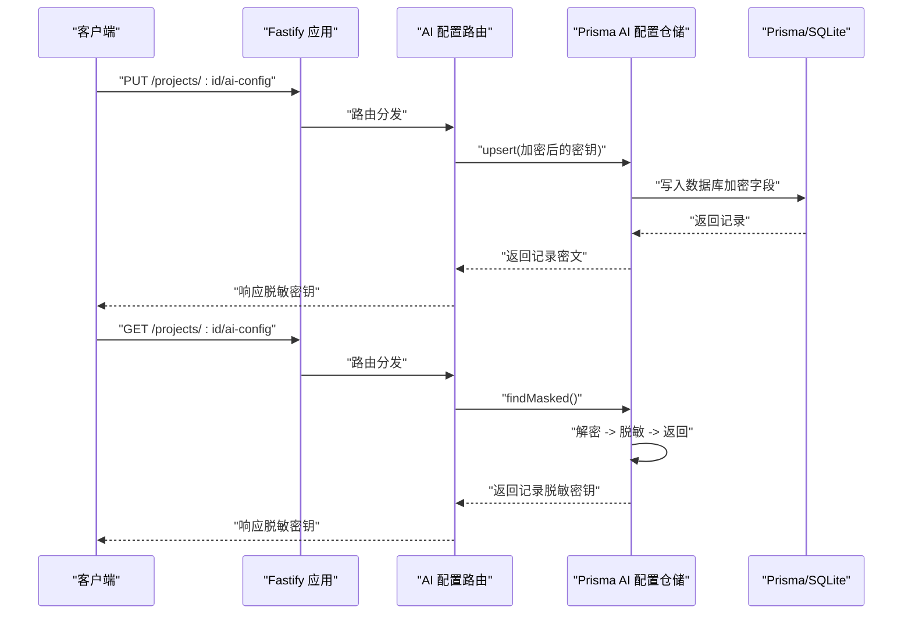
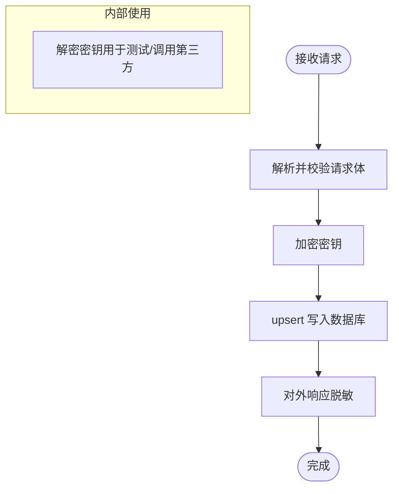
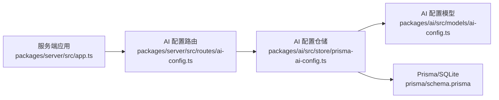

# 安全架构

<cite>
**本文引用的文件**
- [packages/server/src/app.ts](file://packages/server/src/app.ts)
- [packages/server/src/routes/ai-config.ts](file://packages/server/src/routes/ai-config.ts)
- [packages/ai/src/store/prisma-ai-config.ts](file://packages/ai/src/store/prisma-ai-config.ts)
- [packages/ai/src/models/ai-config.ts](file://packages/ai/src/models/ai-config.ts)
- [prisma/schema.prisma](file://prisma/schema.prisma)
- [packages/server/package.json](file://packages/server/package.json)
- [packages/core/package.json](file://packages/core/package.json)
- [packages/web/package.json](file://packages/web/package.json)
</cite>

## 目录
1. [引言](#引言)
2. [项目结构](#项目结构)
3. [核心组件](#核心组件)
4. [架构总览](#架构总览)
5. [详细组件分析](#详细组件分析)
6. [依赖关系分析](#依赖关系分析)
7. [性能与安全权衡](#性能与安全权衡)
8. [故障排查指南](#故障排查指南)
9. [结论](#结论)
10. [附录：安全配置最佳实践与合规建议](#附录安全配置最佳实践与合规建议)

## 引言
本文件系统化梳理本项目的“安全架构”，聚焦以下方面：
- API 密钥管理：入库加密、出库脱敏、仅在必要时短暂解密
- 加密存储与解密机制：基于对称加密的密钥存储与最小暴露原则
- 访问控制与权限验证：当前未见显式鉴权中间件，需结合部署边界与前端策略补强
- CORS 配置：默认允许来源，建议按环境收紧
- WebSocket 连接：未发现专用 WS 路由或认证逻辑，存在风险
- 安全审计、日志与异常检测：统一错误处理与日志级别
- 数据传输加密、静态数据保护与密钥轮换：建议与基础设施联动
- 合规性与最佳实践：基于现有实现的加固建议

## 项目结构
后端采用 Fastify 框架，通过模块化路由注册组织功能；AI 配置相关逻辑位于独立包中，并通过 Prisma 访问 SQLite 数据库存储。

图表来源
- [packages/server/src/app.ts:13-63](file://packages/server/src/app.ts#L13-L63)
- [packages/server/src/routes/ai-config.ts:11-81](file://packages/server/src/routes/ai-config.ts#L11-L81)
- [packages/ai/src/store/prisma-ai-config.ts:22-81](file://packages/ai/src/store/prisma-ai-config.ts#L22-L81)
- [prisma/schema.prisma:10-154](file://prisma/schema.prisma#L10-L154)

章节来源
- [packages/server/src/app.ts:13-63](file://packages/server/src/app.ts#L13-L63)
- [packages/server/src/routes/ai-config.ts:11-81](file://packages/server/src/routes/ai-config.ts#L11-L81)
- [packages/ai/src/store/prisma-ai-config.ts:22-81](file://packages/ai/src/store/prisma-ai-config.ts#L22-L81)
- [prisma/schema.prisma:10-154](file://prisma/schema.prisma#L10-L154)

## 核心组件
- 应用与中间件
  - CORS：启用并允许任意来源（生产环境建议按域名白名单）
  - 全局错误处理器：统一返回结构与日志记录
  - 健康检查端点
- 路由层
  - AI 配置路由：查询、创建/更新、删除、连通性测试
- 存储层
  - Prisma AI 配置仓储：封装加密入库、解密查询、脱敏返回
- 数据模型
  - AI 配置模型：定义字段与校验规则（含密钥长度等约束）

章节来源
- [packages/server/src/app.ts:20-43](file://packages/server/src/app.ts#L20-L43)
- [packages/server/src/routes/ai-config.ts:11-81](file://packages/server/src/routes/ai-config.ts#L11-L81)
- [packages/ai/src/store/prisma-ai-config.ts:22-81](file://packages/ai/src/store/prisma-ai-config.ts#L22-L81)
- [packages/ai/src/models/ai-config.ts:5-26](file://packages/ai/src/models/ai-config.ts#L5-L26)

## 架构总览
下图展示从请求到数据库的关键路径，以及加密/解密与脱敏的时机。

图表来源
- [packages/server/src/routes/ai-config.ts:24-42](file://packages/server/src/routes/ai-config.ts#L24-L42)
- [packages/ai/src/store/prisma-ai-config.ts:22-81](file://packages/ai/src/store/prisma-ai-config.ts#L22-L81)
- [prisma/schema.prisma:141-154](file://prisma/schema.prisma#L141-L154)

## 详细组件分析

### API 密钥管理与加密存储
- 入库加密
  - 创建/更新时对密钥进行加密后再写入数据库
  - 数据库字段类型为字符串，存储加密结果
- 出库解密
  - 仅在内部测试连通性等必要场景才解密
  - 对外响应使用脱敏显示
- 脱敏策略
  - 响应体中以掩码形式展示密钥片段，避免泄露完整密钥

图表来源
- [packages/ai/src/store/prisma-ai-config.ts:23-47](file://packages/ai/src/store/prisma-ai-config.ts#L23-L47)
- [packages/server/src/routes/ai-config.ts:24-42](file://packages/server/src/routes/ai-config.ts#L24-L42)
- [prisma/schema.prisma:146](file://prisma/schema.prisma#L146)

章节来源
- [packages/ai/src/store/prisma-ai-config.ts:22-81](file://packages/ai/src/store/prisma-ai-config.ts#L22-L81)
- [packages/server/src/routes/ai-config.ts:11-81](file://packages/server/src/routes/ai-config.ts#L11-L81)
- [prisma/schema.prisma:141-154](file://prisma/schema.prisma#L141-L154)

### 解密机制与最小暴露原则
- 解密仅在必要时发生（如连通性测试），并在测试完成后立即丢弃明文
- 外部响应不包含原始密钥，仅返回掩码后的片段
- 数据库字段存储密文，避免明文落盘

章节来源
- [packages/server/src/routes/ai-config.ts:54-80](file://packages/server/src/routes/ai-config.ts#L54-L80)
- [packages/ai/src/store/prisma-ai-config.ts:60-80](file://packages/ai/src/store/prisma-ai-config.ts#L60-L80)

### 访问控制与权限验证
- 当前实现未发现全局鉴权中间件或细粒度权限控制
- 建议在路由层或插件层引入鉴权与授权（如基于角色的访问控制 RBAC）
- 结合前端与网关，限制可访问的项目范围与操作

章节来源
- [packages/server/src/app.ts:13-63](file://packages/server/src/app.ts#L13-L63)
- [packages/server/src/routes/ai-config.ts:11-81](file://packages/server/src/routes/ai-config.ts#L11-L81)

### CORS 配置
- 默认允许任意来源，便于开发调试
- 生产环境建议改为白名单域名，减少跨域风险

章节来源
- [packages/server/src/app.ts:20-21](file://packages/server/src/app.ts#L20-L21)

### WebSocket 连接与消息认证
- 未发现专用 WebSocket 路由或认证逻辑
- 若后续引入实时通信，需明确认证来源、令牌校验与会话绑定

章节来源
- [packages/server/package.json:22-24](file://packages/server/package.json#L22-L24)
- [packages/server/src/app.ts:13-63](file://packages/server/src/app.ts#L13-L63)

### 安全审计、日志记录与异常检测
- 统一错误处理器：区分参数校验错误与服务器内部错误，记录日志
- 日志级别可通过环境变量配置
- 建议补充敏感操作审计（如密钥更新、删除）、异常指标与告警

章节来源
- [packages/server/src/app.ts:23-43](file://packages/server/src/app.ts#L23-L43)

### 数据传输加密、静态数据保护与密钥轮换
- 数据传输：建议强制 HTTPS/TLS
- 静态数据保护：数据库文件与密钥材料应受文件系统权限保护
- 密钥轮换：建议引入密钥版本管理与平滑迁移流程

章节来源
- [prisma/schema.prisma:5-8](file://prisma/schema.prisma#L5-L8)

## 依赖关系分析
- 服务端依赖 Fastify、CORS、Swagger 等
- AI 包依赖共享与核心包，负责加密/解密与仓储
- 数据库使用 Prisma/SQLite

图表来源
- [packages/server/src/app.ts:13-63](file://packages/server/src/app.ts#L13-L63)
- [packages/server/src/routes/ai-config.ts:11-81](file://packages/server/src/routes/ai-config.ts#L11-L81)
- [packages/ai/src/store/prisma-ai-config.ts:22-81](file://packages/ai/src/store/prisma-ai-config.ts#L22-L81)
- [packages/ai/src/models/ai-config.ts:5-26](file://packages/ai/src/models/ai-config.ts#L5-L26)
- [prisma/schema.prisma:10-154](file://prisma/schema.prisma#L10-L154)

章节来源
- [packages/server/package.json:16-28](file://packages/server/package.json#L16-L28)
- [packages/core/package.json:21-26](file://packages/core/package.json#L21-L26)
- [packages/web/package.json:13-33](file://packages/web/package.json#L13-L33)

## 性能与安全权衡
- 加密/解密成本：在高频写入场景下，建议评估加解密开销并缓存必要信息
- 脱敏与掩码：对外响应脱敏可降低泄露面，但需确保前端展示一致性
- CORS 放宽：开发友好，生产需收紧以降低 CSRF 与跨站风险

## 故障排查指南
- 参数校验失败：检查请求体是否满足模型校验规则
- 服务器内部错误：查看日志定位具体异常
- 密钥测试失败：确认密钥正确性、网络连通性与第三方服务状态

章节来源
- [packages/server/src/app.ts:23-43](file://packages/server/src/app.ts#L23-L43)
- [packages/server/src/routes/ai-config.ts:54-80](file://packages/server/src/routes/ai-config.ts#L54-L80)

## 结论
本项目在密钥管理上已具备“入库加密、出库脱敏”的基础能力，但在访问控制、CORS 收敛、WebSocket 安全与审计告警等方面尚有改进空间。建议尽快补齐鉴权与授权、收紧 CORS、完善审计与异常监控，并在基础设施层面落实 TLS、文件系统权限与密钥轮换策略。

## 附录：安全配置最佳实践与合规建议
- 网络与传输
  - 强制 HTTPS/TLS，禁用明文 HTTP
  - 严格限制 CORS 来源，生产环境使用精确域名白名单
- 认证与授权
  - 引入统一鉴权中间件与细粒度权限控制
  - 为敏感操作增加二次确认与审计日志
- 密钥与数据
  - 使用强随机密钥与安全算法
  - 实施密钥版本管理与定期轮换
  - 数据库文件与密钥材料置于受限访问的存储介质
- 日志与监控
  - 统一日志格式与保留策略
  - 关键事件（登录、密钥变更、删除）必须审计
  - 建立异常检测与告警机制