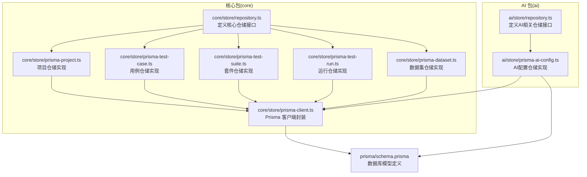
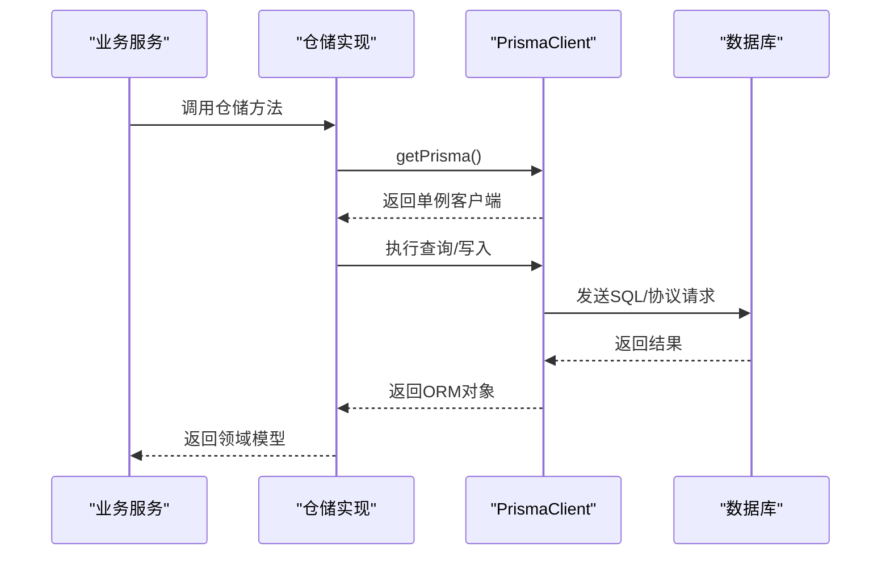
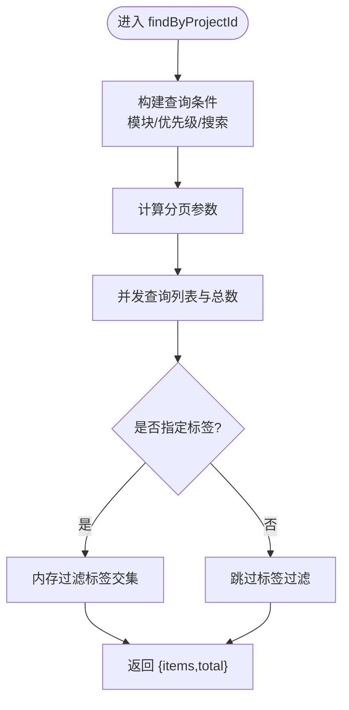
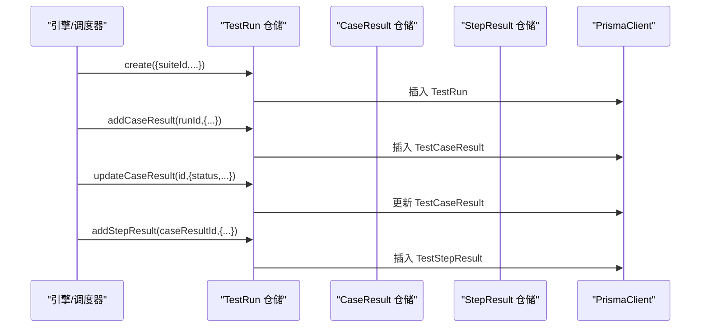
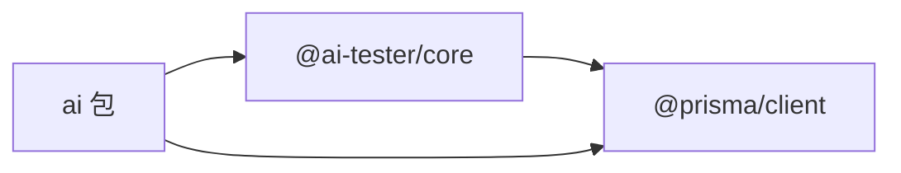

# 仓储模式实现

<cite>
**本文引用的文件**
- [packages/core/src/store/repository.ts](file://packages/core/src/store/repository.ts)
- [packages/core/src/store/prisma-client.ts](file://packages/core/src/store/prisma-client.ts)
- [packages/core/src/store/prisma-project.ts](file://packages/core/src/store/prisma-project.ts)
- [packages/core/src/store/prisma-test-case.ts](file://packages/core/src/store/prisma-test-case.ts)
- [packages/core/src/store/prisma-test-suite.ts](file://packages/core/src/store/prisma-test-suite.ts)
- [packages/core/src/store/prisma-test-run.ts](file://packages/core/src/store/prisma-test-run.ts)
- [packages/core/src/store/prisma-dataset.ts](file://packages/core/src/store/prisma-dataset.ts)
- [packages/ai/src/store/repository.ts](file://packages/ai/src/store/repository.ts)
- [packages/ai/src/store/prisma-ai-config.ts](file://packages/ai/src/store/prisma-ai-config.ts)
- [prisma/schema.prisma](file://prisma/schema.prisma)
- [package.json](file://package.json)
</cite>

## 目录
1. [简介](#简介)
2. [项目结构](#项目结构)
3. [核心组件](#核心组件)
4. [架构总览](#架构总览)
5. [详细组件分析](#详细组件分析)
6. [依赖关系分析](#依赖关系分析)
7. [性能考量](#性能考量)
8. [故障排查指南](#故障排查指南)
9. [结论](#结论)
10. [附录：最佳实践与使用指南](#附录最佳实践与使用指南)

## 简介
本文件系统性阐述本项目中仓储模式（Repository Pattern）的设计与实现，重点覆盖以下方面：
- 仓储接口设计与抽象方法定义
- PrismaClient 的封装与数据库连接管理
- 数据访问层的职责分离与依赖注入思路
- 针对不同实体的仓储实现示例
- 查询优化、事务处理与错误处理机制
- 缓存策略与数据一致性保障
- 最佳实践与使用指南

## 项目结构
本项目采用多包（monorepo）组织方式，仓储相关代码主要分布在 core 与 ai 两个包中：
- core 包：面向测试工程的核心模型与仓储实现（项目、用例、套件、运行、数据集）
- ai 包：面向 AI 配置与生成任务的仓储实现（AI 配置、API 端点、生成任务）



图表来源
- [packages/core/src/store/repository.ts:1-96](file://packages/core/src/store/repository.ts#L1-L96)
- [packages/core/src/store/prisma-client.ts:1-17](file://packages/core/src/store/prisma-client.ts#L1-L17)
- [packages/core/src/store/prisma-project.ts:1-58](file://packages/core/src/store/prisma-project.ts#L1-L58)
- [packages/core/src/store/prisma-test-case.ts:1-148](file://packages/core/src/store/prisma-test-case.ts#L1-L148)
- [packages/core/src/store/prisma-test-suite.ts:1-77](file://packages/core/src/store/prisma-test-suite.ts#L1-L77)
- [packages/core/src/store/prisma-test-run.ts:1-194](file://packages/core/src/store/prisma-test-run.ts#L1-L194)
- [packages/core/src/store/prisma-dataset.ts:1-69](file://packages/core/src/store/prisma-dataset.ts#L1-L69)
- [packages/ai/src/store/repository.ts:1-39](file://packages/ai/src/store/repository.ts#L1-L39)
- [packages/ai/src/store/prisma-ai-config.ts:1-82](file://packages/ai/src/store/prisma-ai-config.ts#L1-L82)
- [prisma/schema.prisma:1-196](file://prisma/schema.prisma#L1-L196)

章节来源
- [packages/core/src/store/repository.ts:1-96](file://packages/core/src/store/repository.ts#L1-L96)
- [packages/core/src/store/prisma-client.ts:1-17](file://packages/core/src/store/prisma-client.ts#L1-L17)
- [packages/ai/src/store/repository.ts:1-39](file://packages/ai/src/store/repository.ts#L1-L39)
- [prisma/schema.prisma:1-196](file://prisma/schema.prisma#L1-L196)

## 核心组件
- 仓储接口层：在 core 与 ai 包中分别定义了面向领域模型的仓储接口，统一声明 CRUD 与业务查询方法，隔离数据源细节。
- 具体仓储实现：以 Prisma 为基础，针对每个实体提供实现类，负责数据映射、查询条件构建、分页统计与结果转换。
- Prisma 客户端封装：提供单例式 PrismaClient 获取与断开连接能力，集中管理数据库连接生命周期。

章节来源
- [packages/core/src/store/repository.ts:1-96](file://packages/core/src/store/repository.ts#L1-L96)
- [packages/ai/src/store/repository.ts:1-39](file://packages/ai/src/store/repository.ts#L1-L39)
- [packages/core/src/store/prisma-client.ts:1-17](file://packages/core/src/store/prisma-client.ts#L1-L17)

## 架构总览
仓储模式通过“接口隔离 + 具体实现 + 数据访问封装”三层解耦，使上层业务逻辑仅依赖于抽象接口，而不感知底层存储技术。

```mermaid
classDiagram
class ProjectRepository {
+create(data) Promise~Project~
+findById(id) Promise~Project|null~
+findAll() Promise~Project[]~
+update(id,data) Promise~Project~
+delete(id) Promise~void~
}
class TestCaseRepository {
+create(data) Promise~TestCase~
+findById(id) Promise~TestCase|null~
+findByProjectId(projectId,filters?) Promise~{items,total}~
+update(id,data) Promise~TestCase~
+delete(id) Promise~void~
+duplicate(id) Promise~TestCase~
}
class TestSuiteRepository {
+create(data) Promise~TestSuite~
+findById(id) Promise~TestSuite|null~
+findByProjectId(projectId) Promise~TestSuite[]~
+update(id,data) Promise~TestSuite~
+delete(id) Promise~void~
}
class TestRunRepository {
+create(data) Promise~TestRun~
+findById(id) Promise~TestRun|null~
+findAll(filters?) Promise~{items,total}~
+update(id,data) Promise~TestRun~
+addCaseResult(runId,caseResult) Promise~TestCaseResult~
+updateCaseResult(id,data) Promise~TestCaseResult~
+addStepResult(caseResultId,stepResult) Promise~TestStepResult~
}
class TestDataSetRepository {
+create(data) Promise~TestDataSet~
+findById(id) Promise~TestDataSet|null~
+findByProjectId(projectId) Promise~TestDataSet[]~
+update(id,data) Promise~TestDataSet~
+delete(id) Promise~void~
}
class AiConfigRepository {
+upsert(data) Promise~AiConfig~
+findByProjectId(projectId) Promise~AiConfig|null~
+delete(projectId) Promise~void~
}
class ApiEndpointRepository {
+create(data) Promise~ApiEndpoint~
+createMany(data) Promise~ApiEndpoint[]~
+findById(id) Promise~ApiEndpoint|null~
+findByProjectId(projectId,filters?) Promise~ApiEndpoint[]~
+update(id,data) Promise~ApiEndpoint~
+delete(id) Promise~void~
}
class GenerationTaskRepository {
+create(data) Promise~GenerationTask~
+findById(id) Promise~GenerationTask|null~
+findByProjectId(projectId) Promise~GenerationTask[]~
+update(id,data) Promise~GenerationTask~
}
class PrismaProjectRepository
class PrismaTestCaseRepository
class PrismaTestSuiteRepository
class PrismaTestRunRepository
class PrismaTestDataSetRepository
class PrismaAiConfigRepository
ProjectRepository <|.. PrismaProjectRepository
TestCaseRepository <|.. PrismaTestCaseRepository
TestSuiteRepository <|.. PrismaTestSuiteRepository
TestRunRepository <|.. PrismaTestRunRepository
TestDataSetRepository <|.. PrismaTestDataSetRepository
AiConfigRepository <|.. PrismaAiConfigRepository
```

图表来源
- [packages/core/src/store/repository.ts:1-96](file://packages/core/src/store/repository.ts#L1-L96)
- [packages/ai/src/store/repository.ts:1-39](file://packages/ai/src/store/repository.ts#L1-L39)
- [packages/core/src/store/prisma-project.ts:17-57](file://packages/core/src/store/prisma-project.ts#L17-L57)
- [packages/core/src/store/prisma-test-case.ts:23-147](file://packages/core/src/store/prisma-test-case.ts#L23-L147)
- [packages/core/src/store/prisma-test-suite.ts:23-76](file://packages/core/src/store/prisma-test-suite.ts#L23-L76)
- [packages/core/src/store/prisma-test-run.ts:64-193](file://packages/core/src/store/prisma-test-run.ts#L64-L193)
- [packages/core/src/store/prisma-dataset.ts:23-68](file://packages/core/src/store/prisma-dataset.ts#L23-L68)
- [packages/ai/src/store/prisma-ai-config.ts:22-81](file://packages/ai/src/store/prisma-ai-config.ts#L22-L81)

## 详细组件分析

### 仓储接口层（抽象定义）
- 核心仓储接口：涵盖项目、用例、套件、运行、数据集等领域的增删改查与业务查询方法，统一返回类型与参数约束。
- AI 仓储接口：涵盖 AI 配置、API 端点、生成任务的增删改查与查询方法，满足 AI 能力的配置与执行管理需求。

章节来源
- [packages/core/src/store/repository.ts:20-95](file://packages/core/src/store/repository.ts#L20-L95)
- [packages/ai/src/store/repository.ts:15-38](file://packages/ai/src/store/repository.ts#L15-L38)

### PrismaClient 封装与连接管理
- 单例式客户端：通过惰性初始化与全局缓存，避免重复创建连接；提供断开连接函数用于进程退出或测试清理。
- 连接生命周期：在应用启动时按需创建，在合适时机调用断开，确保资源回收。



图表来源
- [packages/core/src/store/prisma-client.ts:5-10](file://packages/core/src/store/prisma-client.ts#L5-L10)
- [packages/core/src/store/prisma-project.ts:18-28](file://packages/core/src/store/prisma-project.ts#L18-L28)
- [packages/core/src/store/prisma-test-case.ts:24-45](file://packages/core/src/store/prisma-test-case.ts#L24-L45)

章节来源
- [packages/core/src/store/prisma-client.ts:1-17](file://packages/core/src/store/prisma-client.ts#L1-L17)

### 项目仓储实现（PrismaProjectRepository）
- 职责：创建、查询、更新、删除项目；自动处理 JSON 字段序列化与反序列化。
- 关键点：使用自增 ID 工具生成主键；环境配置以 JSON 存储；排序与分页由数据库完成。

章节来源
- [packages/core/src/store/prisma-project.ts:17-57](file://packages/core/src/store/prisma-project.ts#L17-L57)

### 用例仓储实现（PrismaTestCaseRepository）
- 职责：创建、查询、分页查询、更新、删除、复制用例。
- 查询优化：支持模块前缀匹配、优先级过滤、全文检索；分页采用并发统计总数与列表查询；标签过滤在内存后处理（SQLite JSON 限制）。
- 版本控制：更新时递增版本号，确保并发安全与审计可追溯。



图表来源
- [packages/core/src/store/prisma-test-case.ts:52-99](file://packages/core/src/store/prisma-test-case.ts#L52-L99)

章节来源
- [packages/core/src/store/prisma-test-case.ts:23-147](file://packages/core/src/store/prisma-test-case.ts#L23-L147)

### 套件仓储实现（PrismaTestSuiteRepository）
- 职责：创建、查询、按项目查询、更新、删除；支持并行度、变量、设置/收尾用例等字段管理。
- 关键点：JSON 字段序列化；按创建时间倒序排列。

章节来源
- [packages/core/src/store/prisma-test-suite.ts:23-76](file://packages/core/src/store/prisma-test-suite.ts#L23-L76)

### 运行仓储实现（PrismaTestRunRepository）
- 职责：创建测试运行、按 ID/状态/套件查询、分页查询；更新运行指标；新增/更新用例结果与步骤结果。
- 关键点：关联查询包含用例结果与步骤结果，按顺序加载；JSON 字段序列化/反序列化；提供运行指标更新方法。



图表来源
- [packages/core/src/store/prisma-test-run.ts:133-192](file://packages/core/src/store/prisma-test-run.ts#L133-L192)

章节来源
- [packages/core/src/store/prisma-test-run.ts:64-193](file://packages/core/src/store/prisma-test-run.ts#L64-L193)

### 数据集仓储实现（PrismaTestDataSetRepository）
- 职责：创建、查询、按项目查询、更新、删除；字段与行均以 JSON 存储。
- 关键点：按创建时间倒序；JSON 序列化/反序列化。

章节来源
- [packages/core/src/store/prisma-dataset.ts:23-68](file://packages/core/src/store/prisma-dataset.ts#L23-L68)

### AI 配置仓储实现（PrismaAiConfigRepository）
- 职责：创建/更新（upsert）、按项目查询、删除；提供解密与掩码 API Key 的查询变体。
- 关键点：API Key 在入库前加密，出库时可选择解密或掩码；upsert 满足幂等写入。

章节来源
- [packages/ai/src/store/prisma-ai-config.ts:22-81](file://packages/ai/src/store/prisma-ai-config.ts#L22-L81)

## 依赖关系分析
- 包间依赖：ai 包通过依赖 core 包的 Prisma 客户端与共享工具进行数据访问；核心模型与仓储在 core 中定义，ai 侧扩展 AI 相关仓储。
- 外部依赖：@prisma/client 提供 ORM 能力；项目根 package.json 声明依赖版本。



图表来源
- [package.json:27-29](file://package.json#L27-L29)
- [packages/ai/src/store/prisma-ai-config.ts:1-5](file://packages/ai/src/store/prisma-ai-config.ts#L1-L5)

章节来源
- [package.json:1-31](file://package.json#L1-L31)

## 性能考量
- 查询优化
  - 分页并发：列表与总数并发查询，减少往返延迟。
  - 索引利用：schema 中为常用查询字段建立索引（如项目外键、状态、模块等），提升过滤效率。
  - 后过滤策略：SQLite 对 JSON 数组查询有限制，标签过滤在内存完成，建议在上层尽量缩小数据集或迁移至支持 JSON 查询的数据库。
- 写入优化
  - 批量插入：在需要时可考虑批量 API（如 createMany）降低网络开销。
  - 版本控制：用例更新时递增版本，避免无主键冲突更新。
- 连接管理
  - 单例客户端复用连接，避免频繁握手；在进程退出或测试结束时断开连接，释放资源。

章节来源
- [packages/core/src/store/prisma-test-case.ts:81-89](file://packages/core/src/store/prisma-test-case.ts#L81-L89)
- [prisma/schema.prisma:42-44](file://prisma/schema.prisma#L42-L44)
- [prisma/schema.prisma:84-86](file://prisma/schema.prisma#L84-L86)
- [prisma/schema.prisma:138-139](file://prisma/schema.prisma#L138-L139)
- [prisma/schema.prisma:174-175](file://prisma/schema.prisma#L174-L175)
- [prisma/schema.prisma:194-195](file://prisma/schema.prisma#L194-L195)

## 故障排查指南
- 常见错误与处理
  - 记录不存在：用例更新时若未找到记录则抛错；应先校验存在性或捕获异常并提示用户。
  - JSON 解析失败：确保 JSON 字段在入库前正确序列化，出库后正确解析；避免空值与非法格式。
  - 并发更新冲突：用例版本号递增策略可缓解冲突；必要时引入乐观锁字段或重试机制。
- 日志与监控
  - 在仓储层记录关键操作（创建、更新、删除）与异常堆栈，便于定位问题。
  - 对慢查询与高延迟操作进行告警（结合数据库日志与 ORM 统计）。
- 清理与恢复
  - 使用断开连接函数在测试或关闭流程中释放资源。
  - 数据库迁移失败时，回滚到备份快照并检查 schema 与 seed 数据。

章节来源
- [packages/core/src/store/prisma-test-case.ts:102-104](file://packages/core/src/store/prisma-test-case.ts#L102-L104)
- [packages/core/src/store/prisma-client.ts:12-17](file://packages/core/src/store/prisma-client.ts#L12-L17)

## 结论
本项目以仓储模式为核心的数据访问架构，实现了接口与实现的清晰分离、数据源的统一封装与跨包复用。通过 Prisma 的强类型与单例客户端管理，结合合理的查询优化与错误处理策略，为测试工程与 AI 能力提供了稳定可靠的数据支撑。后续可在事务管理、缓存策略与一致性保障方面进一步增强。

## 附录：最佳实践与使用指南
- 设计原则
  - 接口先行：先定义仓储接口，再实现具体仓储，确保业务层只依赖抽象。
  - 领域模型与持久化模型分离：通过映射函数转换，隐藏 JSON/ORM 细节。
  - 单一职责：每个仓储专注一个聚合根或实体集合，避免“万能仓储”。
- 依赖注入与生命周期
  - 将 Prisma 客户端作为单例注入到仓储构造函数中，便于替换与测试替身。
  - 在应用启动阶段初始化客户端，在关闭阶段断开连接。
- 查询与事务
  - 对高频查询建立索引；对复杂联表查询使用 include 或 join，避免 N+1。
  - 对需要一致性的多个写操作使用事务包裹，失败回滚。
- 错误处理
  - 明确区分“记录不存在”“参数非法”“数据库异常”等错误类型，返回语义化错误。
  - 对外部依赖（如加密/解密）失败进行降级或重试策略。
- 缓存与一致性
  - 对只读热点数据（如配置、静态字典）使用缓存；对写密集场景采用“写后失效”策略。
  - 对强一致要求的场景禁用缓存或强制刷新。
- 可观测性
  - 为仓储关键路径埋点（耗时、成功率、错误码），结合链路追踪定位瓶颈。