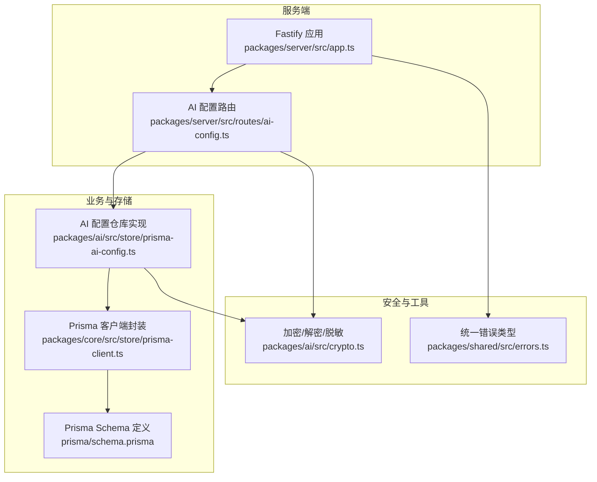
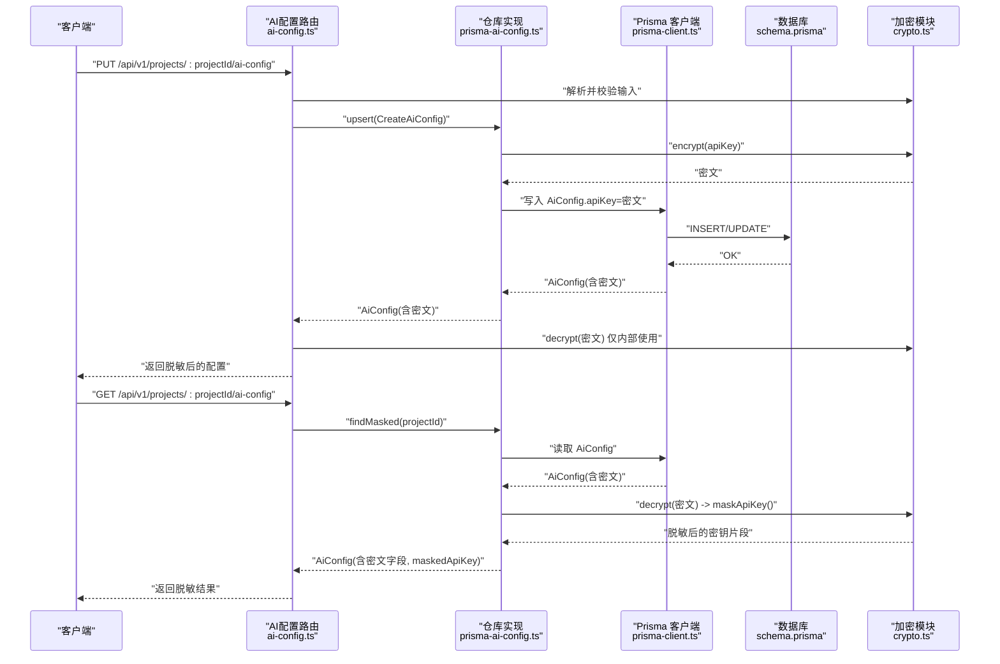
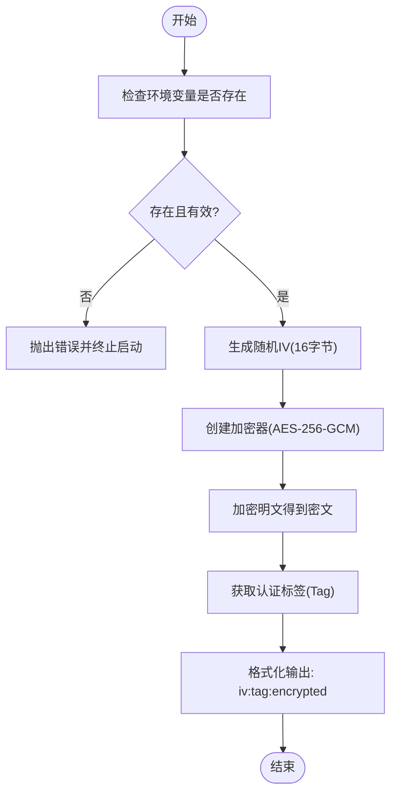
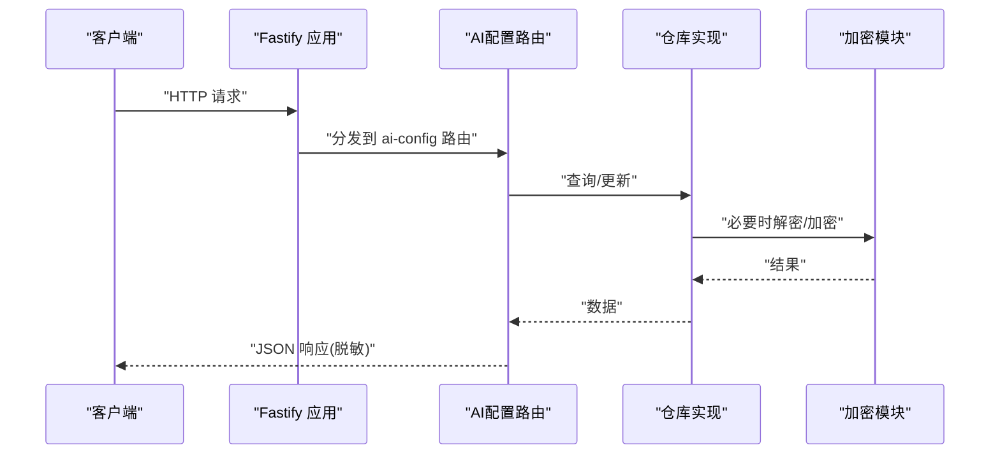
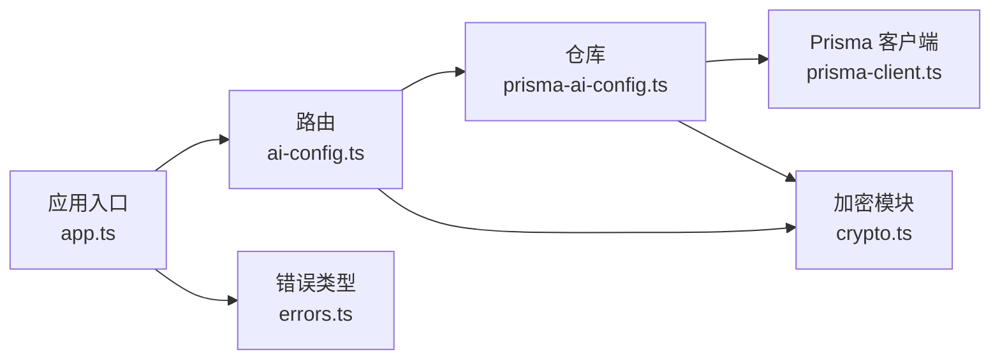

# 安全与加密

<cite>
**本文引用的文件**
- [packages/ai/src/crypto.ts](file://packages/ai/src/crypto.ts)
- [packages/ai/src/store/prisma-ai-config.ts](file://packages/ai/src/store/prisma-ai-config.ts)
- [packages/ai/src/models/ai-config.ts](file://packages/ai/src/models/ai-config.ts)
- [packages/server/src/routes/ai-config.ts](file://packages/server/src/routes/ai-config.ts)
- [packages/server/src/app.ts](file://packages/server/src/app.ts)
- [prisma/schema.prisma](file://prisma/schema.prisma)
- [packages/core/src/store/prisma-client.ts](file://packages/core/src/store/prisma-client.ts)
- [packages/shared/src/errors.ts](file://packages/shared/src/errors.ts)
- [packages/ai/src/index.ts](file://packages/ai/src/index.ts)
- [docs/review-report/specs-review-2026-04-24.md](file://docs/review-report/specs-review-2026-04-24.md)
</cite>

## 目录
1. [简介](#简介)
2. [项目结构](#项目结构)
3. [核心组件](#核心组件)
4. [架构总览](#架构总览)
5. [详细组件分析](#详细组件分析)
6. [依赖分析](#依赖分析)
7. [性能考虑](#性能考虑)
8. [故障排查指南](#故障排查指南)
9. [结论](#结论)
10. [附录：安全配置指南与最佳实践](#附录安全配置指南与最佳实践)

## 简介
本文件系统性梳理本项目的“安全与加密”机制，重点覆盖以下方面：
- 敏感数据（尤其是AI配置中的API密钥）的加密存储策略
- AES-256-GCM加密算法的实现细节与密钥管理
- 加密数据的解密流程与安全传输机制
- 数据访问的安全控制与权限验证现状
- 环境变量的安全存储与管理
- 数据完整性验证与防篡改机制
- 安全架构图与威胁模型分析
- 安全配置指南与最佳实践建议

## 项目结构
围绕“安全与加密”的关键模块分布如下：
- 加密与脱敏工具：位于AI包的加密模块，负责对API密钥进行加解密与脱敏显示
- 存储层：AI配置的持久化使用Prisma，字段类型与约束在Prisma Schema中定义
- 接口层：服务端Fastify路由暴露AI配置的增删改查接口，并在返回时进行脱敏
- 错误处理：统一的错误类型便于在安全相关场景下进行一致的错误响应
- 核心客户端：Prisma客户端封装，确保数据库连接的单例与生命周期管理



图表来源
- [packages/server/src/app.ts:13-63](file://packages/server/src/app.ts#L13-L63)
- [packages/server/src/routes/ai-config.ts:11-42](file://packages/server/src/routes/ai-config.ts#L11-L42)
- [packages/ai/src/store/prisma-ai-config.ts:1-81](file://packages/ai/src/store/prisma-ai-config.ts#L1-L81)
- [packages/core/src/store/prisma-client.ts:1-17](file://packages/core/src/store/prisma-client.ts#L1-L17)
- [prisma/schema.prisma:141-154](file://prisma/schema.prisma#L141-L154)
- [packages/ai/src/crypto.ts:1-58](file://packages/ai/src/crypto.ts#L1-L58)
- [packages/shared/src/errors.ts:1-25](file://packages/shared/src/errors.ts#L1-L25)

章节来源
- [packages/server/src/app.ts:13-63](file://packages/server/src/app.ts#L13-L63)
- [packages/server/src/routes/ai-config.ts:11-42](file://packages/server/src/routes/ai-config.ts#L11-L42)
- [packages/ai/src/store/prisma-ai-config.ts:1-81](file://packages/ai/src/store/prisma-ai-config.ts#L1-L81)
- [packages/core/src/store/prisma-client.ts:1-17](file://packages/core/src/store/prisma-client.ts#L1-L17)
- [prisma/schema.prisma:141-154](file://prisma/schema.prisma#L141-L154)
- [packages/ai/src/crypto.ts:1-58](file://packages/ai/src/crypto.ts#L1-L58)
- [packages/shared/src/errors.ts:1-25](file://packages/shared/src/errors.ts#L1-L25)

## 核心组件
- 加密模块（AES-256-GCM）
  - 提供加密、解密与API Key脱敏能力
  - 使用随机初始化向量（IV）与认证标签（Tag）保障机密性与完整性
  - 密钥来源于环境变量，格式为十六进制字符串
- AI配置存储层
  - 在数据库中以加密形式保存API密钥
  - 对外返回时默认脱敏；内部使用时才解密
- 服务端路由
  - 提供AI配置的查询与更新接口
  - 返回数据中隐藏真实密钥，仅展示脱敏后的片段
- 错误处理
  - 统一的错误类型，便于在安全事件中保持一致的错误响应

章节来源
- [packages/ai/src/crypto.ts:1-58](file://packages/ai/src/crypto.ts#L1-L58)
- [packages/ai/src/store/prisma-ai-config.ts:60-81](file://packages/ai/src/store/prisma-ai-config.ts#L60-L81)
- [packages/server/src/routes/ai-config.ts:11-42](file://packages/server/src/routes/ai-config.ts#L11-L42)
- [packages/shared/src/errors.ts:1-25](file://packages/shared/src/errors.ts#L1-L25)

## 架构总览
下图展示了从请求到数据库的完整安全路径：请求经由路由进入，调用仓库实现，仓库通过Prisma访问数据库；敏感数据在入库前被加密，在出库时根据需要进行解密或脱敏。



图表来源
- [packages/server/src/routes/ai-config.ts:11-42](file://packages/server/src/routes/ai-config.ts#L11-L42)
- [packages/ai/src/store/prisma-ai-config.ts:1-81](file://packages/ai/src/store/prisma-ai-config.ts#L1-L81)
- [packages/core/src/store/prisma-client.ts:1-17](file://packages/core/src/store/prisma-client.ts#L1-L17)
- [prisma/schema.prisma:141-154](file://prisma/schema.prisma#L141-L154)
- [packages/ai/src/crypto.ts:1-58](file://packages/ai/src/crypto.ts#L1-L58)

## 详细组件分析

### 加密模块（AES-256-GCM）
- 算法与参数
  - 算法：AES-256-GCM
  - IV长度：16字节
  - Tag长度：16字节
- 密钥来源
  - 从环境变量读取，要求十六进制编码且长度满足AES-256需求
  - 若未设置，启动时抛出明确错误，防止静默失败
- 编解码格式
  - 密文格式：iv:tag:encrypted
  - 解密时严格校验格式与Tag，确保完整性
- 脱敏策略
  - 对外展示时仅显示前四位与后四位，中间以占位符替代



图表来源
- [packages/ai/src/crypto.ts:7-30](file://packages/ai/src/crypto.ts#L7-L30)

章节来源
- [packages/ai/src/crypto.ts:1-58](file://packages/ai/src/crypto.ts#L1-L58)

### AI配置存储与访问控制
- 数据模型
  - AiConfig表的apiKey字段用于存储加密后的密钥
  - 通过唯一索引保证每个项目仅有一份AI配置
- 仓库方法
  - upsert：创建或更新配置，入库前对apiKey进行加密
  - findDecrypted：内部使用，返回解密后的apiKey
  - findMasked：对外返回，返回脱敏后的密钥片段
- 路由行为
  - 查询接口返回脱敏后的配置
  - 更新接口入库前加密，返回时同样脱敏

```mermaid
classDiagram
class AiConfigRepository {
+upsert(data) AiConfig
+findByProjectId(projectId) AiConfig|null
+delete(projectId) void
}
class PrismaAiConfigRepository {
+upsert(data) AiConfig
+findByProjectId(projectId) AiConfig|null
+delete(projectId) void
+findDecrypted(projectId) AiConfig&{decryptedApiKey}
+findMasked(projectId) AiConfig&{maskedApiKey}
}
AiConfigRepository <|.. PrismaAiConfigRepository
```

图表来源
- [packages/ai/src/store/prisma-ai-config.ts:1-81](file://packages/ai/src/store/prisma-ai-config.ts#L1-L81)

章节来源
- [packages/ai/src/store/prisma-ai-config.ts:1-81](file://packages/ai/src/store/prisma-ai-config.ts#L1-L81)
- [prisma/schema.prisma:141-154](file://prisma/schema.prisma#L141-L154)

### 服务端路由与安全传输
- 路由职责
  - GET：返回脱敏后的配置
  - PUT：接收明文API Key，入库前加密，返回脱敏后的结果
- 错误处理
  - 统一错误响应，避免泄露内部细节
- CORS与健康检查
  - 已注册CORS中间件
  - 提供健康检查端点



图表来源
- [packages/server/src/app.ts:13-63](file://packages/server/src/app.ts#L13-L63)
- [packages/server/src/routes/ai-config.ts:11-42](file://packages/server/src/routes/ai-config.ts#L11-L42)

章节来源
- [packages/server/src/app.ts:13-63](file://packages/server/src/app.ts#L13-L63)
- [packages/server/src/routes/ai-config.ts:11-42](file://packages/server/src/routes/ai-config.ts#L11-L42)

### 数据库模型与完整性
- 模型字段
  - AiConfig.apiKey：存储加密后的密钥
  - 通过Prisma Client生成的类型确保字段一致性
- 完整性保障
  - AES-256-GCM的Tag用于解密阶段的完整性校验
  - 仓库与路由在读写链路中均参与解密与脱敏，降低泄露面

章节来源
- [prisma/schema.prisma:141-154](file://prisma/schema.prisma#L141-L154)
- [packages/core/src/store/prisma-client.ts:1-17](file://packages/core/src/store/prisma-client.ts#L1-L17)

## 依赖分析
- 组件耦合
  - 路由依赖仓库实现；仓库依赖Prisma客户端；两者均依赖加密模块
  - 错误类型在应用层统一处理，减少重复逻辑
- 外部依赖
  - Fastify、Prisma、Zod等
- 潜在风险
  - 当前密钥来源为环境变量，生产环境建议接入KMS或密钥管理系统
  - 路由层未实现鉴权与授权，属于安全薄弱环节



图表来源
- [packages/server/src/routes/ai-config.ts:11-42](file://packages/server/src/routes/ai-config.ts#L11-L42)
- [packages/ai/src/store/prisma-ai-config.ts:1-81](file://packages/ai/src/store/prisma-ai-config.ts#L1-L81)
- [packages/core/src/store/prisma-client.ts:1-17](file://packages/core/src/store/prisma-client.ts#L1-L17)
- [packages/ai/src/crypto.ts:1-58](file://packages/ai/src/crypto.ts#L1-L58)
- [packages/server/src/app.ts:13-63](file://packages/server/src/app.ts#L13-L63)
- [packages/shared/src/errors.ts:1-25](file://packages/shared/src/errors.ts#L1-L25)

章节来源
- [packages/server/src/routes/ai-config.ts:11-42](file://packages/server/src/routes/ai-config.ts#L11-L42)
- [packages/ai/src/store/prisma-ai-config.ts:1-81](file://packages/ai/src/store/prisma-ai-config.ts#L1-L81)
- [packages/core/src/store/prisma-client.ts:1-17](file://packages/core/src/store/prisma-client.ts#L1-L17)
- [packages/ai/src/crypto.ts:1-58](file://packages/ai/src/crypto.ts#L1-L58)
- [packages/server/src/app.ts:13-63](file://packages/server/src/app.ts#L13-L63)
- [packages/shared/src/errors.ts:1-25](file://packages/shared/src/errors.ts#L1-L25)

## 性能考虑
- 加解密成本
  - AES-256-GCM为对称加密，计算开销较小；频繁的加解密可能成为热点
- 批量操作
  - 仓库支持批量创建/更新，建议在导入或迁移场景中复用
- 缓存策略
  - 对于只读的脱敏配置，可在应用层缓存以减少重复解密与序列化

## 故障排查指南
- 启动时报错：缺少加密密钥
  - 现象：启动即抛出错误，提示需要设置环境变量
  - 处理：生成符合长度要求的十六进制密钥并正确注入
- 解密失败或格式异常
  - 现象：解密时报格式错误
  - 处理：确认存储格式是否为 iv:tag:encrypted；检查密钥是否一致
- 路由返回未脱敏
  - 现象：返回的配置仍包含原始密钥
  - 处理：确认调用的是查询接口（返回脱敏）而非内部解密接口
- 数据库字段不一致
  - 现象：字段类型或约束与预期不符
  - 处理：核对Prisma Schema与实际迁移状态

章节来源
- [packages/ai/src/crypto.ts:7-16](file://packages/ai/src/crypto.ts#L7-L16)
- [packages/ai/src/crypto.ts:32-50](file://packages/ai/src/crypto.ts#L32-L50)
- [packages/server/src/routes/ai-config.ts:11-42](file://packages/server/src/routes/ai-config.ts#L11-L42)
- [prisma/schema.prisma:141-154](file://prisma/schema.prisma#L141-L154)

## 结论
本项目已实现对敏感数据（API密钥）的端到端加密存储与安全传输，采用AES-256-GCM确保机密性与完整性，并通过脱敏策略降低泄露风险。当前仍存在的主要安全缺口在于：
- 密钥管理：当前依赖环境变量，生产环境建议接入KMS或密钥管理系统
- 访问控制：路由层尚未实现鉴权与授权，应在网关或中间件层面补齐
- 审计与监控：建议增加密钥轮换审计与异常访问告警

## 附录：安全配置指南与最佳实践
- 密钥管理
  - 开发/简单部署：使用环境变量，十六进制编码，长度≥32字节
  - 生产环境：接入KMS（如AWS KMS、Azure Key Vault）或HSM，启用密钥轮换与访问审计
  - 启动时校验密钥有效性，缺失或无效时拒绝启动
- 环境变量安全
  - 仅在受控环境中注入密钥，避免硬编码与日志泄露
  - 使用最小权限原则，限制密钥读取范围
- 数据访问控制
  - 在路由层或中间件实现鉴权与授权，确保只有授权用户可访问AI配置
  - 对敏感操作（如删除、更新）增加二次确认与审计日志
- 传输安全
  - 强制HTTPS，禁用弱密码套件与过时协议
  - 对外部LLM调用使用可信代理与网络隔离
- 完整性与防篡改
  - 依赖AES-256-GCM的Tag进行解密阶段完整性校验
  - 对数据库备份启用加密与访问控制，定期校验备份可用性
- 配置清单（要点）
  - 环境变量：AI_TESTER_ENCRYPTION_KEY（十六进制）
  - 数据库：DATABASE_URL（SQLite/PostgreSQL等）
  - 日志级别：按需调整，避免泄露敏感信息
  - 端口与主机：HOST/PORT按部署环境配置

章节来源
- [packages/ai/src/crypto.ts:7-16](file://packages/ai/src/crypto.ts#L7-L16)
- [docs/review-report/specs-review-2026-04-24.md:124-130](file://docs/review-report/specs-review-2026-04-24.md#L124-L130)