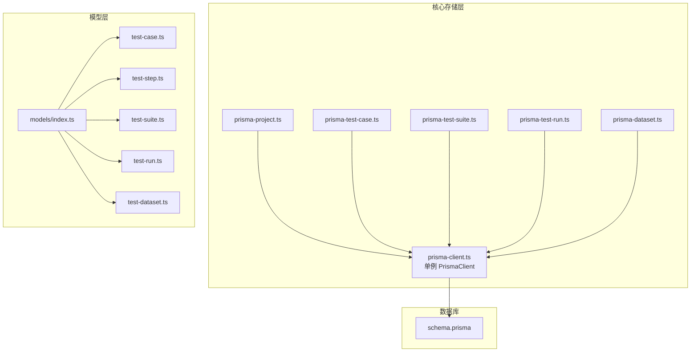
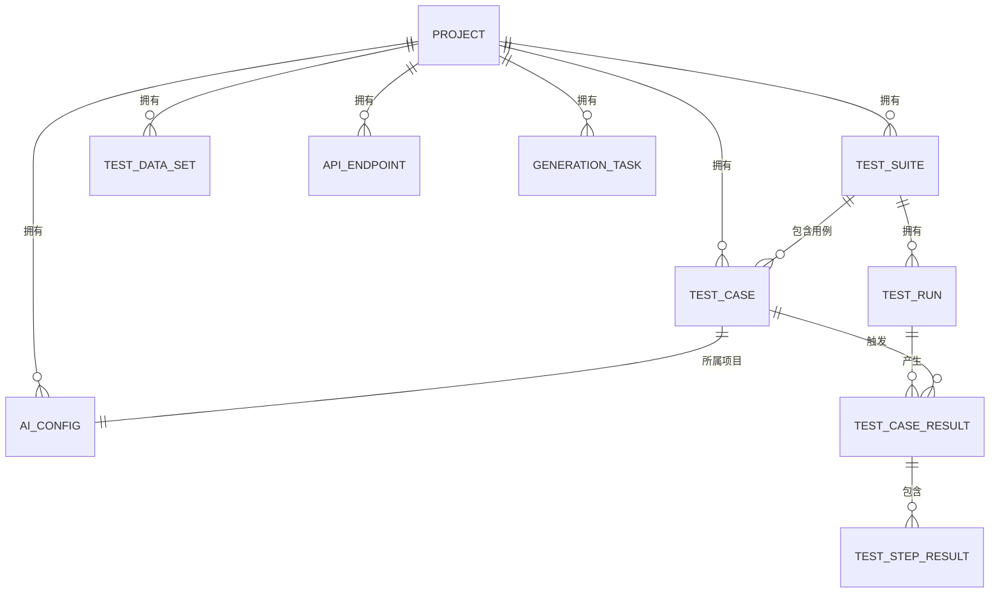
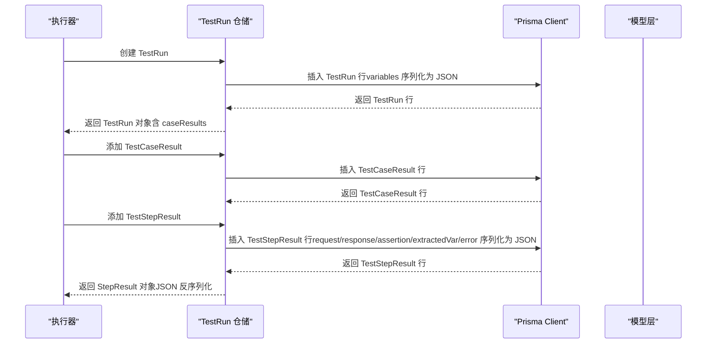
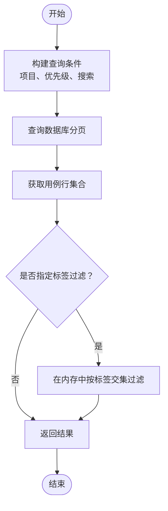
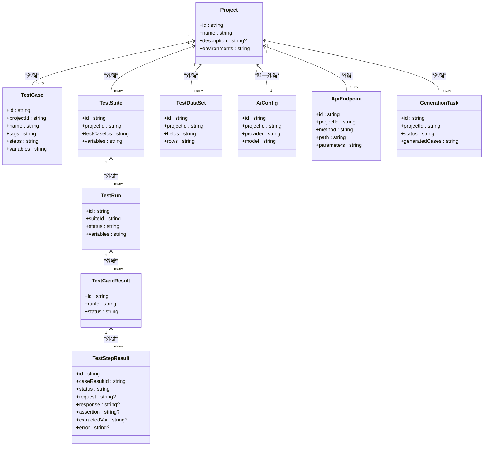
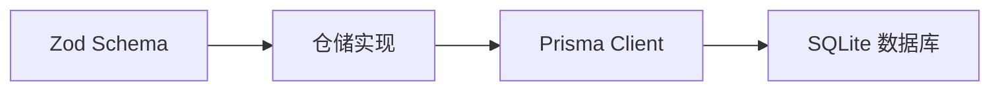

# 数据库设计

<cite>
**本文引用的文件**
- [schema.prisma](file://prisma/schema.prisma)
- [prisma-client.ts](file://packages/core/src/store/prisma-client.ts)
- [prisma-project.ts](file://packages/core/src/store/prisma-project.ts)
- [prisma-test-case.ts](file://packages/core/src/store/prisma-test-case.ts)
- [prisma-test-suite.ts](file://packages/core/src/store/prisma-test-suite.ts)
- [prisma-test-run.ts](file://packages/core/src/store/prisma-test-run.ts)
- [prisma-dataset.ts](file://packages/core/src/store/prisma-dataset.ts)
- [index.ts（模型导出）](file://packages/core/src/models/index.ts)
- [test-case.ts（模型定义）](file://packages/core/src/models/test-case.ts)
- [test-step.ts（模型定义）](file://packages/core/src/models/test-step.ts)
- [test-suite.ts（模型定义）](file://packages/core/src/models/test-suite.ts)
- [test-run.ts（模型定义）](file://packages/core/src/models/test-run.ts)
- [test-dataset.ts（模型定义）](file://packages/core/src/models/test-dataset.ts)
- [package.json](file://package.json)
</cite>

## 目录
1. [简介](#简介)
2. [项目结构](#项目结构)
3. [核心组件](#核心组件)
4. [架构总览](#架构总览)
5. [详细组件分析](#详细组件分析)
6. [依赖分析](#依赖分析)
7. [性能考虑](#性能考虑)
8. [故障排查指南](#故障排查指南)
9. [结论](#结论)
10. [附录](#附录)

## 简介
本文件系统性梳理数据库设计，围绕 Prisma Schema 中的核心实体进行深入解析，覆盖字段定义、数据类型、约束与索引策略；阐明实体间关系映射（一对一、一对多、多对多）；总结 JSON 字段的使用模式与序列化策略；提供完整的实体关系图（ERD）与数据流图；并解释 SQLite 作为默认数据库的选择原因与配置要点。

## 项目结构
该仓库采用 monorepo 结构，数据库层位于 prisma 目录，通过 Prisma Client 在核心包中被统一访问。核心模块负责：
- 模型定义：在 packages/core/src/models 下定义强类型与 Zod 校验模型
- 存储实现：在 packages/core/src/store 下实现各实体的仓储接口与 Prisma 映射
- 客户端管理：在 packages/core/src/store/prisma-client.ts 提供单例 PrismaClient 获取与断开连接

图表来源
- [prisma-client.ts:1-17](file://packages/core/src/store/prisma-client.ts#L1-L17)
- [prisma-project.ts:1-38](file://packages/core/src/store/prisma-project.ts#L1-L38)
- [prisma-test-case.ts:1-148](file://packages/core/src/store/prisma-test-case.ts#L1-L148)
- [prisma-test-suite.ts:1-77](file://packages/core/src/store/prisma-test-suite.ts#L1-L77)
- [prisma-test-run.ts:1-194](file://packages/core/src/store/prisma-test-run.ts#L1-L194)
- [prisma-dataset.ts:1-69](file://packages/core/src/store/prisma-dataset.ts#L1-L69)
- [index.ts（模型导出）:1-7](file://packages/core/src/models/index.ts#L1-L7)
- [schema.prisma:1-196](file://prisma/schema.prisma#L1-L196)

章节来源
- [prisma-client.ts:1-17](file://packages/core/src/store/prisma-client.ts#L1-L17)
- [package.json:1-31](file://package.json#L1-L31)

## 核心组件
本节聚焦 Prisma Schema 中的核心实体及其关键属性、约束与索引策略，并结合存储层的序列化逻辑说明 JSON 字段的使用模式。

- Project（项目）
  - 关键字段与约束
    - id: 主键
    - name/description: 文本
    - environments: JSON 数组（Environment 对象数组），默认空数组
    - createdAt/updatedAt: 时间戳，默认值与自动更新
  - 关系
    - 一对多：拥有多个 TestCase/TestSuite/TestDataSet/AiConfig/ApiEndpoint/GenerationTask
  - 索引
    - 无显式索引（可按需在查询侧使用过滤）

- TestCase（测试用例）
  - 关键字段与约束
    - id: 主键
    - projectId: 外键，关联 Project
    - name/description/module/tags/priority/steps/variables/version
    - tags: JSON 字符串数组，默认空数组
    - steps: JSON 字符串数组（TestStep 对象数组），默认空数组
    - variables: JSON 记录（字符串到字符串），默认空对象
    - createdAt/updatedAt: 时间戳
  - 关系
    - 多对一：属于一个 Project
    - 一对多：对应 TestRun 的 CaseResult（间接通过外键）
  - 索引
    - 项目级索引（projectId）
    - 模块索引（module）

- TestSuite（测试套件）
  - 关键字段与约束
    - id: 主键
    - projectId: 外键，关联 Project
    - name/description/testCaseIds/parallelism/environment/variables/setupCaseId/teardownCaseId
    - testCaseIds: JSON 字符串数组（用例 ID 列表），默认空数组
    - variables: JSON 记录（字符串到字符串），默认空对象
    - createdAt/updatedAt: 时间戳
  - 关系
    - 多对一：属于一个 Project
    - 一对多：拥有多个 TestRun
  - 索引
    - 项目级索引（projectId）

- TestRun（测试运行）
  - 关键字段与约束
    - id: 主键
    - suiteId: 外键，关联 TestSuite
    - status: 枚举状态，默认 pending
    - environment/variables: JSON 记录（字符串到字符串），默认空对象
    - startedAt/finishedAt/durationMs/totalCases/passedCases/failedCases/triggeredBy
    - createdAt: 时间戳
  - 关系
    - 多对一：属于一个 TestSuite
    - 一对多：拥有多个 TestCaseResult
  - 索引
    - 套件级索引（suiteId）
    - 状态索引（status）

- TestCaseResult（用例结果）
  - 关键字段与约束
    - id: 主键
    - runId: 外键，关联 TestRun
    - testCaseId/testCaseName/status/startedAt/finishedAt/durationMs/totalSteps/passedSteps/failedSteps
  - 关系
    - 多对一：属于一个 TestRun
    - 一对多：拥有多个 TestStepResult
  - 索引
    - 运行级索引（runId）

- TestStepResult（步骤结果）
  - 关键字段与约束
    - id: 主键
    - caseResultId: 外键，关联 TestCaseResult
    - stepId/stepName/stepType/status/durationMs
    - request/response/assertion/extractedVar/error: JSON 字段（请求、响应、断言、提取变量、错误信息）
  - 关系
    - 多对一：属于一个 TestCaseResult
  - 索引
    - 用例结果级索引（caseResultId）

- TestDataSet（测试数据集）
  - 关键字段与约束
    - id: 主键
    - projectId: 外键，关联 Project
    - name/description/fields/rows
    - fields: JSON 字符串数组（DataField 定义数组），默认空数组
    - rows: JSON 字符串数组（记录数组），默认空数组
    - createdAt/updatedAt: 时间戳
  - 关系
    - 多对一：属于一个 Project
  - 索引
    - 项目级索引（projectId）

- AiConfig（AI 配置）
  - 关键字段与约束
    - id: 主键
    - projectId: 唯一键，关联 Project
    - provider/model/apiKey/baseUrl/temperature/maxTokens
    - createdAt/updatedAt: 时间戳
  - 关系
    - 多对一：属于一个 Project
  - 索引
    - 项目唯一索引（projectId）

- ApiEndpoint（API 接口）
  - 关键字段与约束
    - id: 主键
    - projectId: 外键，关联 Project
    - method/path/summary/description/tags/parameters/requestBody/responseBody/authentication/source
    - tags/parameters: JSON 字段（字符串数组、参数定义数组）
    - requestBody/responseBody: JSON 模式描述
    - createdAt/updatedAt: 时间戳
  - 关系
    - 多对一：属于一个 Project
  - 索引
    - 项目级索引（projectId）

- GenerationTask（生成任务）
  - 关键字段与约束
    - id: 主键
    - projectId: 外键，关联 Project
    - endpointIds/strategy/status/generatedCases/confirmedCaseIds/error/tokenUsage/durationMs/createdAt/completedAt
    - endpointIds/generatedCases/confirmedCaseIds/tokenUsage: JSON 字段
    - status: 枚举状态，默认 pending
    - createdAt/updatedAt: 时间戳
  - 关系
    - 多对一：属于一个 Project
  - 索引
    - 项目级索引（projectId）
    - 状态索引（status）

章节来源
- [schema.prisma:10-196](file://prisma/schema.prisma#L10-L196)

## 架构总览
下图展示数据库实体之间的关系映射，涵盖一对一、一对多与多对多关系，并标注外键与级联删除策略。

图表来源
- [schema.prisma:10-196](file://prisma/schema.prisma#L10-L196)

## 详细组件分析

### 实体关系与索引策略
- 外键与级联删除
  - 所有子实体均通过外键关联父实体，并在删除父实体时采用级联删除（Cascade），确保数据一致性。
- 索引策略
  - 项目维度索引：用于按项目筛选（如 TestCase、TestSuite、TestRun、TestDataSet、ApiEndpoint、GenerationTask）
  - 运行维度索引：TestRun 与 TestCaseResult、TestStepResult 的层级索引，提升查询效率
  - 状态维度索引：TestRun 与 GenerationTask 的状态索引，便于状态驱动的任务调度与统计

章节来源
- [schema.prisma:40-44](file://prisma/schema.prisma#L40-L44)
- [schema.prisma:60-64](file://prisma/schema.prisma#L60-L64)
- [schema.prisma:81-86](file://prisma/schema.prisma#L81-L86)
- [schema.prisma:101-124](file://prisma/schema.prisma#L101-L124)
- [schema.prisma:136-139](file://prisma/schema.prisma#L136-L139)
- [schema.prisma:153-154](file://prisma/schema.prisma#L153-L154)
- [schema.prisma:172-175](file://prisma/schema.prisma#L172-L175)
- [schema.prisma:191-195](file://prisma/schema.prisma#L191-L195)

### JSON 字段使用模式与序列化策略
- 使用模式
  - 多数复杂结构以 JSON 字符串形式存储，包括数组与对象，便于灵活扩展与跨语言传输
  - 典型场景：标签数组、步骤数组、变量映射、请求/响应/断言/提取变量/错误等结构化数据
- 序列化策略
  - 写入：在存储层将内存中的对象序列化为 JSON 字符串（如 tags、steps、variables、fields、rows、request、response、assertion、extractedVar、error 等）
  - 读取：在存储层将数据库中的 JSON 字符串反序列化为对象，供上层消费
  - 默认值：对于 JSON 字段，Schema 层提供空数组或空对象的默认值，保证查询侧无需判空处理
- 限制与注意事项
  - SQLite 不支持原生 JSON 查询与索引，因此在存储层进行后过滤（如标签匹配）或通过应用层处理
  - JSON 字段的校验建议在业务层（Zod）完成，避免写入非法结构

章节来源
- [prisma-project.ts:11-14](file://packages/core/src/store/prisma-project.ts#L11-L14)
- [prisma-test-case.ts:13-20](file://packages/core/src/store/prisma-test-case.ts#L13-L20)
- [prisma-test-case.ts:38-42](file://packages/core/src/store/prisma-test-case.ts#L38-L42)
- [prisma-test-suite.ts:12-20](file://packages/core/src/store/prisma-test-suite.ts#L12-L20)
- [prisma-test-suite.ts:31-37](file://packages/core/src/store/prisma-test-suite.ts#L31-L37)
- [prisma-test-run.ts:17-27](file://packages/core/src/store/prisma-test-run.ts#L17-L27)
- [prisma-test-run.ts:55-61](file://packages/core/src/store/prisma-test-run.ts#L55-L61)
- [prisma-dataset.ts:16-20](file://packages/core/src/store/prisma-dataset.ts#L16-L20)
- [prisma-dataset.ts:31-33](file://packages/core/src/store/prisma-dataset.ts#L31-L33)

### 数据流与处理逻辑
以下序列图展示测试运行的数据流：从创建 TestRun 开始，逐步生成 TestCaseResult 与 TestStepResult，并在存储层进行 JSON 序列化与反序列化。

图表来源
- [prisma-test-run.ts:64-194](file://packages/core/src/store/prisma-test-run.ts#L64-L194)
- [test-run.ts:1-118](file://packages/core/src/models/test-run.ts#L1-L118)

章节来源
- [prisma-test-run.ts:64-194](file://packages/core/src/store/prisma-test-run.ts#L64-L194)
- [test-run.ts:1-118](file://packages/core/src/models/test-run.ts#L1-L118)

### 复杂逻辑流程（标签过滤示例）
由于 SQLite 不支持 JSON 数组原生查询，存储层在查询 TestCase 时采用“先筛选再后过滤”的策略：先按项目与简单条件查询，再在内存中根据标签集合进行过滤。

图表来源
- [prisma-test-case.ts:62-99](file://packages/core/src/store/prisma-test-case.ts#L62-L99)

章节来源
- [prisma-test-case.ts:62-99](file://packages/core/src/store/prisma-test-case.ts#L62-L99)

### 类图（实体与仓储）

图表来源
- [schema.prisma:10-196](file://prisma/schema.prisma#L10-L196)

## 依赖分析
- 存储层依赖
  - 各仓储实现依赖 Prisma Client 单例，确保全局一致的连接与生命周期管理
- 模型层依赖
  - 仓储实现依赖模型层的 Zod Schema 进行输入校验与输出转换
- 数据库依赖
  - 默认使用 SQLite，通过环境变量 DATABASE_URL 指定连接地址

图表来源
- [prisma-client.ts:1-17](file://packages/core/src/store/prisma-client.ts#L1-L17)
- [package.json:20-29](file://package.json#L20-L29)

章节来源
- [prisma-client.ts:1-17](file://packages/core/src/store/prisma-client.ts#L1-L17)
- [package.json:20-29](file://package.json#L20-L29)

## 性能考虑
- JSON 字段的查询与索引
  - SQLite 不支持 JSON 原生查询与索引，建议在查询侧尽量减少对 JSON 字段的过滤；必要时采用“先粗筛后内存过滤”的策略
- 索引策略
  - 为高频过滤字段建立索引（如 TestRun.status、TestRun.suiteId、TestCase.projectId 等）
- 分页与并发
  - 查询侧使用分页与并发计数，避免一次性加载大量数据
- 序列化成本
  - 大对象的频繁序列化/反序列化会带来 CPU 开销，建议在批量写入时合并事务操作

## 故障排查指南
- 连接问题
  - 确认 DATABASE_URL 环境变量正确指向 SQLite 文件路径
  - 检查 Prisma Client 初始化与断开连接逻辑
- JSON 结构异常
  - 若出现 JSON 解析失败，检查写入侧是否正确序列化对象；确认默认值策略（空数组/空对象）与读取侧的可选处理
- 级联删除影响
  - 删除 Project 会级联删除其下的所有子实体，注意备份与审计日志
- 查询性能
  - 对未建立索引的字段进行过滤时，观察慢查询日志并评估添加索引的必要性

章节来源
- [prisma-client.ts:1-17](file://packages/core/src/store/prisma-client.ts#L1-L17)
- [schema.prisma:5-8](file://prisma/schema.prisma#L5-L8)

## 结论
本数据库设计以 Prisma Schema 为核心，围绕测试与 AI 生成场景构建了清晰的实体模型与关系映射。通过 JSON 字段承载灵活的结构化数据，结合存储层的序列化策略与索引策略，在 SQLite 的约束下实现了良好的可维护性与扩展性。建议在后续迭代中持续优化查询路径与索引覆盖，以进一步提升性能与可观测性。

## 附录

### SQLite 选择原因与配置
- 选择原因
  - 轻量、零配置、跨平台，适合开发与小型生产环境
  - 与 Prisma 生态无缝集成，支持迁移与客户端生成
- 配置要点
  - 通过环境变量 DATABASE_URL 指定 SQLite 文件路径
  - 在 monorepo 中统一管理 Prisma 版本与客户端版本，确保兼容性

章节来源
- [schema.prisma:5-8](file://prisma/schema.prisma#L5-L8)
- [package.json:20-29](file://package.json#L20-L29)