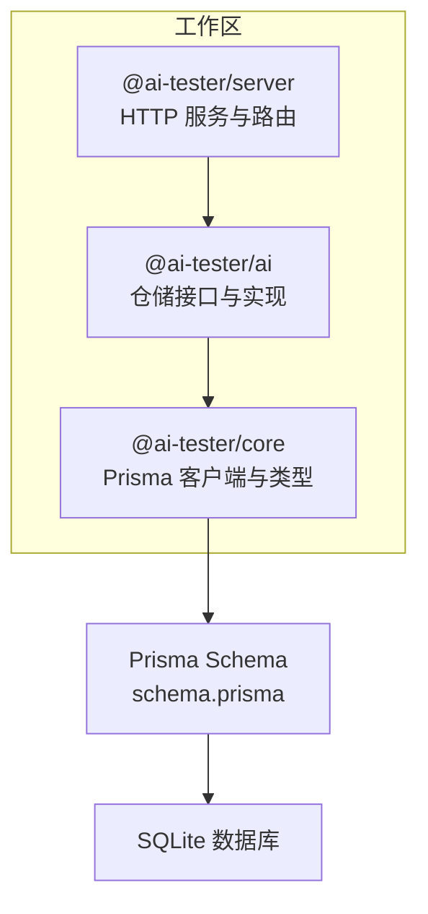
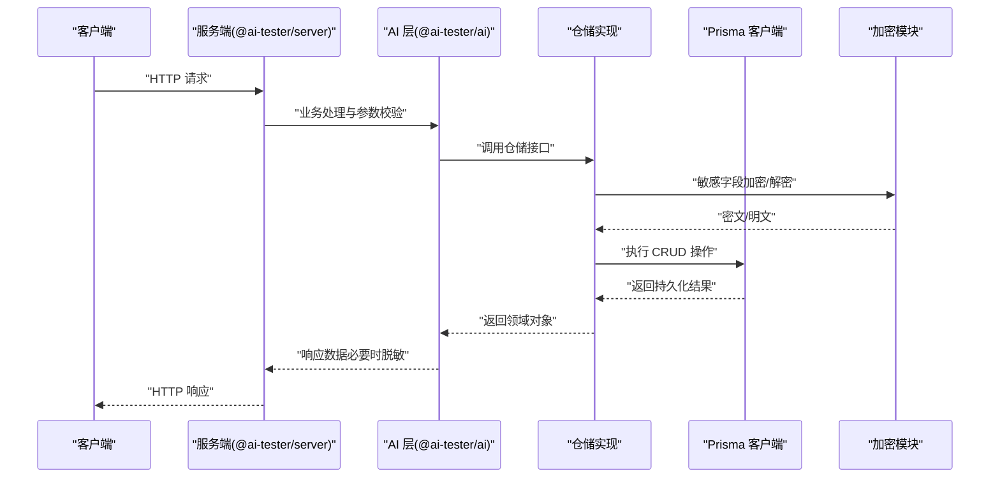
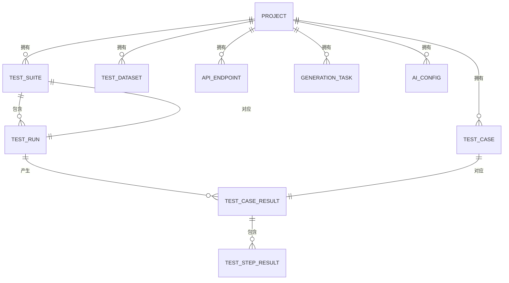
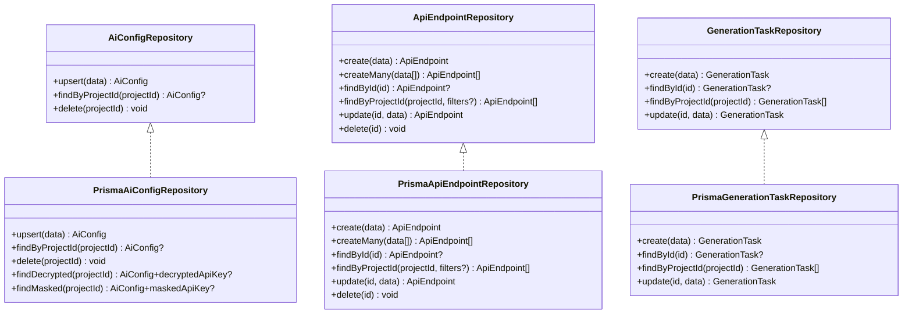
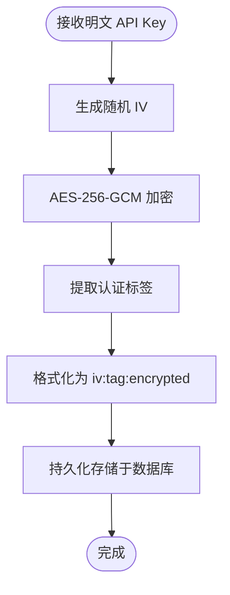
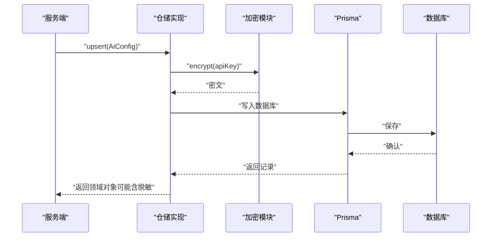
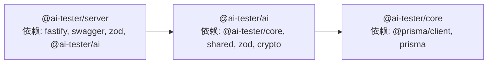

# 数据架构

<cite>
**本文引用的文件**
- [schema.prisma](file://prisma/schema.prisma)
- [crypto.ts](file://packages/ai/src/crypto.ts)
- [ai-config.ts](file://packages/ai/src/models/ai-config.ts)
- [repository.ts](file://packages/ai/src/store/repository.ts)
- [prisma-ai-config.ts](file://packages/ai/src/store/prisma-ai-config.ts)
- [prisma-api-endpoint.ts](file://packages/ai/src/store/prisma-api-endpoint.ts)
- [prisma-generation-task.ts](file://packages/ai/src/store/prisma-generation-task.ts)
- [package.json（@ai-tester/core）](file://packages/core/package.json)
- [package.json（@ai-tester/server）](file://packages/server/package.json)
</cite>

## 目录
1. [引言](#引言)
2. [项目结构](#项目结构)
3. [核心组件](#核心组件)
4. [架构总览](#架构总览)
5. [详细组件分析](#详细组件分析)
6. [依赖分析](#依赖分析)
7. [性能考虑](#性能考虑)
8. [故障排查指南](#故障排查指南)
9. [结论](#结论)
10. [附录](#附录)

## 引言
本文件系统化梳理本项目的数据库模型设计、实体关系与字段约束，阐释仓储模式与 Prisma ORM 的使用方式，文档化数据加密、安全存储与敏感信息保护机制，并给出数据迁移策略、版本管理与向后兼容建议。同时提供实体关系图、数据流图与安全架构图，解释缓存策略、查询优化与性能监控方案，并覆盖数据备份、恢复与灾难恢复计划。

## 项目结构
本项目采用多包工作区组织，数据访问层位于 @ai-tester/core 包中，通过 Prisma 客户端访问 SQLite；业务与数据交互在 @ai-tester/ai 包中以仓储接口与具体实现的形式呈现；服务端在 @ai-tester/server 中承载 API 与路由。

图表来源
- [schema.prisma:1-196](file://prisma/schema.prisma#L1-L196)
- [package.json（@ai-tester/core）:1-34](file://packages/core/package.json#L1-L34)
- [package.json（@ai-tester/server）:1-36](file://packages/server/package.json#L1-L36)

章节来源
- [schema.prisma:1-196](file://prisma/schema.prisma#L1-L196)
- [package.json（@ai-tester/core）:1-34](file://packages/core/package.json#L1-L34)
- [package.json（@ai-tester/server）:1-36](file://packages/server/package.json#L1-L36)

## 核心组件
- 数据模型与约束：由 Prisma Schema 定义，包含项目、测试用例、测试套件、测试运行、结果、数据集、AI 配置、API 端点与生成任务等实体及索引、默认值与外键级联。
- 仓储接口与实现：在 @ai-tester/ai 中定义统一的仓储接口，分别对 AiConfig、ApiEndpoint、GenerationTask 提供 Prisma 实现。
- 加密与安全：使用 AES-256-GCM 对敏感字段进行加密存储，提供解密与脱敏展示能力。
- 类型与校验：使用 Zod 对输入输出进行强类型校验，确保数据一致性与可预测性。

章节来源
- [schema.prisma:10-196](file://prisma/schema.prisma#L10-L196)
- [repository.ts:1-39](file://packages/ai/src/store/repository.ts#L1-L39)
- [prisma-ai-config.ts:1-82](file://packages/ai/src/store/prisma-ai-config.ts#L1-L82)
- [prisma-api-endpoint.ts:1-111](file://packages/ai/src/store/prisma-api-endpoint.ts#L1-L111)
- [prisma-generation-task.ts:1-72](file://packages/ai/src/store/prisma-generation-task.ts#L1-L72)
- [crypto.ts:1-58](file://packages/ai/src/crypto.ts#L1-L58)
- [ai-config.ts:1-34](file://packages/ai/src/models/ai-config.ts#L1-L34)

## 架构总览
下图展示了从服务端到仓储再到 Prisma 的调用链路，以及加密与脱敏在数据流中的位置。

图表来源
- [prisma-ai-config.ts:22-82](file://packages/ai/src/store/prisma-ai-config.ts#L22-L82)
- [prisma-api-endpoint.ts:29-111](file://packages/ai/src/store/prisma-api-endpoint.ts#L29-L111)
- [prisma-generation-task.ts:23-72](file://packages/ai/src/store/prisma-generation-task.ts#L23-L72)
- [crypto.ts:18-50](file://packages/ai/src/crypto.ts#L18-L50)

## 详细组件分析

### 数据模型与实体关系
- 主要实体包括：Project、TestCase、TestSuite、TestRun、TestCaseResult、TestStepResult、TestDataSet、AiConfig、ApiEndpoint、GenerationTask。
- 关系与约束要点：
  - 外键与级联：多数子实体通过 projectId 关联到 Project，并设置 onDelete: Cascade，保证父实体删除时子实体级联清理。
  - JSON 字段：多处使用字符串存储 JSON（如 environments、tags、steps、variables、fields、rows、parameters、request、response、assertion、extractedVar、error 等），便于灵活扩展但需注意查询与校验成本。
  - 索引：在高频过滤字段上建立索引（如 TestCase.module、TestSuite.projectId、TestRun.suiteId/status、GenerationTask.projectId/status）。
  - 默认值：大量字段设置默认值（如空数组/对象、时间戳、状态等），降低空值处理复杂度。
- 典型关系图：

图表来源
- [schema.prisma:10-196](file://prisma/schema.prisma#L10-L196)

章节来源
- [schema.prisma:10-196](file://prisma/schema.prisma#L10-L196)

### 仓储模式与 Prisma 使用
- 接口层：在 @ai-tester/ai 中定义 AiConfigRepository、ApiEndpointRepository、GenerationTaskRepository，隔离业务与数据访问细节。
- 实现层：分别为上述接口提供 Prisma 实现类，负责：
  - 将领域对象映射为 Prisma 行（toXxx 函数）。
  - 执行 upsert/create/find/update/delete 等操作。
  - 在 AiConfig 场景中，结合加密模块对敏感字段进行加密/解密与脱敏。
- 查询优化：
  - 使用索引字段进行过滤与排序（如按 projectId、status、suiteId）。
  - 对 JSON 字段的查询采用字符串匹配或结构化解析（如 ApiEndpoint 的 tags/parameters）。

图表来源
- [repository.ts:15-39](file://packages/ai/src/store/repository.ts#L15-L39)
- [prisma-ai-config.ts:22-82](file://packages/ai/src/store/prisma-ai-config.ts#L22-L82)
- [prisma-api-endpoint.ts:29-111](file://packages/ai/src/store/prisma-api-endpoint.ts#L29-L111)
- [prisma-generation-task.ts:23-72](file://packages/ai/src/store/prisma-generation-task.ts#L23-L72)

章节来源
- [repository.ts:1-39](file://packages/ai/src/store/repository.ts#L1-L39)
- [prisma-ai-config.ts:1-82](file://packages/ai/src/store/prisma-ai-config.ts#L1-L82)
- [prisma-api-endpoint.ts:1-111](file://packages/ai/src/store/prisma-api-endpoint.ts#L1-L111)
- [prisma-generation-task.ts:1-72](file://packages/ai/src/store/prisma-generation-task.ts#L1-L72)

### 数据加密、安全存储与敏感信息保护
- 加密算法：AES-256-GCM，使用随机初始化向量与认证标签，格式为 iv:tag:encrypted。
- 敏感字段：AiConfig.apiKey 存储为密文，仅在内部需要时解密，对外返回时进行脱敏展示。
- 密钥管理：通过环境变量提供加密密钥，缺失时抛出错误，避免静默失败。
- 脱敏策略：对 API Key 进行部分掩码显示，防止泄露。

图表来源
- [crypto.ts:18-30](file://packages/ai/src/crypto.ts#L18-L30)

章节来源
- [crypto.ts:1-58](file://packages/ai/src/crypto.ts#L1-L58)
- [prisma-ai-config.ts:22-82](file://packages/ai/src/store/prisma-ai-config.ts#L22-L82)
- [ai-config.ts:1-34](file://packages/ai/src/models/ai-config.ts#L1-L34)

### 数据流与安全架构
- 写入路径：服务端接收请求 -> Zod 校验 -> 仓储实现 -> 加密模块 -> Prisma -> 数据库。
- 读取路径：数据库 -> Prisma -> 仓储实现 -> 解密/脱敏 -> 返回给服务端 -> 客户端。
- 安全边界：加密密钥仅在内存中使用，不落盘；对外响应中不暴露原始密钥。

图表来源
- [prisma-ai-config.ts:22-82](file://packages/ai/src/store/prisma-ai-config.ts#L22-L82)
- [crypto.ts:18-50](file://packages/ai/src/crypto.ts#L18-L50)

## 依赖分析
- @ai-tester/core 依赖 Prisma 客户端与 Prisma 工具，提供类型化的数据库访问。
- @ai-tester/ai 依赖 @ai-tester/core 与共享工具，定义仓储接口与 Prisma 实现，并引入加密模块。
- @ai-tester/server 依赖 @ai-tester/ai 与共享模块，承载 HTTP 服务与路由。

图表来源
- [package.json（@ai-tester/core）:21-31](file://packages/core/package.json#L21-L31)
- [package.json（@ai-tester/server）:16-28](file://packages/server/package.json#L16-L28)

章节来源
- [package.json（@ai-tester/core）:1-34](file://packages/core/package.json#L1-L34)
- [package.json（@ai-tester/server）:1-36](file://packages/server/package.json#L1-L36)

## 性能考虑
- 查询优化
  - 利用已建立的索引字段（如 TestSuite.projectId、TestRun.suiteId/status、GenerationTask.projectId/status）进行过滤与排序。
  - 对 JSON 字段的查询尽量限定范围，避免全表扫描。
- 缓存策略
  - 对热点配置（如 AiConfig）可在应用层增加只读缓存，减少数据库访问频率。
  - 对只读列表（如 ApiEndpoint 列表）可短期缓存，配合失效策略。
- 分页与批量
  - 列表查询使用分页，避免一次性加载过多数据。
  - 批量写入使用事务或批量 API，减少往返次数。
- 监控与告警
  - 记录慢查询与异常错误，结合数据库性能分析工具定位瓶颈。
  - 监控数据库连接池使用率与锁等待情况。

## 故障排查指南
- 加密相关
  - 若出现“无效加密格式”错误，检查密文格式是否为 iv:tag:encrypted。
  - 若缺少加密密钥环境变量，系统会抛出错误提示，请按要求生成并注入密钥。
- 数据访问
  - 若 upsert/AI 配置查询失败，检查 projectId 是否唯一且存在。
  - 若 JSON 字段解析异常，检查存储的 JSON 结构是否符合预期。
- 依赖问题
  - 若 Prisma 客户端不可用，检查 @ai-tester/core 的依赖安装与 Prisma 版本兼容性。

章节来源
- [crypto.ts:32-50](file://packages/ai/src/crypto.ts#L32-L50)
- [prisma-ai-config.ts:22-82](file://packages/ai/src/store/prisma-ai-config.ts#L22-L82)
- [prisma-api-endpoint.ts:29-111](file://packages/ai/src/store/prisma-api-endpoint.ts#L29-L111)
- [prisma-generation-task.ts:23-72](file://packages/ai/src/store/prisma-generation-task.ts#L23-L72)
- [package.json（@ai-tester/core）:21-31](file://packages/core/package.json#L21-L31)

## 结论
本项目通过 Prisma Schema 明确了数据模型与约束，借助仓储模式实现了清晰的职责分离与可测试性。AiConfig 的敏感字段采用 AES-256-GCM 加密存储，并在读取时提供解密与脱敏能力，满足安全与可用性的双重需求。通过索引、批量与缓存策略，可进一步提升查询性能与吞吐。建议后续完善数据迁移与版本管理流程，确保向后兼容与平滑升级。

## 附录

### 数据迁移策略与版本管理
- 迁移工具：使用 Prisma Migrate 管理结构变更，保持迁移脚本可回滚与幂等。
- 版本策略：对 JSON 字段的结构变化增加版本号或前缀，避免解析歧义；对新增字段提供默认值与兼容逻辑。
- 向后兼容：旧数据在读取时自动适配新结构，写入时遵循新规范；对删除字段进行注释保留以便审计。

### 备份、恢复与灾难恢复
- 备份：定期导出 SQLite 文件，结合 WAL/快照策略保障一致性。
- 恢复：在最小停机时间内恢复至最近可用快照，验证完整性后再切换流量。
- 灾难恢复：异地多活部署，关键数据跨地域复制，演练恢复流程并定期评估 RTO/RPO。