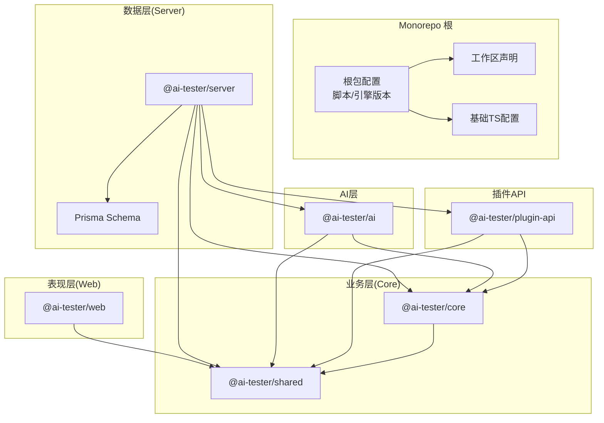
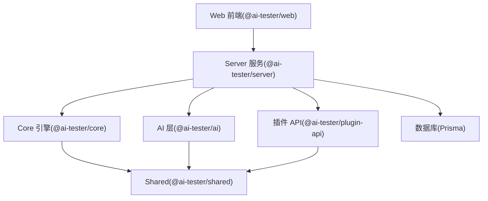
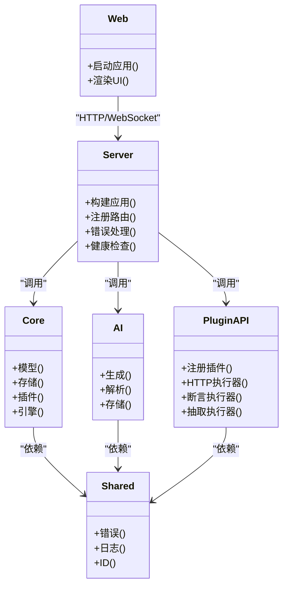
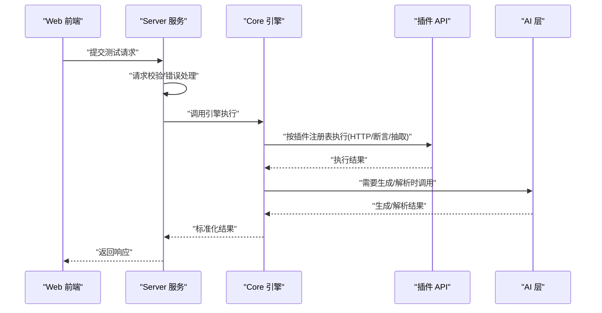
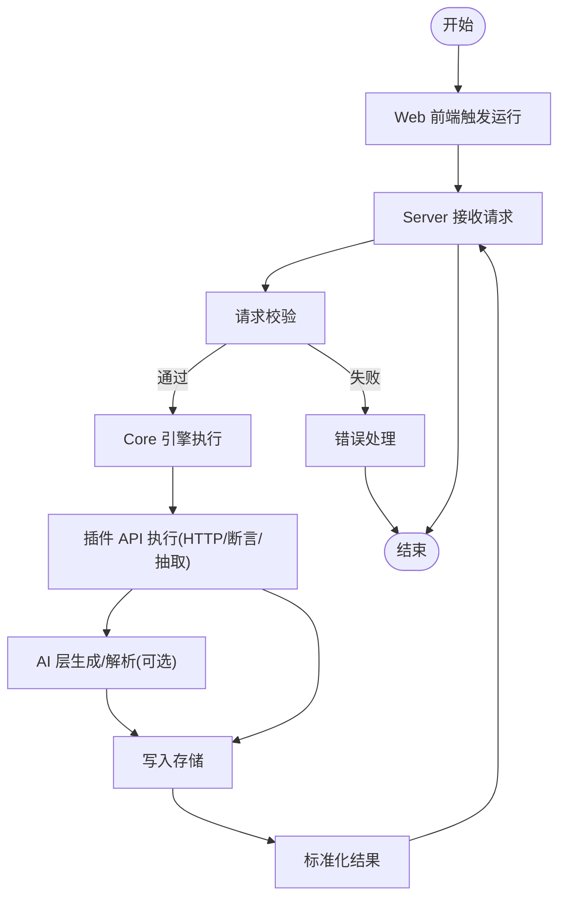
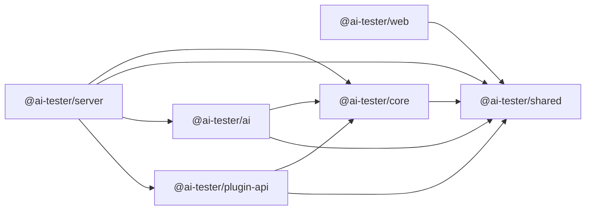
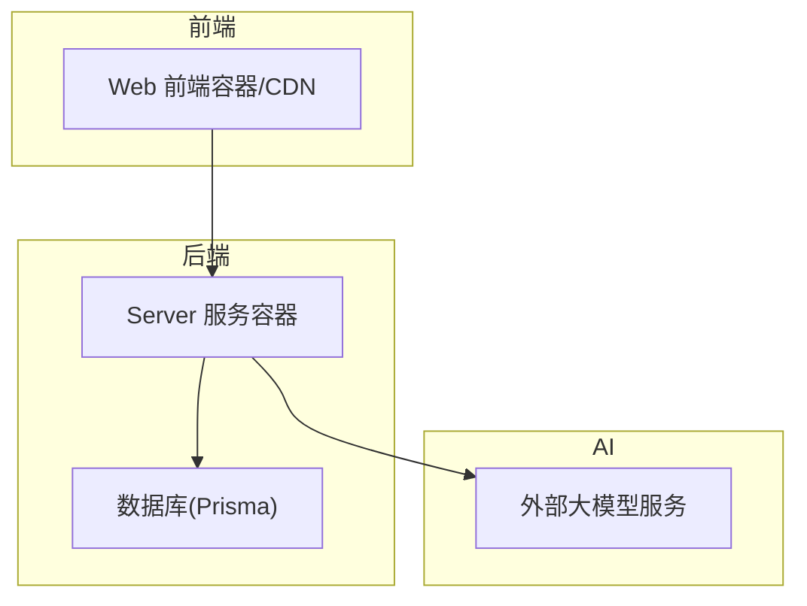

# 整体架构设计

<cite>
**本文引用的文件**
- [package.json](file://package.json)
- [pnpm-workspace.yaml](file://pnpm-workspace.yaml)
- [tsconfig.base.json](file://tsconfig.base.json)
- [packages/ai/package.json](file://packages/ai/package.json)
- [packages/core/package.json](file://packages/core/package.json)
- [packages/plugin-api/package.json](file://packages/plugin-api/package.json)
- [packages/server/package.json](file://packages/server/package.json)
- [packages/shared/package.json](file://packages/shared/package.json)
- [packages/web/package.json](file://packages/web/package.json)
- [packages/ai/src/index.ts](file://packages/ai/src/index.ts)
- [packages/core/src/index.ts](file://packages/core/src/index.ts)
- [packages/plugin-api/src/index.ts](file://packages/plugin-api/src/index.ts)
- [packages/shared/src/index.ts](file://packages/shared/src/index.ts)
- [packages/server/src/app.ts](file://packages/server/src/app.ts)
- [packages/web/src/main.tsx](file://packages/web/src/main.tsx)
- [prisma/schema.prisma](file://prisma/schema.prisma)
</cite>

## 目录
1. [引言](#引言)
2. [项目结构](#项目结构)
3. [核心组件](#核心组件)
4. [架构总览](#架构总览)
5. [详细组件分析](#详细组件分析)
6. [依赖分析](#依赖分析)
7. [性能考虑](#性能考虑)
8. [故障排查指南](#故障排查指南)
9. [结论](#结论)
10. [附录](#附录)

## 引言
本项目采用 Monorepo 架构组织多个相关但职责分离的包，覆盖从 Web 前端到后端服务、再到核心引擎与共享能力的完整链路。通过统一的工作区管理与类型系统配置，确保跨包的一致性与可维护性。本文档系统阐述分层架构（表现层、业务层、数据层/服务层）的职责边界、组件交互方式、数据流向与事件驱动机制，并给出系统边界图、组件关系图与部署拓扑图，帮助读者快速理解整体设计与技术取舍。

## 项目结构
项目采用 pnpm 工作区（workspace）组织，根目录提供统一脚本与基础 TypeScript 配置，各功能包位于 packages 目录下，分别承担不同层次的职责：
- 表现层（Web 前端）：负责用户界面与交互，使用现代前端框架与工具链构建。
- 业务层（Core 引擎）：封装测试用例执行、插件体系、模型与存储抽象等核心逻辑。
- 数据层/服务层（Server 服务）：提供 REST API 与 WebSocket 能力，承载路由、校验、错误处理与运行时编排。
- AI 层：对接外部大模型服务，提供生成、解析与存储能力。
- 插件 API：定义可扩展的执行器接口，支撑 HTTP 请求、断言与抽取等扩展能力。
- Shared：提供通用错误、日志、ID 等横切能力。

图表来源
- [pnpm-workspace.yaml:1-3](file://pnpm-workspace.yaml#L1-L3)
- [tsconfig.base.json:1-20](file://tsconfig.base.json#L1-L20)
- [packages/web/package.json:1-45](file://packages/web/package.json#L1-L45)
- [packages/server/package.json:1-36](file://packages/server/package.json#L1-L36)
- [packages/core/package.json:1-34](file://packages/core/package.json#L1-L34)
- [packages/ai/package.json:1-34](file://packages/ai/package.json#L1-L34)
- [packages/plugin-api/package.json:1-33](file://packages/plugin-api/package.json#L1-L33)
- [packages/shared/package.json:1-28](file://packages/shared/package.json#L1-L28)
- [prisma/schema.prisma](file://prisma/schema.prisma)

章节来源
- [package.json:1-31](file://package.json#L1-L31)
- [pnpm-workspace.yaml:1-3](file://pnpm-workspace.yaml#L1-L3)
- [tsconfig.base.json:1-20](file://tsconfig.base.json#L1-L20)

## 核心组件
- Web 前端（@ai-tester/web）
  - 入口文件负责初始化国际化、样式与应用根节点渲染。
  - 作为表现层，负责用户交互与状态展示，通过 API 与服务层通信。
- Server 服务（@ai-tester/server）
  - 使用高性能 Web 框架构建 REST API，注册多条业务路由与全局错误处理。
  - 提供健康检查、CORS 支持与统一的响应格式。
- Core 引擎（@ai-tester/core）
  - 导出模型、存储、插件与引擎等核心模块，是业务逻辑的中枢。
- AI 层（@ai-tester/ai）
  - 对接大模型服务，提供生成、解析与存储能力，依赖 Core 与 Shared。
- 插件 API（@ai-tester/plugin-api）
  - 定义可扩展的执行器（HTTP、断言、抽取），通过注册函数注入到插件注册表。
- Shared（@ai-tester/shared）
  - 提供错误、日志与 ID 等横切能力，被多包复用。

章节来源
- [packages/web/src/main.tsx:1-12](file://packages/web/src/main.tsx#L1-L12)
- [packages/server/src/app.ts:1-78](file://packages/server/src/app.ts#L1-L78)
- [packages/core/src/index.ts:1-5](file://packages/core/src/index.ts#L1-L5)
- [packages/ai/src/index.ts:1-7](file://packages/ai/src/index.ts#L1-L7)
- [packages/plugin-api/src/index.ts:1-15](file://packages/plugin-api/src/index.ts#L1-L15)
- [packages/shared/src/index.ts:1-4](file://packages/shared/src/index.ts#L1-L4)

## 架构总览
系统采用三层架构：
- 表现层（Web 前端）：负责用户交互与视图渲染，调用服务层提供的 API。
- 业务层（Core 引擎）：封装测试生命周期、插件体系与数据模型，向上承接服务层请求，向下协调 AI 与存储。
- 数据层/服务层（Server 服务）：对外暴露 REST API，进行请求校验、路由分发与错误处理，协调 Core 与 AI 能力完成具体任务。

图表来源
- [packages/web/src/main.tsx:1-12](file://packages/web/src/main.tsx#L1-L12)
- [packages/server/src/app.ts:1-78](file://packages/server/src/app.ts#L1-L78)
- [packages/core/src/index.ts:1-5](file://packages/core/src/index.ts#L1-L5)
- [packages/ai/src/index.ts:1-7](file://packages/ai/src/index.ts#L1-L7)
- [packages/plugin-api/src/index.ts:1-15](file://packages/plugin-api/src/index.ts#L1-L15)
- [packages/shared/src/index.ts:1-4](file://packages/shared/src/index.ts#L1-L4)
- [prisma/schema.prisma](file://prisma/schema.prisma)

## 详细组件分析

### 组件关系与职责边界
- @ai-tester/web
  - 职责：应用启动、国际化初始化、UI 渲染与用户交互。
  - 交互：通过 HTTP/WebSocket 与 @ai-tester/server 通信。
- @ai-tester/server
  - 职责：路由注册、请求校验、错误处理、健康检查、CORS 与 Swagger 文档。
  - 交互：接收来自 Web 的请求，调用 Core/Plugin/AI 能力，返回标准化响应。
- @ai-tester/core
  - 职责：测试用例执行、插件注册表、模型与存储抽象。
  - 交互：被 Server 调用；向 AI 与 Plugin API 提供统一的执行上下文。
- @ai-tester/ai
  - 职责：大模型集成、生成与解析、结果存储。
  - 交互：被 Server 或 Core 调用；依赖 Core 的模型与存储。
- @ai-tester/plugin-api
  - 职责：定义 HTTP 执行器、断言执行器、抽取执行器的接口与注册流程。
  - 交互：通过注册函数注入到 Core 的插件注册表。
- @ai-tester/shared
  - 职责：错误、日志、ID 等横切能力，被多包复用。

图表来源
- [packages/web/src/main.tsx:1-12](file://packages/web/src/main.tsx#L1-L12)
- [packages/server/src/app.ts:1-78](file://packages/server/src/app.ts#L1-L78)
- [packages/core/src/index.ts:1-5](file://packages/core/src/index.ts#L1-L5)
- [packages/ai/src/index.ts:1-7](file://packages/ai/src/index.ts#L1-L7)
- [packages/plugin-api/src/index.ts:1-15](file://packages/plugin-api/src/index.ts#L1-L15)
- [packages/shared/src/index.ts:1-4](file://packages/shared/src/index.ts#L1-L4)

章节来源
- [packages/web/src/main.tsx:1-12](file://packages/web/src/main.tsx#L1-L12)
- [packages/server/src/app.ts:1-78](file://packages/server/src/app.ts#L1-L78)
- [packages/core/src/index.ts:1-5](file://packages/core/src/index.ts#L1-L5)
- [packages/ai/src/index.ts:1-7](file://packages/ai/src/index.ts#L1-L7)
- [packages/plugin-api/src/index.ts:1-15](file://packages/plugin-api/src/index.ts#L1-L15)
- [packages/shared/src/index.ts:1-4](file://packages/shared/src/index.ts#L1-L4)

### 数据流与事件驱动机制
- 数据流
  - 用户在 Web 前端发起操作，Server 接收请求并进行校验与路由分发。
  - Server 调用 Core 引擎，Core 通过插件 API 执行 HTTP/断言/抽取等步骤。
  - AI 层参与生成与解析，结果写入存储（由 Core/Shared 协调）。
  - Server 将标准化响应返回给前端。
- 事件驱动
  - 插件 API 通过注册函数将执行器注入到 Core 的插件注册表，形成“事件式”的可扩展执行链。
  - Server 在启动时注册路由与中间件，形成“事件式”的请求处理管线。

图表来源
- [packages/server/src/app.ts:1-78](file://packages/server/src/app.ts#L1-L78)
- [packages/core/src/index.ts:1-5](file://packages/core/src/index.ts#L1-L5)
- [packages/plugin-api/src/index.ts:1-15](file://packages/plugin-api/src/index.ts#L1-L15)
- [packages/ai/src/index.ts:1-7](file://packages/ai/src/index.ts#L1-L7)

章节来源
- [packages/server/src/app.ts:1-78](file://packages/server/src/app.ts#L1-L78)
- [packages/plugin-api/src/index.ts:1-15](file://packages/plugin-api/src/index.ts#L1-L15)

### 处理流程（以“运行测试套件”为例）
- Web 前端触发运行。
- Server 注册运行路由并接收请求。
- Server 调用 Core 引擎，Core 依据插件注册表执行 HTTP 请求、断言与抽取。
- 若需要 AI 参与，Server 调用 AI 层进行生成或解析。
- 结果写入存储并通过 Core/Shared 统一处理。
- Server 返回标准化响应给前端。

图表来源
- [packages/server/src/app.ts:1-78](file://packages/server/src/app.ts#L1-L78)
- [packages/core/src/index.ts:1-5](file://packages/core/src/index.ts#L1-L5)
- [packages/plugin-api/src/index.ts:1-15](file://packages/plugin-api/src/index.ts#L1-L15)
- [packages/ai/src/index.ts:1-7](file://packages/ai/src/index.ts#L1-L7)

## 依赖分析
- 包间依赖关系
  - @ai-tester/server 依赖 @ai-tester/core、@ai-tester/shared、@ai-tester/ai、@ai-tester/plugin-api。
  - @ai-tester/ai 依赖 @ai-tester/core、@ai-tester/shared。
  - @ai-tester/plugin-api 依赖 @ai-tester/core、@ai-tester/shared。
  - @ai-tester/core 依赖 @ai-tester/shared。
  - @ai-tester/web 依赖 UI 组件库与国际化库，不直接依赖后端包。
- 工作区与构建
  - pnpm 工作区统一管理各包，根脚本支持并行开发与构建。
  - 基础 TypeScript 配置确保一致的编译目标与输出目录。

图表来源
- [packages/web/package.json:1-45](file://packages/web/package.json#L1-L45)
- [packages/server/package.json:1-36](file://packages/server/package.json#L1-L36)
- [packages/core/package.json:1-34](file://packages/core/package.json#L1-L34)
- [packages/ai/package.json:1-34](file://packages/ai/package.json#L1-L34)
- [packages/plugin-api/package.json:1-33](file://packages/plugin-api/package.json#L1-L33)
- [packages/shared/package.json:1-28](file://packages/shared/package.json#L1-L28)

章节来源
- [pnpm-workspace.yaml:1-3](file://pnpm-workspace.yaml#L1-L3)
- [package.json:6-12](file://package.json#L6-L12)
- [tsconfig.base.json:1-20](file://tsconfig.base.json#L1-L20)

## 性能考虑
- 并行开发与构建：根脚本支持并行执行，缩短开发周期。
- 类型安全：统一的 TypeScript 配置与严格选项，减少运行时错误。
- 轻量级服务端：基于高性能 Web 框架，结合中间件与错误处理，保证稳定性与可观测性。
- 插件化扩展：通过插件注册表降低耦合，便于按需扩展与优化热点路径。

## 故障排查指南
- 错误处理
  - Server 提供全局错误处理器，区分参数校验错误与内部错误，统一返回结构化错误信息。
  - 健康检查接口可用于快速判断服务可用性。
- 日志与追踪
  - 服务端日志记录错误堆栈，便于定位问题。
  - 建议在插件与 AI 层增加关键步骤的日志埋点，辅助排障。
- 常见问题
  - 路由未注册：确认 Server 启动时是否正确注册了所需路由模块。
  - 插件未生效：确认插件注册函数已在合适时机调用，且插件已成功注册到 Core 的插件注册表。
  - 数据库连接：若涉及持久化，确认 Prisma 配置与连接字符串正确。

章节来源
- [packages/server/src/app.ts:23-43](file://packages/server/src/app.ts#L23-L43)
- [packages/server/src/app.ts:45-50](file://packages/server/src/app.ts#L45-L50)

## 结论
本项目通过 Monorepo 与分层架构实现了清晰的职责划分与高内聚低耦合的组件关系。表现层、业务层与数据层/服务层边界明确，配合插件化与 AI 能力，既满足当前需求又具备良好的扩展性。统一的工作区与类型配置降低了协作成本，提升了整体可维护性与可演进性。

## 附录
- 部署拓扑建议
  - 前端：静态资源托管于 CDN 或容器镜像，独立于后端。
  - 后端：Server 服务容器化部署，暴露 REST API 与 WebSocket。
  - 数据库：Prisma 管理迁移与连接，建议使用独立实例或托管服务。
  - AI 服务：根据外部模型提供商要求配置密钥与网络策略。
- 关键配置参考
  - 工作区与脚本：根级 package.json 与 pnpm-workspace.yaml。
  - TypeScript 基础配置：tsconfig.base.json。
  - 数据模型：prisma/schema.prisma。

图表来源
- [packages/web/package.json:1-45](file://packages/web/package.json#L1-L45)
- [packages/server/package.json:1-36](file://packages/server/package.json#L1-L36)
- [prisma/schema.prisma](file://prisma/schema.prisma)