# 插件系统架构

<cite>
**本文引用的文件**
- [packages/plugin-api/src/index.ts](file://packages/plugin-api/src/index.ts)
- [packages/plugin-api/src/http-executor.ts](file://packages/plugin-api/src/http-executor.ts)
- [packages/plugin-api/src/assertions.ts](file://packages/plugin-api/src/assertions.ts)
- [packages/plugin-api/src/extractors.ts](file://packages/plugin-api/src/extractors.ts)
- [packages/core/src/plugins/registry.ts](file://packages/core/src/plugins/registry.ts)
- [packages/core/src/plugins/executor.ts](file://packages/core/src/plugins/executor.ts)
- [packages/core/src/engine/run-context.ts](file://packages/core/src/engine/run-context.ts)
- [packages/core/src/engine/orchestrator.ts](file://packages/core/src/engine/orchestrator.ts)
- [packages/core/src/models/test-step.ts](file://packages/core/src/models/test-step.ts)
- [packages/shared/src/id.ts](file://packages/shared/src/id.ts)
</cite>

## 目录
1. [引言](#引言)
2. [项目结构](#项目结构)
3. [核心组件](#核心组件)
4. [架构总览](#架构总览)
5. [详细组件分析](#详细组件分析)
6. [依赖分析](#依赖分析)
7. [性能考虑](#性能考虑)
8. [故障排查指南](#故障排查指南)
9. [结论](#结论)
10. [附录：自定义插件开发指南与最佳实践](#附录自定义插件开发指南与最佳实践)

## 引言
本文件面向插件系统架构，围绕以下目标展开：深入解释 PluginRegistry 的设计与插件注册机制（发现、加载、生命周期管理），文档化执行器（Executor）的接口定义、异步执行模式与结果聚合机制；阐明注册表的查找算法、缓存策略与错误处理；说明插件执行的上下文传递、参数解析与结果回传流程；给出插件架构图、注册流程图与执行序列图；提供自定义插件开发指南与最佳实践，并解释插件间依赖与冲突解决策略。

## 项目结构
该仓库采用多包工作区组织方式，插件系统的核心位于 core 包，插件 API 实现位于 plugin-api 包，二者通过统一的接口契约协作。关键模块分布如下：
- 核心插件接口与注册表：packages/core/src/plugins
- 执行器实现：packages/plugin-api/src
- 运行时上下文与编排器：packages/core/src/engine
- 测试步骤与配置校验：packages/core/src/models
- 公共 ID 工具：packages/shared/src

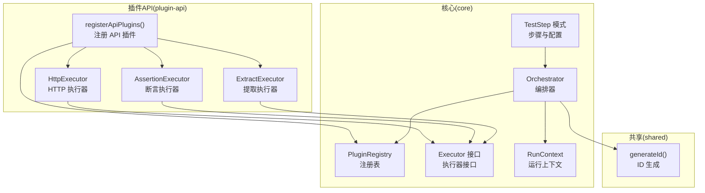

图表来源
- [packages/core/src/plugins/registry.ts:1-29](file://packages/core/src/plugins/registry.ts#L1-L29)
- [packages/core/src/plugins/executor.ts:1-23](file://packages/core/src/plugins/executor.ts#L1-L23)
- [packages/core/src/engine/run-context.ts:1-80](file://packages/core/src/engine/run-context.ts#L1-L80)
- [packages/core/src/engine/orchestrator.ts:1-296](file://packages/core/src/engine/orchestrator.ts#L1-L296)
- [packages/core/src/models/test-step.ts:1-102](file://packages/core/src/models/test-step.ts#L1-L102)
- [packages/plugin-api/src/index.ts:1-15](file://packages/plugin-api/src/index.ts#L1-L15)
- [packages/plugin-api/src/http-executor.ts:1-95](file://packages/plugin-api/src/http-executor.ts#L1-L95)
- [packages/plugin-api/src/assertions.ts:1-112](file://packages/plugin-api/src/assertions.ts#L1-L112)
- [packages/plugin-api/src/extractors.ts:1-68](file://packages/plugin-api/src/extractors.ts#L1-L68)
- [packages/shared/src/id.ts:1-6](file://packages/shared/src/id.ts#L1-L6)

章节来源
- [packages/core/src/plugins/registry.ts:1-29](file://packages/core/src/plugins/registry.ts#L1-L29)
- [packages/core/src/plugins/executor.ts:1-23](file://packages/core/src/plugins/executor.ts#L1-L23)
- [packages/core/src/engine/run-context.ts:1-80](file://packages/core/src/engine/run-context.ts#L1-L80)
- [packages/core/src/engine/orchestrator.ts:1-296](file://packages/core/src/engine/orchestrator.ts#L1-L296)
- [packages/core/src/models/test-step.ts:1-102](file://packages/core/src/models/test-step.ts#L1-L102)
- [packages/plugin-api/src/index.ts:1-15](file://packages/plugin-api/src/index.ts#L1-L15)
- [packages/plugin-api/src/http-executor.ts:1-95](file://packages/plugin-api/src/http-executor.ts#L1-L95)
- [packages/plugin-api/src/assertions.ts:1-112](file://packages/plugin-api/src/assertions.ts#L1-L112)
- [packages/plugin-api/src/extractors.ts:1-68](file://packages/plugin-api/src/extractors.ts#L1-L68)
- [packages/shared/src/id.ts:1-6](file://packages/shared/src/id.ts#L1-L6)

## 核心组件
- 插件注册表（PluginRegistry）
  - 职责：维护执行器类型到执行器实例的映射，提供注册、查询、抛错查询与类型列表能力。
  - 关键点：注册时按 type 去重，查询失败时抛出包含可用类型的错误信息。
- 执行器接口（Executor）
  - 职责：定义统一的执行器契约，包括 type、configSchema、execute，以及可选的 setup/teardown 生命周期钩子。
  - 结果格式：StepExecutionResult 统一承载状态、请求/响应、断言、变量提取、错误与耗时等字段。
- 运行上下文（RunContext）
  - 职责：封装运行期环境、变量、事件发射器与最近一次响应对象；提供模板解析（单层与深解析）能力。
- 编排器（Orchestrator）
  - 职责：驱动一次完整的测试运行，负责环境解析、变量合并、用例执行、步骤重试、事件发射与结果聚合。
- 步骤与配置（TestStep）
  - 职责：定义步骤类型、配置模式与校验规则，支持 http、assertion、extract、call、load-dataset 等类型。

章节来源
- [packages/core/src/plugins/registry.ts:1-29](file://packages/core/src/plugins/registry.ts#L1-L29)
- [packages/core/src/plugins/executor.ts:1-23](file://packages/core/src/plugins/executor.ts#L1-L23)
- [packages/core/src/engine/run-context.ts:1-80](file://packages/core/src/engine/run-context.ts#L1-L80)
- [packages/core/src/engine/orchestrator.ts:1-296](file://packages/core/src/engine/orchestrator.ts#L1-L296)
- [packages/core/src/models/test-step.ts:1-102](file://packages/core/src/models/test-step.ts#L1-L102)

## 架构总览
下图展示插件系统整体交互：编排器从存储层读取套件与用例，构建运行上下文，依据步骤类型选择对应执行器，执行后将结果写入存储并发出事件；执行器内部通过配置模式进行参数解析与执行。

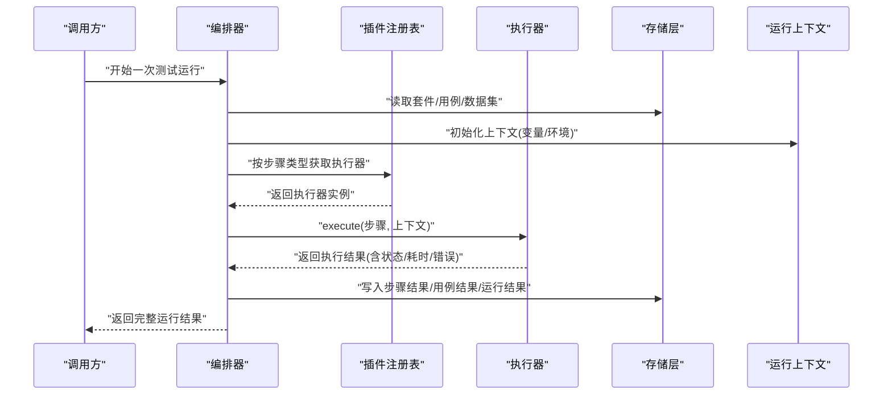

图表来源
- [packages/core/src/engine/orchestrator.ts:25-140](file://packages/core/src/engine/orchestrator.ts#L25-L140)
- [packages/core/src/plugins/registry.ts:13-23](file://packages/core/src/plugins/registry.ts#L13-L23)
- [packages/core/src/plugins/executor.ts:15-22](file://packages/core/src/plugins/executor.ts#L15-L22)
- [packages/core/src/engine/run-context.ts:11-33](file://packages/core/src/engine/run-context.ts#L11-L33)

## 详细组件分析

### 插件注册表（PluginRegistry）
- 设计模式：简单工厂 + 映射容器
- 注册机制：以 type 为键，确保唯一性；重复注册会抛出错误。
- 查找算法：基于 Map 的 O(1) 查找；提供安全查询 getOrThrow，失败时抛出包含可用类型的错误信息。
- 错误处理：注册冲突与未知类型均显式抛错，便于快速定位问题。
- 缓存策略：Map 作为内存缓存，生命周期随进程；无持久化或过期逻辑。

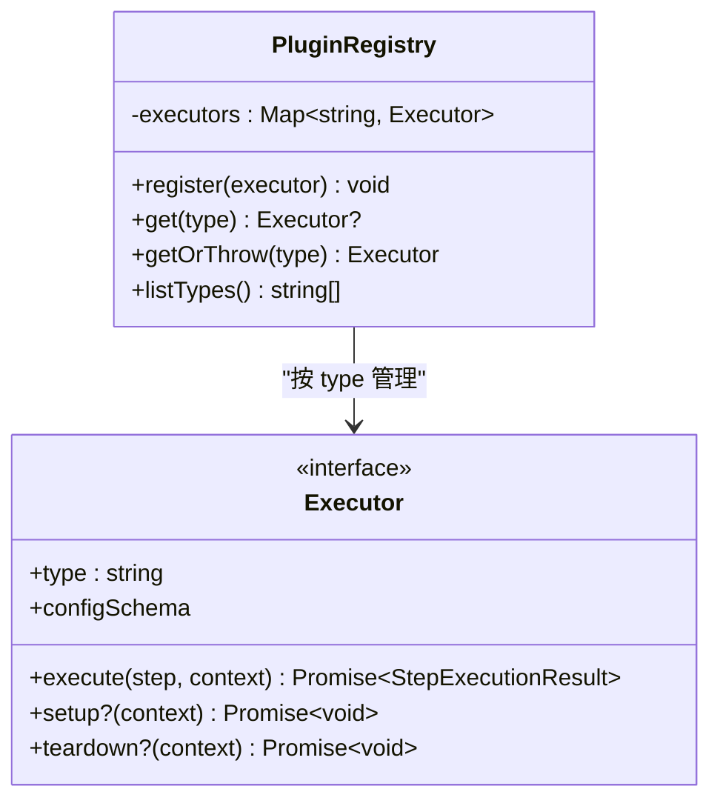

图表来源
- [packages/core/src/plugins/registry.ts:3-28](file://packages/core/src/plugins/registry.ts#L3-L28)
- [packages/core/src/plugins/executor.ts:15-22](file://packages/core/src/plugins/executor.ts#L15-L22)

章节来源
- [packages/core/src/plugins/registry.ts:1-29](file://packages/core/src/plugins/registry.ts#L1-L29)

### 执行器接口（Executor）
- 接口定义：type、configSchema、execute 必备；setup/teardown 可选。
- 配置校验：由各执行器的 configSchema 在执行前进行解析与校验，保证输入一致性。
- 异步执行：execute 返回 Promise，支持超时、重试与错误捕获。
- 结果聚合：StepExecutionResult 统一承载执行状态、请求/响应、断言、变量提取、错误与耗时，便于编排器汇总。

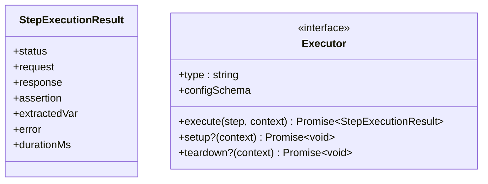

图表来源
- [packages/core/src/plugins/executor.ts:5-22](file://packages/core/src/plugins/executor.ts#L5-L22)

章节来源
- [packages/core/src/plugins/executor.ts:1-23](file://packages/core/src/plugins/executor.ts#L1-L23)

### HTTP 执行器（HttpExecutor）
- 功能：根据配置发起 HTTP 请求，解析响应体（JSON/文本），设置响应头扁平化，记录 lastResponse 到上下文。
- 参数解析：URL、Headers、Body 通过 RunContext 的模板解析方法进行变量替换；contentType 默认值与超时控制。
- 错误处理：捕获异常并返回 error 状态，包含消息与堆栈；记录耗时。
- 结果回传：返回包含请求/响应详情与耗时的结果对象。

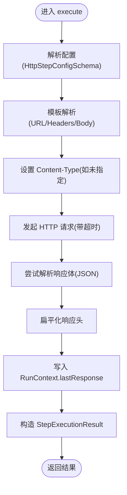

图表来源
- [packages/plugin-api/src/http-executor.ts:11-93](file://packages/plugin-api/src/http-executor.ts#L11-L93)
- [packages/core/src/engine/run-context.ts:35-54](file://packages/core/src/engine/run-context.ts#L35-L54)

章节来源
- [packages/plugin-api/src/http-executor.ts:1-95](file://packages/plugin-api/src/http-executor.ts#L1-L95)
- [packages/core/src/engine/run-context.ts:1-80](file://packages/core/src/engine/run-context.ts#L1-L80)

### 断言执行器（AssertionExecutor）
- 功能：从 lastResponse 或上下文变量中解析实际值，结合表达式与运算符进行断言评估。
- 支持源：status、header、body、jsonpath、variable；表达式必填项在特定源下强制校验。
- 运算符：equals、not_equals、contains、not_contains、gt/gte、lt/lte、matches、exists/not_exists、type_is。
- 错误处理：解析与评估异常转为 error 状态；成功则返回 passed/failed。

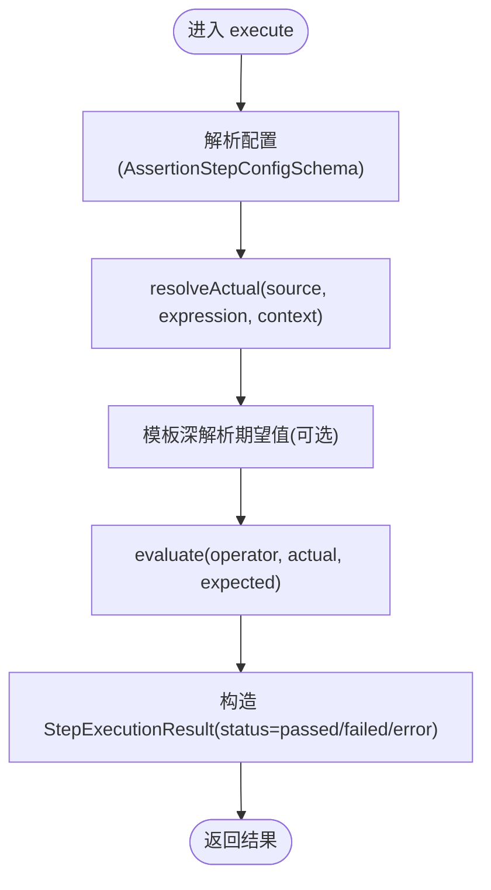

图表来源
- [packages/plugin-api/src/assertions.ts:11-40](file://packages/plugin-api/src/assertions.ts#L11-L40)
- [packages/plugin-api/src/assertions.ts:42-99](file://packages/plugin-api/src/assertions.ts#L42-L99)

章节来源
- [packages/plugin-api/src/assertions.ts:1-112](file://packages/plugin-api/src/assertions.ts#L1-L112)

### 提取执行器（ExtractExecutor）
- 功能：从响应中抽取值并写入上下文变量，支持 body、jsonpath、header、status、regex 等源。
- 表达式要求：jsonpath、regex、variable 等源需要表达式参数，缺失时报错。
- 错误处理：无响应或解析失败时抛错并被上层捕获为 error 状态。

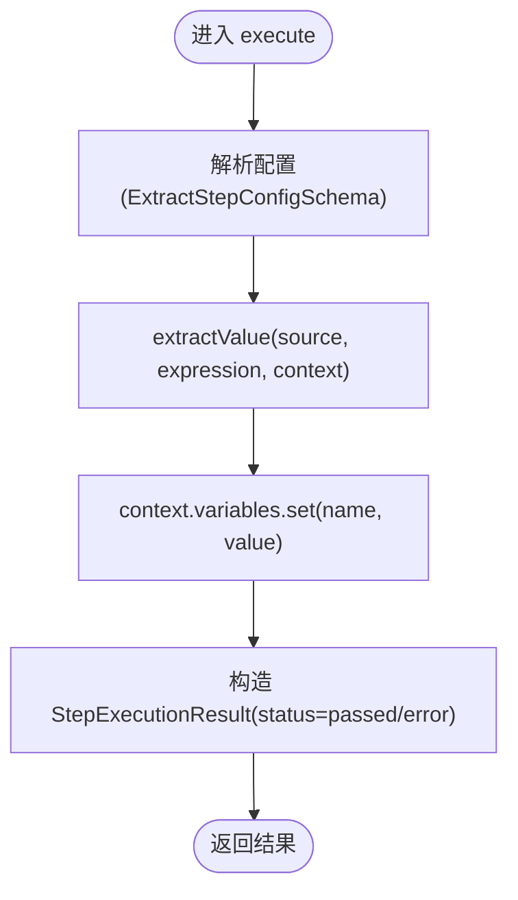

图表来源
- [packages/plugin-api/src/extractors.ts:11-34](file://packages/plugin-api/src/extractors.ts#L11-L34)
- [packages/plugin-api/src/extractors.ts:36-66](file://packages/plugin-api/src/extractors.ts#L36-L66)

章节来源
- [packages/plugin-api/src/extractors.ts:1-68](file://packages/plugin-api/src/extractors.ts#L1-L68)

### 运行上下文（RunContext）
- 变量体系：Map 存储，支持模板解析（单层与深解析），路径访问支持点号与数组索引。
- 环境注入：构造时预填充 baseUrl 与环境变量，便于执行器直接使用。
- 最近响应：lastResponse 用于断言与提取执行器读取，形成跨步骤的数据通道。
- 事件机制：EventEmitter 供编排器监听用例/步骤生命周期事件。

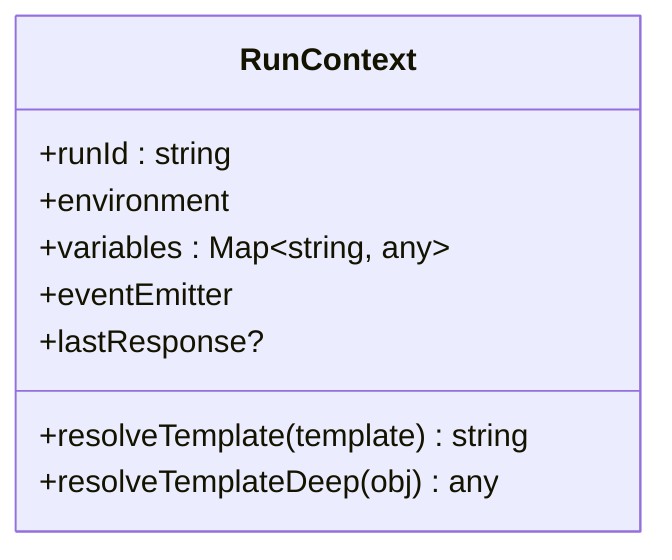

图表来源
- [packages/core/src/engine/run-context.ts:11-79](file://packages/core/src/engine/run-context.ts#L11-L79)

章节来源
- [packages/core/src/engine/run-context.ts:1-80](file://packages/core/src/engine/run-context.ts#L1-L80)

### 编排器（Orchestrator）
- 生命周期：执行 run → setupCase → 逐用例执行 → teardownCase → 更新运行状态与统计。
- 步骤调度：按 order 排序，支持 call 递归执行与 load-dataset 数据集装载；遇到 continueOnFailure=false 时中断后续步骤。
- 重试机制：按 retryCount 自动重试，记录最后一次结果；事件发射 step:start/complete。
- 结果聚合：将每步结果写入存储，计算用例与运行级统计，最终返回完整运行对象。

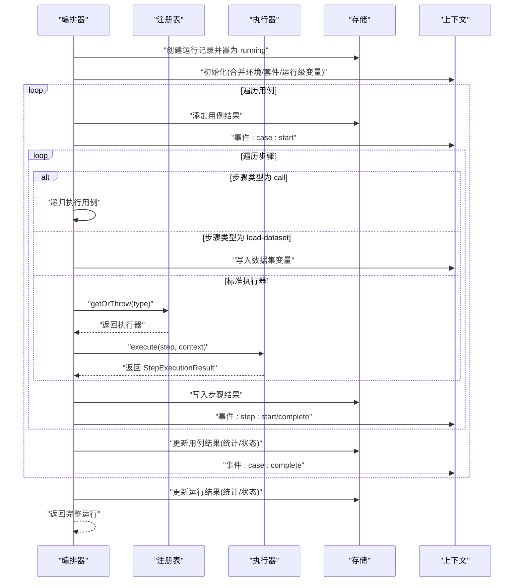

图表来源
- [packages/core/src/engine/orchestrator.ts:25-140](file://packages/core/src/engine/orchestrator.ts#L25-L140)
- [packages/core/src/engine/orchestrator.ts:142-294](file://packages/core/src/engine/orchestrator.ts#L142-L294)
- [packages/core/src/plugins/registry.ts:13-23](file://packages/core/src/plugins/registry.ts#L13-L23)

章节来源
- [packages/core/src/engine/orchestrator.ts:1-296](file://packages/core/src/engine/orchestrator.ts#L1-L296)

### 插件注册流程（API 插件）
- 作用：集中注册内置执行器（HTTP、断言、提取）到 PluginRegistry。
- 流程：接收 PluginRegistry 实例，逐一注册执行器；确保类型唯一且可被编排器按类型获取。

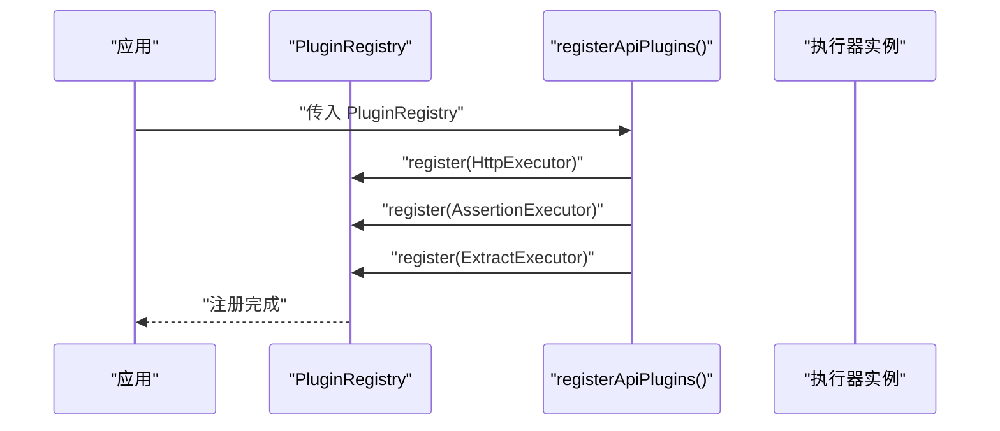

图表来源
- [packages/plugin-api/src/index.ts:10-14](file://packages/plugin-api/src/index.ts#L10-L14)
- [packages/core/src/plugins/registry.ts:6-11](file://packages/core/src/plugins/registry.ts#L6-L11)

章节来源
- [packages/plugin-api/src/index.ts:1-15](file://packages/plugin-api/src/index.ts#L1-L15)

## 依赖分析
- 组件耦合
  - Orchestrator 依赖 Registry 与 RunContext；Registry 仅依赖 Executor 接口；执行器实现依赖 RunContext 与配置模式。
  - 执行器之间无直接耦合，通过统一接口与配置模式解耦。
- 外部依赖
  - 执行器使用 undici 发起 HTTP 请求；断言/提取使用 jsonpath-plus；ID 使用 cuid2。
- 循环依赖
  - 未见循环导入；模块边界清晰。

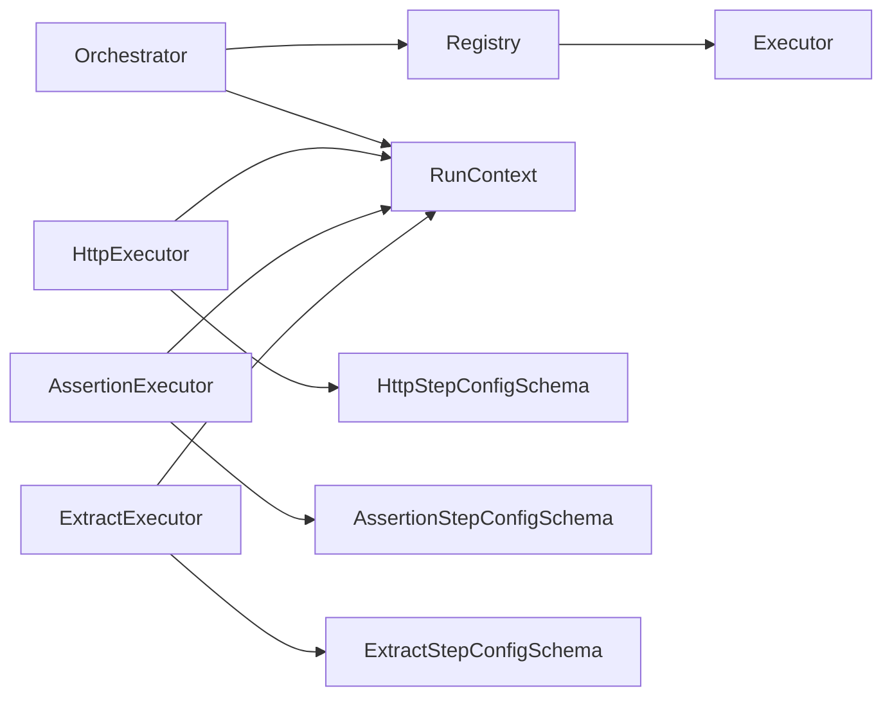

图表来源
- [packages/core/src/engine/orchestrator.ts:4-5](file://packages/core/src/engine/orchestrator.ts#L4-L5)
- [packages/core/src/plugins/registry.ts:1](file://packages/core/src/plugins/registry.ts#L1)
- [packages/plugin-api/src/http-executor.ts:5](file://packages/plugin-api/src/http-executor.ts#L5)
- [packages/plugin-api/src/assertions.ts:5](file://packages/plugin-api/src/assertions.ts#L5)
- [packages/plugin-api/src/extractors.ts:5](file://packages/plugin-api/src/extractors.ts#L5)
- [packages/core/src/models/test-step.ts:12-70](file://packages/core/src/models/test-step.ts#L12-L70)

章节来源
- [packages/core/src/engine/orchestrator.ts:1-296](file://packages/core/src/engine/orchestrator.ts#L1-L296)
- [packages/core/src/plugins/registry.ts:1-29](file://packages/core/src/plugins/registry.ts#L1-L29)
- [packages/plugin-api/src/http-executor.ts:1-95](file://packages/plugin-api/src/http-executor.ts#L1-L95)
- [packages/plugin-api/src/assertions.ts:1-112](file://packages/plugin-api/src/assertions.ts#L1-L112)
- [packages/plugin-api/src/extractors.ts:1-68](file://packages/plugin-api/src/extractors.ts#L1-L68)
- [packages/core/src/models/test-step.ts:1-102](file://packages/core/src/models/test-step.ts#L1-L102)

## 性能考虑
- 并发与吞吐
  - 当前执行器为顺序执行；若需提升吞吐，可在编排器层面引入并发队列与限流策略，但需注意共享上下文的线程安全与变量覆盖风险。
- 超时与重试
  - HTTP 执行器内置超时；编排器对步骤提供重试次数配置；应结合网络与服务端性能合理设置。
- 内存与缓存
  - 注册表为内存 Map；上下文变量为 Map；建议避免在变量中存放超大对象，必要时采用分页或懒加载策略。
- 日志与可观测性
  - 编排器已发出 step/start、step/complete、case/start、case/complete、run/complete 事件，建议配合日志系统记录关键指标（耗时、成功率、错误分布）。

## 故障排查指南
- 注册冲突
  - 现象：注册相同 type 抛错。
  - 处理：检查执行器 type 是否重复；确保每个类型只注册一个实现。
- 类型未知
  - 现象：getOrThrow 查询不到类型并提示可用类型列表。
  - 处理：确认步骤 type 与已注册类型一致；检查注册是否遗漏。
- 执行器异常
  - 现象：execute 抛错被包装为 error 状态。
  - 处理：查看 error.message 与 stack；检查配置模式与模板变量。
- 模板解析失败
  - 现象：模板占位符未被替换或返回原串。
  - 处理：确认变量名与路径正确；检查 resolveTemplate/resolveTemplateDeep 的使用场景。
- 断言/提取源缺失
  - 现象：断言/提取源需要表达式而未提供时报错。
  - 处理：补齐表达式；或切换到不需要表达式的源（如 body/status）。

章节来源
- [packages/core/src/plugins/registry.ts:7-22](file://packages/core/src/plugins/registry.ts#L7-L22)
- [packages/plugin-api/src/assertions.ts:42-64](file://packages/plugin-api/src/assertions.ts#L42-L64)
- [packages/plugin-api/src/extractors.ts:36-66](file://packages/plugin-api/src/extractors.ts#L36-L66)
- [packages/core/src/engine/run-context.ts:35-78](file://packages/core/src/engine/run-context.ts#L35-L78)

## 结论
该插件系统以清晰的接口契约与注册表实现为核心，通过编排器协调执行器、上下文与存储，形成“类型驱动”的扩展机制。执行器内部通过配置模式与上下文模板解析实现强健的参数处理与跨步骤数据传递；编排器提供重试、事件与结果聚合能力。整体架构具备良好的可扩展性与可维护性，适合进一步引入更多执行器类型与并发优化。

## 附录：自定义插件开发指南与最佳实践
- 开发步骤
  - 定义执行器类，实现 type、configSchema 与 execute 方法；如需生命周期钩子可实现 setup/teardown。
  - 在配置模式中严格约束输入字段，使用 Zod Schema 进行解析与校验。
  - 在执行过程中充分利用 RunContext 的模板解析能力与 lastResponse/variables。
  - 在插件注册入口中调用 registry.register 注册新执行器。
- 最佳实践
  - 类型唯一：确保 type 全局唯一，避免覆盖默认实现。
  - 配置健壮：对必填字段与默认值进行明确约束；对可选字段提供合理默认。
  - 错误友好：捕获异常并返回 error 状态，保留 message 与 stack；必要时补充上下文信息。
  - 结果统一：遵循 StepExecutionResult 字段约定，便于编排器聚合与展示。
  - 可观测性：在关键节点发出事件，便于监控与调试。
  - 性能优先：避免在变量中存放超大对象；合理设置超时与重试；必要时引入并发与限流。
- 插件间依赖与冲突
  - 依赖：执行器之间无直接依赖，但可能共享上下文变量；应避免竞态与覆盖。
  - 冲突：同一 type 冲突会导致注册失败；可通过命名空间或版本化策略规避。
  - 解决策略：在注册阶段集中管理；对同类型提供明确的替代与迁移路径；通过测试用例验证行为一致性。

章节来源
- [packages/core/src/plugins/executor.ts:15-22](file://packages/core/src/plugins/executor.ts#L15-L22)
- [packages/core/src/engine/run-context.ts:35-78](file://packages/core/src/engine/run-context.ts#L35-L78)
- [packages/core/src/plugins/registry.ts:6-11](file://packages/core/src/plugins/registry.ts#L6-L11)
- [packages/plugin-api/src/index.ts:10-14](file://packages/plugin-api/src/index.ts#L10-L14)