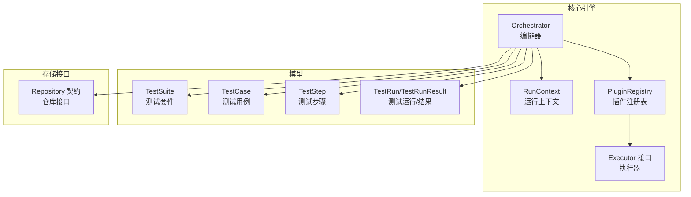
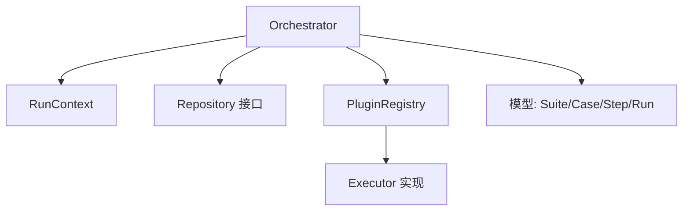
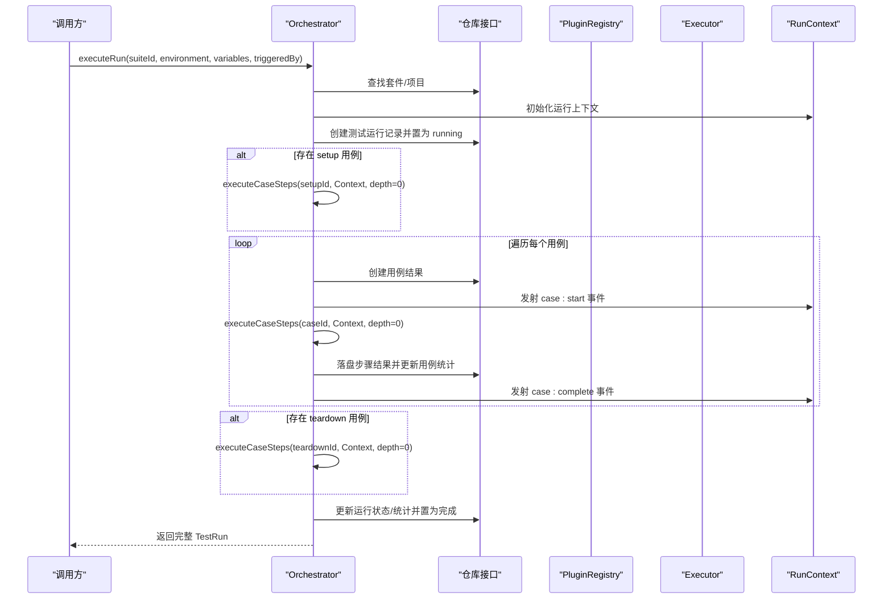
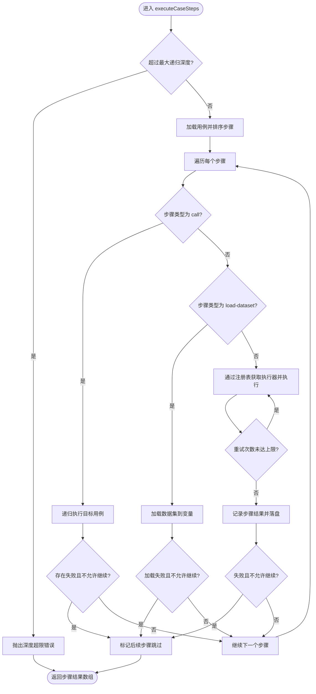
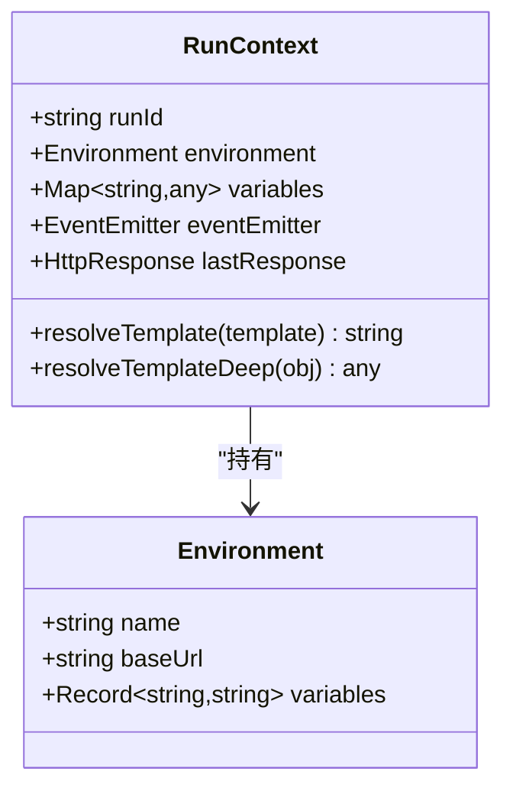
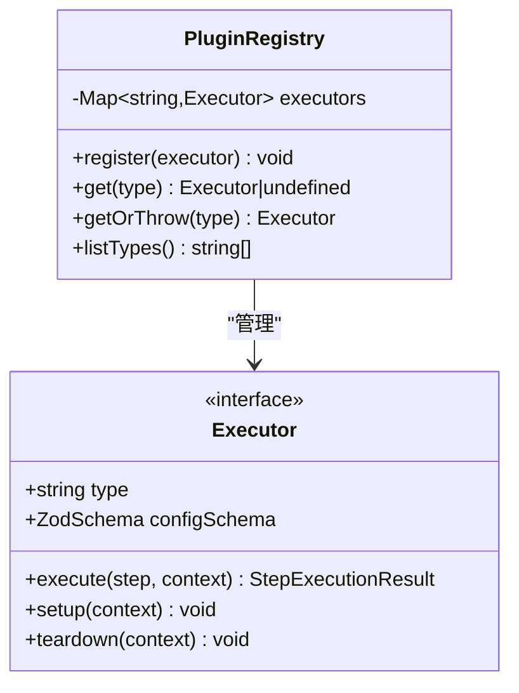
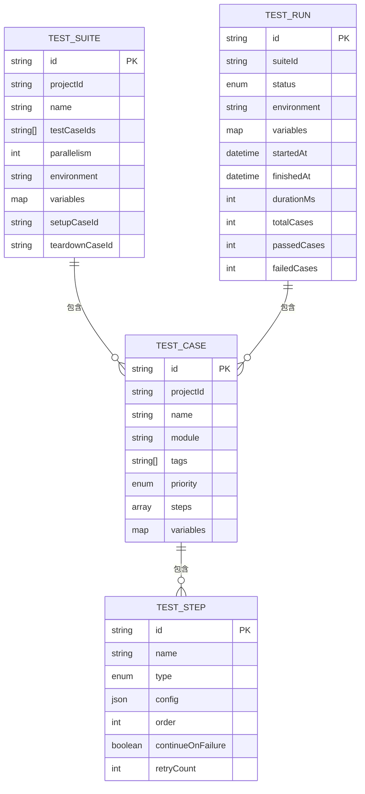
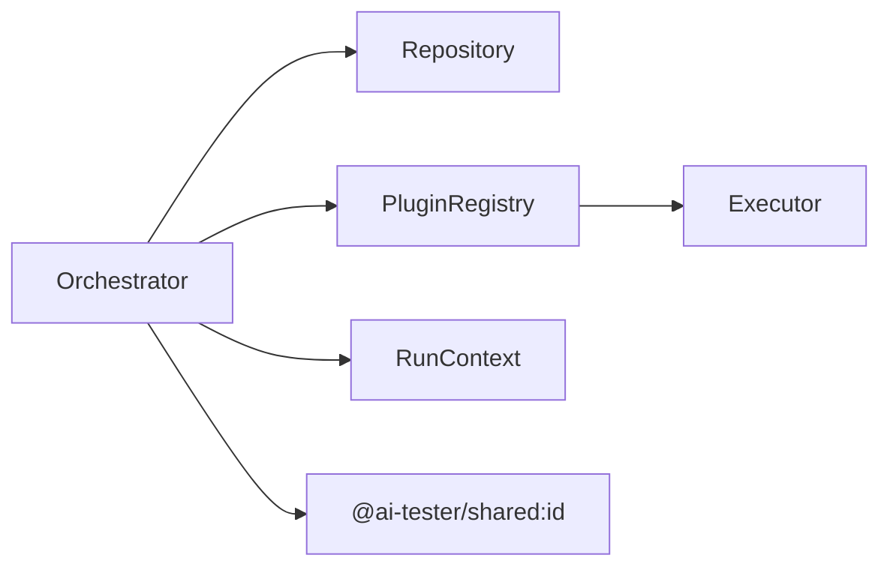

# 核心引擎架构

<cite>
**本文引用的文件**
- [packages/core/src/engine/orchestrator.ts](file://packages/core/src/engine/orchestrator.ts)
- [packages/core/src/engine/run-context.ts](file://packages/core/src/engine/run-context.ts)
- [packages/core/src/plugins/registry.ts](file://packages/core/src/plugins/registry.ts)
- [packages/core/src/plugins/executor.ts](file://packages/core/src/plugins/executor.ts)
- [packages/core/src/models/test-case.ts](file://packages/core/src/models/test-case.ts)
- [packages/core/src/models/test-suite.ts](file://packages/core/src/models/test-suite.ts)
- [packages/core/src/models/test-step.ts](file://packages/core/src/models/test-step.ts)
- [packages/core/src/models/test-run.ts](file://packages/core/src/models/test-run.ts)
- [packages/core/src/store/repository.ts](file://packages/core/src/store/repository.ts)
- [packages/plugin-api/src/index.ts](file://packages/plugin-api/src/index.ts)
- [packages/shared/src/index.ts](file://packages/shared/src/index.ts)
</cite>

## 目录
1. [引言](#引言)
2. [项目结构](#项目结构)
3. [核心组件](#核心组件)
4. [架构总览](#架构总览)
5. [详细组件分析](#详细组件分析)
6. [依赖关系分析](#依赖关系分析)
7. [性能考量](#性能考量)
8. [故障排查指南](#故障排查指南)
9. [结论](#结论)
10. [附录](#附录)

## 引言
本文件面向核心引擎模块，系统性阐述测试执行编排器（Orchestrator）的设计与执行流程，覆盖测试套件、测试用例与步骤三个层级的编排逻辑；同时深入解析运行上下文（RunContext）的状态管理、变量解析与生命周期；并详述插件注册表（PluginRegistry）的架构与执行器模式实现。文档包含执行流程图、状态转换图与组件交互序列图，并解释并发执行、错误处理与重试机制的设计原理。

## 项目结构
核心引擎位于 packages/core 包中，围绕“编排器-上下文-插件”三层展开：
- engine：编排器与运行上下文
- plugins：插件注册表与执行器接口
- models：测试域模型（套件、用例、步骤、运行结果）
- store：仓库接口契约（用于持久化与结果写入）

图表来源
- [packages/core/src/engine/orchestrator.ts:1-296](file://packages/core/src/engine/orchestrator.ts#L1-L296)
- [packages/core/src/engine/run-context.ts:1-80](file://packages/core/src/engine/run-context.ts#L1-L80)
- [packages/core/src/plugins/registry.ts:1-29](file://packages/core/src/plugins/registry.ts#L1-L29)
- [packages/core/src/plugins/executor.ts:1-23](file://packages/core/src/plugins/executor.ts#L1-L23)
- [packages/core/src/models/test-suite.ts:1-44](file://packages/core/src/models/test-suite.ts#L1-L44)
- [packages/core/src/models/test-case.ts:1-46](file://packages/core/src/models/test-case.ts#L1-L46)
- [packages/core/src/models/test-step.ts:1-102](file://packages/core/src/models/test-step.ts#L1-L102)
- [packages/core/src/models/test-run.ts:1-118](file://packages/core/src/models/test-run.ts#L1-L118)
- [packages/core/src/store/repository.ts:1-96](file://packages/core/src/store/repository.ts#L1-L96)

章节来源
- [packages/core/src/engine/index.ts:1-3](file://packages/core/src/engine/index.ts#L1-L3)

## 核心组件
- 编排器（Orchestrator）：负责测试运行的全生命周期编排，包括环境解析、变量合并、套件/用例/步骤执行、事件发射、结果落盘与状态更新。
- 运行上下文（RunContext）：提供变量存储与模板解析能力，承载当前运行的环境信息与事件总线。
- 插件注册表（PluginRegistry）：集中管理执行器（Executor），提供注册、查询与类型列表能力。
- 执行器（Executor）：统一的步骤执行接口，支持 setup/teardown 生命周期钩子与类型校验。

章节来源
- [packages/core/src/engine/orchestrator.ts:17-296](file://packages/core/src/engine/orchestrator.ts#L17-L296)
- [packages/core/src/engine/run-context.ts:11-80](file://packages/core/src/engine/run-context.ts#L11-L80)
- [packages/core/src/plugins/registry.ts:3-29](file://packages/core/src/plugins/registry.ts#L3-L29)
- [packages/core/src/plugins/executor.ts:15-23](file://packages/core/src/plugins/executor.ts#L15-L23)

## 架构总览
核心引擎采用“编排器驱动、上下文贯穿、插件扩展”的分层架构。编排器通过仓库接口读取模型数据，借助运行上下文进行变量解析与事件通知，使用插件注册表按步骤类型调度具体执行器完成实际工作。

图表来源
- [packages/core/src/engine/orchestrator.ts:8-15](file://packages/core/src/engine/orchestrator.ts#L8-L15)
- [packages/core/src/engine/run-context.ts:1-3](file://packages/core/src/engine/run-context.ts#L1-L3)
- [packages/core/src/plugins/registry.ts:1-29](file://packages/core/src/plugins/registry.ts#L1-L29)
- [packages/core/src/plugins/executor.ts:1-23](file://packages/core/src/plugins/executor.ts#L1-L23)
- [packages/core/src/models/test-suite.ts:1-44](file://packages/core/src/models/test-suite.ts#L1-L44)
- [packages/core/src/models/test-case.ts:1-46](file://packages/core/src/models/test-case.ts#L1-L46)
- [packages/core/src/models/test-step.ts:1-102](file://packages/core/src/models/test-step.ts#L1-L102)
- [packages/core/src/models/test-run.ts:1-118](file://packages/core/src/models/test-run.ts#L1-L118)
- [packages/core/src/store/repository.ts:1-96](file://packages/core/src/store/repository.ts#L1-L96)

## 详细组件分析

### 编排器（Orchestrator）设计与执行流程
- 输入与初始化
  - 接收套件 ID、环境名与可选变量、触发来源。
  - 解析项目环境配置，合并环境、套件与运行级变量。
  - 创建测试运行记录并置为运行中，构建运行上下文。
- 套件执行
  - 可选执行 setup 用例。
  - 遍历套件中的用例 ID，逐个执行步骤，统计用例级通过/失败步数并落盘。
  - 可选执行 teardown 用例。
  - 更新运行状态与统计信息，发射运行完成事件。
- 步骤执行（executeCaseSteps）
  - 递归深度限制防止环调用。
  - 支持五种步骤类型：
    - call：递归执行另一个用例，失败时根据 continueOnFailure 决定是否中断后续步骤。
    - load-dataset：加载数据集到变量，失败时同样受 continueOnFailure 控制。
    - http/assertion/extract 等：通过 PluginRegistry 按类型获取执行器，执行并支持重试。
  - 每步执行后生成测试步骤结果并落盘，同时发射 step:start/step:complete 事件。
- 错误处理与重试
  - 单步最多重试 retryCount+1 次，若仍失败则标记 error 并按 continueOnFailure 决定是否中断。
  - 运行期异常捕获并更新运行状态为 error，最终抛出。

图表来源
- [packages/core/src/engine/orchestrator.ts:25-140](file://packages/core/src/engine/orchestrator.ts#L25-L140)
- [packages/core/src/engine/orchestrator.ts:142-294](file://packages/core/src/engine/orchestrator.ts#L142-L294)
- [packages/core/src/engine/run-context.ts:11-33](file://packages/core/src/engine/run-context.ts#L11-L33)
- [packages/core/src/store/repository.ts:55-87](file://packages/core/src/store/repository.ts#L55-L87)

图表来源
- [packages/core/src/engine/orchestrator.ts:142-294](file://packages/core/src/engine/orchestrator.ts#L142-L294)

章节来源
- [packages/core/src/engine/orchestrator.ts:17-296](file://packages/core/src/engine/orchestrator.ts#L17-L296)

### 运行上下文（RunContext）状态管理与变量解析
- 状态与生命周期
  - 保存运行 ID、环境配置与初始变量映射。
  - 提供事件发射器，用于 step:start/step:complete/case:start/case:complete/run:complete 等事件。
  - 维护最近一次响应对象，便于断言与提取使用。
- 变量解析
  - 支持模板字符串 {{path.to.value}} 的解析，路径可包含点号与数组索引。
  - 支持深拷贝解析（对象/数组/字符串）。
  - 变量优先级：环境变量 → 套件变量 → 运行变量 → 上下文预设（如 baseUrl）。
- 生命周期
  - 在运行开始时创建，贯穿整个运行周期，逐步注入变量并产出中间结果。

图表来源
- [packages/core/src/engine/run-context.ts:11-80](file://packages/core/src/engine/run-context.ts#L11-L80)

章节来源
- [packages/core/src/engine/run-context.ts:11-80](file://packages/core/src/engine/run-context.ts#L11-L80)

### 插件注册表（PluginRegistry）与执行器模式
- 注册表职责
  - 维护类型到执行器实例的映射。
  - 提供注册、查询与类型列表能力；查询不存在时抛出明确错误。
- 执行器接口
  - 统一的 type 与 configSchema 定义。
  - 必需方法：execute(step, context)；可选钩子：setup/teardown。
- 插件装配
  - 通过 registerApiPlugins 将 HTTP、断言、提取等执行器批量注册到注册表。

图表来源
- [packages/core/src/plugins/registry.ts:3-29](file://packages/core/src/plugins/registry.ts#L3-L29)
- [packages/core/src/plugins/executor.ts:15-23](file://packages/core/src/plugins/executor.ts#L15-L23)

章节来源
- [packages/core/src/plugins/registry.ts:3-29](file://packages/core/src/plugins/registry.ts#L3-L29)
- [packages/core/src/plugins/executor.ts:15-23](file://packages/core/src/plugins/executor.ts#L15-L23)
- [packages/plugin-api/src/index.ts:10-14](file://packages/plugin-api/src/index.ts#L10-L14)

### 测试域模型与数据流
- 测试套件（TestSuite）
  - 包含用例 ID 列表、并行度、环境与变量、setup/teardown 用例 ID。
- 测试用例（TestCase）
  - 包含名称、模块、标签、优先级、步骤数组与变量。
- 测试步骤（TestStep）
  - 类型枚举：http、assertion、extract、call、load-dataset。
  - 共同字段：order、continueOnFailure、retryCount。
  - 各类型配置由对应 Schema 校验。
- 测试运行（TestRun）与结果
  - 运行状态、环境、变量、用例结果与步骤结果。
  - 步骤结果包含请求/响应、断言、提取变量、错误与耗时。

图表来源
- [packages/core/src/models/test-suite.ts:3-16](file://packages/core/src/models/test-suite.ts#L3-L16)
- [packages/core/src/models/test-case.ts:7-21](file://packages/core/src/models/test-case.ts#L7-L21)
- [packages/core/src/models/test-step.ts:74-82](file://packages/core/src/models/test-step.ts#L74-L82)
- [packages/core/src/models/test-run.ts:88-103](file://packages/core/src/models/test-run.ts#L88-L103)

章节来源
- [packages/core/src/models/test-suite.ts:1-44](file://packages/core/src/models/test-suite.ts#L1-L44)
- [packages/core/src/models/test-case.ts:1-46](file://packages/core/src/models/test-case.ts#L1-L46)
- [packages/core/src/models/test-step.ts:1-102](file://packages/core/src/models/test-step.ts#L1-L102)
- [packages/core/src/models/test-run.ts:1-118](file://packages/core/src/models/test-run.ts#L1-L118)

### 并发执行、错误处理与重试机制
- 并发策略
  - 套件维度的并行度由 TestSuite.parallelism 指定；当前编排器实现为顺序执行用例，可在上层或扩展层引入并发队列以利用该参数。
- 错误处理
  - 单步错误：记录 error 状态与堆栈，按 continueOnFailure 决定是否中断。
  - 运行级错误：捕获异常并将运行状态置为 error，随后抛出。
- 重试机制
  - 单步最多重试 retryCount+1 次；仅当状态为 passed 时停止重试。
  - 重试期间保留最后一次执行结果，确保落盘与事件通知一致。

章节来源
- [packages/core/src/engine/orchestrator.ts:242-266](file://packages/core/src/engine/orchestrator.ts#L242-L266)
- [packages/core/src/engine/orchestrator.ts:133-139](file://packages/core/src/engine/orchestrator.ts#L133-L139)

## 依赖关系分析
- 编排器依赖
  - 仓库接口：读取/写入套件、用例、运行、数据集与项目信息。
  - 插件注册表：按步骤类型动态调度执行器。
  - 运行上下文：变量解析与事件通知。
- 执行器依赖
  - 通过 configSchema 对配置进行类型校验，确保执行安全。
  - 可选 setup/teardown 钩子用于环境准备与清理。
- 工具与共享
  - 使用共享包的 ID 生成工具，保证唯一标识。

图表来源
- [packages/core/src/engine/orchestrator.ts:1-7](file://packages/core/src/engine/orchestrator.ts#L1-L7)
- [packages/shared/src/index.ts:3-4](file://packages/shared/src/index.ts#L3-L4)

章节来源
- [packages/core/src/engine/orchestrator.ts:8-15](file://packages/core/src/engine/orchestrator.ts#L8-L15)
- [packages/core/src/store/repository.ts:1-96](file://packages/core/src/store/repository.ts#L1-L96)
- [packages/shared/src/index.ts:1-4](file://packages/shared/src/index.ts#L1-L4)

## 性能考量
- 事件发射开销
  - 频繁的 step:start/complete 与 case:start/complete 事件可能带来额外开销，建议在高吞吐场景下评估事件频率或采用批量化上报。
- 重试与网络延迟
  - 重试次数与超时设置应结合外部服务 SLA 调整，避免过度重试导致整体运行时间膨胀。
- 数据落盘与查询
  - 步骤结果与用例统计频繁写入，建议在存储层启用批量写入与索引优化。
- 递归深度控制
  - 当前已内置最大递归深度保护，避免环调用导致栈溢出。

## 故障排查指南
- 常见问题定位
  - “未找到执行器类型”：检查插件是否正确注册，或确认步骤类型拼写。
  - “超过最大调用深度”：检查是否存在 call 步骤的循环引用。
  - “运行状态为 error”：查看运行记录的 finishedAt 与错误信息，定位首个失败步骤。
- 建议排查步骤
  - 核对 TestSuite.parallelism 与实际执行顺序（当前为顺序）。
  - 检查 RunContext 中变量解析是否正确，尤其是嵌套路径与数组索引。
  - 关注 continueOnFailure 与 retryCount 的组合对结果的影响。
- 相关实现参考
  - 执行器查询与错误提示、单步重试与失败中断、运行状态更新与异常捕获。

章节来源
- [packages/core/src/plugins/registry.ts:17-23](file://packages/core/src/plugins/registry.ts#L17-L23)
- [packages/core/src/engine/orchestrator.ts:147-149](file://packages/core/src/engine/orchestrator.ts#L147-L149)
- [packages/core/src/engine/orchestrator.ts:242-291](file://packages/core/src/engine/orchestrator.ts#L242-L291)
- [packages/core/src/engine/orchestrator.ts:133-139](file://packages/core/src/engine/orchestrator.ts#L133-L139)

## 结论
核心引擎通过编排器、运行上下文与插件注册表三者协作，实现了从测试套件到测试步骤的清晰分层与可扩展执行。变量解析与事件机制提升了可观测性与可维护性；执行器模式与类型校验保障了扩展的安全性。当前实现以顺序执行为主，未来可基于 TestSuite.parallelism 参数引入并发队列以提升吞吐。

## 附录
- 插件装配示例
  - 通过 registerApiPlugins 将 HTTP、断言、提取执行器注册至注册表，便于编排器按类型调度。
- 共享工具
  - 使用共享包的 ID 生成工具，确保跨模块一致性。

章节来源
- [packages/plugin-api/src/index.ts:10-14](file://packages/plugin-api/src/index.ts#L10-L14)
- [packages/shared/src/index.ts:3-4](file://packages/shared/src/index.ts#L3-L4)