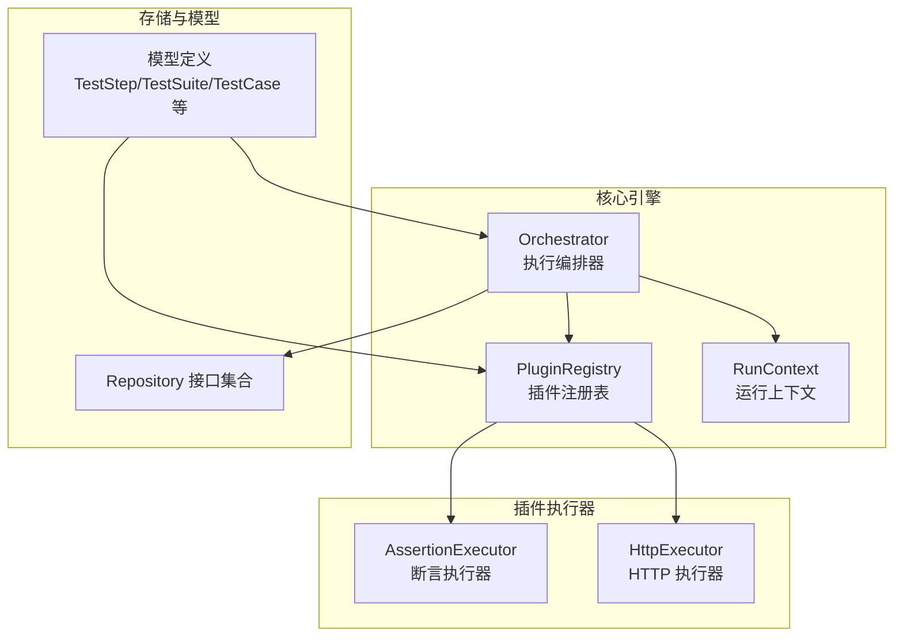
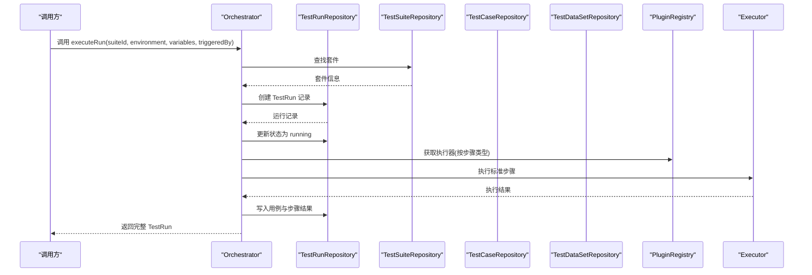
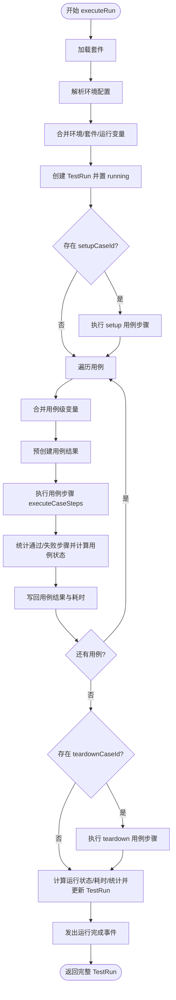
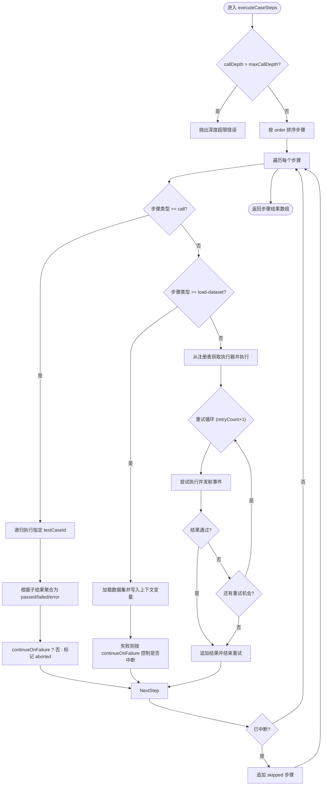
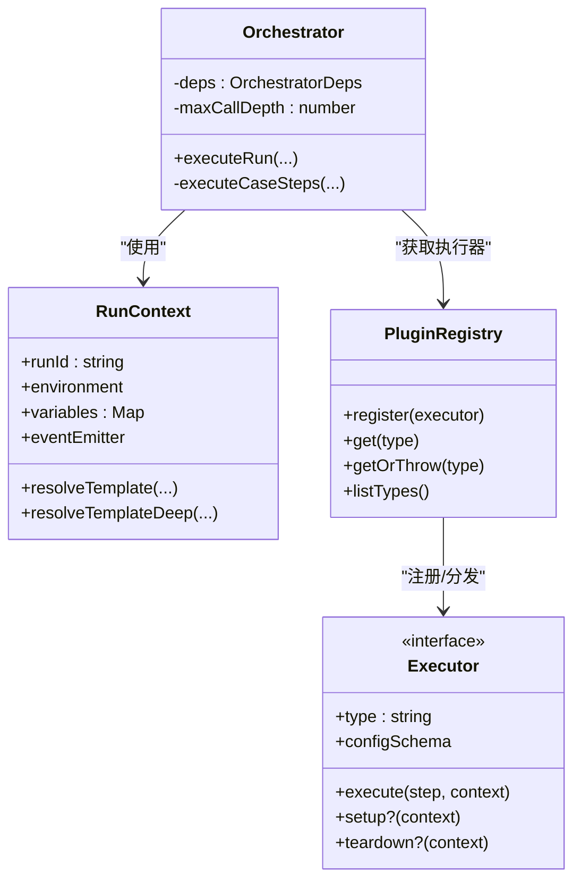

# 测试执行编排器

<cite>
**本文引用的文件**
- [packages/core/src/engine/orchestrator.ts](file://packages/core/src/engine/orchestrator.ts)
- [packages/core/src/engine/run-context.ts](file://packages/core/src/engine/run-context.ts)
- [packages/core/src/plugins/registry.ts](file://packages/core/src/plugins/registry.ts)
- [packages/core/src/plugins/executor.ts](file://packages/core/src/plugins/executor.ts)
- [packages/core/src/plugins/http-executor.ts](file://packages/plugin-api/src/http-executor.ts)
- [packages/core/src/plugins/assertions.ts](file://packages/plugin-api/src/assertions.ts)
- [packages/core/src/store/repository.ts](file://packages/core/src/store/repository.ts)
- [packages/core/src/models/test-step.ts](file://packages/core/src/models/test-step.ts)
- [packages/core/src/models/test-case.ts](file://packages/core/src/models/test-case.ts)
</cite>

## 目录
1. [简介](#简介)
2. [项目结构](#项目结构)
3. [核心组件](#核心组件)
4. [架构总览](#架构总览)
5. [详细组件分析](#详细组件分析)
6. [依赖关系分析](#依赖关系分析)
7. [性能考量](#性能考量)
8. [故障排查指南](#故障排查指南)
9. [结论](#结论)
10. [附录：使用模式与示例路径](#附录使用模式与示例路径)

## 简介
本文件面向“测试执行编排器”的技术文档，聚焦 Orchestrator 类的设计与实现，系统阐述测试运行创建、环境变量合并、测试套件执行流程与状态管理机制；并深入解析 executeRun 方法的完整执行流程（套件设置、用例遍历、步骤执行与清理阶段），executeCaseSteps 的递归执行机制、call 步骤类型处理与数据集加载功能，以及错误处理策略、重试机制与中断控制逻辑。文档同时提供执行流程图、状态转换图与调用深度限制机制说明，并给出可直接定位到源码的路径示例。

## 项目结构
本项目采用多包工作区组织，测试执行编排器位于 core 包中，插件体系与执行器位于 plugin-api 包，模型与存储仓库接口位于 core 包内。整体结构围绕“编排器-上下文-插件注册表-执行器-存储仓库”展开。

图表来源
- [packages/core/src/engine/orchestrator.ts:17-296](file://packages/core/src/engine/orchestrator.ts#L17-L296)
- [packages/core/src/engine/run-context.ts:11-80](file://packages/core/src/engine/run-context.ts#L11-L80)
- [packages/core/src/plugins/registry.ts:3-29](file://packages/core/src/plugins/registry.ts#L3-L29)
- [packages/plugin-api/src/http-executor.ts:7-95](file://packages/plugin-api/src/http-executor.ts#L7-L95)
- [packages/plugin-api/src/assertions.ts:7-112](file://packages/plugin-api/src/assertions.ts#L7-L112)
- [packages/core/src/store/repository.ts:1-96](file://packages/core/src/store/repository.ts#L1-L96)
- [packages/core/src/models/test-step.ts:1-102](file://packages/core/src/models/test-step.ts#L1-L102)
- [packages/core/src/models/test-case.ts:1-46](file://packages/core/src/models/test-case.ts#L1-L46)

章节来源
- [packages/core/src/engine/orchestrator.ts:1-296](file://packages/core/src/engine/orchestrator.ts#L1-L296)
- [packages/core/src/engine/run-context.ts:1-80](file://packages/core/src/engine/run-context.ts#L1-L80)
- [packages/core/src/plugins/registry.ts:1-29](file://packages/core/src/plugins/registry.ts#L1-L29)
- [packages/core/src/plugins/executor.ts:1-23](file://packages/core/src/plugins/executor.ts#L1-L23)
- [packages/plugin-api/src/http-executor.ts:1-95](file://packages/plugin-api/src/http-executor.ts#L1-L95)
- [packages/plugin-api/src/assertions.ts:1-112](file://packages/plugin-api/src/assertions.ts#L1-L112)
- [packages/core/src/store/repository.ts:1-96](file://packages/core/src/store/repository.ts#L1-L96)
- [packages/core/src/models/test-step.ts:1-102](file://packages/core/src/models/test-step.ts#L1-L102)
- [packages/core/src/models/test-case.ts:1-46](file://packages/core/src/models/test-case.ts#L1-L46)

## 核心组件
- Orchestrator：测试执行编排器，负责测试运行创建、环境变量合并、用例遍历与结果汇总、状态更新与事件通知。
- RunContext：运行上下文，维护运行时环境、变量映射与模板解析能力，并承载最近一次响应供断言/提取使用。
- PluginRegistry：插件注册表，按类型分发执行器，提供获取与校验可用执行器的能力。
- Executor 接口：统一的步骤执行抽象，定义执行结果结构与可选的 setup/teardown 生命周期钩子。
- 存储仓库接口：对项目、套件、用例、运行、数据集等进行持久化操作，支撑运行状态与结果写入。
- 模型定义：TestStep/TestSuite/TestCase/TestRun/TestDataSet 等，约束步骤类型、配置与字段。

章节来源
- [packages/core/src/engine/orchestrator.ts:8-23](file://packages/core/src/engine/orchestrator.ts#L8-L23)
- [packages/core/src/engine/run-context.ts:11-80](file://packages/core/src/engine/run-context.ts#L11-L80)
- [packages/core/src/plugins/registry.ts:3-29](file://packages/core/src/plugins/registry.ts#L3-L29)
- [packages/core/src/plugins/executor.ts:15-23](file://packages/core/src/plugins/executor.ts#L15-L23)
- [packages/core/src/store/repository.ts:55-87](file://packages/core/src/store/repository.ts#L55-L87)
- [packages/core/src/models/test-step.ts:74-102](file://packages/core/src/models/test-step.ts#L74-L102)
- [packages/core/src/models/test-case.ts:7-46](file://packages/core/src/models/test-case.ts#L7-L46)

## 架构总览
编排器通过读取项目与套件信息，合并环境变量与运行级变量，创建测试运行记录并置为运行态；随后依次执行套件设置用例、各用例步骤（含递归调用与数据集加载）、套件清理用例；期间通过事件发射器对外广播阶段事件；最终汇总用例与运行级统计并更新状态。

图表来源
- [packages/core/src/engine/orchestrator.ts:25-140](file://packages/core/src/engine/orchestrator.ts#L25-L140)
- [packages/core/src/plugins/registry.ts:13-23](file://packages/core/src/plugins/registry.ts#L13-L23)
- [packages/core/src/plugins/executor.ts:15-22](file://packages/core/src/plugins/executor.ts#L15-L22)
- [packages/core/src/store/repository.ts:55-87](file://packages/core/src/store/repository.ts#L55-L87)

## 详细组件分析

### Orchestrator 类设计与职责
- 依赖注入：接收 PluginRegistry、各类 Repository 与 RunContext。
- 最大调用深度：内置 maxCallDepth 用于防止递归调用导致的无限循环。
- 环境变量合并：按 environment -> suite -> run-level 顺序合并，确保运行时变量覆盖优先级。
- 流程控制：支持 suite.setupCaseId 与 suite.teardownCaseId 的前置/后置执行。
- 结果聚合：逐用例计算 passed/failed 步数，汇总到 TestRun 统计字段。

章节来源
- [packages/core/src/engine/orchestrator.ts:17-23](file://packages/core/src/engine/orchestrator.ts#L17-L23)
- [packages/core/src/engine/orchestrator.ts:25-140](file://packages/core/src/engine/orchestrator.ts#L25-L140)

### executeRun 完整执行流程
- 输入参数：suiteId、environment、variables（可选）、triggeredBy（可选）。
- 环境解析：从项目中查找匹配的环境配置，若不存在则以传入 environment 作为名称并构造默认空变量。
- 变量合并：按环境变量、套件变量、运行变量的顺序合并，形成最终运行时变量集。
- 运行记录创建：创建 TestRun 并置为 running。
- 套件设置：若存在 setupCaseId，则先执行该用例的所有步骤。
- 用例遍历：对 suite.testCaseIds 逐一执行，每条用例：
  - 合并用例级变量（仅在上下文中未存在时加入）。
  - 预创建用例结果并写入总步数、开始时间等。
  - 执行用例步骤（executeCaseSteps），收集步骤结果。
  - 计算用例状态（失败数>0 则失败），写回用例结果与耗时。
  - 发出用例开始/完成事件。
- 套件清理：若存在 teardownCaseId，则在所有用例结束后执行。
- 运行收尾：计算最终状态、总耗时、用例总数与通过/失败数，更新 TestRun 并发出运行完成事件。
- 异常处理：捕获异常后将运行状态置为 error 并抛出。

图表来源
- [packages/core/src/engine/orchestrator.ts:25-140](file://packages/core/src/engine/orchestrator.ts#L25-L140)

章节来源
- [packages/core/src/engine/orchestrator.ts:25-140](file://packages/core/src/engine/orchestrator.ts#L25-L140)

### executeCaseSteps 递归执行机制与步骤处理
- 调用深度限制：超过 maxCallDepth 抛错，避免循环调用。
- 步骤排序：按 order 升序执行。
- 中断控制：当某一步失败且 continueOnFailure=false 时，标记 aborted=true，后续步骤均标记为 skipped。
- call 步骤：递归执行指定 testCaseId 的步骤序列，将子结果的失败情况映射为当前 call 步骤的失败或通过；若子执行抛错，也视为 error。
- load-dataset 步骤：按 datasetId 加载数据集，将 rows 写入上下文变量名；成功时记录提取信息，失败时写入错误并按 continueOnFailure 控制是否中断。
- 标准步骤：按步骤类型从 PluginRegistry 获取对应 Executor，执行并支持重试（retryCount+1 次）；每次执行前后发射 step:start/step:complete 事件；将执行结果转换为 TestStepResult 并追加到结果数组。

图表来源
- [packages/core/src/engine/orchestrator.ts:142-294](file://packages/core/src/engine/orchestrator.ts#L142-L294)

章节来源
- [packages/core/src/engine/orchestrator.ts:142-294](file://packages/core/src/engine/orchestrator.ts#L142-L294)

### 错误处理策略、重试机制与中断控制
- 错误处理：
  - call 步骤：子执行异常时记录 error 并按 continueOnFailure 控制是否中断。
  - load-dataset 步骤：数据集不存在或读取异常时记录 error 并按 continueOnFailure 控制是否中断。
  - 标准步骤：执行器抛错或断言失败时分别记录 error 或 failed，并按 continueOnFailure 控制是否中断。
- 重试机制：每个标准步骤最多重试 retryCount+1 次；只有当最后一次尝试仍失败时才计入失败。
- 中断控制：一旦出现 failed/error 且 continueOnFailure=false，立即标记 aborted，后续步骤全部跳过。

章节来源
- [packages/core/src/engine/orchestrator.ts:172-203](file://packages/core/src/engine/orchestrator.ts#L172-L203)
- [packages/core/src/engine/orchestrator.ts:205-237](file://packages/core/src/engine/orchestrator.ts#L205-L237)
- [packages/core/src/engine/orchestrator.ts:242-291](file://packages/core/src/engine/orchestrator.ts#L242-L291)

### 状态管理与事件流
- 运行状态：TestRun 在创建后置为 running，异常时置为 error，最终根据用例失败数计算 passed/failed。
- 用例状态：按失败步骤数判定，写回用例结果与耗时。
- 事件发射：run:complete、case:start/case:complete、step:start/step:complete，便于外部监听与扩展。

章节来源
- [packages/core/src/engine/orchestrator.ts:45-46](file://packages/core/src/engine/orchestrator.ts#L45-L46)
- [packages/core/src/engine/orchestrator.ts:83-109](file://packages/core/src/engine/orchestrator.ts#L83-L109)
- [packages/core/src/engine/orchestrator.ts:129-139](file://packages/core/src/engine/orchestrator.ts#L129-L139)

### 插件执行器与模板解析
- 插件注册表：按类型注册与获取执行器，缺失类型时抛错并提示可用类型列表。
- 执行器接口：统一返回 StepExecutionResult，包含请求/响应/断言/提取/错误等字段。
- 模板解析：RunContext 支持 {{var.path}} 语法的模板解析，深层对象与数组索引访问，用于 URL、Header、Body 等动态替换。

章节来源
- [packages/core/src/plugins/registry.ts:3-29](file://packages/core/src/plugins/registry.ts#L3-L29)
- [packages/core/src/plugins/executor.ts:5-22](file://packages/core/src/plugins/executor.ts#L5-L22)
- [packages/core/src/engine/run-context.ts:35-78](file://packages/core/src/engine/run-context.ts#L35-L78)

### 具体执行器示例
- HTTP 执行器：解析配置、模板替换、超时控制、响应体解析、上下文保存 lastResponse 供断言/提取使用。
- 断言执行器：支持 status/header/body/jsonpath/variable 多源断言，内置多种比较运算符与类型检查。

章节来源
- [packages/plugin-api/src/http-executor.ts:11-95](file://packages/plugin-api/src/http-executor.ts#L11-L95)
- [packages/plugin-api/src/assertions.ts:11-112](file://packages/plugin-api/src/assertions.ts#L11-L112)

## 依赖关系分析
- 编排器依赖：
  - TestSuiteRepository、TestCaseRepository、TestRunRepository、TestDataSetRepository、ProjectRepository：用于读取/写入运行元数据与结果。
  - PluginRegistry：按步骤类型分发执行器。
  - RunContext：提供变量与模板解析能力。
- 执行器依赖：
  - RunContext：读取环境变量、上次响应、写入提取变量。
  - 模型定义：验证配置 Schema。

图表来源
- [packages/core/src/engine/orchestrator.ts:17-23](file://packages/core/src/engine/orchestrator.ts#L17-L23)
- [packages/core/src/engine/run-context.ts:11-33](file://packages/core/src/engine/run-context.ts#L11-L33)
- [packages/core/src/plugins/registry.ts:3-29](file://packages/core/src/plugins/registry.ts#L3-L29)
- [packages/core/src/plugins/executor.ts:15-22](file://packages/core/src/plugins/executor.ts#L15-L22)

章节来源
- [packages/core/src/engine/orchestrator.ts:1-23](file://packages/core/src/engine/orchestrator.ts#L1-L23)
- [packages/core/src/engine/run-context.ts:1-33](file://packages/core/src/engine/run-context.ts#L1-L33)
- [packages/core/src/plugins/registry.ts:1-29](file://packages/core/src/plugins/registry.ts#L1-L29)
- [packages/core/src/plugins/executor.ts:1-22](file://packages/core/src/plugins/executor.ts#L1-L22)

## 性能考量
- 步骤排序与顺序执行：按 order 排序，保证确定性；建议合理拆分用例，减少单用例步骤数量。
- 重试策略：retryCount+1 次尝试，避免瞬时失败影响整体稳定性；建议对网络类步骤适当配置 retryCount。
- 模板解析：模板替换发生在执行前，避免在热路径重复解析；建议将静态值固化，减少动态模板使用。
- 数据集加载：load-dataset 将整表 rows 注入上下文，注意内存占用；建议按需分页或在执行器侧做流式处理。
- 事件发射：事件回调可能带来额外开销，建议在生产环境谨慎订阅高频事件。

## 故障排查指南
- “套件未找到”：检查 suiteId 是否正确，确认 TestSuiteRepository 返回非空。
- “数据集未找到”：检查 datasetId 与 variableName 配置，确认 TestDataSetRepository 返回非空。
- “执行器类型未注册”：检查 PluginRegistry.register 是否被调用，或执行器类型拼写是否一致。
- “调用深度超限”：检查是否存在 call 步骤的循环引用，调整 maxCallDepth 或重构用例。
- “运行状态异常”：确认 TestRunRepository 的 create/update 流程，检查异常分支是否将状态置为 error。

章节来源
- [packages/core/src/engine/orchestrator.ts:26-32](file://packages/core/src/engine/orchestrator.ts#L26-L32)
- [packages/core/src/engine/orchestrator.ts:210-212](file://packages/core/src/engine/orchestrator.ts#L210-L212)
- [packages/core/src/plugins/registry.ts:17-23](file://packages/core/src/plugins/registry.ts#L17-L23)
- [packages/core/src/engine/orchestrator.ts:147-149](file://packages/core/src/engine/orchestrator.ts#L147-L149)
- [packages/core/src/engine/orchestrator.ts:133-139](file://packages/core/src/engine/orchestrator.ts#L133-L139)

## 结论
Orchestrator 通过清晰的职责划分与严格的执行流程控制，实现了可扩展、可观测、可恢复的测试执行编排。其基于插件的执行器体系与模板解析能力，使得测试步骤具备高度灵活性；结合重试、中断与深度限制机制，有效提升了执行的鲁棒性。建议在实际使用中关注变量合并优先级、数据集大小与事件监听频率，以获得更优的执行体验。

## 附录：使用模式与示例路径
- 创建并启动一次测试运行
  - 示例路径：[executeRun 调用入口:25-140](file://packages/core/src/engine/orchestrator.ts#L25-L140)
- 执行单个用例步骤序列（含递归与数据集）
  - 示例路径：[executeCaseSteps 主流程:142-294](file://packages/core/src/engine/orchestrator.ts#L142-L294)
- call 步骤类型处理
  - 示例路径：[call 步骤分支:172-203](file://packages/core/src/engine/orchestrator.ts#L172-L203)
- load-dataset 步骤类型处理
  - 示例路径：[load-dataset 步骤分支:205-237](file://packages/core/src/engine/orchestrator.ts#L205-L237)
- HTTP 执行器与模板解析
  - 示例路径：[HTTP 执行器 execute:11-95](file://packages/plugin-api/src/http-executor.ts#L11-L95)
- 断言执行器与表达式求值
  - 示例路径：[断言执行器 execute:11-40](file://packages/plugin-api/src/assertions.ts#L11-L40)
- 插件注册表与执行器获取
  - 示例路径：[PluginRegistry.getOrThrow:17-23](file://packages/core/src/plugins/registry.ts#L17-L23)
- RunContext 变量与模板解析
  - 示例路径：[RunContext.resolveTemplate:35-54](file://packages/core/src/engine/run-context.ts#L35-L54)