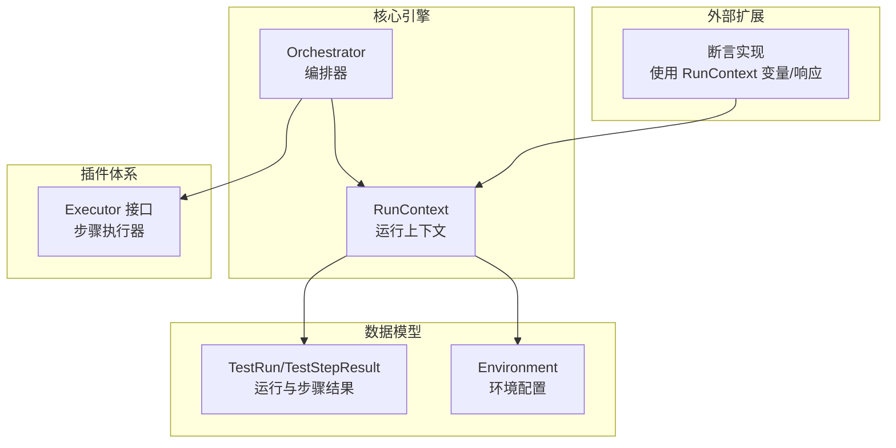
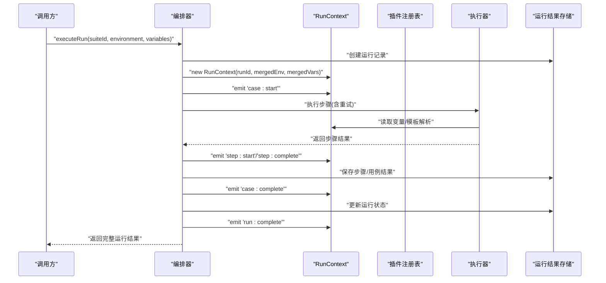
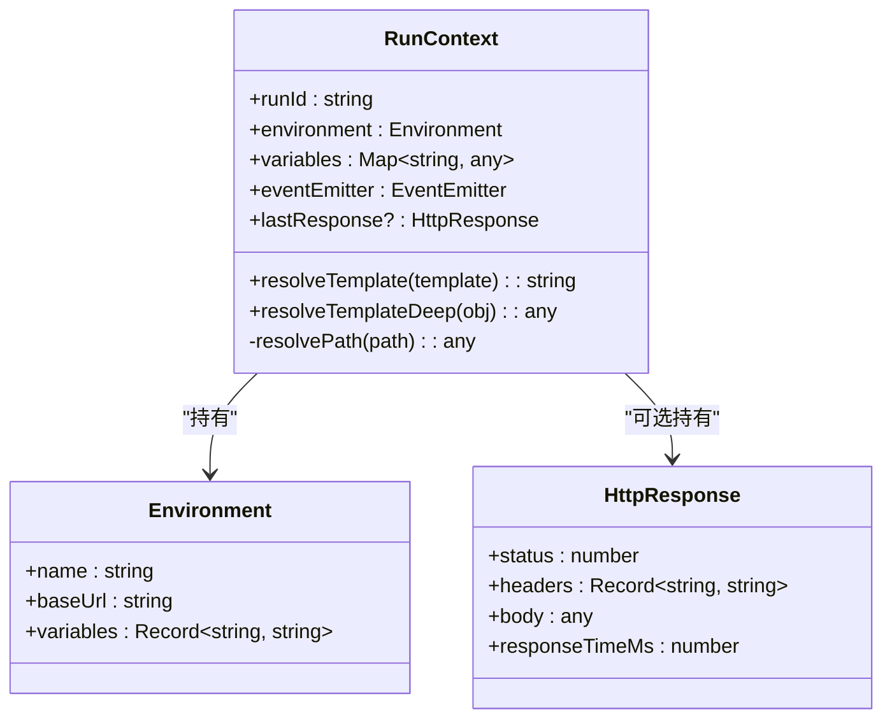
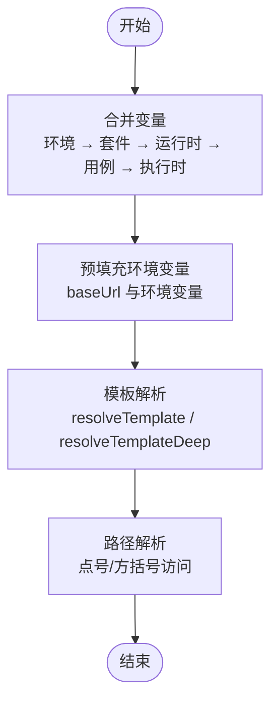
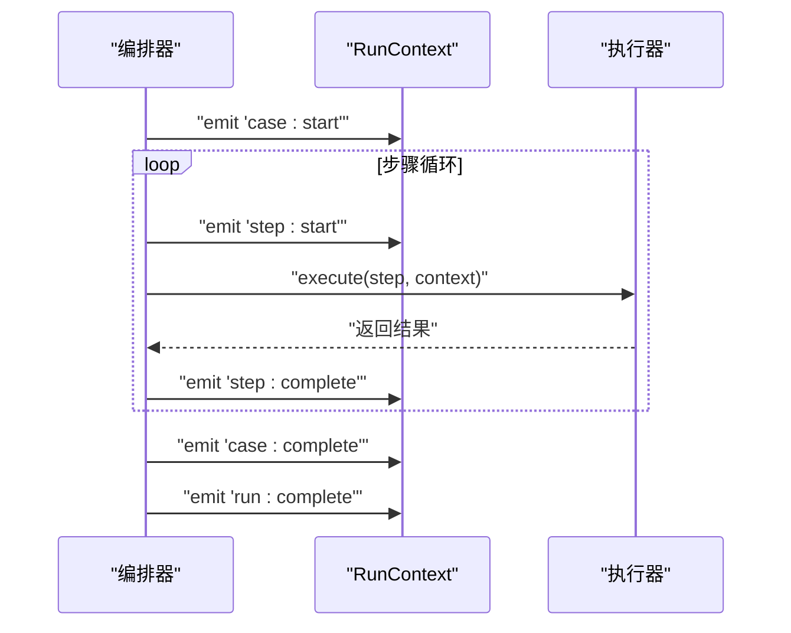
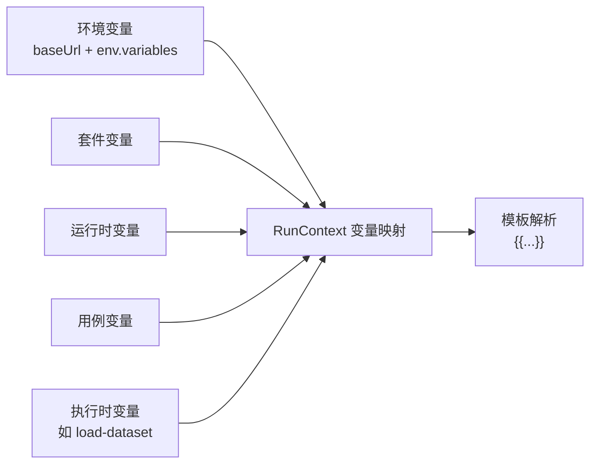
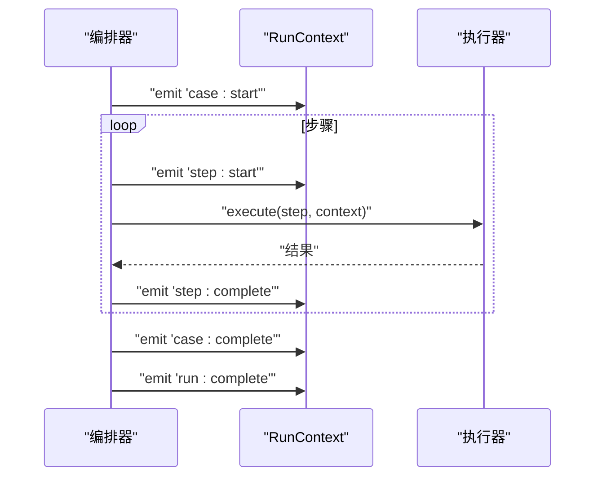
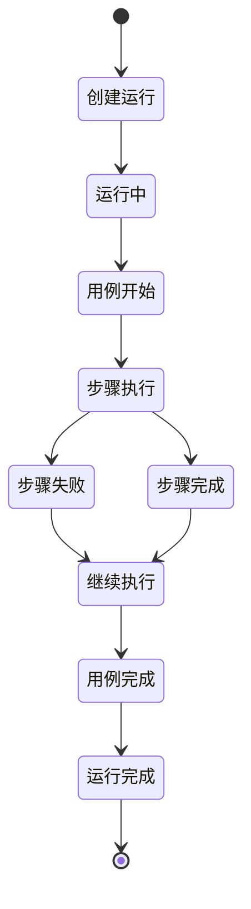
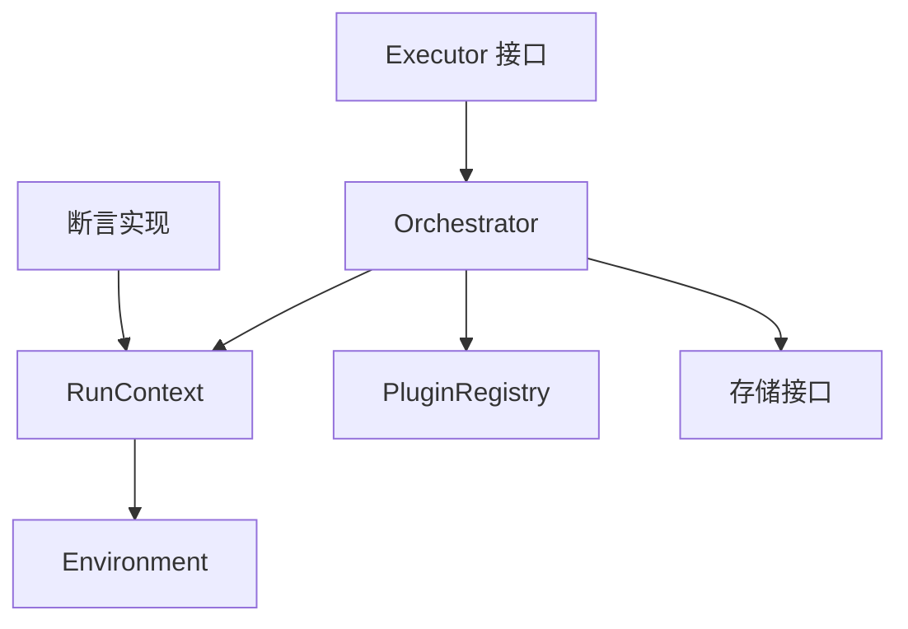

# 运行上下文管理

<cite>
**本文引用的文件**
- [packages/core/src/engine/run-context.ts](file://packages/core/src/engine/run-context.ts)
- [packages/core/src/engine/orchestrator.ts](file://packages/core/src/engine/orchestrator.ts)
- [packages/core/src/plugins/executor.ts](file://packages/core/src/plugins/executor.ts)
- [packages/core/src/models/test-run.ts](file://packages/core/src/models/test-run.ts)
- [packages/core/src/models/project.ts](file://packages/core/src/models/project.ts)
- [packages/plugin-api/src/assertions.ts](file://packages/plugin-api/src/assertions.ts)
</cite>

## 目录
1. [简介](#简介)
2. [项目结构](#项目结构)
3. [核心组件](#核心组件)
4. [架构总览](#架构总览)
5. [详细组件分析](#详细组件分析)
6. [依赖关系分析](#依赖关系分析)
7. [性能考量](#性能考量)
8. [故障排查指南](#故障排查指南)
9. [结论](#结论)
10. [附录](#附录)

## 简介
本技术文档围绕运行上下文管理系统展开，重点阐述 RunContext 类的设计目的、架构模式与运行机制，涵盖变量存储与解析、事件发射器集成、生命周期管理、变量解析优先级与合并策略、事件流与状态机、以及持久化与内存管理策略。文档同时提供变量作用域图、事件流图与状态机图，并给出变量解析示例与事件监听器实现模式，帮助读者快速理解并正确使用该系统。

## 项目结构
本系统位于多包工作区中，核心运行时逻辑集中在 core 包的 engine 与 plugins 子模块；测试运行结果的数据模型定义在 models 子模块；插件执行接口在 plugins 子模块；断言等扩展能力在 plugin-api 中使用 RunContext 的变量与响应信息。

图表来源
- [packages/core/src/engine/run-context.ts:11-33](file://packages/core/src/engine/run-context.ts#L11-L33)
- [packages/core/src/engine/orchestrator.ts:17-48](file://packages/core/src/engine/orchestrator.ts#L17-L48)
- [packages/core/src/plugins/executor.ts:15-22](file://packages/core/src/plugins/executor.ts#L15-L22)
- [packages/core/src/models/test-run.ts:88-110](file://packages/core/src/models/test-run.ts#L88-L110)
- [packages/core/src/models/project.ts:3-7](file://packages/core/src/models/project.ts#L3-L7)
- [packages/plugin-api/src/assertions.ts:42-64](file://packages/plugin-api/src/assertions.ts#L42-L64)

章节来源
- [packages/core/src/engine/run-context.ts:11-33](file://packages/core/src/engine/run-context.ts#L11-L33)
- [packages/core/src/engine/orchestrator.ts:25-48](file://packages/core/src/engine/orchestrator.ts#L25-L48)
- [packages/core/src/models/project.ts:3-7](file://packages/core/src/models/project.ts#L3-L7)
- [packages/core/src/models/test-run.ts:88-110](file://packages/core/src/models/test-run.ts#L88-L110)

## 核心组件
- RunContext：承载一次测试运行的运行时状态，包括运行 ID、环境配置、变量映射、事件发射器以及最近一次 HTTP 响应。它负责模板变量解析与路径解析，是插件执行与事件驱动的关键载体。
- Orchestrator：编排器，负责从项目环境与套件变量合并生成运行时变量，创建运行记录，驱动用例执行，发出生命周期事件，并持久化结果。
- Executor 接口：定义了步骤执行器的统一规范，接收 TestStep 与 RunContext，返回标准化的执行结果。
- 数据模型：TestRun、TestCaseResult、TestStepResult 定义了运行结果的结构；Environment 定义了环境配置与变量。
- 断言扩展：断言实现通过 RunContext 的变量与 lastResponse 获取断言源值，体现上下文对断言能力的支持。

章节来源
- [packages/core/src/engine/run-context.ts:11-33](file://packages/core/src/engine/run-context.ts#L11-L33)
- [packages/core/src/engine/orchestrator.ts:17-48](file://packages/core/src/engine/orchestrator.ts#L17-L48)
- [packages/core/src/plugins/executor.ts:15-22](file://packages/core/src/plugins/executor.ts#L15-L22)
- [packages/core/src/models/test-run.ts:88-110](file://packages/core/src/models/test-run.ts#L88-L110)
- [packages/core/src/models/project.ts:3-7](file://packages/core/src/models/project.ts#L3-L7)
- [packages/plugin-api/src/assertions.ts:42-64](file://packages/plugin-api/src/assertions.ts#L42-L64)

## 架构总览
运行上下文管理采用“编排器 + 上下文 + 插件执行器”的分层架构。编排器负责变量合并、运行生命周期管理与事件发射；RunContext 提供变量解析与事件通道；Executor 负责具体步骤的执行；数据模型用于持久化运行结果。

图表来源
- [packages/core/src/engine/orchestrator.ts:25-139](file://packages/core/src/engine/orchestrator.ts#L25-L139)
- [packages/core/src/engine/run-context.ts:11-33](file://packages/core/src/engine/run-context.ts#L11-L33)
- [packages/core/src/plugins/executor.ts:15-22](file://packages/core/src/plugins/executor.ts#L15-L22)
- [packages/core/src/models/test-run.ts:88-110](file://packages/core/src/models/test-run.ts#L88-L110)

## 详细组件分析

### RunContext 设计与实现
- 角色定位：一次运行的运行时容器，持有运行 ID、环境配置、变量映射、事件发射器与最近一次响应。
- 变量存储：使用 Map 结构存储键值对，支持按名称设置与读取；构造函数预置 baseUrl 与环境变量，确保模板解析可用。
- 模板解析：提供字符串模板解析与深度遍历解析，支持嵌套对象与数组字段访问；未解析到的占位符保持原样。
- 路径解析：支持点号与方括号语法，如 a.b[0].c，逐段导航至目标值；不匹配时返回 undefined。
- 事件发射器：对外暴露 EventEmitter 实例，供编排器与执行器在关键节点发出事件。

图表来源
- [packages/core/src/engine/run-context.ts:11-33](file://packages/core/src/engine/run-context.ts#L11-L33)
- [packages/core/src/models/project.ts:3-7](file://packages/core/src/models/project.ts#L3-L7)

章节来源
- [packages/core/src/engine/run-context.ts:11-33](file://packages/core/src/engine/run-context.ts#L11-L33)
- [packages/core/src/engine/run-context.ts:35-54](file://packages/core/src/engine/run-context.ts#L35-L54)
- [packages/core/src/engine/run-context.ts:56-78](file://packages/core/src/engine/run-context.ts#L56-L78)

### 变量解析系统与优先级
- 合并顺序（高到低）：环境变量 → 套件变量 → 运行时变量 → 用例变量 → 执行时变量（如加载数据集）。
- 预填充：构造 RunContext 时会将环境 baseUrl 与环境变量写入变量映射。
- 模板语法：双花括号占位符，支持点号与数组索引访问；未解析到的占位符保留原样。
- 解析范围：字符串、对象与数组均可深度解析，确保复杂配置也能被正确替换。

图表来源
- [packages/core/src/engine/orchestrator.ts:34-48](file://packages/core/src/engine/orchestrator.ts#L34-L48)
- [packages/core/src/engine/run-context.ts:28-32](file://packages/core/src/engine/run-context.ts#L28-L32)
- [packages/core/src/engine/run-context.ts:35-54](file://packages/core/src/engine/run-context.ts#L35-L54)
- [packages/core/src/engine/run-context.ts:56-78](file://packages/core/src/engine/run-context.ts#L56-L78)

章节来源
- [packages/core/src/engine/orchestrator.ts:34-48](file://packages/core/src/engine/orchestrator.ts#L34-L48)
- [packages/core/src/engine/run-context.ts:28-32](file://packages/core/src/engine/run-context.ts#L28-L32)
- [packages/core/src/engine/run-context.ts:35-54](file://packages/core/src/engine/run-context.ts#L35-L54)
- [packages/core/src/engine/run-context.ts:56-78](file://packages/core/src/engine/run-context.ts#L56-L78)

### 事件发射器与生命周期管理
- 生命周期事件：
  - run:complete：运行完成时发出，携带运行 ID 与最终状态。
  - case:start：用例开始时发出，携带用例结果 ID 与用例名称。
  - case:complete：用例结束时发出，携带用例结果 ID 与用例状态。
  - step:start：步骤开始前发出，携带步骤 ID 与名称。
  - step:complete：步骤完成后发出，携带步骤 ID 与状态。
- 触发时机：由编排器在执行流程的关键节点主动 emit；执行器在每次执行前后发出 step:start 与 step:complete。
- 数据结构：事件载荷为最小必要信息，便于监听端进行统计与可视化。

图表来源
- [packages/core/src/engine/orchestrator.ts:83-109](file://packages/core/src/engine/orchestrator.ts#L83-L109)
- [packages/core/src/engine/orchestrator.ts:250-263](file://packages/core/src/engine/orchestrator.ts#L250-L263)
- [packages/core/src/engine/run-context.ts:14-16](file://packages/core/src/engine/run-context.ts#L14-L16)

章节来源
- [packages/core/src/engine/orchestrator.ts:83-109](file://packages/core/src/engine/orchestrator.ts#L83-L109)
- [packages/core/src/engine/orchestrator.ts:250-263](file://packages/core/src/engine/orchestrator.ts#L250-L263)
- [packages/core/src/engine/run-context.ts:14-16](file://packages/core/src/engine/run-context.ts#L14-L16)

### 上下文状态持久化与内存管理
- 持久化：编排器在运行过程中持续向存储层写入运行、用例与步骤结果；运行结束时更新最终状态与耗时。
- 内存管理：RunContext 使用 Map 存储变量，避免频繁对象重建；模板解析与路径解析均为纯函数式处理，无额外状态；事件发射器仅作为通知通道，不持有业务状态。
- 生命周期：RunContext 在编排器创建后随运行周期存在，结束后由调用方释放；变量映射在用例切换或运行结束时可被新值覆盖或清理。

章节来源
- [packages/core/src/engine/orchestrator.ts:71-139](file://packages/core/src/engine/orchestrator.ts#L71-L139)
- [packages/core/src/models/test-run.ts:88-110](file://packages/core/src/models/test-run.ts#L88-L110)
- [packages/core/src/engine/run-context.ts:11-33](file://packages/core/src/engine/run-context.ts#L11-L33)

### 变量作用域图

图表来源
- [packages/core/src/engine/orchestrator.ts:34-48](file://packages/core/src/engine/orchestrator.ts#L34-L48)
- [packages/core/src/engine/run-context.ts:28-32](file://packages/core/src/engine/run-context.ts#L28-L32)

章节来源
- [packages/core/src/engine/orchestrator.ts:34-48](file://packages/core/src/engine/orchestrator.ts#L34-L48)
- [packages/core/src/engine/run-context.ts:28-32](file://packages/core/src/engine/run-context.ts#L28-L32)

### 事件流图

图表来源
- [packages/core/src/engine/orchestrator.ts:83-109](file://packages/core/src/engine/orchestrator.ts#L83-L109)
- [packages/core/src/engine/orchestrator.ts:250-263](file://packages/core/src/engine/orchestrator.ts#L250-L263)

章节来源
- [packages/core/src/engine/orchestrator.ts:83-109](file://packages/core/src/engine/orchestrator.ts#L83-L109)
- [packages/core/src/engine/orchestrator.ts:250-263](file://packages/core/src/engine/orchestrator.ts#L250-L263)

### 状态机图（运行生命周期）

图表来源
- [packages/core/src/engine/orchestrator.ts:50-139](file://packages/core/src/engine/orchestrator.ts#L50-L139)
- [packages/core/src/models/test-run.ts:82-86](file://packages/core/src/models/test-run.ts#L82-L86)

章节来源
- [packages/core/src/engine/orchestrator.ts:50-139](file://packages/core/src/engine/orchestrator.ts#L50-L139)
- [packages/core/src/models/test-run.ts:82-86](file://packages/core/src/models/test-run.ts#L82-L86)

### 变量解析示例（路径解析）
- 示例场景：变量名为 a，值为对象 { b: [ { c: 1 }, { c: 2 } ] }。
- 访问方式：
  - a.b[0].c → 期望解析为 1
  - a.b[1].c → 期望解析为 2
- 若访问不存在的路径，解析返回 undefined，模板占位符保持原样。

章节来源
- [packages/core/src/engine/run-context.ts:56-78](file://packages/core/src/engine/run-context.ts#L56-L78)

### 事件监听器实现模式
- 监听 run:complete：用于汇总运行统计与生成报告。
- 监听 case:start/case:complete：用于用例级别的进度跟踪与告警。
- 监听 step:start/step:complete：用于步骤粒度的监控与重试策略。

章节来源
- [packages/core/src/engine/orchestrator.ts:83-109](file://packages/core/src/engine/orchestrator.ts#L83-L109)
- [packages/core/src/engine/orchestrator.ts:250-263](file://packages/core/src/engine/orchestrator.ts#L250-L263)

## 依赖关系分析
- RunContext 依赖 Environment 类型与 EventEmitter；其方法 resolveTemplateDeep 依赖 Map 与对象遍历。
- Orchestrator 依赖 RunContext、PluginRegistry、仓库接口与数据模型；在执行流程中通过 emit 发出事件。
- Executor 接口定义了执行器的类型约束，编排器通过注册表获取具体执行器。
- 断言实现依赖 RunContext 的变量与 lastResponse，体现上下文对断言能力的支持。

图表来源
- [packages/core/src/engine/run-context.ts:11-33](file://packages/core/src/engine/run-context.ts#L11-L33)
- [packages/core/src/engine/orchestrator.ts:1-15](file://packages/core/src/engine/orchestrator.ts#L1-L15)
- [packages/core/src/plugins/executor.ts:15-22](file://packages/core/src/plugins/executor.ts#L15-L22)
- [packages/plugin-api/src/assertions.ts:42-64](file://packages/plugin-api/src/assertions.ts#L42-L64)

章节来源
- [packages/core/src/engine/run-context.ts:11-33](file://packages/core/src/engine/run-context.ts#L11-L33)
- [packages/core/src/engine/orchestrator.ts:1-15](file://packages/core/src/engine/orchestrator.ts#L1-L15)
- [packages/core/src/plugins/executor.ts:15-22](file://packages/core/src/plugins/executor.ts#L15-L22)
- [packages/plugin-api/src/assertions.ts:42-64](file://packages/plugin-api/src/assertions.ts#L42-L64)

## 性能考量
- 变量解析：模板解析与路径解析为线性扫描，复杂度与模板长度及嵌套深度成正比；建议控制模板复杂度与嵌套层级。
- 事件发射：事件发射器为轻量通知通道，开销极低；避免在事件回调中执行阻塞操作。
- 内存占用：Map 存储变量，按需增长；建议在用例切换或运行结束时清理不再使用的变量，降低内存压力。
- 并发与重试：执行器支持重试，编排器限制最大递归深度以防止栈溢出与环形调用。

## 故障排查指南
- 变量未解析：检查变量名大小写、路径语法是否正确；确认变量已在相应作用域内设置。
- 事件未触发：确认编排器在对应节点调用了 emit；检查监听器是否在正确的生命周期阶段注册。
- 环境变量缺失：确认环境解析与合并逻辑已生效；检查项目配置中的环境是否存在。
- 执行器异常：查看 step:complete 事件的状态与错误信息；根据错误堆栈定位具体步骤。

章节来源
- [packages/core/src/engine/run-context.ts:35-54](file://packages/core/src/engine/run-context.ts#L35-L54)
- [packages/core/src/engine/orchestrator.ts:250-263](file://packages/core/src/engine/orchestrator.ts#L250-L263)
- [packages/core/src/models/test-run.ts:88-110](file://packages/core/src/models/test-run.ts#L88-L110)

## 结论
运行上下文管理系统通过 RunContext 将变量、事件与执行器有机结合，形成清晰的生命周期与事件流。变量解析系统支持灵活的路径访问与深度解析，事件发射器贯穿整个执行过程，便于观测与扩展。结合数据模型与存储接口，系统实现了完整的运行结果持久化与可观测性。遵循本文提供的优先级与实现模式，可高效构建稳定可靠的测试运行框架。

## 附录
- 关键接口与类型参考：
  - RunContext：运行时上下文容器与解析工具
  - Orchestrator：运行编排与事件发射
  - Executor：步骤执行器接口
  - TestRun/TestStepResult：运行与步骤结果模型
  - Environment：环境配置模型

章节来源
- [packages/core/src/engine/run-context.ts:11-33](file://packages/core/src/engine/run-context.ts#L11-L33)
- [packages/core/src/engine/orchestrator.ts:17-48](file://packages/core/src/engine/orchestrator.ts#L17-L48)
- [packages/core/src/plugins/executor.ts:15-22](file://packages/core/src/plugins/executor.ts#L15-L22)
- [packages/core/src/models/test-run.ts:88-110](file://packages/core/src/models/test-run.ts#L88-L110)
- [packages/core/src/models/project.ts:3-7](file://packages/core/src/models/project.ts#L3-L7)