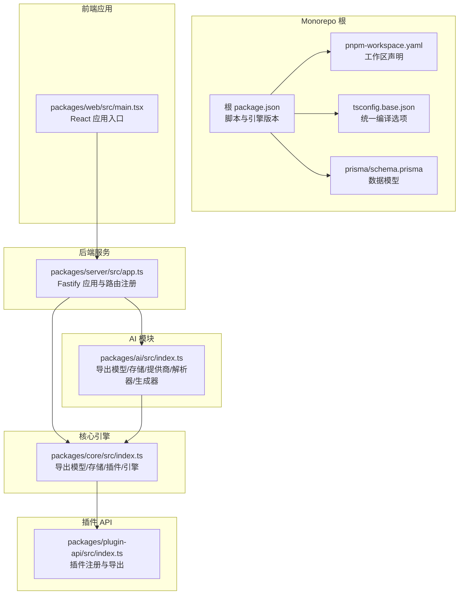
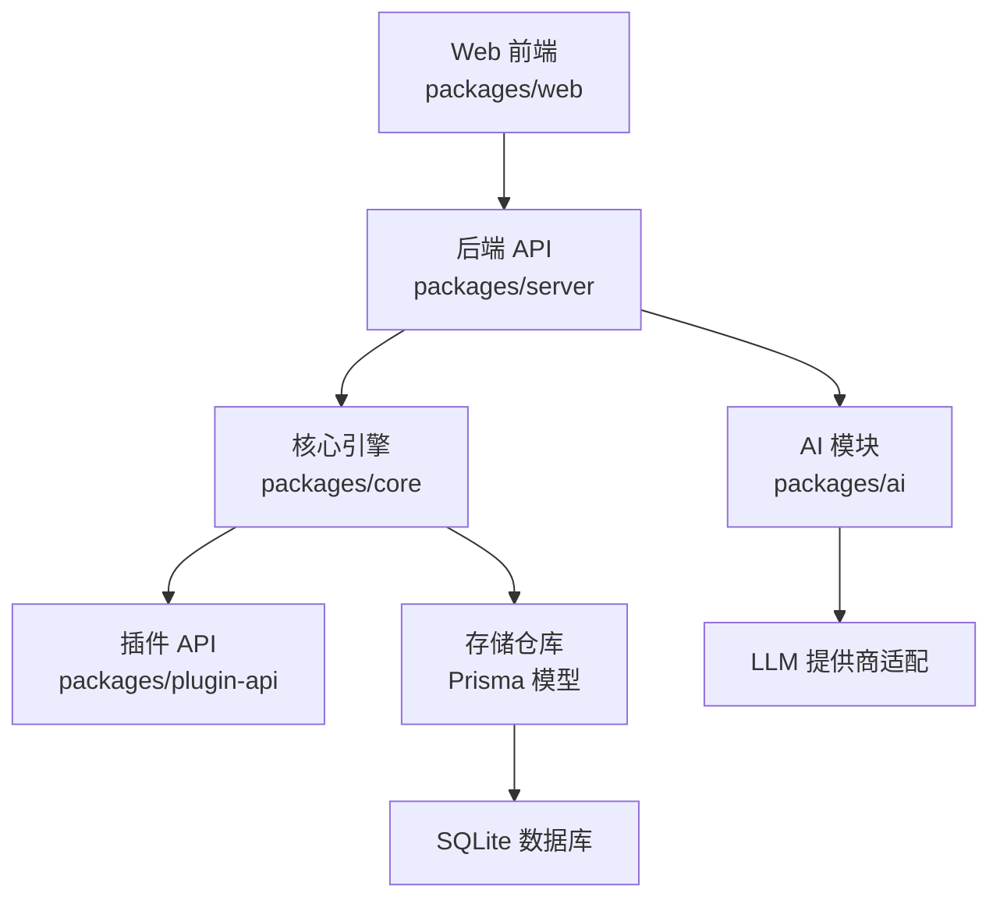
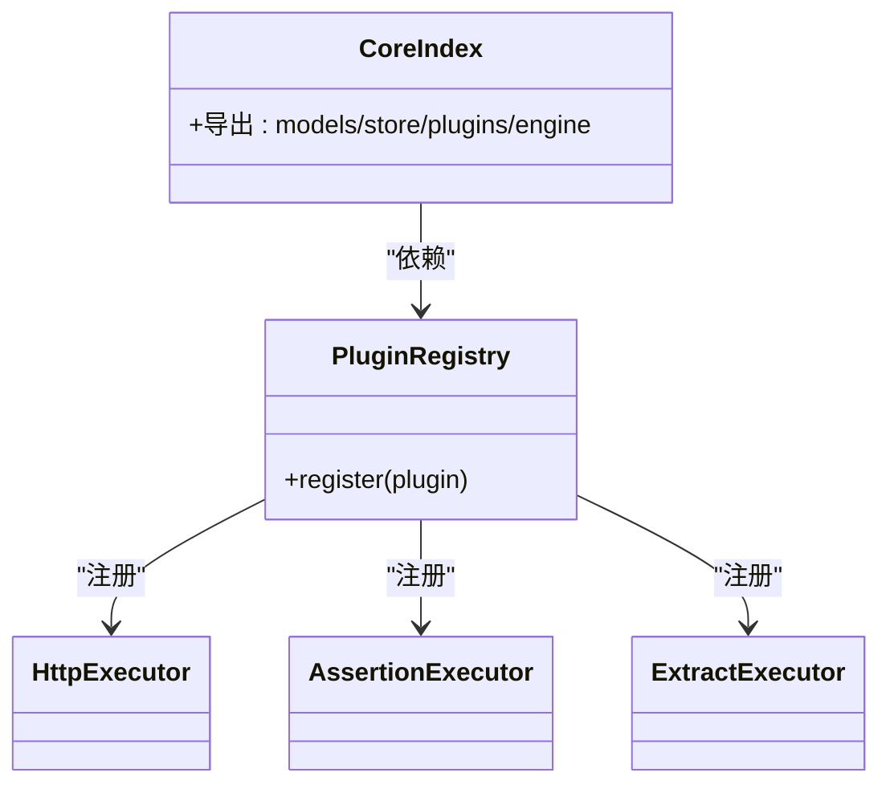
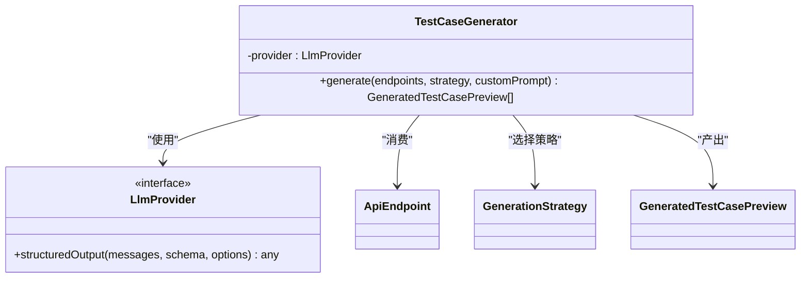
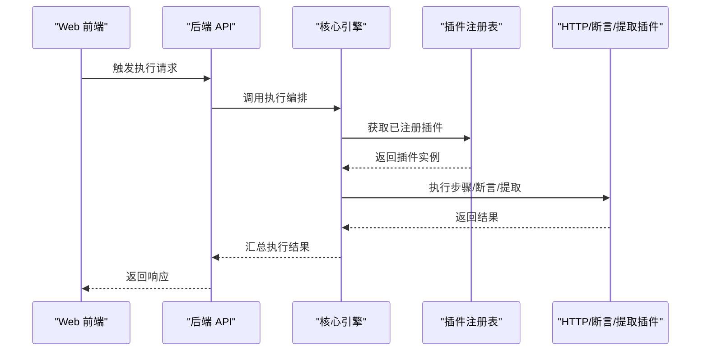
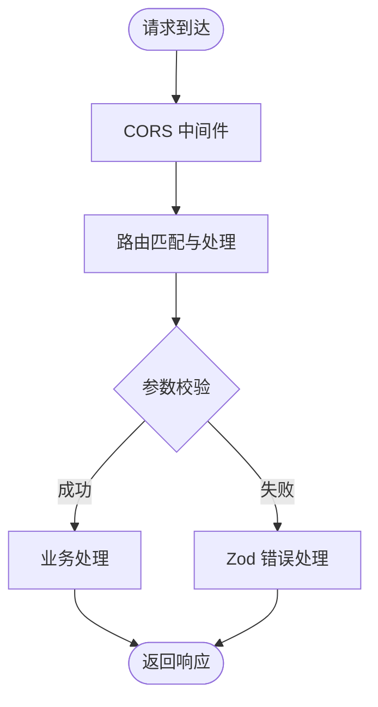
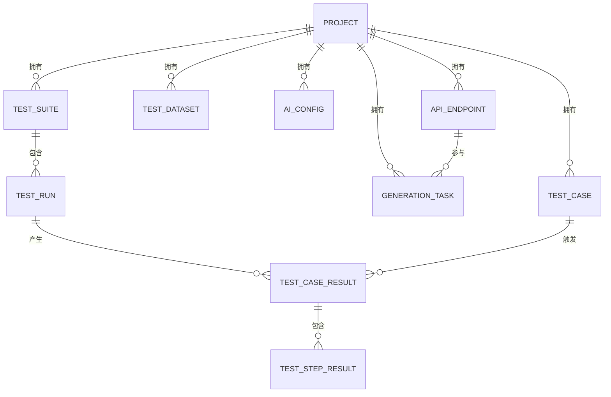
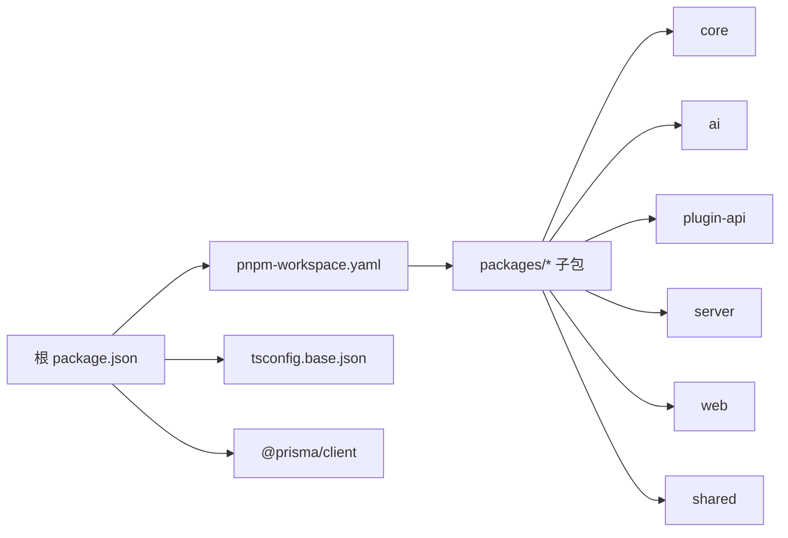
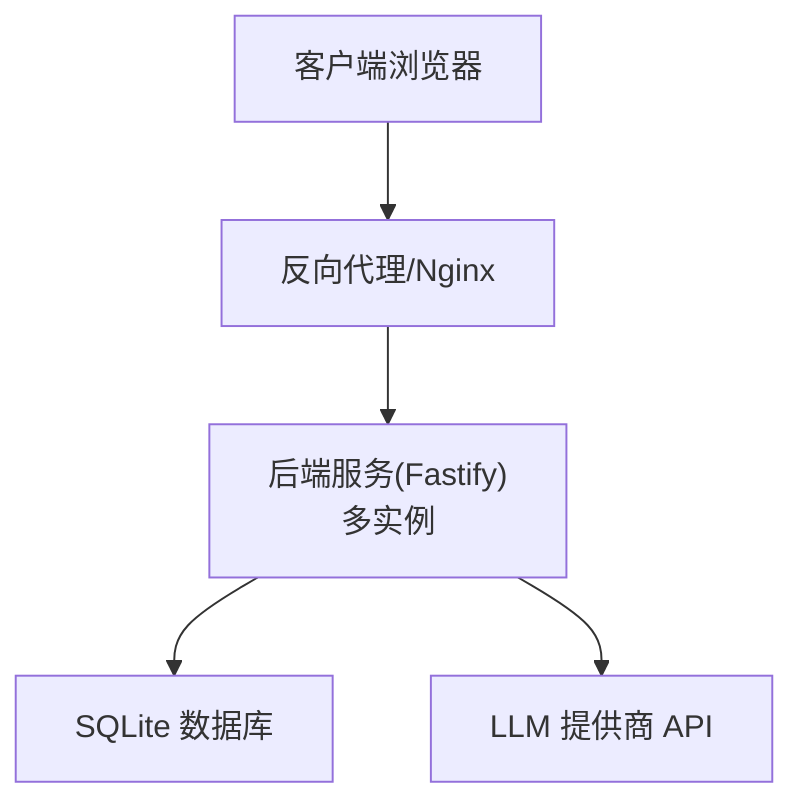

# 系统架构

<cite>
**本文引用的文件**
- [package.json](file://package.json)
- [pnpm-workspace.yaml](file://pnpm-workspace.yaml)
- [tsconfig.base.json](file://tsconfig.base.json)
- [prisma/schema.prisma](file://prisma/schema.prisma)
- [packages/ai/src/index.ts](file://packages/ai/src/index.ts)
- [packages/ai/src/generation/generator.ts](file://packages/ai/src/generation/generator.ts)
- [packages/core/src/index.ts](file://packages/core/src/index.ts)
- [packages/plugin-api/src/index.ts](file://packages/plugin-api/src/index.ts)
- [packages/server/src/app.ts](file://packages/server/src/app.ts)
- [packages/web/src/main.tsx](file://packages/web/src/main.tsx)
</cite>

## 目录
1. [引言](#引言)
2. [项目结构](#项目结构)
3. [核心组件](#核心组件)
4. [架构总览](#架构总览)
5. [详细组件分析](#详细组件分析)
6. [依赖分析](#依赖分析)
7. [性能考虑](#性能考虑)
8. [故障排查指南](#故障排查指南)
9. [结论](#结论)
10. [附录](#附录)

## 引言
本项目是一个围绕“AI测试器”的 Monorepo 工程，采用 pnpm workspace 管理多包协作，统一 TypeScript 编译配置与工具链。系统以“核心引擎 + AI 模块 + 插件体系 + 后端服务 + 前端应用”五层架构组织，通过 Prisma 数据模型与 SQLite 存储支撑测试用例、套件、运行记录与 AI 配置等业务实体。系统强调可扩展性与事件驱动式的数据流：前端通过 HTTP API 与后端交互，后端路由编排业务逻辑，核心引擎负责执行与编排，AI 模块提供基于 LLM 的测试用例生成能力，插件 API 定义了可扩展的执行器与断言器。

## 项目结构
- Monorepo 根目录使用 pnpm workspace 管理 packages/* 下的子包，统一脚本与类型检查策略。
- 核心包概览：
  - ai：AI 能力封装（提示词构建、策略、LLM 提供商适配、存储仓库）
  - core：核心引擎与执行编排、模型定义、存储仓库、插件注册表
  - plugin-api：插件接口与注册函数，定义 HTTP 执行器、断言器、提取器
  - server：基于 Fastify 的后端服务，提供 REST API 路由与健康检查
  - shared：共享错误、ID、日志等基础设施
  - web：基于 Vite + React 的前端应用入口与页面组件
- 数据模型：Prisma 定义了 Project/TestSuite/TestRun/TestCase/TestCaseResult/TestStepResult/AiConfig/ApiEndpoint/GenerationTask/TestDataSet 等实体及索引，支持测试生命周期与 AI 生成任务追踪。

图表来源
- [package.json:1-31](file://package.json#L1-L31)
- [pnpm-workspace.yaml:1-3](file://pnpm-workspace.yaml#L1-L3)
- [tsconfig.base.json:1-20](file://tsconfig.base.json#L1-L20)
- [prisma/schema.prisma:1-196](file://prisma/schema.prisma#L1-L196)
- [packages/server/src/app.ts:1-78](file://packages/server/src/app.ts#L1-L78)
- [packages/core/src/index.ts:1-5](file://packages/core/src/index.ts#L1-L5)
- [packages/ai/src/index.ts:1-7](file://packages/ai/src/index.ts#L1-L7)
- [packages/plugin-api/src/index.ts:1-15](file://packages/plugin-api/src/index.ts#L1-L15)
- [packages/web/src/main.tsx:1-12](file://packages/web/src/main.tsx#L1-L12)

章节来源
- [package.json:1-31](file://package.json#L1-L31)
- [pnpm-workspace.yaml:1-3](file://pnpm-workspace.yaml#L1-L3)
- [tsconfig.base.json:1-20](file://tsconfig.base.json#L1-L20)
- [prisma/schema.prisma:1-196](file://prisma/schema.prisma#L1-L196)

## 核心组件
- 核心引擎（core）：提供测试生命周期的模型与存储抽象，以及插件注册表与执行器接口，是系统执行与编排的中枢。
- AI 模块（ai）：封装 LLM 提供商适配、提示词工程、生成策略与存储仓库，支持基于 API 文档的测试用例生成。
- 插件 API（plugin-api）：定义 HTTP 执行器、断言器、提取器等插件接口，并提供注册函数将这些插件注入核心引擎。
- 后端服务（server）：基于 Fastify 构建 REST API，统一处理 CORS、全局错误与健康检查，按模块注册路由。
- 前端应用（web）：React 应用入口，负责展示项目、套件、运行、数据集与 AI 生成等功能页面。
- 共享模块（shared）：提供通用错误、ID 工具与日志设施，被其他包复用。

章节来源
- [packages/core/src/index.ts:1-5](file://packages/core/src/index.ts#L1-L5)
- [packages/ai/src/index.ts:1-7](file://packages/ai/src/index.ts#L1-L7)
- [packages/plugin-api/src/index.ts:1-15](file://packages/plugin-api/src/index.ts#L1-L15)
- [packages/server/src/app.ts:1-78](file://packages/server/src/app.ts#L1-L78)
- [packages/web/src/main.tsx:1-12](file://packages/web/src/main.tsx#L1-L12)

## 架构总览
系统采用分层架构与事件驱动的数据流：
- 表现层：Web 前端通过 HTTP API 与后端交互，触发项目管理、套件执行、运行查询与 AI 生成等操作。
- 控制层：后端服务接收请求，进行参数校验与错误处理，调用核心引擎或 AI 模块完成业务处理。
- 执行层：核心引擎协调插件执行器完成步骤执行、断言与变量提取；AI 模块通过 LLM 生成测试用例预览。
- 数据层：Prisma 管理 SQLite 数据库，持久化项目、套件、运行、结果与 AI 配置等实体。

图表来源
- [packages/server/src/app.ts:1-78](file://packages/server/src/app.ts#L1-L78)
- [packages/core/src/index.ts:1-5](file://packages/core/src/index.ts#L1-L5)
- [packages/plugin-api/src/index.ts:1-15](file://packages/plugin-api/src/index.ts#L1-L15)
- [packages/ai/src/index.ts:1-7](file://packages/ai/src/index.ts#L1-L7)
- [prisma/schema.prisma:1-196](file://prisma/schema.prisma#L1-L196)

## 详细组件分析

### 核心引擎（core）
- 职责：提供测试生命周期模型、存储仓库、插件注册表与执行器接口，作为系统执行与编排的中枢。
- 关键点：
  - 通过导出统一入口聚合模型、存储、插件与引擎模块，便于上层依赖。
  - 插件注册表用于集中管理执行器、断言器与提取器，实现可扩展的步骤执行链路。
- 与插件 API 的关系：插件 API 导出的执行器与断言器需通过注册函数注入核心引擎的注册表，形成统一的执行管线。

图表来源
- [packages/core/src/index.ts:1-5](file://packages/core/src/index.ts#L1-L5)
- [packages/plugin-api/src/index.ts:1-15](file://packages/plugin-api/src/index.ts#L1-L15)

章节来源
- [packages/core/src/index.ts:1-5](file://packages/core/src/index.ts#L1-L5)
- [packages/plugin-api/src/index.ts:1-15](file://packages/plugin-api/src/index.ts#L1-L15)

### AI 模块（ai）
- 职责：封装 LLM 提供商适配、提示词工程、生成策略与存储仓库，支持基于 API 文档的测试用例生成。
- 关键点：
  - 生成器通过系统提示词、端点上下文与用户提示词组合，调用 LLM 提供商的结构化输出能力，返回测试用例预览。
  - 支持多种生成策略与自定义提示词，满足不同场景下的测试覆盖需求。
- 与核心引擎的关系：AI 模块在生成完成后，可通过核心引擎的存储与插件机制进入后续执行流程。

图表来源
- [packages/ai/src/generation/generator.ts:1-57](file://packages/ai/src/generation/generator.ts#L1-L57)

章节来源
- [packages/ai/src/generation/generator.ts:1-57](file://packages/ai/src/generation/generator.ts#L1-L57)

### 插件 API（plugin-api）
- 职责：定义 HTTP 执行器、断言器、提取器等插件接口，并提供注册函数将这些插件注入核心引擎。
- 关键点：
  - 注册函数集中注册三大类插件，确保核心引擎在执行时具备统一的扩展点。
  - 与核心引擎的耦合度低，通过接口契约解耦具体实现。

图表来源
- [packages/plugin-api/src/index.ts:1-15](file://packages/plugin-api/src/index.ts#L1-L15)
- [packages/server/src/app.ts:1-78](file://packages/server/src/app.ts#L1-L78)

章节来源
- [packages/plugin-api/src/index.ts:1-15](file://packages/plugin-api/src/index.ts#L1-L15)
- [packages/server/src/app.ts:1-78](file://packages/server/src/app.ts#L1-L78)

### 后端服务（server）
- 职责：基于 Fastify 构建 REST API，统一处理 CORS、全局错误与健康检查，按模块注册路由。
- 关键点：
  - 统一错误处理：区分 Zod 校验错误与内部错误，返回结构化错误信息。
  - 健康检查：提供 /api/v1/health 接口，便于外部监控与负载均衡探测。
  - 路由注册：按项目、用例、套件、运行、数据集、AI 配置、AI 端点、AI 生成等模块划分路由。

图表来源
- [packages/server/src/app.ts:1-78](file://packages/server/src/app.ts#L1-L78)

章节来源
- [packages/server/src/app.ts:1-78](file://packages/server/src/app.ts#L1-L78)

### 前端应用（web）
- 职责：React 应用入口，负责渲染页面组件与调用后端 API。
- 关键点：
  - 应用入口仅负责挂载与渲染，页面组件负责具体业务交互。
  - 通过统一的 API 客户端与上下文管理项目状态。

章节来源
- [packages/web/src/main.tsx:1-12](file://packages/web/src/main.tsx#L1-L12)

### 数据模型与存储（Prisma）
- 职责：定义项目、套件、运行、用例、步骤结果、数据集、AI 配置与生成任务等实体，建立索引以提升查询性能。
- 关键点：
  - 使用 JSON 字段存储数组与对象，便于灵活扩展字段内容（如环境、标签、变量、步骤等）。
  - 多对一/一对多关系清晰，支持测试生命周期的完整追踪。

图表来源
- [prisma/schema.prisma:1-196](file://prisma/schema.prisma#L1-L196)

章节来源
- [prisma/schema.prisma:1-196](file://prisma/schema.prisma#L1-L196)

## 依赖分析
- 包管理策略：根目录使用 pnpm workspace 管理所有子包，统一脚本（构建、开发、类型检查、测试）与工具链（ESLint、Prettier、TypeScript），降低重复依赖与版本漂移风险。
- 类型与编译：统一的 tsconfig.base.json 确保各包一致的编译目标、模块解析与声明输出，便于跨包引用与发布。
- 运行时依赖：根 package.json 声明 Node 版本要求与 Prisma 客户端依赖，保证运行环境一致性。

图表来源
- [package.json:1-31](file://package.json#L1-L31)
- [pnpm-workspace.yaml:1-3](file://pnpm-workspace.yaml#L1-L3)
- [tsconfig.base.json:1-20](file://tsconfig.base.json#L1-L20)

章节来源
- [package.json:1-31](file://package.json#L1-L31)
- [pnpm-workspace.yaml:1-3](file://pnpm-workspace.yaml#L1-L3)
- [tsconfig.base.json:1-20](file://tsconfig.base.json#L1-L20)

## 性能考虑
- 并行执行：后端服务脚本支持并行开发模式，有利于多包同时启动与热重载，提升迭代效率。
- 查询优化：Prisma 模型中为常用查询字段建立索引（如项目 ID、模块、状态等），减少数据库扫描成本。
- 结构化输出：AI 生成器通过结构化输出 Schema 与温度参数控制，平衡生成质量与稳定性。
- 缓存与中间件：后端服务已启用 CORS 中间件，建议在后续引入缓存中间件与限流策略以进一步提升吞吐量与稳定性。

## 故障排查指南
- 健康检查：通过 /api/v1/health 接口确认服务可用性与版本信息。
- 错误处理：后端统一捕获 Zod 校验错误与内部异常，返回结构化错误体，便于前端与运维定位问题。
- 日志：后端应用初始化时设置日志级别，建议在生产环境调整日志级别并接入集中式日志收集。

章节来源
- [packages/server/src/app.ts:1-78](file://packages/server/src/app.ts#L1-L78)

## 结论
本系统以 Monorepo 为基础，采用分层架构与插件化设计，结合 Prisma 数据模型与 Fastify 后端服务，实现了从测试用例生成到执行与结果追踪的完整闭环。AI 模块与核心引擎的解耦设计使得系统具备良好的可扩展性与可维护性；统一的包管理与编译配置降低了协作成本。未来可在缓存、限流、监控与可观测性方面进一步完善，以支撑更大规模的测试场景。

## 附录
- 部署拓扑（概念示意）：
  - 前端应用通过反向代理暴露于公网，后端服务监听内网地址，Prisma 使用 SQLite 文件存储于持久卷。
  - 可横向扩展后端实例，配合健康检查与负载均衡实现高可用。

[此图为概念性部署拓扑，不直接映射具体源码文件，故无图表来源]