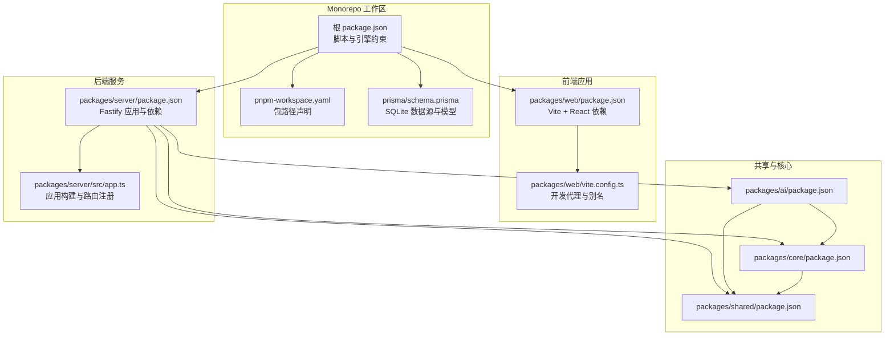
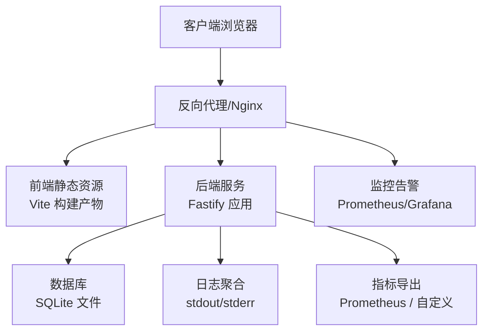
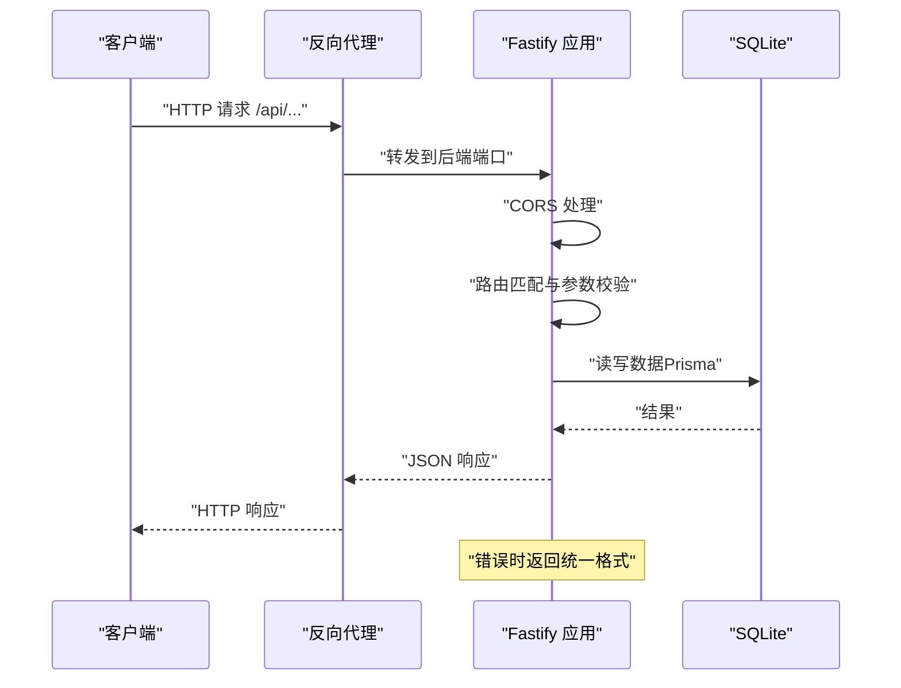
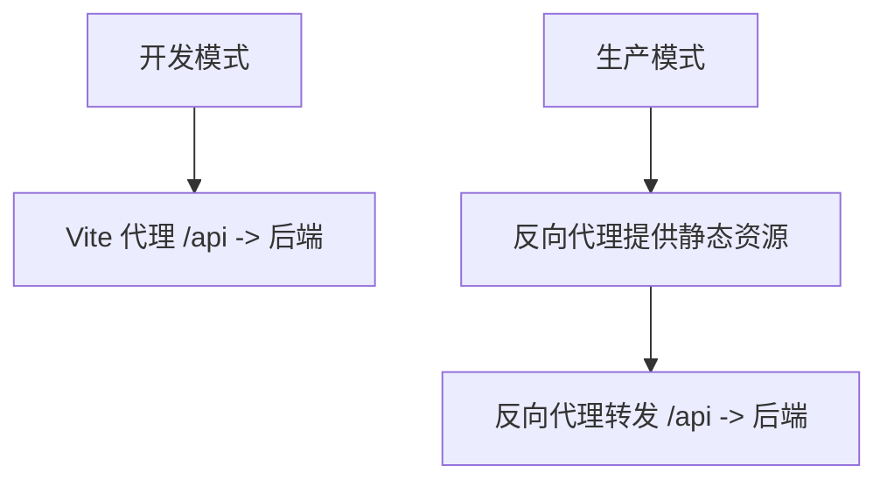
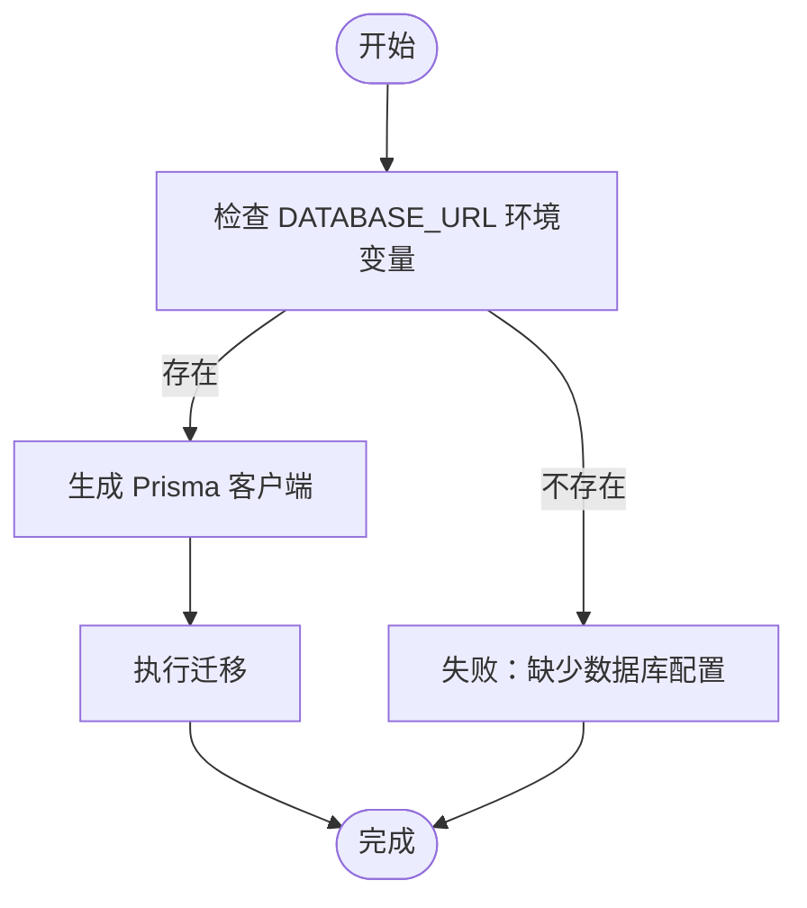
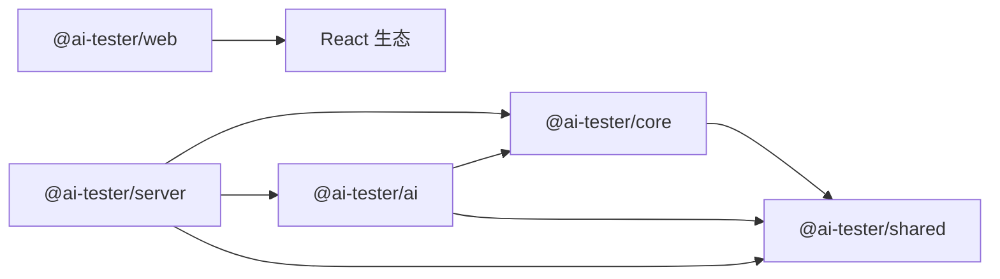

# 部署指南

<cite>
**本文引用的文件**
- [package.json](file://package.json)
- [pnpm-workspace.yaml](file://pnpm-workspace.yaml)
- [prisma/schema.prisma](file://prisma/schema.prisma)
- [packages/server/package.json](file://packages/server/package.json)
- [packages/server/src/app.ts](file://packages/server/src/app.ts)
- [packages/web/vite.config.ts](file://packages/web/vite.config.ts)
- [packages/web/package.json](file://packages/web/package.json)
- [packages/core/package.json](file://packages/core/package.json)
- [packages/ai/package.json](file://packages/ai/package.json)
- [packages/shared/package.json](file://packages/shared/package.json)
</cite>

## 目录
1. [简介](#简介)
2. [项目结构](#项目结构)
3. [核心组件](#核心组件)
4. [架构总览](#架构总览)
5. [详细组件分析](#详细组件分析)
6. [依赖分析](#依赖分析)
7. [性能考虑](#性能考虑)
8. [故障排除指南](#故障排除指南)
9. [结论](#结论)
10. [附录](#附录)

## 简介
本指南面向AI测试器项目的运维与开发团队，提供从生产环境构建、代码分割与优化、Docker容器化到数据库迁移、CI/CD流水线、负载均衡与SSL配置、性能调优与日志管理的完整部署方案。文档同时给出开发、测试、生产三类环境的配置要点与最佳实践，并提供可操作的自动化部署脚本与监控建议。

## 项目结构
项目采用monorepo结构，使用pnpm工作区管理多包（packages），核心模块包括服务端（Fastify）、Web前端（Vite+React）、AI能力封装、核心业务逻辑与共享工具。数据库使用Prisma与SQLite，支持通过环境变量切换数据源。

图表来源
- [package.json:1-31](file://package.json#L1-L31)
- [pnpm-workspace.yaml:1-3](file://pnpm-workspace.yaml#L1-L3)
- [prisma/schema.prisma:1-196](file://prisma/schema.prisma#L1-L196)
- [packages/server/package.json:1-36](file://packages/server/package.json#L1-L36)
- [packages/server/src/app.ts:1-78](file://packages/server/src/app.ts#L1-L78)
- [packages/web/package.json:1-45](file://packages/web/package.json#L1-L45)
- [packages/web/vite.config.ts:1-22](file://packages/web/vite.config.ts#L1-L22)
- [packages/core/package.json:1-34](file://packages/core/package.json#L1-L34)
- [packages/ai/package.json:1-34](file://packages/ai/package.json#L1-L34)
- [packages/shared/package.json:1-28](file://packages/shared/package.json#L1-L28)

章节来源
- [package.json:1-31](file://package.json#L1-L31)
- [pnpm-workspace.yaml:1-3](file://pnpm-workspace.yaml#L1-L3)
- [prisma/schema.prisma:1-196](file://prisma/schema.prisma#L1-L196)
- [packages/server/package.json:1-36](file://packages/server/package.json#L1-L36)
- [packages/server/src/app.ts:1-78](file://packages/server/src/app.ts#L1-L78)
- [packages/web/package.json:1-45](file://packages/web/package.json#L1-L45)
- [packages/web/vite.config.ts:1-22](file://packages/web/vite.config.ts#L1-L22)
- [packages/core/package.json:1-34](file://packages/core/package.json#L1-L34)
- [packages/ai/package.json:1-34](file://packages/ai/package.json#L1-L34)
- [packages/shared/package.json:1-28](file://packages/shared/package.json#L1-L28)

## 核心组件
- 后端服务（Fastify）
  - 提供REST API、健康检查、CORS、全局错误处理与路由注册。
  - 支持通过环境变量控制日志级别、监听地址与端口。
- 前端应用（Vite + React）
  - 开发时通过代理将/api前缀转发至后端；生产构建产物由反向代理提供。
- 数据层（Prisma + SQLite）
  - 使用环境变量配置数据库URL；支持生成客户端与迁移。
- 包管理（pnpm workspace）
  - 统一脚本、类型检查、测试与清理；跨包依赖通过workspace协议解析。

章节来源
- [packages/server/src/app.ts:13-63](file://packages/server/src/app.ts#L13-L63)
- [packages/server/package.json:7-14](file://packages/server/package.json#L7-L14)
- [packages/web/vite.config.ts:12-20](file://packages/web/vite.config.ts#L12-L20)
- [prisma/schema.prisma:1-8](file://prisma/schema.prisma#L1-L8)
- [package.json:6-12](file://package.json#L6-L12)

## 架构总览
下图展示生产部署中的典型拓扑：反向代理（Nginx或边缘网关）负责TLS终止、静态资源与请求转发；后端服务以容器形式运行；前端静态资源由反向代理提供；数据库使用SQLite文件存储于持久卷。

图表来源
- [packages/server/src/app.ts:45-50](file://packages/server/src/app.ts#L45-L50)
- [packages/web/vite.config.ts:1-22](file://packages/web/vite.config.ts#L1-L22)
- [prisma/schema.prisma:5-8](file://prisma/schema.prisma#L5-L8)

## 详细组件分析

### 后端服务（Fastify）部署要点
- 进程与端口
  - 监听端口与主机可通过环境变量配置；启动时输出监听地址便于容器健康检查。
- 日志与错误处理
  - 日志级别受环境变量控制；统一Zod校验错误与通用内部错误响应格式。
- 路由与健康检查
  - 注册各领域路由组；提供健康检查接口返回版本与时间戳。
- 容器化建议
  - 使用最小基础镜像；仅暴露必要端口；挂载持久卷用于SQLite文件；设置健康探针指向健康检查接口。

图表来源
- [packages/server/src/app.ts:13-63](file://packages/server/src/app.ts#L13-L63)
- [prisma/schema.prisma:5-8](file://prisma/schema.prisma#L5-L8)

章节来源
- [packages/server/src/app.ts:13-78](file://packages/server/src/app.ts#L13-L78)
- [packages/server/package.json:7-14](file://packages/server/package.json#L7-L14)

### 前端应用（Vite + React）部署要点
- 开发代理
  - 本地开发时将/api前缀代理至后端；生产环境由反向代理统一处理。
- 构建与产物
  - 生产构建生成静态资源；需确保反向代理正确提供这些文件。
- 反向代理配置
  - 将/api前缀转发至后端服务；对静态资源设置合适的缓存与安全头。

图表来源
- [packages/web/vite.config.ts:12-20](file://packages/web/vite.config.ts#L12-L20)
- [packages/web/package.json:6-11](file://packages/web/package.json#L6-L11)

章节来源
- [packages/web/vite.config.ts:1-22](file://packages/web/vite.config.ts#L1-L22)
- [packages/web/package.json:1-45](file://packages/web/package.json#L1-L45)

### 数据库与迁移（Prisma + SQLite）
- 数据源配置
  - 通过环境变量设置数据库URL；默认使用SQLite。
- 迁移与客户端
  - 生成Prisma客户端；在部署前执行迁移以确保表结构一致。
- 持久化
  - SQLite文件需挂载到持久卷；备份策略与快照管理需纳入运维流程。

图表来源
- [prisma/schema.prisma:5-8](file://prisma/schema.prisma#L5-L8)
- [package.json:20-21](file://package.json#L20-L21)

章节来源
- [prisma/schema.prisma:1-196](file://prisma/schema.prisma#L1-L196)
- [package.json:20-21](file://package.json#L20-L21)

### 包管理与构建（pnpm workspace）
- 统一脚本
  - 根级脚本统一触发各包的构建、开发、测试与清理。
- 类型检查与测试
  - 在根目录进行全量类型检查与测试，保证跨包一致性。
- 依赖与版本
  - 使用workspace协议管理内部包依赖；外部依赖版本集中在各包内维护。

章节来源
- [package.json:6-12](file://package.json#L6-L12)
- [pnpm-workspace.yaml:1-3](file://pnpm-workspace.yaml#L1-L3)
- [packages/core/package.json:21-31](file://packages/core/package.json#L21-L31)
- [packages/ai/package.json:21-31](file://packages/ai/package.json#L21-L31)
- [packages/shared/package.json:19-26](file://packages/shared/package.json#L19-L26)

## 依赖分析
后端服务依赖核心与AI模块，AI模块依赖核心与共享模块，前端依赖UI与状态管理等生态库；共享模块提供日志与ID生成等基础能力。

图表来源
- [packages/server/package.json:16-28](file://packages/server/package.json#L16-L28)
- [packages/ai/package.json:21-26](file://packages/ai/package.json#L21-L26)
- [packages/core/package.json:21-25](file://packages/core/package.json#L21-L25)
- [packages/shared/package.json:19-21](file://packages/shared/package.json#L19-L21)
- [packages/web/package.json:13-33](file://packages/web/package.json#L13-L33)

章节来源
- [packages/server/package.json:16-28](file://packages/server/package.json#L16-L28)
- [packages/ai/package.json:21-26](file://packages/ai/package.json#L21-L26)
- [packages/core/package.json:21-25](file://packages/core/package.json#L21-L25)
- [packages/shared/package.json:19-21](file://packages/shared/package.json#L19-L21)
- [packages/web/package.json:13-33](file://packages/web/package.json#L13-L33)

## 性能考虑
- 代码分割与懒加载
  - 前端按路由拆分包；动态导入重型组件与库，减少首屏体积。
- 构建优化
  - 生产构建启用压缩与Tree-shaking；合理配置别名与外部化依赖。
- 运行时优化
  - 后端使用连接池与查询缓存；限制并发与超时；开启GZIP压缩。
- 缓存策略
  - 对静态资源设置长缓存；对API响应设置合理的ETag/Cache-Control。
- 监控与追踪
  - 指标导出与日志聚合；链路追踪与慢查询分析。

## 故障排除指南
- 健康检查失败
  - 检查后端监听端口与主机；确认健康检查接口可达。
- 数据库连接异常
  - 校验DATABASE_URL环境变量；确认SQLite文件权限与路径；查看迁移是否成功。
- CORS与代理问题
  - 核对反向代理对/api的转发规则；确认Origin白名单与预检请求处理。
- 错误响应排查
  - 查看统一错误响应体中的错误码与消息；结合日志定位具体请求与参数。
- 日志与指标
  - 确保stdout/stderr被收集；检查日志级别与采样率；验证指标导出端点。

章节来源
- [packages/server/src/app.ts:45-50](file://packages/server/src/app.ts#L45-L50)
- [packages/server/src/app.ts:23-43](file://packages/server/src/app.ts#L23-L43)
- [prisma/schema.prisma:5-8](file://prisma/schema.prisma#L5-L8)

## 结论
通过pnpm工作区统一管理、Fastify后端与Vite前端的清晰边界、Prisma驱动的数据层以及反向代理的统一入口，AI测试器项目可在多环境中实现稳定、可观测且可扩展的部署。建议在CI/CD中集成构建、测试与安全扫描，在生产中启用持久化与备份、负载均衡与SSL、完善的监控与告警体系。

## 附录

### 环境变量清单
- 后端服务
  - PORT：监听端口
  - HOST：监听地址
  - LOG_LEVEL：日志级别
  - DATABASE_URL：数据库连接字符串（SQLite）
- 前端开发
  - VITE_API_BASE_URL：开发时API基础URL（可选）

章节来源
- [packages/server/src/app.ts:66-67](file://packages/server/src/app.ts#L66-L67)
- [packages/server/src/app.ts:14-18](file://packages/server/src/app.ts#L14-L18)
- [prisma/schema.prisma:5-8](file://prisma/schema.prisma#L5-L8)
- [packages/web/vite.config.ts:14-18](file://packages/web/vite.config.ts#L14-L18)

### 不同部署环境配置示例
- 开发环境
  - 前端：Vite开发服务器 + 本地代理；后端：本地运行；数据库：本地SQLite文件。
  - 关键点：开启热重载与源码映射；代理/api至后端；日志级别设为调试。
- 测试环境
  - 前端：生产构建产物由反向代理提供；后端：容器化部署；数据库：独立测试库。
  - 关键点：隔离数据与流量；启用健康检查与基本监控。
- 生产环境
  - 前端：静态资源由反向代理提供；后端：容器化+副本数；数据库：持久化卷+备份。
  - 关键点：启用SSL/TLS；配置WAF与速率限制；设置告警阈值。

### CI/CD流水线建议
- 触发条件
  - 主分支保护与PR合并；标签发布。
- 步骤
  - 依赖安装（pnpm install）；类型检查；单元测试；构建（前后端）；打包镜像；推送镜像；部署（Kubernetes/Docker Compose）；运行集成测试；发布报告。
- 安全
  - 代码扫描（Secrets/SAST）；依赖漏洞扫描；镜像安全扫描。

### 自动化部署脚本与监控
- 部署脚本
  - Docker Compose/Kubernetes YAML；一键拉起前端、后端与数据库；支持滚动更新与回滚。
- 监控
  - 指标：QPS、P95/P99、错误率、数据库连接数；日志：统一采集与检索；告警：阈值与异常检测。

### 负载均衡、SSL与域名
- 负载均衡
  - 多副本后端；会话保持或无状态设计；健康检查与自动摘除。
- SSL证书
  - 使用Let’s Encrypt或企业CA；边缘TLS终止；HSTS与安全头。
- 域名绑定
  - DNS记录；CNAME/A记录；通配符与子域策略。