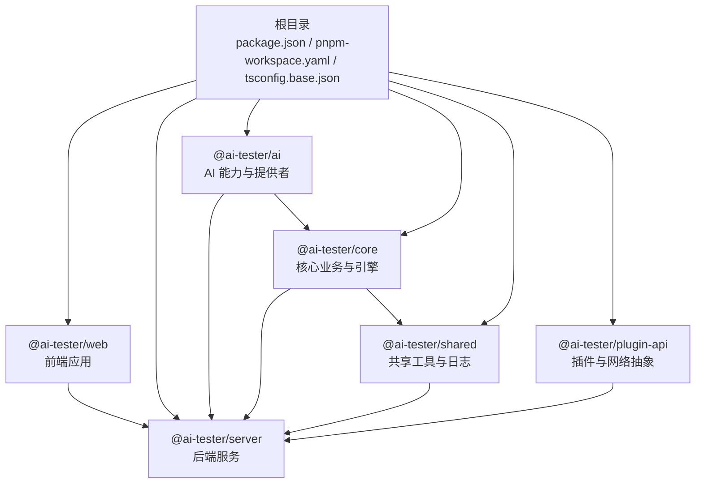
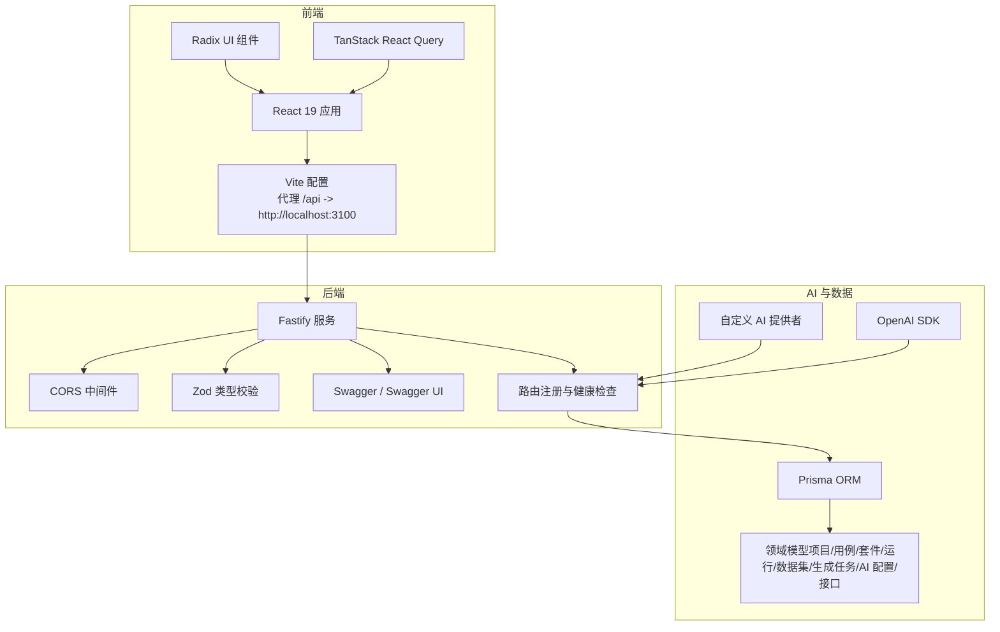
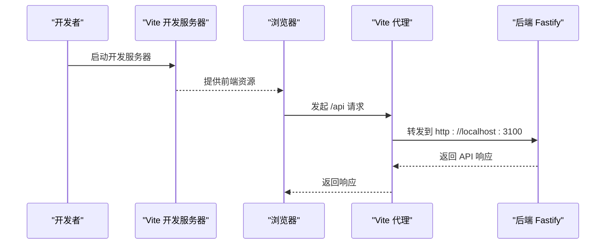
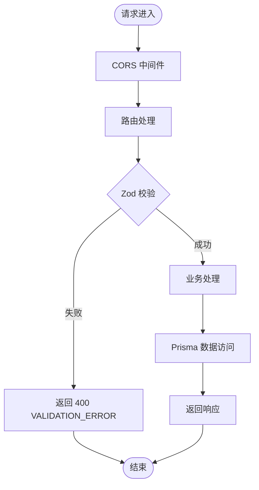
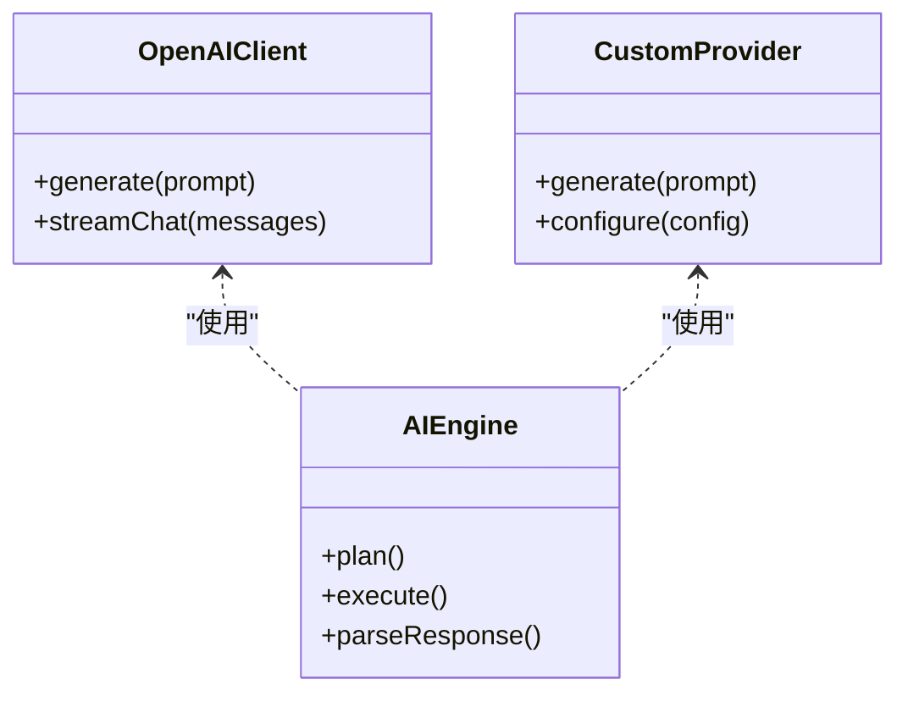
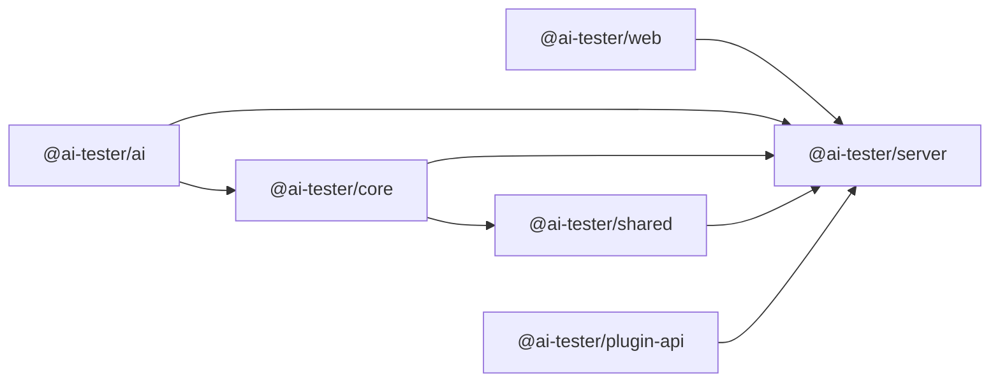

# 技术栈概览

<cite>
**本文引用的文件**
- [package.json](file://package.json)
- [pnpm-workspace.yaml](file://pnpm-workspace.yaml)
- [tsconfig.base.json](file://tsconfig.base.json)
- [.prettierrc](file://.prettierrc)
- [prisma/schema.prisma](file://prisma/schema.prisma)
- [packages/web/package.json](file://packages/web/package.json)
- [packages/web/vite.config.ts](file://packages/web/vite.config.ts)
- [packages/server/package.json](file://packages/server/package.json)
- [packages/server/src/app.ts](file://packages/server/src/app.ts)
- [packages/ai/package.json](file://packages/ai/package.json)
- [packages/ai/src/index.ts](file://packages/ai/src/index.ts)
- [packages/core/package.json](file://packages/core/package.json)
- [packages/core/src/index.ts](file://packages/core/src/index.ts)
- [packages/shared/package.json](file://packages/shared/package.json)
- [packages/plugin-api/package.json](file://packages/plugin-api/package.json)
- [docs/review-report/specs-review-2026-04-24.md](file://docs/review-report/specs-review-2026-04-24.md)
</cite>

## 目录
1. [简介](#简介)
2. [项目结构](#项目结构)
3. [核心组件](#核心组件)
4. [架构总览](#架构总览)
5. [详细组件分析](#详细组件分析)
6. [依赖分析](#依赖分析)
7. [性能考量](#性能考量)
8. [故障排查指南](#故障排查指南)
9. [结论](#结论)
10. [附录](#附录)

## 简介
本文件为 AI 测试器项目的“技术栈概览”，围绕前端（React 19、Vite、Radix UI、TanStack React Query）、后端（Fastify、Zod、Prisma ORM）、AI 集成（OpenAI SDK、自定义 AI 提供者）与开发工具链（TypeScript、ESLint、Prettier、Vitest）进行系统梳理，解释技术选型理由、版本兼容性、在项目中的职责与协作关系，并提供开发环境要求、依赖管理与构建配置要点。

## 项目结构
本项目采用 pnpm 工作区（monorepo）组织，根目录通过脚本统一管理各包的构建、开发与测试；TypeScript 基础配置集中于根目录，确保跨包一致的编译行为；Prisma 用于数据库建模与客户端生成。

图表来源
- [pnpm-workspace.yaml:1-3](file://pnpm-workspace.yaml#L1-L3)
- [packages/web/package.json:1-45](file://packages/web/package.json#L1-L45)
- [packages/server/package.json:1-36](file://packages/server/package.json#L1-L36)
- [packages/ai/package.json:1-34](file://packages/ai/package.json#L1-L34)
- [packages/core/package.json:1-34](file://packages/core/package.json#L1-L34)
- [packages/shared/package.json:1-28](file://packages/shared/package.json#L1-L28)
- [packages/plugin-api/package.json:1-33](file://packages/plugin-api/package.json#L1-L33)

章节来源
- [pnpm-workspace.yaml:1-3](file://pnpm-workspace.yaml#L1-L3)
- [package.json:1-31](file://package.json#L1-L31)
- [tsconfig.base.json:1-20](file://tsconfig.base.json#L1-L20)

## 核心组件
- 前端技术栈
  - React 19：用于构建用户界面，配合 React Router DOM 实现 SPA 路由。
  - Vite：开发服务器与打包工具，提供快速热更新与代理配置。
  - Radix UI：无主题的无障碍 UI 组件库，保证一致性与可访问性。
  - TanStack React Query：状态管理与数据获取，简化缓存、重试与并发控制。
- 后端技术栈
  - Fastify：高性能 Node.js Web 框架，具备零浪费的路由与中间件机制。
  - Zod：运行时类型校验与 API schema 定义，结合 fastify-type-provider-zod 实现类型安全的路由。
  - Prisma ORM：数据库抽象与客户端生成，支持 SQLite，模型覆盖测试全生命周期。
- AI 集成技术
  - OpenAI SDK：官方 SDK，提供模型调用、消息结构与流式响应等能力。
  - 自定义 AI 提供者：通过抽象接口统一不同供应商（如 OpenAI、Anthropic、自定义兼容端点）。
- 开发工具链
  - TypeScript：强类型保障，根配置统一模块解析与输出目标。
  - ESLint + TypeScript ESLint：静态检查与规则约束。
  - Prettier：统一代码风格，减少审查成本。
  - Vitest：单元与集成测试，贯穿各包。

章节来源
- [packages/web/package.json:13-33](file://packages/web/package.json#L13-L33)
- [packages/web/vite.config.ts:1-22](file://packages/web/vite.config.ts#L1-L22)
- [packages/server/package.json:16-28](file://packages/server/package.json#L16-L28)
- [packages/ai/package.json:21-27](file://packages/ai/package.json#L21-L27)
- [prisma/schema.prisma:1-196](file://prisma/schema.prisma#L1-L196)
- [package.json:14-22](file://package.json#L14-L22)
- [tsconfig.base.json:1-20](file://tsconfig.base.json#L1-L20)
- [.prettierrc:1-8](file://.prettierrc#L1-L8)

## 架构总览
前端通过 Vite 本地开发服务器启动，使用代理将 /api 请求转发至后端服务；后端基于 Fastify 提供 REST API 与 Swagger 文档，使用 Zod 校验请求参数；AI 能力封装在 packages/ai 中，面向后端与前端提供统一的生成与解析接口；数据库模型由 Prisma 管理，核心业务逻辑集中在 packages/core。

图表来源
- [packages/web/vite.config.ts:12-21](file://packages/web/vite.config.ts#L12-L21)
- [packages/server/src/app.ts:13-63](file://packages/server/src/app.ts#L13-L63)
- [packages/ai/package.json:24-26](file://packages/ai/package.json#L24-L26)
- [prisma/schema.prisma:10-196](file://prisma/schema.prisma#L10-L196)

## 详细组件分析

### 前端技术栈（React 19、Vite、Radix UI、TanStack React Query）
- React 19
  - 作用：构建用户界面与交互，配合路由实现页面切换。
  - 版本与兼容性：与 Vite、TypeScript ESNext 模块解析兼容良好。
- Vite
  - 作用：开发服务器、代理与打包；本地代理将 /api 转发到后端。
  - 配置要点：端口、路径别名、代理规则。
- Radix UI
  - 作用：提供无主题的无障碍组件，保证一致性与可访问性。
- TanStack React Query
  - 作用：统一数据获取、缓存、重试与并发控制，简化前端状态管理。

图表来源
- [packages/web/vite.config.ts:14-19](file://packages/web/vite.config.ts#L14-L19)
- [packages/server/src/app.ts:66-77](file://packages/server/src/app.ts#L66-L77)

章节来源
- [packages/web/package.json:13-33](file://packages/web/package.json#L13-L33)
- [packages/web/vite.config.ts:1-22](file://packages/web/vite.config.ts#L1-L22)

### 后端技术栈（Fastify、Zod、Prisma ORM）
- Fastify
  - 作用：高性能 Web 框架，提供路由、中间件、日志与错误处理。
  - 特性：内置 CORS、全局错误处理器、健康检查端点。
- Zod
  - 作用：类型安全的请求/响应校验，结合 type provider 提升开发体验。
- Prisma ORM
  - 作用：数据库抽象、客户端生成与迁移；SQLite 作为默认数据源。
  - 模型覆盖：项目、用例、套件、运行、结果、数据集、生成任务、AI 配置、接口等。

图表来源
- [packages/server/src/app.ts:20-43](file://packages/server/src/app.ts#L20-L43)
- [packages/server/src/app.ts:52-60](file://packages/server/src/app.ts#L52-L60)
- [prisma/schema.prisma:10-196](file://prisma/schema.prisma#L10-L196)

章节来源
- [packages/server/package.json:16-28](file://packages/server/package.json#L16-L28)
- [packages/server/src/app.ts:13-63](file://packages/server/src/app.ts#L13-L63)
- [prisma/schema.prisma:1-8](file://prisma/schema.prisma#L1-L8)

### AI 集成技术（OpenAI SDK、自定义 AI 提供者）
- OpenAI SDK
  - 作用：提供官方模型调用能力，支持消息结构与流式响应。
- 自定义 AI 提供者
  - 作用：通过抽象接口统一不同供应商（OpenAI、Anthropic、自定义兼容端点），便于扩展与替换。
- 在项目中的位置
  - packages/ai 汇聚模型、存储、解析器、生成器与加密工具，并依赖 Prisma 与 Zod。

图表来源
- [packages/ai/package.json:24-26](file://packages/ai/package.json#L24-L26)
- [packages/ai/src/index.ts:1-7](file://packages/ai/src/index.ts#L1-L7)

章节来源
- [packages/ai/package.json:1-34](file://packages/ai/package.json#L1-L34)
- [packages/ai/src/index.ts:1-7](file://packages/ai/src/index.ts#L1-L7)

### 开发工具链（TypeScript、ESLint、Prettier、Vitest）
- TypeScript
  - 作用：强类型保障，根配置统一模块解析、输出目标与严格模式。
- ESLint + TypeScript ESLint
  - 作用：静态检查与规则约束，统一团队代码风格与质量。
- Prettier
  - 作用：自动格式化，减少审查分歧。
- Vitest
  - 作用：单元与集成测试，贯穿各包，提升可靠性。

章节来源
- [tsconfig.base.json:1-20](file://tsconfig.base.json#L1-L20)
- [package.json:14-22](file://package.json#L14-L22)
- [.prettierrc:1-8](file://.prettierrc#L1-L8)

## 依赖分析
- 包依赖关系
  - @ai-tester/server 依赖 @ai-tester/core、@ai-tester/shared、@ai-tester/ai、@ai-tester/plugin-api，形成“核心 -> 服务 -> 插件”的单向依赖。
  - @ai-tester/ai 依赖 @ai-tester/core、@ai-tester/shared、@prisma/client、openai、zod。
  - @ai-tester/core 依赖 @ai-tester/shared、zod、jsonpath-plus、@prisma/client。
  - @ai-tester/plugin-api 依赖 @ai-tester/core、@ai-tester/shared、jsonpath-plus、undici。
  - @ai-tester/shared 依赖 @paralleldrive/cuid2、pino。
- 数据与控制流
  - 前端通过 /api 代理访问后端；后端路由调用 Prisma 访问数据库；AI 能力在后端被路由调用，生成结果写入数据库。

图表来源
- [packages/server/package.json:16-28](file://packages/server/package.json#L16-L28)
- [packages/ai/package.json:21-27](file://packages/ai/package.json#L21-L27)
- [packages/core/package.json:21-26](file://packages/core/package.json#L21-L26)
- [packages/plugin-api/package.json:21-26](file://packages/plugin-api/package.json#L21-L26)
- [packages/shared/package.json:19-22](file://packages/shared/package.json#L19-L22)

章节来源
- [packages/server/package.json:1-36](file://packages/server/package.json#L1-L36)
- [packages/ai/package.json:1-34](file://packages/ai/package.json#L1-L34)
- [packages/core/package.json:1-34](file://packages/core/package.json#L1-L34)
- [packages/plugin-api/package.json:1-33](file://packages/plugin-api/package.json#L1-L33)
- [packages/shared/package.json:1-28](file://packages/shared/package.json#L1-L28)

## 性能考量
- 前端
  - 使用 Vite 的快速冷启动与热更新，减少开发等待；代理配置避免跨域与重复开发成本。
- 后端
  - Fastify 的零浪费路由与中间件机制有助于降低延迟；Zod 校验前置可减少无效请求进入业务层。
- 数据层
  - Prisma 提供类型安全与查询优化；SQLite 适合开发与小型生产场景，注意在高并发与大数据量时评估替代方案。
- AI 生成
  - 文档评审指出同步 LLM 调用可能导致超时，建议改为异步任务 + 轮询或 WebSocket 推送，以提升吞吐与稳定性。

章节来源
- [docs/review-report/specs-review-2026-04-24.md:132-139](file://docs/review-report/specs-review-2026-04-24.md#L132-L139)

## 故障排查指南
- 常见问题定位
  - 请求校验失败：后端对 Zod 错误统一返回 400，并携带错误详情，优先检查请求体与路由参数。
  - 服务器内部错误：全局错误处理器记录日志并返回通用 500，检查服务端异常堆栈与数据库连接。
  - 健康检查：/api/v1/health 可快速判断服务可用性。
- 前端联调
  - 确认 Vite 代理将 /api 转发到后端地址；若跨域或 404，检查代理配置与后端监听地址。
- 数据库
  - Prisma 模型变更后执行生成与迁移；关注字段类型与索引策略对查询性能的影响。

章节来源
- [packages/server/src/app.ts:24-43](file://packages/server/src/app.ts#L24-L43)
- [packages/server/src/app.ts:46-50](file://packages/server/src/app.ts#L46-L50)
- [packages/web/vite.config.ts:14-19](file://packages/web/vite.config.ts#L14-L19)

## 结论
本项目采用现代、务实的技术栈组合：前端以 React 19 + Vite + Radix UI + TanStack React Query 构建高效易用的用户界面；后端以 Fastify + Zod + Prisma 提供高性能与类型安全的 API；AI 能力通过 OpenAI SDK 与抽象提供者实现可扩展的生成能力；开发工具链确保代码质量与一致性。整体架构清晰、模块职责明确，具备良好的扩展性与维护性。

## 附录
- 开发环境要求
  - Node.js 版本：>= 20.0.0（根工程 engines 指定）
  - 包管理：pnpm（工作区）
  - TypeScript：统一基线配置，ESNext 模块解析
- 依赖管理与构建
  - 根脚本统一构建、开发、测试与清理；各包独立构建产物输出至 dist
  - Prisma 用于数据库建模与客户端生成，根工程与各包均包含相关依赖
- 代码风格与质量
  - Prettier 统一格式；ESLint + TypeScript ESLint 保障静态质量；Vitest 贯穿测试

章节来源
- [package.json:24-26](file://package.json#L24-L26)
- [package.json:6-12](file://package.json#L6-L12)
- [prisma/schema.prisma:1-8](file://prisma/schema.prisma#L1-L8)
- [.prettierrc:1-8](file://.prettierrc#L1-L8)