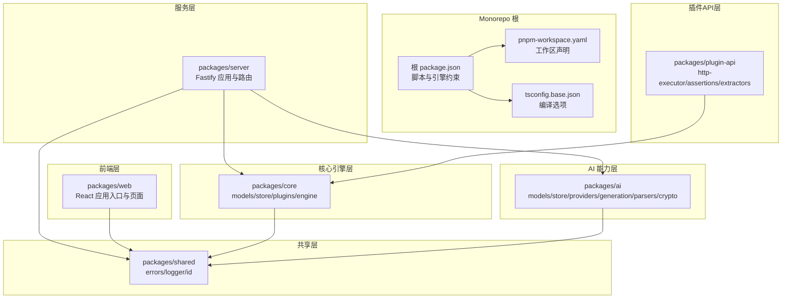
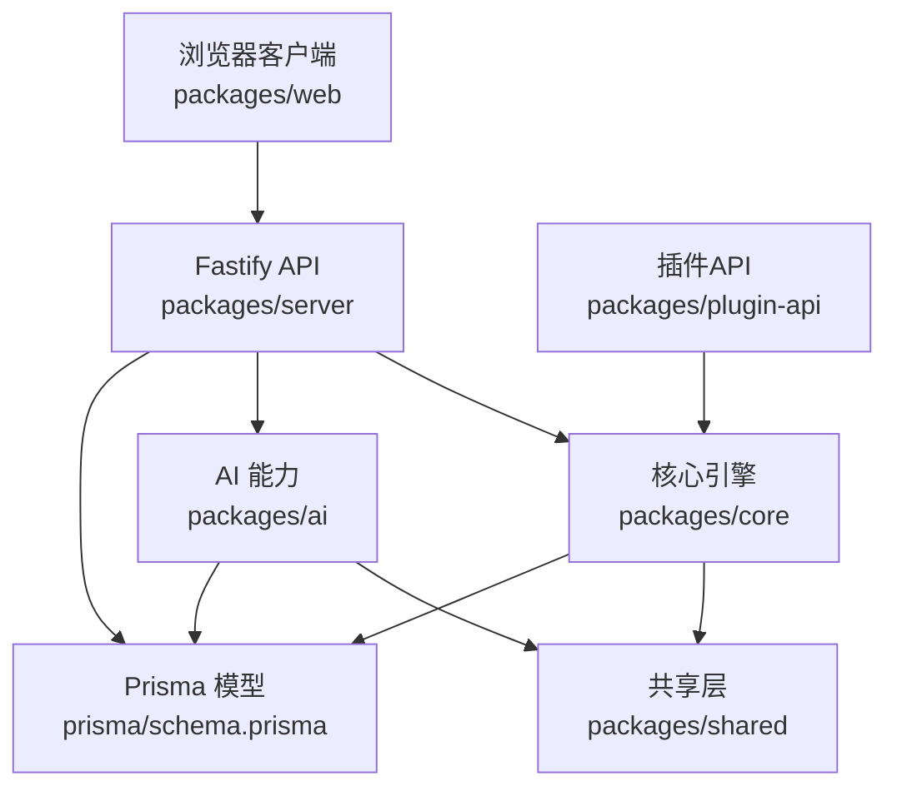
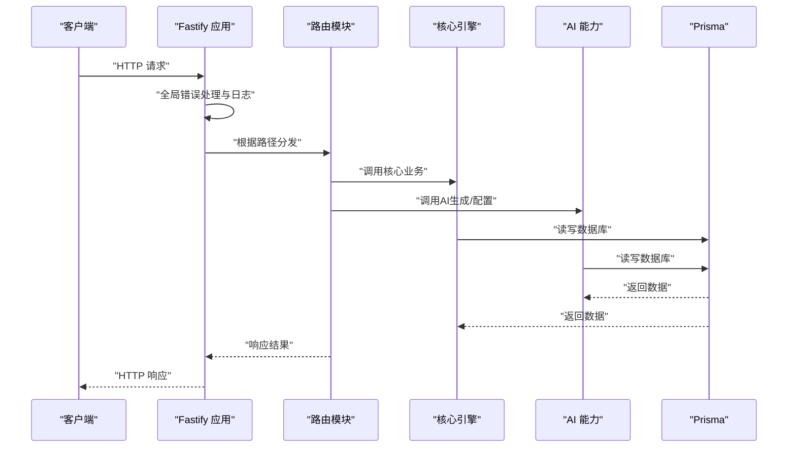
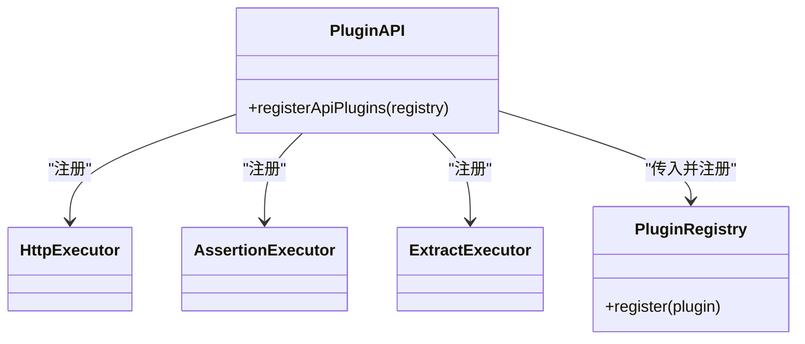
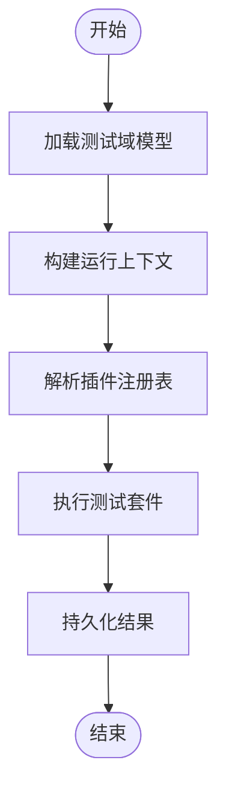
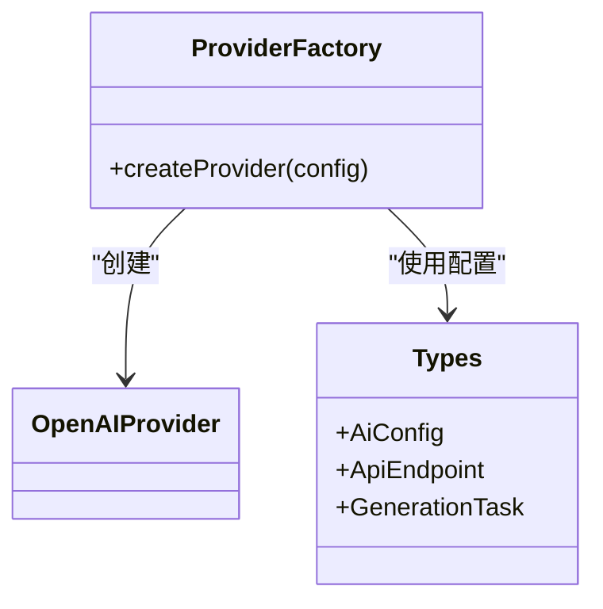
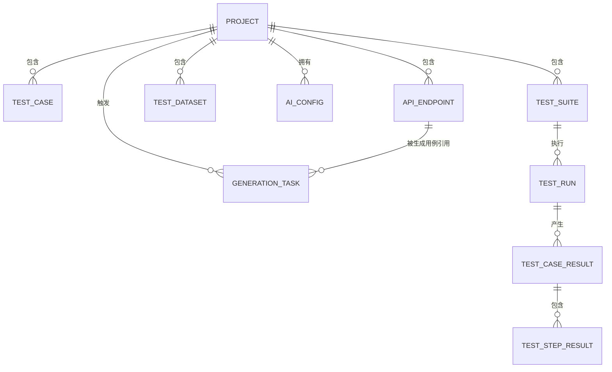
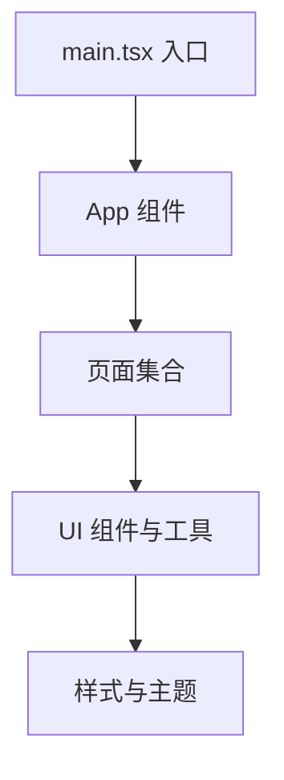
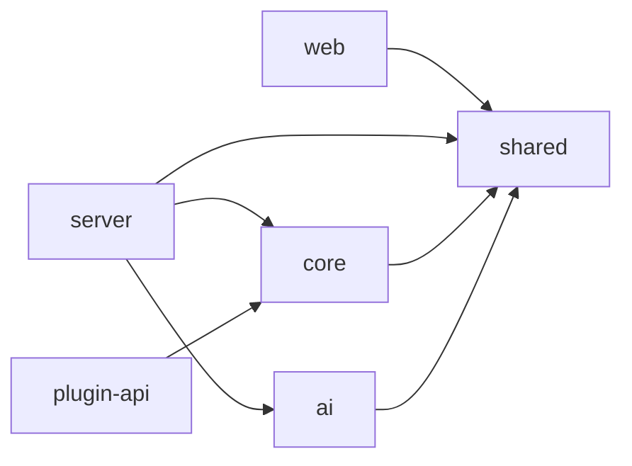

# 架构设计理念

<cite>
**本文引用的文件**
- [package.json](file://package.json)
- [pnpm-workspace.yaml](file://pnpm-workspace.yaml)
- [tsconfig.base.json](file://tsconfig.base.json)
- [schema.prisma](file://prisma/schema.prisma)
- [packages/ai/src/index.ts](file://packages/ai/src/index.ts)
- [packages/core/src/index.ts](file://packages/core/src/index.ts)
- [packages/server/src/app.ts](file://packages/server/src/app.ts)
- [packages/shared/src/index.ts](file://packages/shared/src/index.ts)
- [packages/plugin-api/src/index.ts](file://packages/plugin-api/src/index.ts)
- [packages/web/src/main.tsx](file://packages/web/src/main.tsx)
</cite>

## 目录
1. [引言](#引言)
2. [项目结构](#项目结构)
3. [核心组件](#核心组件)
4. [架构总览](#架构总览)
5. [详细组件分析](#详细组件分析)
6. [依赖分析](#依赖分析)
7. [性能考虑](#性能考虑)
8. [故障排查指南](#故障排查指南)
9. [结论](#结论)
10. [附录](#附录)

## 引言
本项目采用Monorepo架构组织，围绕“AI测试器”这一核心目标，通过分层与模块化设计实现测试用例生成、执行与可视化的统一平台。整体技术栈以TypeScript为基础，结合pnpm workspace进行包管理与构建，后端使用Fastify提供REST API，前端采用React/Vite构建可视化界面，数据库通过Prisma ORM抽象与SQLite驱动。

架构决策强调：
- 单体仓库提升协作效率与版本一致性，同时通过清晰的包边界实现模块解耦
- 分层架构：共享层、核心引擎层、AI能力层、插件API层、服务层、Web前端层
- 微服务风格的模块化：各包独立构建与发布，路由与插件注册体现松耦合
- 事件驱动与状态机：测试运行状态、生成任务状态等以状态字段驱动流程
- 设计模式：依赖注入（容器）、工厂（Provider Factory）、观察者（错误处理与日志）等

## 项目结构
Monorepo采用pnpm workspace统一管理，根目录脚本对所有包执行批量操作；各包按职责划分为：
- shared：跨包通用工具（错误、ID、日志）
- core：测试域模型、存储、插件注册与引擎（编排、上下文）
- ai：AI配置、解析器、生成器、提供商工厂与加密
- plugin-api：插件接口与注册函数（HTTP执行器、断言、提取）
- server：Fastify应用、路由与全局错误处理
- web：React前端应用入口与页面组件
- prisma：数据库模型定义

图表来源
- [package.json:1-31](file://package.json#L1-L31)
- [pnpm-workspace.yaml:1-3](file://pnpm-workspace.yaml#L1-L3)
- [tsconfig.base.json:1-20](file://tsconfig.base.json#L1-L20)
- [packages/server/src/app.ts:1-78](file://packages/server/src/app.ts#L1-L78)
- [packages/core/src/index.ts:1-5](file://packages/core/src/index.ts#L1-L5)
- [packages/ai/src/index.ts:1-7](file://packages/ai/src/index.ts#L1-L7)
- [packages/shared/src/index.ts:1-4](file://packages/shared/src/index.ts#L1-L4)
- [packages/plugin-api/src/index.ts:1-15](file://packages/plugin-api/src/index.ts#L1-L15)
- [packages/web/src/main.tsx:1-12](file://packages/web/src/main.tsx#L1-L12)

章节来源
- [package.json:1-31](file://package.json#L1-L31)
- [pnpm-workspace.yaml:1-3](file://pnpm-workspace.yaml#L1-L3)
- [tsconfig.base.json:1-20](file://tsconfig.base.json#L1-L20)

## 核心组件
- 共享层（shared）：提供统一的错误类型、ID生成与日志工具，作为跨包依赖的基础
- 核心引擎（core）：包含测试域模型、存储抽象与实现、插件注册表、执行引擎与运行上下文
- AI能力（ai）：AI配置、API端点、生成任务、提供商工厂、解析器与加解密工具
- 插件API（plugin-api）：定义HTTP执行器、断言与提取器的插件接口，并提供注册函数
- 服务端（server）：Fastify应用、全局错误处理、健康检查与路由注册
- 前端（web）：React应用入口、页面与UI组件
- 数据库（prisma）：以Prisma模型描述项目、套件、用例、运行、结果与数据集等实体

章节来源
- [packages/shared/src/index.ts:1-4](file://packages/shared/src/index.ts#L1-L4)
- [packages/core/src/index.ts:1-5](file://packages/core/src/index.ts#L1-L5)
- [packages/ai/src/index.ts:1-7](file://packages/ai/src/index.ts#L1-L7)
- [packages/plugin-api/src/index.ts:1-15](file://packages/plugin-api/src/index.ts#L1-L15)
- [packages/server/src/app.ts:1-78](file://packages/server/src/app.ts#L1-L78)
- [packages/web/src/main.tsx:1-12](file://packages/web/src/main.tsx#L1-L12)
- [prisma/schema.prisma:1-196](file://prisma/schema.prisma#L1-L196)

## 架构总览
系统边界与交互：
- 外部边界：浏览器客户端（web）与外部AI服务（通过AI提供商工厂对接）
- 内部边界：服务端（server）暴露REST API；核心引擎（core）负责业务编排；AI能力（ai）提供生成与解析；共享（shared）提供基础能力；插件API（plugin-api）定义扩展点；数据库（prisma）持久化

图表来源
- [packages/server/src/app.ts:1-78](file://packages/server/src/app.ts#L1-L78)
- [packages/core/src/index.ts:1-5](file://packages/core/src/index.ts#L1-L5)
- [packages/ai/src/index.ts:1-7](file://packages/ai/src/index.ts#L1-L7)
- [packages/shared/src/index.ts:1-4](file://packages/shared/src/index.ts#L1-L4)
- [packages/plugin-api/src/index.ts:1-15](file://packages/plugin-api/src/index.ts#L1-L15)
- [prisma/schema.prisma:1-196](file://prisma/schema.prisma#L1-L196)

## 详细组件分析

### 服务端（Server）与路由体系
- 应用构建：Fastify实例、CORS、全局错误处理（Zod校验错误与通用错误）
- 健康检查：/api/v1/health
- 路由注册：项目、用例、套件、运行、数据集、AI配置、AI端点、AI生成等路由模块
- 启动参数：端口与主机地址从环境变量读取

图表来源
- [packages/server/src/app.ts:1-78](file://packages/server/src/app.ts#L1-L78)

章节来源
- [packages/server/src/app.ts:1-78](file://packages/server/src/app.ts#L1-L78)

### 插件API与插件注册
- 插件接口：HTTP执行器、断言执行器、提取执行器
- 注册函数：将插件注册到核心引擎的插件注册表中，形成可扩展的执行链

图表来源
- [packages/plugin-api/src/index.ts:1-15](file://packages/plugin-api/src/index.ts#L1-L15)

章节来源
- [packages/plugin-api/src/index.ts:1-15](file://packages/plugin-api/src/index.ts#L1-L15)

### 核心引擎与运行编排
- 模块导出：模型、存储、插件、引擎
- 引擎：编排器与运行上下文，承载测试执行流程
- 存储：Prisma实现的仓储模式，封装数据访问

图表来源
- [packages/core/src/index.ts:1-5](file://packages/core/src/index.ts#L1-L5)

章节来源
- [packages/core/src/index.ts:1-5](file://packages/core/src/index.ts#L1-L5)

### AI能力与提供商工厂
- 模块导出：模型、存储、提供商、解析器、生成器、加密
- 提供商工厂：根据配置选择不同AI提供商（OpenAI等），统一对外接口
- 解析器：支持OpenAPI、CURL等输入源，生成API端点与测试数据

图表来源
- [packages/ai/src/index.ts:1-7](file://packages/ai/src/index.ts#L1-L7)

章节来源
- [packages/ai/src/index.ts:1-7](file://packages/ai/src/index.ts#L1-L7)

### 数据模型与持久化
- 项目、用例、套件、运行、结果、数据集、AI配置、生成任务等模型
- 关系：一对多/一对一、索引优化、JSON字段存储复杂结构
- 数据流：前端提交/查询 → 服务端路由 → 核心引擎/AI能力 → Prisma → SQLite

图表来源
- [prisma/schema.prisma:10-196](file://prisma/schema.prisma#L10-L196)

章节来源
- [prisma/schema.prisma:1-196](file://prisma/schema.prisma#L1-L196)

### 前端应用与页面
- 入口：React应用挂载到DOM，引入国际化与样式
- 页面：项目、套件、用例、运行、数据集、AI设置、AI生成等页面组件
- 组件：布局、管道视图、UI控件与工具库

图表来源
- [packages/web/src/main.tsx:1-12](file://packages/web/src/main.tsx#L1-L12)

章节来源
- [packages/web/src/main.tsx:1-12](file://packages/web/src/main.tsx#L1-L12)

## 依赖分析
- 包间依赖
  - server 依赖 core、ai、shared
  - core 依赖 shared
  - ai 依赖 shared
  - plugin-api 依赖 core
  - web 依赖 shared
- 工作区与构建
  - pnpm workspace 声明 packages/*
  - 根脚本并行执行开发与构建
  - TypeScript 基础配置统一编译选项

图表来源
- [pnpm-workspace.yaml:1-3](file://pnpm-workspace.yaml#L1-L3)
- [packages/server/src/app.ts:1-78](file://packages/server/src/app.ts#L1-L78)
- [packages/core/src/index.ts:1-5](file://packages/core/src/index.ts#L1-L5)
- [packages/ai/src/index.ts:1-7](file://packages/ai/src/index.ts#L1-L7)
- [packages/shared/src/index.ts:1-4](file://packages/shared/src/index.ts#L1-L4)
- [packages/plugin-api/src/index.ts:1-15](file://packages/plugin-api/src/index.ts#L1-L15)

章节来源
- [pnpm-workspace.yaml:1-3](file://pnpm-workspace.yaml#L1-L3)
- [package.json:1-31](file://package.json#L1-L31)
- [tsconfig.base.json:1-20](file://tsconfig.base.json#L1-L20)

## 性能考虑
- Monorepo与pnpm workspace
  - 通过符号链接减少重复安装，提升安装与构建速度
  - 并行脚本与增量构建降低整体等待时间
- 编译与运行时
  - ESNext模块与bundler解析器提升打包兼容性
  - 严格类型检查与声明文件便于IDE智能提示与早期错误发现
- 数据访问
  - Prisma模型建立索引字段，减少查询开销
  - JSON字段用于灵活存储复杂结构，需配合业务逻辑控制序列化成本
- 网络与API
  - Fastify轻量高性能，建议在生产环境启用压缩与连接池
  - 路由模块化拆分，避免单路由文件过大导致冷启动与维护困难

## 故障排查指南
- 错误处理
  - 全局错误处理器区分Zod校验错误与通用错误，统一返回结构化错误信息
  - Fastify日志级别可通过环境变量调整
- 健康检查
  - 访问 /api/v1/health 快速确认服务可用性
- 日志与ID
  - 使用共享层日志工具输出上下文信息
  - 使用共享层ID工具生成唯一标识，辅助问题定位
- 数据库
  - Prisma模型变更后及时迁移，关注索引与字段类型
  - 对高频查询字段建立索引，避免全表扫描

章节来源
- [packages/server/src/app.ts:1-78](file://packages/server/src/app.ts#L1-L78)
- [packages/shared/src/index.ts:1-4](file://packages/shared/src/index.ts#L1-L4)
- [prisma/schema.prisma:1-196](file://prisma/schema.prisma#L1-L196)

## 结论
本项目通过Monorepo与分层架构实现了测试平台的高内聚低耦合，结合插件化扩展与事件驱动的状态管理，满足从用例生成到执行监控的完整闭环。pnpm workspace与统一TS配置提升了工程效率与一致性。未来可在以下方面持续演进：完善可观测性（指标与追踪）、增强并发与缓存策略、扩展更多AI提供商与解析源、以及加强安全与权限控制。

## 附录
- 技术权衡
  - 选择Monorepo以简化依赖与版本同步，但需要更强的构建与CI治理
  - 采用Prisma ORM提升开发效率，但需平衡复杂查询与迁移成本
  - 插件化设计提升扩展性，需明确接口契约与向后兼容策略
- 最佳实践
  - 保持包边界清晰，避免循环依赖
  - 在核心层与AI层分离纯业务逻辑与外部服务交互
  - 使用共享层统一错误与日志，确保一致的用户体验与运维体验