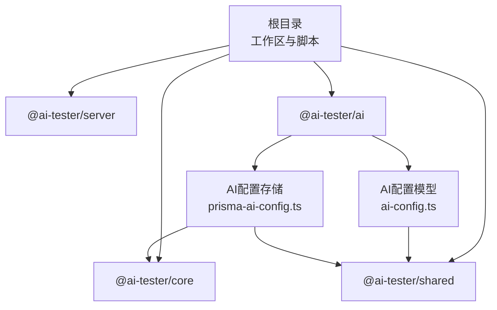
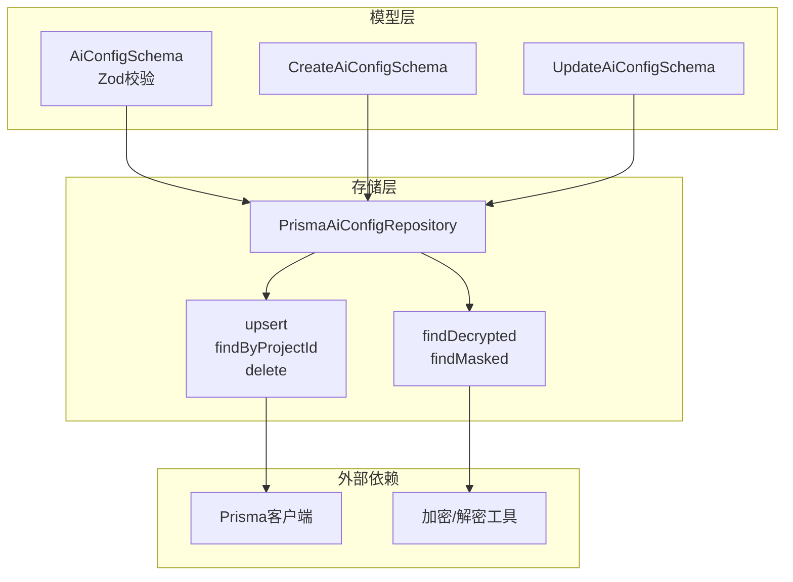
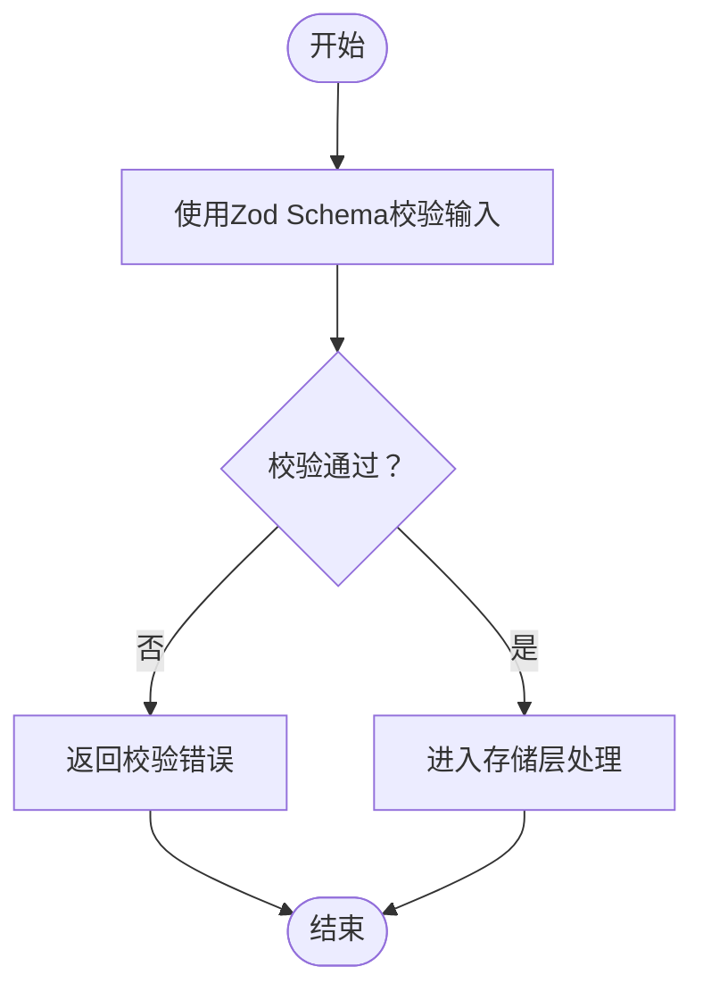
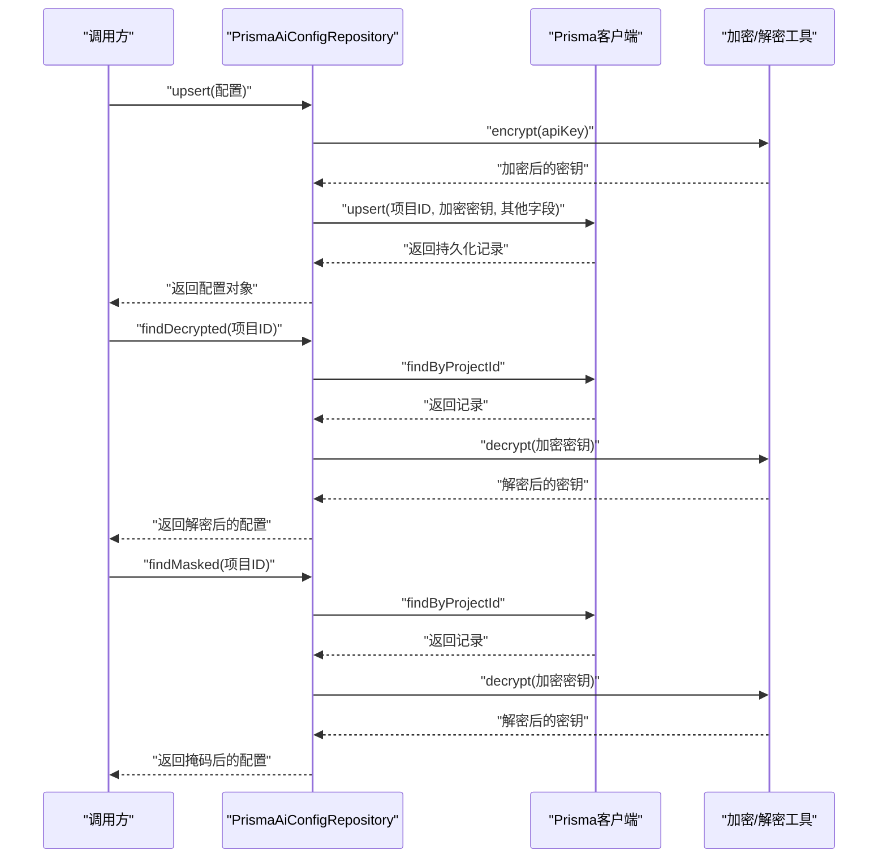
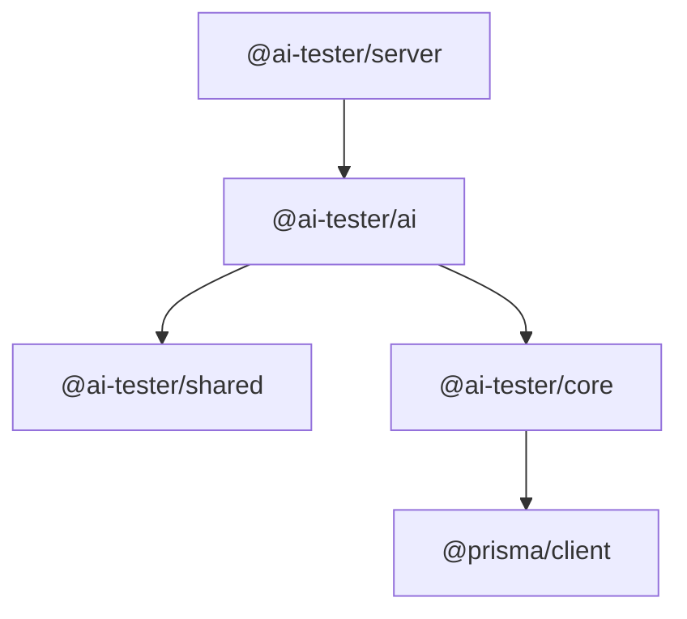

# 多环境配置管理

<cite>
**本文档引用的文件**
- [package.json](file://package.json)
- [pnpm-workspace.yaml](file://pnpm-workspace.yaml)
- [packages/core/package.json](file://packages/core/package.json)
- [packages/server/package.json](file://packages/server/package.json)
- [packages/shared/package.json](file://packages/shared/package.json)
- [packages/ai/src/models/ai-config.ts](file://packages/ai/src/models/ai-config.ts)
- [packages/ai/src/store/prisma-ai-config.ts](file://packages/ai/src/store/prisma-ai-config.ts)
</cite>

## 目录
1. [简介](#简介)
2. [项目结构](#项目结构)
3. [核心组件](#核心组件)
4. [架构总览](#架构总览)
5. [详细组件分析](#详细组件分析)
6. [依赖关系分析](#依赖关系分析)
7. [性能考虑](#性能考虑)
8. [故障排除指南](#故障排除指南)
9. [结论](#结论)
10. [附录](#附录)

## 简介
本文件围绕AI测试器项目的“多环境配置管理”能力进行系统化梳理与说明。当前仓库中与配置管理直接相关的核心实现集中在AI配置模型与持久化层，涉及以下方面：
- 环境变量与URL配置：通过Zod Schema对AI提供商配置进行结构化约束，支持基础URL覆盖与可选字段。
- 认证设置：以加密形式存储API密钥，并在内部使用时解密，在对外响应中进行掩码处理。
- 配置继承与优先级：通过Zod Schema默认值与可空字段设计体现优先级（用户显式值 > 默认值），并结合数据库upsert行为实现“后写覆盖”。
- 安全存储策略：采用对称加密保存敏感信息，确保密钥在存储层不可读；同时在API响应中避免泄露完整密钥。

本文件不展示具体代码片段，仅通过路径引用与图示帮助读者定位实现位置与交互关系。

## 项目结构
项目采用monorepo结构，根目录通过工作区定义统一管理各包。AI配置相关的关键模块位于packages/ai包内，核心职责如下：
- 模型层：定义AI配置的数据结构与校验规则。
- 存储层：基于Prisma访问数据库，封装配置的增删改查与加解密逻辑。

**图表来源**
- [pnpm-workspace.yaml:1-3](file://pnpm-workspace.yaml#L1-L3)
- [packages/ai/src/models/ai-config.ts:1-34](file://packages/ai/src/models/ai-config.ts#L1-L34)
- [packages/ai/src/store/prisma-ai-config.ts:1-82](file://packages/ai/src/store/prisma-ai-config.ts#L1-L82)

**章节来源**
- [pnpm-workspace.yaml:1-3](file://pnpm-workspace.yaml#L1-L3)
- [package.json:1-31](file://package.json#L1-L31)

## 核心组件
- AI配置模型与校验
  - 使用Zod定义配置结构，包含提供商、模型、API密钥、基础URL、温度、最大令牌数等字段，并提供创建与更新的Schema。
  - 关键点：可空的基础URL允许按项目覆盖默认值；默认值用于未显式提供的字段。
- AI配置存储与加解密
  - 基于Prisma的upsert操作实现“后写覆盖”，保证最新配置生效。
  - 内部使用时解密API密钥，对外响应时掩码显示，避免敏感信息泄露。

**章节来源**
- [packages/ai/src/models/ai-config.ts:1-34](file://packages/ai/src/models/ai-config.ts#L1-L34)
- [packages/ai/src/store/prisma-ai-config.ts:1-82](file://packages/ai/src/store/prisma-ai-config.ts#L1-L82)

## 架构总览
下图展示了从配置模型到存储层的整体交互，以及加解密在不同场景下的应用：

**图表来源**
- [packages/ai/src/models/ai-config.ts:1-34](file://packages/ai/src/models/ai-config.ts#L1-L34)
- [packages/ai/src/store/prisma-ai-config.ts:1-82](file://packages/ai/src/store/prisma-ai-config.ts#L1-L82)

## 详细组件分析

### 组件A：AI配置模型与校验
- 设计要点
  - 提供商枚举限制合法取值，模型名称与API密钥必填，基础URL可空且需满足URL格式。
  - 默认值用于温度与最大令牌数，体现“显式值优先”的优先级策略。
  - 更新Schema对除项目ID外的所有字段设为可选，便于部分字段更新。
- 数据流
  - 输入参数经Zod校验后进入存储层；未通过校验的输入会被拒绝。
- 错误处理
  - Zod Schema负责参数合法性校验，非法输入会在上层被拦截。

**图表来源**
- [packages/ai/src/models/ai-config.ts:18-28](file://packages/ai/src/models/ai-config.ts#L18-L28)

**章节来源**
- [packages/ai/src/models/ai-config.ts:1-34](file://packages/ai/src/models/ai-config.ts#L1-L34)

### 组件B：AI配置存储与加解密
- 设计要点
  - upsert：以项目ID为主键，若存在则更新，否则创建；体现“后写覆盖”的继承机制。
  - 加密存储：API密钥在入库前加密，防止明文泄露。
  - 解密使用：内部调用方通过findDecrypted获取解密后的密钥。
  - 掩码输出：对外响应通过findMasked返回掩码后的密钥，避免泄露。
- 数据流
  - 创建/更新：加密密钥 -> upsert -> 返回配置对象。
  - 查询：根据项目ID查询 -> 可选择解密或掩码处理 -> 返回结果。
- 错误处理
  - 数据库异常由调用方捕获；加解密失败会阻止返回敏感数据。

**图表来源**
- [packages/ai/src/store/prisma-ai-config.ts:22-82](file://packages/ai/src/store/prisma-ai-config.ts#L22-L82)

**章节来源**
- [packages/ai/src/store/prisma-ai-config.ts:1-82](file://packages/ai/src/store/prisma-ai-config.ts#L1-L82)

### 组件C：环境变量与URL配置
- 环境变量管理
  - 当前模型层未直接声明环境变量；建议在应用启动时从环境变量读取并注入到配置对象中。
  - 对于基础URL，可通过环境变量提供默认值，再由模型Schema进行校验与覆盖。
- URL配置
  - 基础URL字段为可空字符串，支持按项目覆盖默认值；建议在不同环境中设置不同的基础URL。
- 认证设置
  - API密钥通过加密存储，避免在配置文件中明文出现；运行时通过解密获取。

**章节来源**
- [packages/ai/src/models/ai-config.ts:5-26](file://packages/ai/src/models/ai-config.ts#L5-L26)
- [packages/ai/src/store/prisma-ai-config.ts:23-47](file://packages/ai/src/store/prisma-ai-config.ts#L23-L47)

### 组件D：环境继承机制与变量优先级
- 继承机制
  - 通过项目ID作为主键的upsert实现“后写覆盖”，新配置自动继承旧配置的其他字段，仅更新显式提供的字段。
- 变量优先级
  - 显式值 > 默认值；若未提供基础URL，则使用Schema默认值或留空。
- 动态配置加载
  - 建议在服务启动时按环境读取配置并注入；运行时通过项目ID动态加载对应配置。

**章节来源**
- [packages/ai/src/store/prisma-ai-config.ts:23-47](file://packages/ai/src/store/prisma-ai-config.ts#L23-L47)
- [packages/ai/src/models/ai-config.ts:12-13](file://packages/ai/src/models/ai-config.ts#L12-L13)

### 组件E：安全存储策略
- 密钥加密
  - 入库前对API密钥进行加密，确保数据库层面不可读。
- 解密使用
  - 仅在内部需要调用第三方服务时解密，避免在日志或响应中暴露。
- 掩码输出
  - 对外响应中对API密钥进行掩码处理，仅展示部分字符，保护敏感信息。

**章节来源**
- [packages/ai/src/store/prisma-ai-config.ts:24](file://packages/ai/src/store/prisma-ai-config.ts#L24)
- [packages/ai/src/store/prisma-ai-config.ts:61-80](file://packages/ai/src/store/prisma-ai-config.ts#L61-L80)

### 组件F：配置验证流程
- 输入校验
  - 使用Zod Schema对入参进行严格校验，确保字段类型、范围与格式符合预期。
- 运行时校验
  - 在存储层执行upsert前，确保项目ID唯一性与字段完整性。
- 输出校验
  - 对外响应通过掩码处理，避免敏感信息泄露。

**章节来源**
- [packages/ai/src/models/ai-config.ts:18-28](file://packages/ai/src/models/ai-config.ts#L18-L28)
- [packages/ai/src/store/prisma-ai-config.ts:71-80](file://packages/ai/src/store/prisma-ai-config.ts#L71-L80)

## 依赖关系分析
- 包依赖
  - @ai-tester/ai依赖@ai-tester/shared与@ai-tester/core；存储层进一步依赖core中的Prisma客户端。
  - 服务器端依赖@ai-tester/ai与相关依赖，形成完整的配置读取与调用链路。
- 外部依赖
  - Prisma客户端用于数据库访问。
  - Zod用于配置校验。
  - 加解密工具用于API密钥的安全处理。

**图表来源**
- [packages/server/package.json:16-27](file://packages/server/package.json#L16-L27)
- [packages/ai/src/store/prisma-ai-config.ts:1-2](file://packages/ai/src/store/prisma-ai-config.ts#L1-L2)
- [packages/core/package.json:21-25](file://packages/core/package.json#L21-L25)

**章节来源**
- [packages/server/package.json:1-36](file://packages/server/package.json#L1-L36)
- [packages/core/package.json:1-34](file://packages/core/package.json#L1-L34)
- [packages/shared/package.json:1-28](file://packages/shared/package.json#L1-L28)

## 性能考虑
- 数据库写入
  - upsert操作在高并发场景下可能产生锁竞争，建议对项目ID建立索引并控制写入频率。
- 加解密开销
  - 加密/解密为CPU密集型操作，建议在必要时才进行解密，避免在高频路径中重复解密。
- 缓存策略
  - 对于频繁读取的配置，可在应用层引入缓存，减少数据库访问次数。

## 故障排除指南
- 配置校验失败
  - 症状：请求被拒绝，提示字段不符合Schema。
  - 处理：检查字段类型、长度与格式，确保符合Zod定义。
- 数据库写入冲突
  - 症状：upsert失败或数据未更新。
  - 处理：确认项目ID唯一性，检查数据库连接与权限。
- 密钥解密失败
  - 症状：无法获取解密后的API密钥。
  - 处理：检查加密算法一致性与密钥材料，确保加解密流程正确。
- 响应泄露敏感信息
  - 症状：对外响应中出现完整API密钥。
  - 处理：确保使用掩码输出方法，避免直接返回原始密钥。

**章节来源**
- [packages/ai/src/models/ai-config.ts:18-28](file://packages/ai/src/models/ai-config.ts#L18-L28)
- [packages/ai/src/store/prisma-ai-config.ts:61-80](file://packages/ai/src/store/prisma-ai-config.ts#L61-L80)

## 结论
本项目通过Zod Schema与Prisma存储实现了对AI配置的结构化管理，结合加解密与掩码策略保障了安全性。环境变量与URL配置可通过应用启动阶段注入，配合upsert实现“后写覆盖”的继承机制。建议在实际部署中完善环境隔离、缓存与监控策略，以提升稳定性与可观测性。

## 附录
- 开发环境示例
  - 设置基础URL指向本地或沙箱服务，API密钥使用测试账户，启用较低温度与较小最大令牌数以便快速迭代。
- 测试环境示例
  - 使用独立数据库与测试API密钥，基础URL指向测试服务，开启详细日志与限流策略。
- 生产环境示例
  - 使用强加密与严格的访问控制，基础URL指向正式服务，API密钥通过安全渠道注入，启用审计日志与告警。