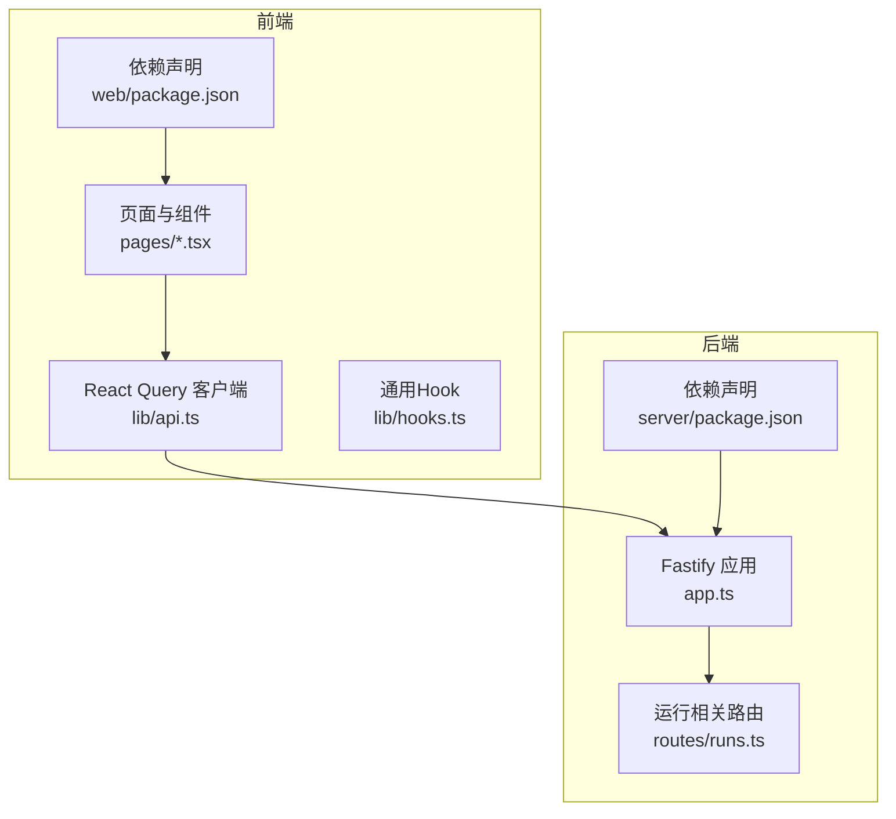
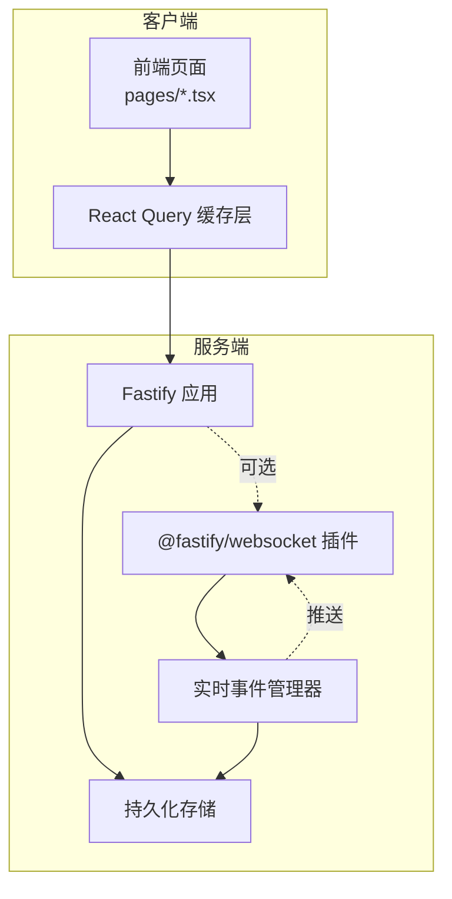
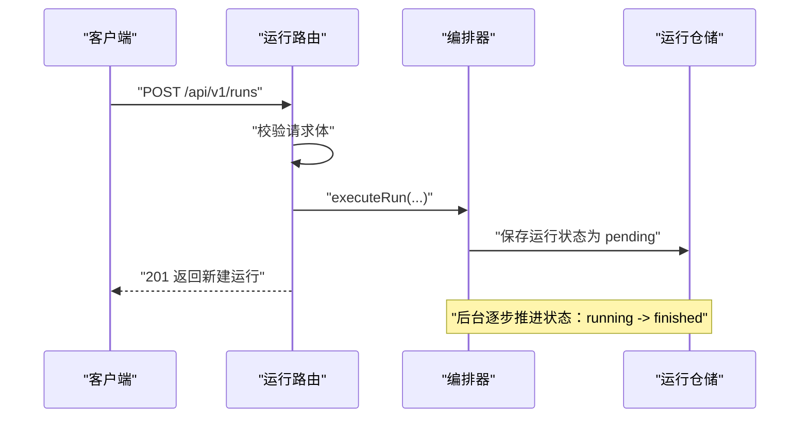
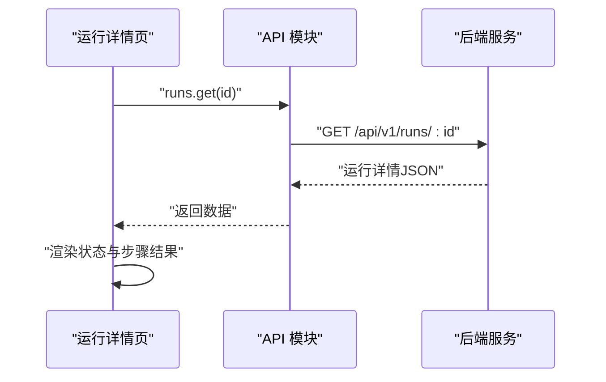
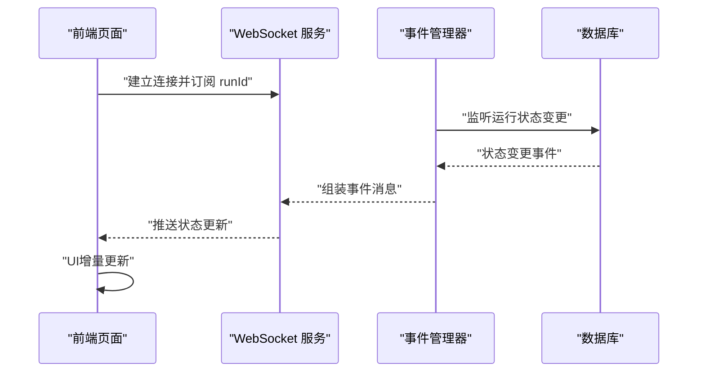
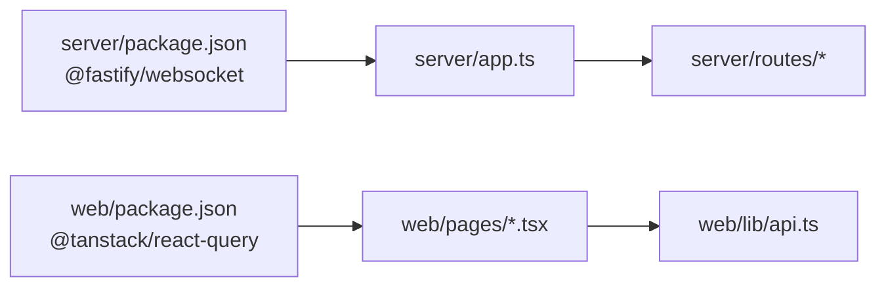

# 实时监控与通知

<cite>
**本文引用的文件**
- [packages/server/src/app.ts](file://packages/server/src/app.ts)
- [packages/server/src/routes/runs.ts](file://packages/server/src/routes/runs.ts)
- [packages/web/src/lib/api.ts](file://packages/web/src/lib/api.ts)
- [packages/web/src/lib/hooks.ts](file://packages/web/src/lib/hooks.ts)
- [packages/web/src/pages/run-detail.tsx](file://packages/web/src/pages/run-detail.tsx)
- [packages/web/src/pages/runs.tsx](file://packages/web/src/pages/runs.tsx)
- [packages/server/package.json](file://packages/server/package.json)
- [packages/web/package.json](file://packages/web/package.json)
</cite>

## 目录
1. [简介](#简介)
2. [项目结构](#项目结构)
3. [核心组件](#核心组件)
4. [架构总览](#架构总览)
5. [详细组件分析](#详细组件分析)
6. [依赖分析](#依赖分析)
7. [性能考量](#性能考量)
8. [故障排查指南](#故障排查指南)
9. [结论](#结论)
10. [附录](#附录)

## 简介
本文件聚焦于AI测试器的“实时监控与通知”能力，结合现有代码库现状进行系统化说明。当前仓库中，后端基于Fastify与@fastify/websocket声明了WebSocket依赖，但未发现实际的WebSocket路由或事件推送实现；前端使用React与TanStack React Query进行数据拉取与缓存，尚未集成WebSocket订阅。因此，本文在“现状分析”的基础上，提供一套可落地的“实时监控与通知”方案设计与实施建议，帮助团队在不破坏现有架构的前提下，平滑引入实时能力。

## 项目结构
- 后端服务（@ai-tester/server）：采用Fastify框架，已注册CORS、全局错误处理、健康检查与多条REST路由（项目、用例、套件、运行、数据集、AI配置等）。WebSocket依赖已声明，但未见具体实现。
- 前端应用（@ai-tester/web）：基于Vite+React，使用TanStack React Query进行数据请求与缓存，页面通过API模块调用后端接口。

图表来源
- [packages/server/src/app.ts:1-78](file://packages/server/src/app.ts#L1-L78)
- [packages/server/src/routes/runs.ts:1-45](file://packages/server/src/routes/runs.ts#L1-L45)
- [packages/server/package.json:16-27](file://packages/server/package.json#L16-L27)
- [packages/web/src/lib/api.ts:1-325](file://packages/web/src/lib/api.ts#L1-L325)
- [packages/web/package.json:13-32](file://packages/web/package.json#L13-L32)

章节来源
- [packages/server/src/app.ts:1-78](file://packages/server/src/app.ts#L1-L78)
- [packages/server/src/routes/runs.ts:1-45](file://packages/server/src/routes/runs.ts#L1-L45)
- [packages/web/src/lib/api.ts:1-325](file://packages/web/src/lib/api.ts#L1-L325)
- [packages/server/package.json:16-27](file://packages/server/package.json#L16-L27)
- [packages/web/package.json:13-32](file://packages/web/package.json#L13-L32)

## 核心组件
- 后端应用与路由
  - 应用入口负责注册CORS、全局错误处理、健康检查以及各模块路由（含运行相关路由）。
  - 运行路由提供触发测试运行、分页查询运行记录、获取运行详情等REST接口。
- 前端API与页面
  - API模块封装了统一的请求方法与类型定义，包含运行列表、详情与触发等方法。
  - 页面通过API调用后端接口，配合React Query进行数据获取与缓存。

章节来源
- [packages/server/src/app.ts:13-63](file://packages/server/src/app.ts#L13-L63)
- [packages/server/src/routes/runs.ts:5-44](file://packages/server/src/routes/runs.ts#L5-L44)
- [packages/web/src/lib/api.ts:178-189](file://packages/web/src/lib/api.ts#L178-L189)

## 架构总览
当前架构以HTTP REST为主，WebSocket尚未接入。若要引入实时监控与通知，建议采用“REST + WebSocket双通道”模式：
- REST用于初始加载与非实时操作；
- WebSocket用于实时推送测试运行状态变更与事件通知。

说明
- WebSocket插件已在后端依赖中声明，可作为后续扩展点。
- 实时事件管理器负责聚合运行状态变更并通过WebSocket广播给订阅者。

## 详细组件分析

### 后端：应用与运行路由
- 应用初始化
  - 注册CORS、全局错误处理、健康检查与各模块路由。
- 运行路由
  - 触发运行：解析请求体，异步执行并立即返回新建的运行对象。
  - 列表查询：支持按套件ID、状态、分页参数过滤。
  - 详情查询：按ID获取运行详情，不存在时返回404。

图表来源
- [packages/server/src/routes/runs.ts:7-19](file://packages/server/src/routes/runs.ts#L7-L19)

章节来源
- [packages/server/src/app.ts:13-63](file://packages/server/src/app.ts#L13-L63)
- [packages/server/src/routes/runs.ts:5-44](file://packages/server/src/routes/runs.ts#L5-L44)

### 前端：API与页面
- API模块
  - 统一封装fetch请求，处理状态码与错误响应。
  - 提供运行列表、详情与触发等方法。
- 页面
  - 运行详情页与运行列表页通过API获取数据，React Query负责缓存与刷新策略。

图表来源
- [packages/web/src/lib/api.ts:178-189](file://packages/web/src/lib/api.ts#L178-L189)
- [packages/web/src/pages/run-detail.tsx:1-200](file://packages/web/src/pages/run-detail.tsx#L1-L200)

章节来源
- [packages/web/src/lib/api.ts:1-325](file://packages/web/src/lib/api.ts#L1-L325)
- [packages/web/src/pages/run-detail.tsx:1-200](file://packages/web/src/pages/run-detail.tsx#L1-L200)

### WebSocket 实现建议（概念性）
- 路由与连接
  - 在后端注册WebSocket路由，建立连接池与订阅管理。
- 事件模型
  - 定义运行状态变更事件（如 pending → running → finished），并在编排器推进状态时触发。
- 前端订阅
  - 前端在进入运行详情页时建立WebSocket连接，订阅对应运行ID的事件流。
- 消息格式
  - 使用结构化的事件载荷，包含运行ID、状态、时间戳与增量字段，便于UI增量更新。

说明
- 此图为概念性流程，用于指导后续实现，当前仓库未包含该实现。

## 依赖分析
- 后端依赖
  - @fastify/websocket 已声明，可用于后续WebSocket功能扩展。
- 前端依赖
  - React Query用于数据缓存与刷新，适合与WebSocket结合实现“先拉取、后推送”的混合策略。

图表来源
- [packages/server/package.json:23](file://packages/server/package.json#L23)
- [packages/web/package.json:22](file://packages/web/package.json#L22)

章节来源
- [packages/server/package.json:16-27](file://packages/server/package.json#L16-L27)
- [packages/web/package.json:13-32](file://packages/web/package.json#L13-L32)

## 性能考量
- 拉取与推送结合
  - 首屏与列表使用REST快速响应，详情页在具备实时需求时再启用WebSocket推送，避免不必要的长连接。
- 分页与增量更新
  - 列表使用分页与缓存，详情页采用增量更新策略，仅替换受影响的部分DOM。
- 连接复用与心跳
  - WebSocket连接应支持心跳与自动重连，减少断线对用户体验的影响。
- 广播粒度
  - 事件推送按运行ID细分，避免全量广播造成带宽浪费。

## 故障排查指南
- 健康检查
  - 后端提供健康检查接口，用于快速判断服务可用性。
- 错误处理
  - 全局错误处理器统一返回结构化错误信息，便于前端识别与提示。
- 常见问题定位
  - WebSocket未收到推送：确认前端是否正确订阅、后端事件是否触发、连接池是否存活。
  - 数据不同步：检查React Query缓存策略与手动刷新逻辑。

章节来源
- [packages/server/src/app.ts:45-50](file://packages/server/src/app.ts#L45-L50)
- [packages/server/src/app.ts:24-43](file://packages/server/src/app.ts#L24-L43)

## 结论
当前仓库已具备引入实时监控与通知的良好基础：后端声明了WebSocket依赖，前端具备完善的REST客户端与缓存层。建议采用“REST + WebSocket双通道”策略，在保证兼容性的前提下，优先在运行详情页等高价值场景引入WebSocket推送，逐步完善事件模型与前端订阅逻辑，最终实现端到端的实时监控与通知体验。

## 附录

### 集成示例（概念性）
- 前端订阅测试状态变化
  - 在运行详情页挂载时建立WebSocket连接，订阅当前运行ID的事件。
  - 收到事件后，使用React Query的查询键刷新对应运行数据，或直接合并增量字段更新UI。
- 处理实时数据与用户交互
  - 将WebSocket事件映射为UI状态，例如“运行中”“已完成”“失败”等，同时保留手动刷新按钮。
- 安全性与连接管理
  - 通过鉴权中间件限制订阅范围，确保用户只能接收其有权限的运行事件。
  - 实现指数退避重连、心跳检测与断线提示，提升稳定性与可观测性。

### 关键实现位置参考
- 后端应用与路由
  - [packages/server/src/app.ts:13-63](file://packages/server/src/app.ts#L13-L63)
  - [packages/server/src/routes/runs.ts:5-44](file://packages/server/src/routes/runs.ts#L5-L44)
- 前端API与页面
  - [packages/web/src/lib/api.ts:178-189](file://packages/web/src/lib/api.ts#L178-L189)
  - [packages/web/src/pages/run-detail.tsx:1-200](file://packages/web/src/pages/run-detail.tsx#L1-L200)