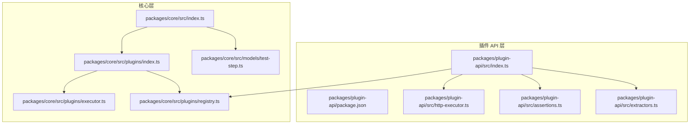
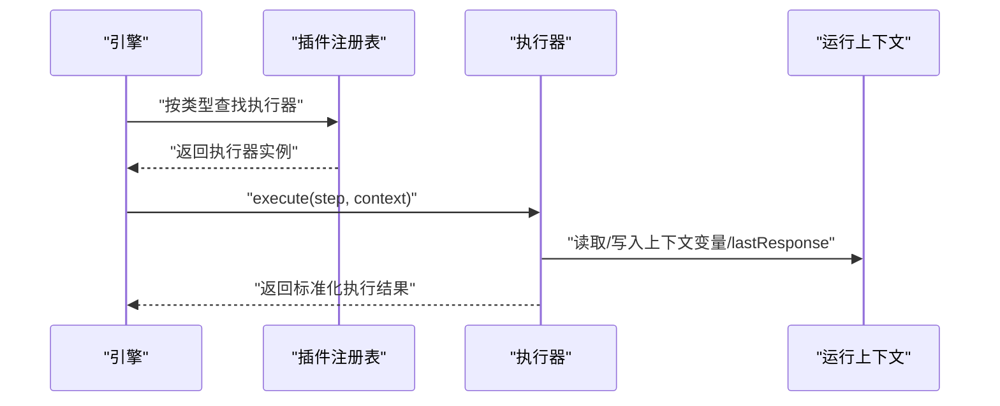
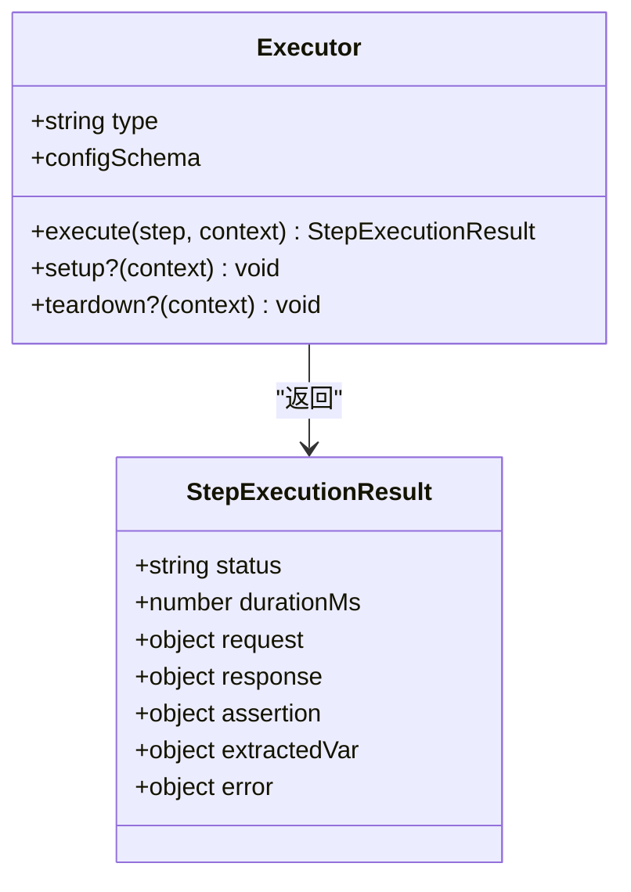
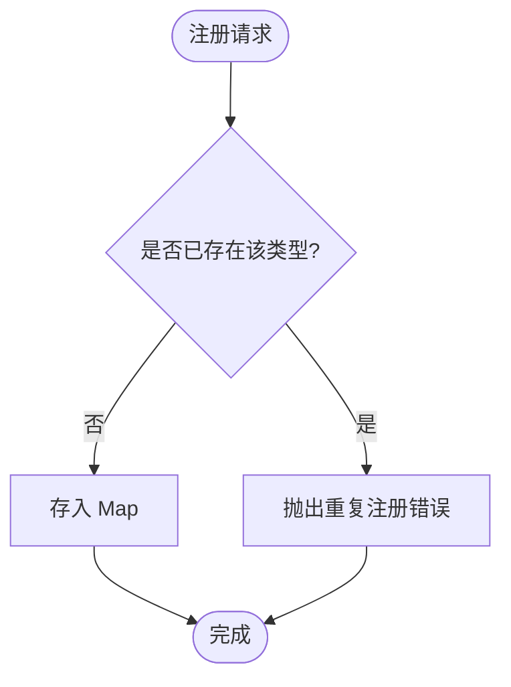
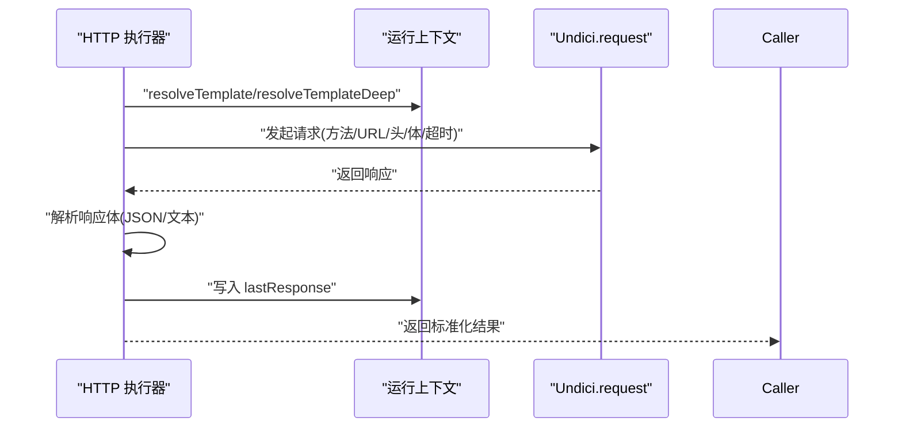
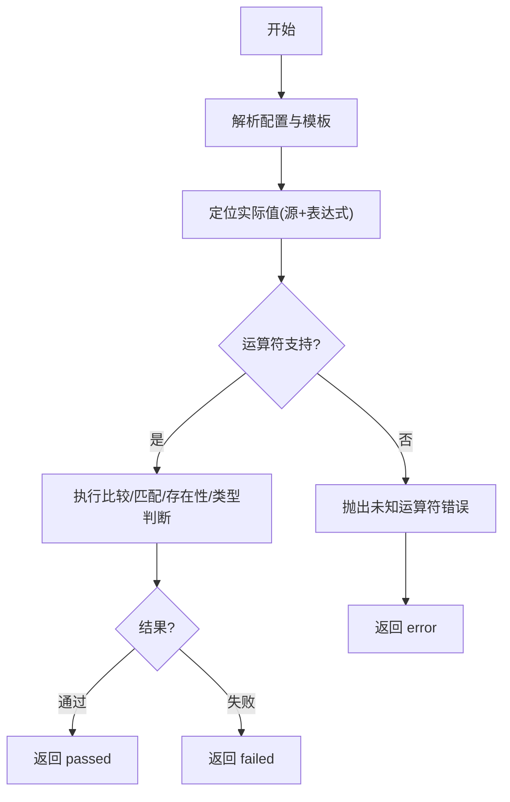
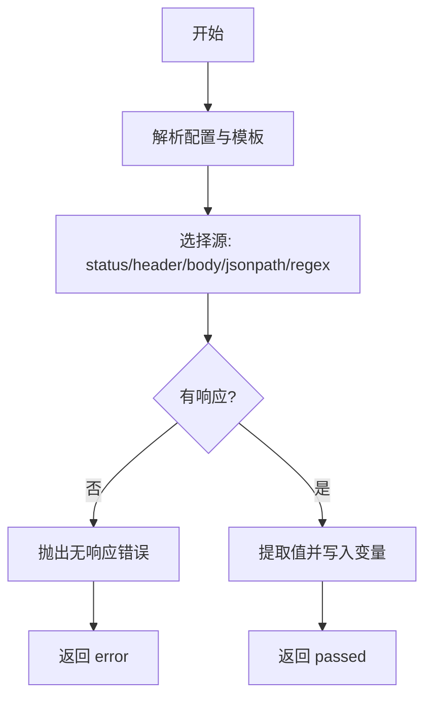
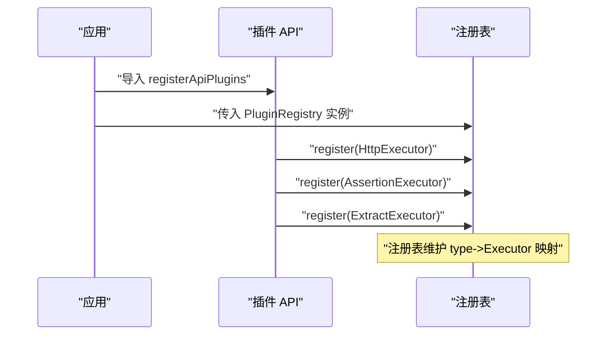
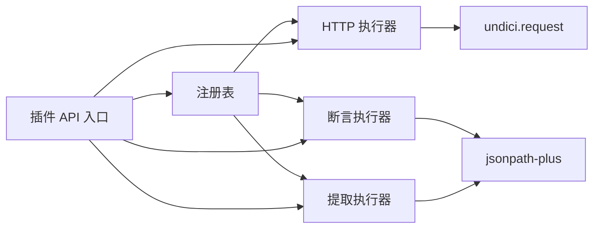

# 插件系统架构

<cite>
**本文引用的文件**
- [packages/plugin-api/package.json](file://packages/plugin-api/package.json)
- [packages/plugin-api/src/index.ts](file://packages/plugin-api/src/index.ts)
- [packages/plugin-api/src/http-executor.ts](file://packages/plugin-api/src/http-executor.ts)
- [packages/plugin-api/src/assertions.ts](file://packages/plugin-api/src/assertions.ts)
- [packages/plugin-api/src/extractors.ts](file://packages/plugin-api/src/extractors.ts)
- [packages/core/src/index.ts](file://packages/core/src/index.ts)
- [packages/core/src/plugins/executor.ts](file://packages/core/src/plugins/executor.ts)
- [packages/core/src/plugins/registry.ts](file://packages/core/src/plugins/registry.ts)
- [packages/core/src/models/test-step.ts](file://packages/core/src/models/test-step.ts)
- [packages/shared/src/index.ts](file://packages/shared/src/index.ts)
</cite>

## 目录
1. [简介](#简介)
2. [项目结构](#项目结构)
3. [核心组件](#核心组件)
4. [架构总览](#架构总览)
5. [详细组件分析](#详细组件分析)
6. [依赖关系分析](#依赖关系分析)
7. [性能考量](#性能考量)
8. [故障排查指南](#故障排查指南)
9. [结论](#结论)
10. [附录：插件开发与集成最佳实践](#附录插件开发与集成最佳实践)

## 简介
本文件系统化阐述 AI 测试器的插件系统架构，重点覆盖以下方面：
- 插件注册表的设计理念与执行器模式实现
- 插件生命周期管理（可选 setup/teardown）
- 类型安全与配置校验（Zod Schema 驱动）
- 插件接口定义、执行器实现与插件发现机制
- 典型插件（HTTP 执行器、断言执行器、提取执行器）的工作流与数据流
- 扩展性设计、性能与安全限制
- 插件开发示例与集成最佳实践

## 项目结构
插件系统由“核心层”和“插件 API 层”组成：
- 核心层提供执行器接口、注册表、测试步骤模型与运行上下文等基础能力
- 插件 API 层提供内置执行器（HTTP/断言/提取），并通过统一入口进行注册

图表来源
- [packages/core/src/index.ts:1-5](file://packages/core/src/index.ts#L1-L5)
- [packages/core/src/plugins/index.ts:1-3](file://packages/core/src/plugins/index.ts#L1-L3)
- [packages/core/src/plugins/executor.ts:1-23](file://packages/core/src/plugins/executor.ts#L1-L23)
- [packages/core/src/plugins/registry.ts:1-29](file://packages/core/src/plugins/registry.ts#L1-L29)
- [packages/core/src/models/test-step.ts:1-102](file://packages/core/src/models/test-step.ts#L1-L102)
- [packages/plugin-api/src/index.ts:1-15](file://packages/plugin-api/src/index.ts#L1-L15)
- [packages/plugin-api/src/http-executor.ts:1-95](file://packages/plugin-api/src/http-executor.ts#L1-L95)
- [packages/plugin-api/src/assertions.ts:1-112](file://packages/plugin-api/src/assertions.ts#L1-L112)
- [packages/plugin-api/src/extractors.ts:1-68](file://packages/plugin-api/src/extractors.ts#L1-L68)
- [packages/plugin-api/package.json:1-33](file://packages/plugin-api/package.json#L1-L33)

章节来源
- [packages/core/src/index.ts:1-5](file://packages/core/src/index.ts#L1-L5)
- [packages/core/src/plugins/index.ts:1-3](file://packages/core/src/plugins/index.ts#L1-L3)
- [packages/plugin-api/src/index.ts:1-15](file://packages/plugin-api/src/index.ts#L1-L15)

## 核心组件
- 执行器接口（Executor）：定义 type、configSchema 以及 execute 方法；支持可选的 setup/teardown 生命周期钩子
- 插件注册表（PluginRegistry）：以 type -> Executor 的映射存储执行器，提供注册、查询与可用类型列表
- 步骤模型与配置校验：通过 Zod 定义各步骤类型的配置模式，并在执行前进行解析与校验
- 内置执行器：
  - HTTP 执行器：发起 HTTP 请求，记录响应与耗时，写入运行上下文 lastResponse
  - 断言执行器：基于源（状态码、头、JSONPath、变量等）与运算符（相等、包含、正则、类型等）进行断言
  - 提取执行器：从响应中提取值写入上下文变量

章节来源
- [packages/core/src/plugins/executor.ts:1-23](file://packages/core/src/plugins/executor.ts#L1-L23)
- [packages/core/src/plugins/registry.ts:1-29](file://packages/core/src/plugins/registry.ts#L1-L29)
- [packages/core/src/models/test-step.ts:1-102](file://packages/core/src/models/test-step.ts#L1-L102)
- [packages/plugin-api/src/http-executor.ts:1-95](file://packages/plugin-api/src/http-executor.ts#L1-L95)
- [packages/plugin-api/src/assertions.ts:1-112](file://packages/plugin-api/src/assertions.ts#L1-L112)
- [packages/plugin-api/src/extractors.ts:1-68](file://packages/plugin-api/src/extractors.ts#L1-L68)

## 架构总览
插件系统采用“执行器模式 + 注册表 + 类型驱动校验”的架构：
- 注册阶段：插件 API 将内置执行器注册到全局注册表
- 运行阶段：引擎根据 TestStep.type 查找对应执行器，使用对应 configSchema 解析配置，调用 execute 并产出标准化结果
- 生命周期：执行器可选实现 setup/teardown，在测试运行前后完成资源准备/清理

图表来源
- [packages/core/src/plugins/registry.ts:13-23](file://packages/core/src/plugins/registry.ts#L13-L23)
- [packages/core/src/plugins/executor.ts:15-22](file://packages/core/src/plugins/executor.ts#L15-L22)
- [packages/plugin-api/src/http-executor.ts:11-93](file://packages/plugin-api/src/http-executor.ts#L11-L93)
- [packages/plugin-api/src/assertions.ts:11-40](file://packages/plugin-api/src/assertions.ts#L11-L40)
- [packages/plugin-api/src/extractors.ts:11-34](file://packages/plugin-api/src/extractors.ts#L11-L34)

## 详细组件分析

### 执行器接口与生命周期
- 接口职责
  - type：唯一标识执行器类型
  - configSchema：每种执行器的配置校验模式
  - execute(step, context)：执行单步逻辑并返回标准化结果
  - 可选钩子：setup(context)、teardown(context)，用于资源初始化与释放
- 结果模型
  - 统一输出字段：status、durationMs、request/response/assertion/extractedVar/error
  - 支持多状态：passed、failed、error、skipped

图表来源
- [packages/core/src/plugins/executor.ts:5-22](file://packages/core/src/plugins/executor.ts#L5-L22)

章节来源
- [packages/core/src/plugins/executor.ts:1-23](file://packages/core/src/plugins/executor.ts#L1-L23)

### 插件注册表
- 设计要点
  - 使用 Map 存储 type -> Executor
  - 注册时禁止重复类型
  - 提供 get/getOrThrow/listTypes 查询能力
- 错误处理
  - 重复注册抛出错误
  - 未找到类型时 getOrThrow 抛出错误并提示可用类型

图表来源
- [packages/core/src/plugins/registry.ts:6-11](file://packages/core/src/plugins/registry.ts#L6-L11)

章节来源
- [packages/core/src/plugins/registry.ts:1-29](file://packages/core/src/plugins/registry.ts#L1-L29)

### HTTP 执行器
- 功能概述
  - 解析并模板化 URL/Headers/Body
  - 发起 HTTP 请求（带超时）
  - 解析响应体（JSON/文本）
  - 汇总响应头、状态码、响应时间
  - 将响应写入运行上下文 lastResponse，供后续断言/提取使用
- 关键流程

图表来源
- [packages/plugin-api/src/http-executor.ts:11-93](file://packages/plugin-api/src/http-executor.ts#L11-L93)

章节来源
- [packages/plugin-api/src/http-executor.ts:1-95](file://packages/plugin-api/src/http-executor.ts#L1-L95)

### 断言执行器
- 数据源
  - status：响应状态码
  - header：响应头（需表达式指定头名）
  - body：完整响应体
  - jsonpath：基于 JSONPath 的路径提取
  - variable：运行上下文变量
- 运算符
  - 基本比较：equals、not_equals、gt/gte/lt/lte
  - 包含关系：contains、not_contains
  - 正则匹配：matches
  - 存在性：exists、not_exists
  - 类型判断：type_is
- 错误处理
  - 缺少必要表达式或未知源/运算符时抛错
  - 执行异常捕获并返回 error 状态

图表来源
- [packages/plugin-api/src/assertions.ts:42-99](file://packages/plugin-api/src/assertions.ts#L42-L99)

章节来源
- [packages/plugin-api/src/assertions.ts:1-112](file://packages/plugin-api/src/assertions.ts#L1-L112)

### 提取执行器
- 数据源
  - status/header/body
  - jsonpath：基于 JSONPath 的路径提取
  - regex：基于正则表达式的匹配（优先返回首捕获组）
- 行为
  - 从响应中提取值并写入运行上下文变量
  - 异常场景抛错（如无响应、表达式缺失）

图表来源
- [packages/plugin-api/src/extractors.ts:36-66](file://packages/plugin-api/src/extractors.ts#L36-L66)

章节来源
- [packages/plugin-api/src/extractors.ts:1-68](file://packages/plugin-api/src/extractors.ts#L1-L68)

### 插件发现与注册
- 插件 API 入口导出执行器类与注册函数
- 调用 registerApiPlugins(registry) 将内置执行器注册到全局注册表
- 注册后可通过 type 在运行时动态查找执行器

图表来源
- [packages/plugin-api/src/index.ts:10-14](file://packages/plugin-api/src/index.ts#L10-L14)
- [packages/core/src/plugins/registry.ts:6-11](file://packages/core/src/plugins/registry.ts#L6-L11)

章节来源
- [packages/plugin-api/src/index.ts:1-15](file://packages/plugin-api/src/index.ts#L1-L15)

### 类型安全与配置校验
- 步骤类型与配置
  - StepType：http、assertion、extract、call、load-dataset
  - 各类型配置使用 Zod Schema 校验，确保运行期类型安全
- 执行前解析
  - 执行器在执行前使用各自 configSchema 对 step.config 进行 parse，失败即早返回 error 状态
- 运行上下文
  - 提供模板解析与变量存储能力，供执行器读写 lastResponse 与 variables

章节来源
- [packages/core/src/models/test-step.ts:1-102](file://packages/core/src/models/test-step.ts#L1-L102)

## 依赖关系分析
- 插件 API 依赖核心层的执行器接口、运行上下文与步骤模型
- 插件 API 通过注册函数将执行器注册到全局注册表
- 执行器内部依赖外部库（如 undici、jsonpath-plus）进行网络与数据提取

图表来源
- [packages/plugin-api/src/http-executor.ts:1-5](file://packages/plugin-api/src/http-executor.ts#L1-L5)
- [packages/plugin-api/src/assertions.ts:1-5](file://packages/plugin-api/src/assertions.ts#L1-L5)
- [packages/plugin-api/src/extractors.ts:1-5](file://packages/plugin-api/src/extractors.ts#L1-L5)
- [packages/plugin-api/src/index.ts:1-8](file://packages/plugin-api/src/index.ts#L1-L8)

章节来源
- [packages/plugin-api/package.json:21-26](file://packages/plugin-api/package.json#L21-L26)

## 性能考量
- HTTP 请求超时控制：默认超时在配置中设定，避免阻塞
- 响应体解析：优先尝试 JSON，失败回退为文本，减少不必要的解析开销
- 响应头扁平化：统一字符串表示，便于断言与日志输出
- 断言与提取：尽量使用 JSONPath/正则前先做存在性检查，减少无效计算
- 执行器粒度：将复杂逻辑拆分为多个小步骤，提升可缓存与可观测性

## 故障排查指南
- 注册冲突
  - 现象：注册相同 type 抛错
  - 处理：更换执行器 type 或移除重复注册
- 类型未找到
  - 现象：getOrThrow 未找到类型并列出可用类型
  - 处理：确认步骤 type 与已注册类型一致
- 配置校验失败
  - 现象：执行器 parse 失败返回 error
  - 处理：对照各类型配置 Schema 修正字段
- 断言/提取异常
  - 现象：源或表达式不合法导致抛错
  - 处理：检查 source/expression 是否满足要求

章节来源
- [packages/core/src/plugins/registry.ts:7-22](file://packages/core/src/plugins/registry.ts#L7-L22)
- [packages/plugin-api/src/assertions.ts:42-63](file://packages/plugin-api/src/assertions.ts#L42-L63)
- [packages/plugin-api/src/extractors.ts:36-66](file://packages/plugin-api/src/extractors.ts#L36-L66)

## 结论
该插件系统以“执行器 + 注册表 + 类型安全校验”为核心，实现了高内聚、低耦合的扩展框架。通过统一的结果模型与生命周期钩子，既保证了执行的一致性，也为自定义扩展提供了清晰边界。内置 HTTP/断言/提取执行器展示了典型的插件实现范式，可作为二次开发的参考。

## 附录：插件开发与集成最佳实践

- 开发自定义执行器
  - 实现 Executor 接口，定义 type 与 configSchema
  - 在 execute 中完成业务逻辑，产出标准化结果
  - 如需资源准备/清理，实现 setup/teardown
  - 参考路径：[packages/core/src/plugins/executor.ts:15-22](file://packages/core/src/plugins/executor.ts#L15-L22)

- 注册插件
  - 在应用启动阶段调用 registerApiPlugins 或直接向注册表注册
  - 确保 type 唯一且与步骤配置一致
  - 参考路径：[packages/plugin-api/src/index.ts:10-14](file://packages/plugin-api/src/index.ts#L10-L14)

- 在测试用例中使用
  - 步骤类型与配置需符合对应 Schema
  - 断言/提取步骤依赖上一步的 lastResponse 或变量
  - 参考路径：[packages/core/src/models/test-step.ts:64-82](file://packages/core/src/models/test-step.ts#L64-L82)

- 扩展性设计建议
  - 将复杂步骤拆分为多个小步骤，提升可维护性
  - 使用变量传递中间结果，避免硬编码
  - 为长耗时操作提供重试与超时策略

- 安全限制
  - 严格校验输入参数，避免注入与越界访问
  - 对外部网络请求设置合理超时与重试上限
  - 对断言与提取表达式进行白名单与长度限制