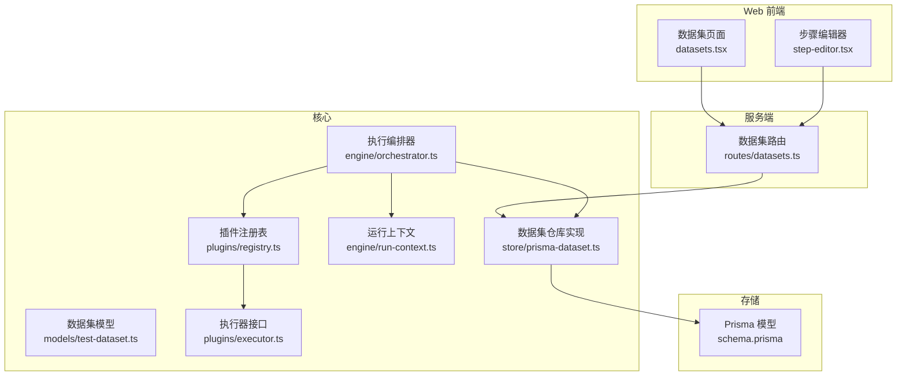
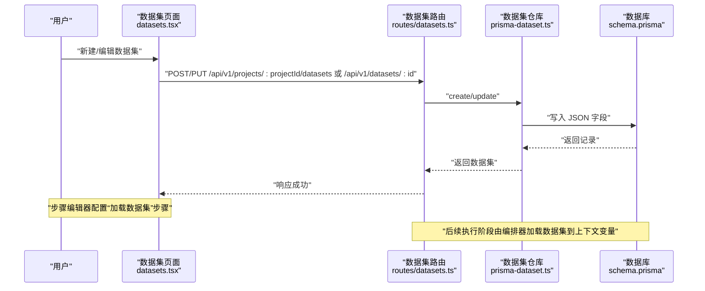
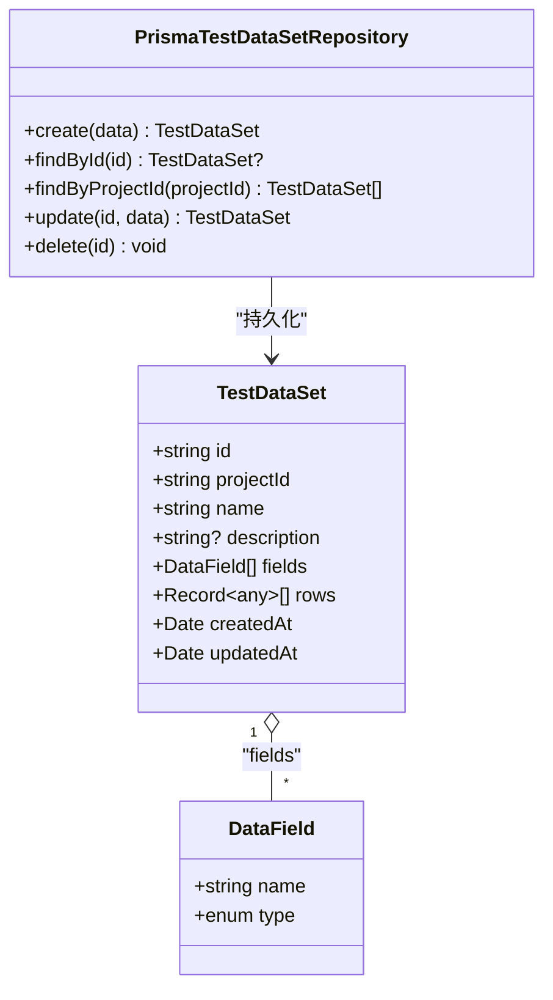
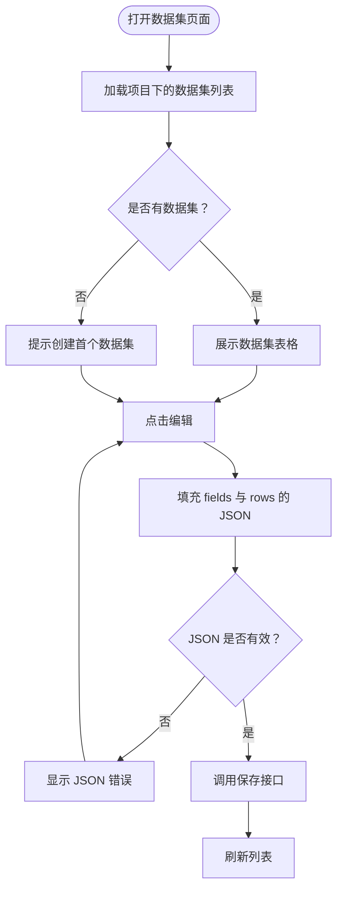
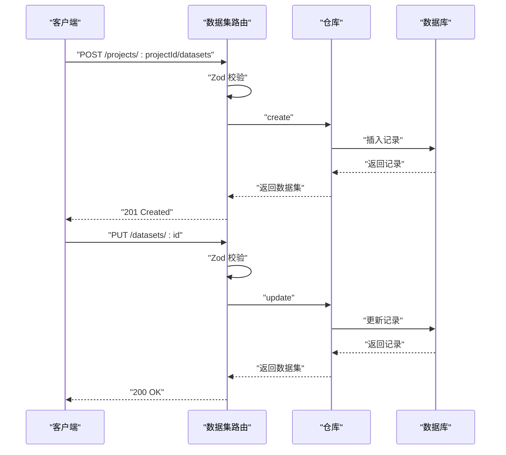
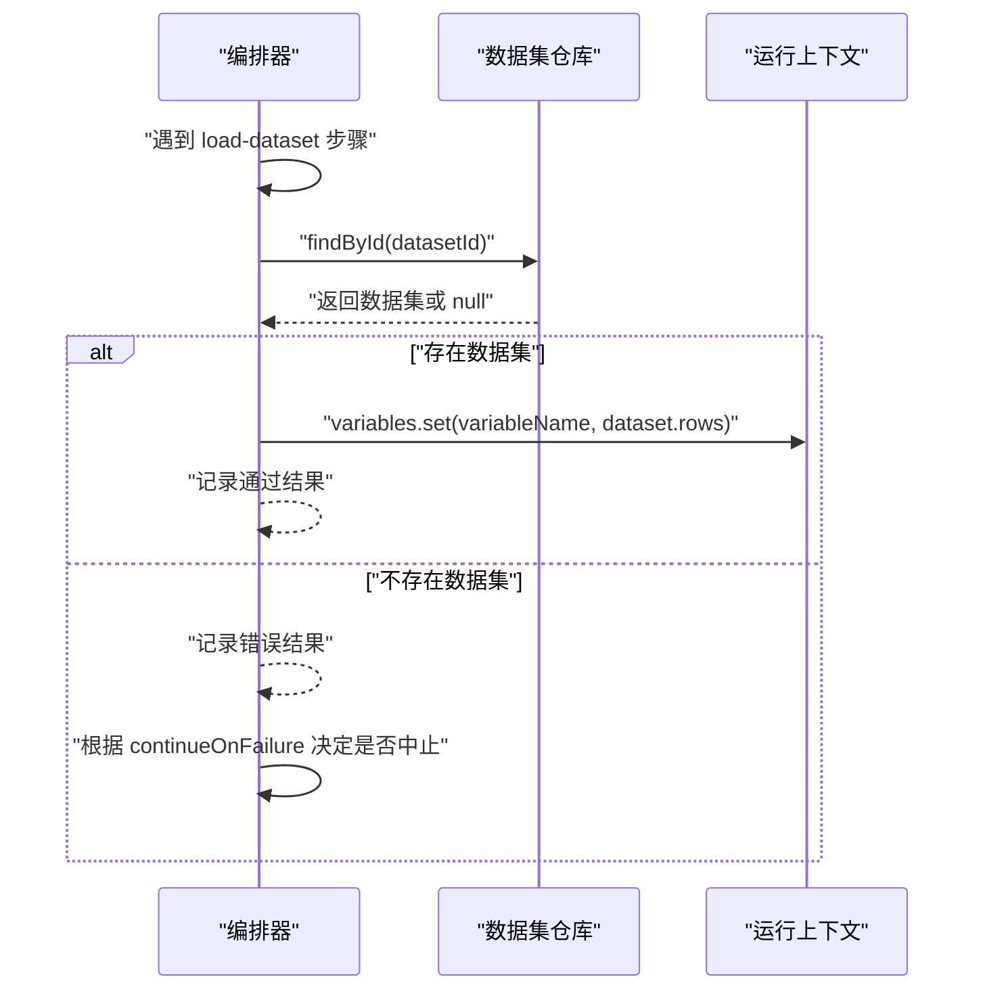
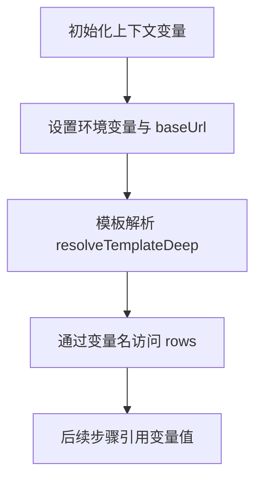
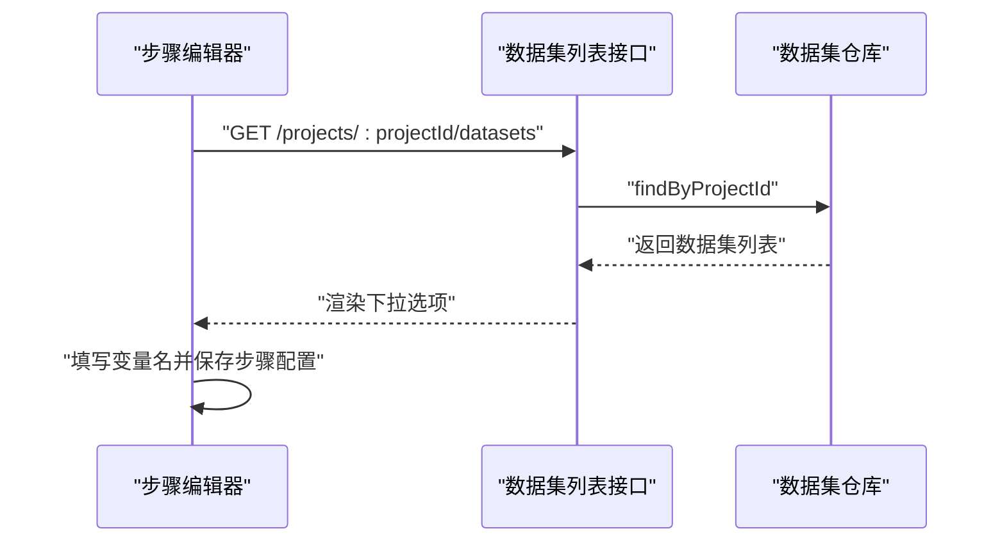
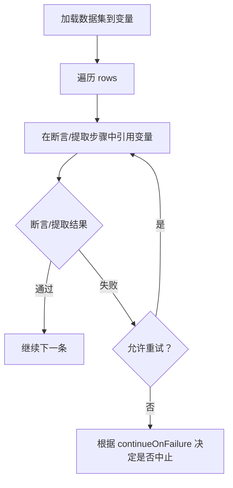
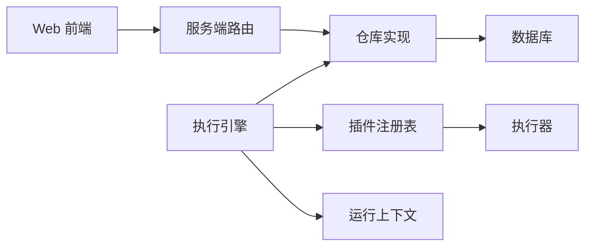

# 数据驱动测试

<cite>
**本文引用的文件**
- [packages/core/src/models/test-dataset.ts](file://packages/core/src/models/test-dataset.ts)
- [packages/core/src/store/prisma-dataset.ts](file://packages/core/src/store/prisma-dataset.ts)
- [packages/server/src/routes/datasets.ts](file://packages/server/src/routes/datasets.ts)
- [prisma/schema.prisma](file://prisma/schema.prisma)
- [packages/web/src/pages/datasets.tsx](file://packages/web/src/pages/datasets.tsx)
- [packages/web/src/components/step-editor.tsx](file://packages/web/src/components/step-editor.tsx)
- [packages/core/src/engine/orchestrator.ts](file://packages/core/src/engine/orchestrator.ts)
- [packages/core/src/engine/run-context.ts](file://packages/core/src/engine/run-context.ts)
- [packages/core/src/plugins/executor.ts](file://packages/core/src/plugins/executor.ts)
- [packages/core/src/plugins/registry.ts](file://packages/core/src/plugins/registry.ts)
- [packages/shared/src/errors.ts](file://packages/shared/src/errors.ts)
</cite>

## 目录
1. [简介](#简介)
2. [项目结构](#项目结构)
3. [核心组件](#核心组件)
4. [架构总览](#架构总览)
5. [详细组件分析](#详细组件分析)
6. [依赖关系分析](#依赖关系分析)
7. [性能考虑](#性能考虑)
8. [故障排查指南](#故障排查指南)
9. [结论](#结论)
10. [附录](#附录)

## 简介
本文件围绕 AI 测试器的数据驱动测试能力进行系统化说明，重点覆盖以下方面：
- 数据集（TestDataSet）的模型定义与持久化存储
- CSV 导入与 JSON 编辑的数据集创建流程
- 行列数据的操作与变量绑定机制
- 在测试用例中引用数据集、进行循环执行与条件判断的实现路径
- 数据验证规则、错误处理与性能优化策略
- 设计模式与最佳实践建议

## 项目结构
数据驱动测试相关的关键模块分布于多个包中：
- 核心模型与仓库：定义数据集模型、Prisma 仓库实现与数据库表结构
- 服务端路由：提供数据集的增删改查接口
- Web 前端页面与步骤编辑器：支持数据集的可视化创建与配置
- 执行引擎：负责在运行时加载数据集到上下文变量，并驱动后续步骤执行
- 插件体系：统一的执行器接口与注册机制，支撑扩展新的步骤类型

图表来源
- [packages/web/src/pages/datasets.tsx:1-212](file://packages/web/src/pages/datasets.tsx#L1-L212)
- [packages/web/src/components/step-editor.tsx:67-377](file://packages/web/src/components/step-editor.tsx#L67-L377)
- [packages/server/src/routes/datasets.ts:1-49](file://packages/server/src/routes/datasets.ts#L1-L49)
- [packages/core/src/models/test-dataset.ts:1-48](file://packages/core/src/models/test-dataset.ts#L1-L48)
- [packages/core/src/store/prisma-dataset.ts:1-69](file://packages/core/src/store/prisma-dataset.ts#L1-L69)
- [prisma/schema.prisma:126-139](file://prisma/schema.prisma#L126-L139)
- [packages/core/src/engine/orchestrator.ts:1-296](file://packages/core/src/engine/orchestrator.ts#L1-L296)
- [packages/core/src/engine/run-context.ts:1-80](file://packages/core/src/engine/run-context.ts#L1-L80)
- [packages/core/src/plugins/executor.ts:1-23](file://packages/core/src/plugins/executor.ts#L1-L23)
- [packages/core/src/plugins/registry.ts:1-29](file://packages/core/src/plugins/registry.ts#L1-L29)

章节来源
- [packages/core/src/models/test-dataset.ts:1-48](file://packages/core/src/models/test-dataset.ts#L1-L48)
- [packages/core/src/store/prisma-dataset.ts:1-69](file://packages/core/src/store/prisma-dataset.ts#L1-L69)
- [prisma/schema.prisma:126-139](file://prisma/schema.prisma#L126-L139)
- [packages/server/src/routes/datasets.ts:1-49](file://packages/server/src/routes/datasets.ts#L1-L49)
- [packages/web/src/pages/datasets.tsx:1-212](file://packages/web/src/pages/datasets.tsx#L1-L212)
- [packages/web/src/components/step-editor.tsx:67-377](file://packages/web/src/components/step-editor.tsx#L67-L377)
- [packages/core/src/engine/orchestrator.ts:1-296](file://packages/core/src/engine/orchestrator.ts#L1-L296)
- [packages/core/src/engine/run-context.ts:1-80](file://packages/core/src/engine/run-context.ts#L1-L80)
- [packages/core/src/plugins/executor.ts:1-23](file://packages/core/src/plugins/executor.ts#L1-L23)
- [packages/core/src/plugins/registry.ts:1-29](file://packages/core/src/plugins/registry.ts#L1-L29)

## 核心组件
- 数据集模型与校验
  - 定义字段类型枚举、字段结构与数据集结构，并通过 Zod 进行输入校验
  - 字段类型涵盖字符串、数值、布尔、邮箱、UUID、日期与自定义等
- 数据集仓库实现
  - 使用 Prisma 访问数据库，提供创建、查询、更新、删除方法
  - 将 fields 与 rows 以 JSON 字符串形式存储，读取时解析为对象数组
- 服务端路由
  - 提供创建、列表、查询、更新、删除数据集的 REST 接口
  - 使用模型层的 Zod Schema 对请求体进行解析与校验
- Web 页面与步骤编辑器
  - 数据集页面支持新建、编辑、删除数据集；编辑时以 JSON 文本域展示 fields 与 rows
  - 步骤编辑器支持“加载数据集”步骤，选择数据集并指定变量名，用于后续步骤引用
- 执行引擎
  - 在运行时加载数据集到上下文变量，支持在后续步骤中通过模板语法引用
  - 支持失败时的继续执行策略与重试机制
- 运行上下文
  - 维护变量映射 Map，提供模板解析能力，支持点号与索引访问
- 插件体系
  - 统一的执行器接口与注册表，便于扩展新的步骤类型

章节来源
- [packages/core/src/models/test-dataset.ts:1-48](file://packages/core/src/models/test-dataset.ts#L1-L48)
- [packages/core/src/store/prisma-dataset.ts:1-69](file://packages/core/src/store/prisma-dataset.ts#L1-L69)
- [packages/server/src/routes/datasets.ts:1-49](file://packages/server/src/routes/datasets.ts#L1-L49)
- [packages/web/src/pages/datasets.tsx:125-212](file://packages/web/src/pages/datasets.tsx#L125-L212)
- [packages/web/src/components/step-editor.tsx:344-377](file://packages/web/src/components/step-editor.tsx#L344-L377)
- [packages/core/src/engine/orchestrator.ts:205-240](file://packages/core/src/engine/orchestrator.ts#L205-L240)
- [packages/core/src/engine/run-context.ts:35-78](file://packages/core/src/engine/run-context.ts#L35-L78)
- [packages/core/src/plugins/executor.ts:1-23](file://packages/core/src/plugins/executor.ts#L1-L23)
- [packages/core/src/plugins/registry.ts:1-29](file://packages/core/src/plugins/registry.ts#L1-L29)

## 架构总览
下图展示了从 Web 创建数据集到执行引擎加载数据集并参与测试用例执行的整体流程。

图表来源
- [packages/web/src/pages/datasets.tsx:125-212](file://packages/web/src/pages/datasets.tsx#L125-L212)
- [packages/server/src/routes/datasets.ts:1-49](file://packages/server/src/routes/datasets.ts#L1-L49)
- [packages/core/src/store/prisma-dataset.ts:23-68](file://packages/core/src/store/prisma-dataset.ts#L23-L68)
- [prisma/schema.prisma:126-139](file://prisma/schema.prisma#L126-L139)

## 详细组件分析

### 数据集模型与存储
- 模型要点
  - 字段类型枚举与字段结构定义，确保字段名非空且类型合法
  - 数据集结构包含标识、项目关联、名称、描述、字段定义数组与行数据数组
  - 创建与更新使用对应的 Zod Schema 进行参数校验
- 存储实现
  - 仓库实现将 fields 与 rows 序列化为 JSON 字符串存入数据库
  - 查询时反序列化为对象数组，便于后续处理
- 数据库表结构
  - 数据集模型包含 JSON 字段用于存储字段与行数据，并建立项目索引

图表来源
- [packages/core/src/models/test-dataset.ts:13-27](file://packages/core/src/models/test-dataset.ts#L13-L27)
- [packages/core/src/store/prisma-dataset.ts:10-21](file://packages/core/src/store/prisma-dataset.ts#L10-L21)
- [prisma/schema.prisma:126-139](file://prisma/schema.prisma#L126-L139)

章节来源
- [packages/core/src/models/test-dataset.ts:1-48](file://packages/core/src/models/test-dataset.ts#L1-L48)
- [packages/core/src/store/prisma-dataset.ts:1-69](file://packages/core/src/store/prisma-dataset.ts#L1-L69)
- [prisma/schema.prisma:126-139](file://prisma/schema.prisma#L126-L139)

### Web 端数据集管理
- 数据集页面
  - 列表展示名称、字段数、行数与更新时间
  - 支持新建与编辑弹窗，编辑时默认填充示例数据结构
- 数据集编辑对话框
  - 名称必填，描述可选
  - JSON 文本域用于编辑 fields 与 rows，保存前进行 JSON 解析校验
  - 保存成功后刷新列表

图表来源
- [packages/web/src/pages/datasets.tsx:21-123](file://packages/web/src/pages/datasets.tsx#L21-L123)
- [packages/web/src/pages/datasets.tsx:125-212](file://packages/web/src/pages/datasets.tsx#L125-L212)

章节来源
- [packages/web/src/pages/datasets.tsx:1-212](file://packages/web/src/pages/datasets.tsx#L1-L212)

### 服务端数据集接口
- 路由职责
  - 新建：接收项目 ID 与数据集信息，解析并创建
  - 列表：按项目 ID 查询数据集
  - 查询：按 ID 查询单个数据集
  - 更新：解析更新参数并更新
  - 删除：删除指定 ID 的数据集
- 校验与错误
  - 使用 Zod Schema 对请求体进行严格校验
  - 未找到资源时返回 404

图表来源
- [packages/server/src/routes/datasets.ts:1-49](file://packages/server/src/routes/datasets.ts#L1-L49)
- [packages/core/src/models/test-dataset.ts:29-42](file://packages/core/src/models/test-dataset.ts#L29-L42)

章节来源
- [packages/server/src/routes/datasets.ts:1-49](file://packages/server/src/routes/datasets.ts#L1-L49)
- [packages/core/src/models/test-dataset.ts:1-48](file://packages/core/src/models/test-dataset.ts#L1-L48)

### 执行引擎中的数据集加载
- 加载步骤
  - “加载数据集”步骤根据配置项获取数据集 ID 与变量名
  - 从仓库查询数据集，若不存在则抛出错误
  - 将数据集的 rows 数组设置到上下文变量中，变量名为配置项指定的名称
- 结果记录
  - 成功时记录状态为通过，并在提取变量中记录变量名与行数摘要
  - 失败时记录状态为错误，并携带消息与堆栈
- 继续执行策略
  - 若当前步骤配置为失败不中断，则继续执行后续步骤；否则标记为中止

图表来源
- [packages/core/src/engine/orchestrator.ts:205-240](file://packages/core/src/engine/orchestrator.ts#L205-L240)
- [packages/core/src/engine/run-context.ts:11-33](file://packages/core/src/engine/run-context.ts#L11-L33)

章节来源
- [packages/core/src/engine/orchestrator.ts:205-240](file://packages/core/src/engine/orchestrator.ts#L205-L240)
- [packages/core/src/engine/run-context.ts:11-33](file://packages/core/src/engine/run-context.ts#L11-L33)

### 变量绑定与模板解析
- 变量来源
  - 环境变量与项目/套件/运行级别的变量合并后注入上下文
- 模板解析
  - 支持在字符串、数组与对象中递归解析模板占位符
  - 占位符语法为双花括号，支持点号与数组索引访问
- 在步骤中的应用
  - 加载数据集后，rows 数组作为变量值，可在后续步骤中通过变量名引用
  - 可结合断言与提取步骤对变量进行断言与二次提取

图表来源
- [packages/core/src/engine/run-context.ts:18-54](file://packages/core/src/engine/run-context.ts#L18-L54)
- [packages/core/src/engine/run-context.ts:56-78](file://packages/core/src/engine/run-context.ts#L56-L78)

章节来源
- [packages/core/src/engine/run-context.ts:1-80](file://packages/core/src/engine/run-context.ts#L1-L80)

### 步骤编辑器与数据集引用
- 配置项
  - 选择数据集（下拉搜索）
  - 指定变量名（用于后续步骤引用）
- 动态加载
  - 当步骤类型为“加载数据集”时，前端按当前项目 ID 拉取可用数据集列表

图表来源
- [packages/web/src/components/step-editor.tsx:67-73](file://packages/web/src/components/step-editor.tsx#L67-L73)
- [packages/web/src/components/step-editor.tsx:344-377](file://packages/web/src/components/step-editor.tsx#L344-L377)
- [packages/server/src/routes/datasets.ts:19-26](file://packages/server/src/routes/datasets.ts#L19-L26)

章节来源
- [packages/web/src/components/step-editor.tsx:67-73](file://packages/web/src/components/step-editor.tsx#L67-L73)
- [packages/web/src/components/step-editor.tsx:344-377](file://packages/web/src/components/step-editor.tsx#L344-L377)
- [packages/server/src/routes/datasets.ts:19-26](file://packages/server/src/routes/datasets.ts#L19-L26)

### 循环执行与条件判断
- 循环执行
  - 当前实现通过“加载数据集”步骤将整批 rows 注入变量，后续步骤可逐条消费
  - 典型做法是在断言/提取步骤中使用模板语法访问变量中的某一行或字段
- 条件判断
  - 断言步骤支持多种比较运算符与类型检查，可基于变量值进行条件判断
  - 执行器在失败时可按配置进行重试，或根据 continueOnFailure 决定是否中止

图表来源
- [packages/core/src/engine/orchestrator.ts:242-266](file://packages/core/src/engine/orchestrator.ts#L242-L266)
- [packages/plugin-api/src/assertions.ts:66-111](file://packages/plugin-api/src/assertions.ts#L66-L111)

章节来源
- [packages/core/src/engine/orchestrator.ts:242-266](file://packages/core/src/engine/orchestrator.ts#L242-L266)
- [packages/plugin-api/src/assertions.ts:66-111](file://packages/plugin-api/src/assertions.ts#L66-L111)

### 数据验证规则与错误处理
- 输入验证
  - 使用 Zod Schema 对创建与更新请求进行严格校验
  - 字段名长度限制、字段类型枚举校验、数组默认值保证
- 错误处理
  - 未找到资源返回 404
  - 参数校验失败返回 400
  - 执行阶段的错误记录在步骤结果中，包含消息与堆栈
- 统一错误类型
  - 提供通用错误类与特定错误类型（如未找到、参数错误）

章节来源
- [packages/core/src/models/test-dataset.ts:29-42](file://packages/core/src/models/test-dataset.ts#L29-L42)
- [packages/server/src/routes/datasets.ts:29-34](file://packages/server/src/routes/datasets.ts#L29-L34)
- [packages/shared/src/errors.ts:1-25](file://packages/shared/src/errors.ts#L1-L25)
- [packages/core/src/engine/orchestrator.ts:223-235](file://packages/core/src/engine/orchestrator.ts#L223-L235)

## 依赖关系分析
- 模块耦合
  - Web 前端通过服务端路由与仓库交互，仓库依赖 Prisma 客户端与数据库
  - 执行引擎依赖仓库与插件注册表，运行上下文提供变量解析能力
- 关键依赖链
  - Web → 路由 → 仓库 → 数据库
  - 执行引擎 → 仓库 → 数据库
  - 执行引擎 → 插件注册表 → 执行器

图表来源
- [packages/server/src/routes/datasets.ts:1-49](file://packages/server/src/routes/datasets.ts#L1-L49)
- [packages/core/src/store/prisma-dataset.ts:1-69](file://packages/core/src/store/prisma-dataset.ts#L1-L69)
- [prisma/schema.prisma:126-139](file://prisma/schema.prisma#L126-L139)
- [packages/core/src/engine/orchestrator.ts:1-296](file://packages/core/src/engine/orchestrator.ts#L1-L296)
- [packages/core/src/plugins/registry.ts:1-29](file://packages/core/src/plugins/registry.ts#L1-L29)
- [packages/core/src/plugins/executor.ts:1-23](file://packages/core/src/plugins/executor.ts#L1-L23)
- [packages/core/src/engine/run-context.ts:1-80](file://packages/core/src/engine/run-context.ts#L1-L80)

章节来源
- [packages/server/src/routes/datasets.ts:1-49](file://packages/server/src/routes/datasets.ts#L1-L49)
- [packages/core/src/store/prisma-dataset.ts:1-69](file://packages/core/src/store/prisma-dataset.ts#L1-L69)
- [packages/core/src/engine/orchestrator.ts:1-296](file://packages/core/src/engine/orchestrator.ts#L1-L296)
- [packages/core/src/plugins/registry.ts:1-29](file://packages/core/src/plugins/registry.ts#L1-L29)
- [packages/core/src/plugins/executor.ts:1-23](file://packages/core/src/plugins/executor.ts#L1-L23)
- [packages/core/src/engine/run-context.ts:1-80](file://packages/core/src/engine/run-context.ts#L1-L80)

## 性能考虑
- 数据序列化与反序列化
  - fields 与 rows 以 JSON 字符串存储，读写时进行序列化/反序列化，建议控制单条记录大小与字段数量
- 查询与排序
  - 按项目 ID 查询数据集并按创建时间倒序，避免全表扫描
- 执行阶段
  - 加载数据集仅一次，后续步骤通过变量引用，减少重复 IO
  - 断言与提取步骤应尽量避免复杂正则与深层对象遍历
- 并发与重试
  - 步骤重试次数有限，避免过度重试导致整体耗时增加

## 故障排查指南
- 数据集无法加载
  - 确认数据集 ID 是否正确，是否存在
  - 检查步骤配置中的变量名是否与后续引用一致
- JSON 校验失败
  - 检查 fields 与 rows 的 JSON 结构是否符合预期
  - 确保字段类型与数据类型匹配
- 执行失败
  - 查看步骤结果中的错误信息与堆栈
  - 根据 continueOnFailure 配置判断是否中止后续步骤
- 接口错误
  - 404：资源不存在
  - 400：请求体不符合 Zod 校验

章节来源
- [packages/core/src/engine/orchestrator.ts:223-235](file://packages/core/src/engine/orchestrator.ts#L223-L235)
- [packages/web/src/pages/datasets.tsx:154-174](file://packages/web/src/pages/datasets.tsx#L154-L174)
- [packages/shared/src/errors.ts:1-25](file://packages/shared/src/errors.ts#L1-L25)

## 结论
本方案通过清晰的模型定义、严格的输入校验与稳定的存储结构，实现了数据集的创建、管理与在测试执行中的灵活引用。执行引擎提供了可靠的变量绑定与模板解析能力，配合断言与提取步骤，能够满足大多数数据驱动测试场景。建议在实际使用中遵循最佳实践，合理组织数据结构与变量命名，以获得更好的可维护性与性能表现。

## 附录
- 最佳实践
  - 明确字段类型与约束，保持数据一致性
  - 使用变量名规范命名，避免歧义
  - 控制单次加载的数据量，必要时分批处理
  - 合理配置重试与继续执行策略，平衡稳定性与效率
- 设计模式
  - 仓库模式：隔离数据访问逻辑
  - 插件注册表：统一扩展点
  - 上下文模式：集中管理变量与解析