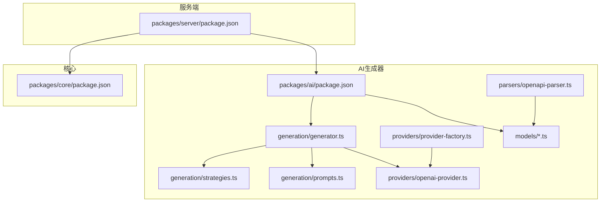
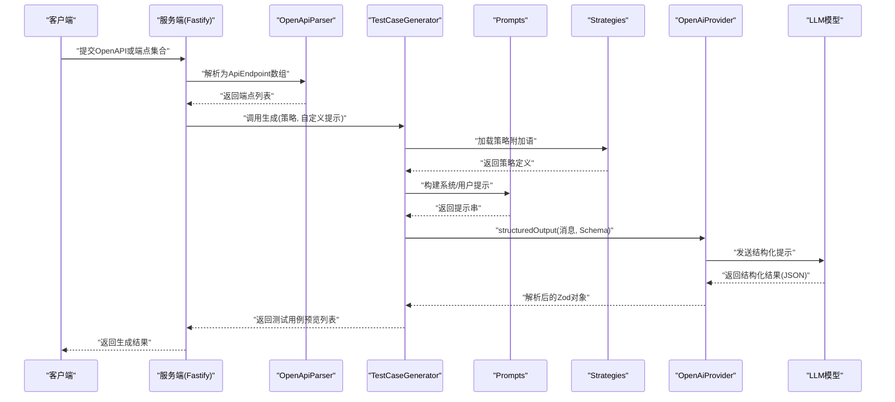
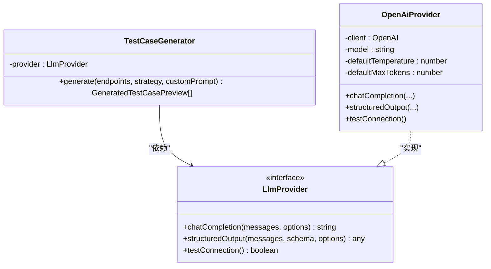
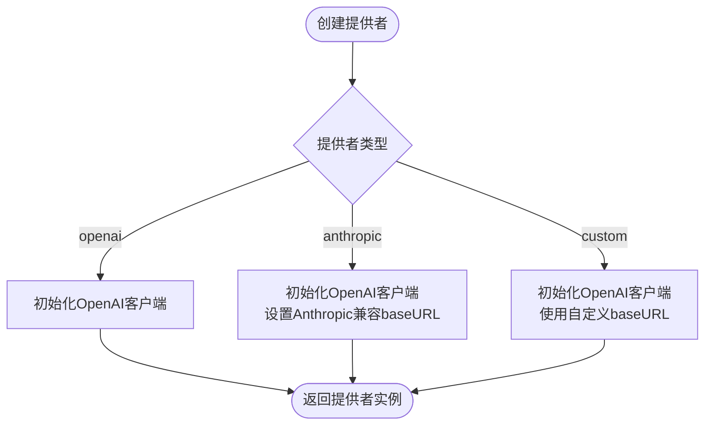
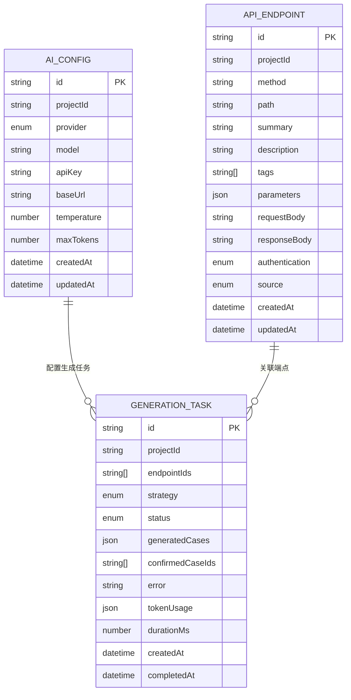
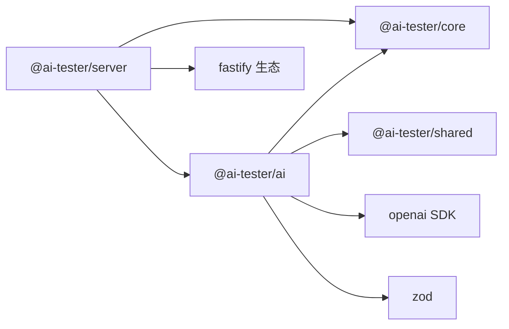

# 智能测试用例生成

<cite>
**本文引用的文件**
- [packages/ai/src/index.ts](file://packages/ai/src/index.ts)
- [packages/ai/src/generation/generator.ts](file://packages/ai/src/generation/generator.ts)
- [packages/ai/src/generation/prompts.ts](file://packages/ai/src/generation/prompts.ts)
- [packages/ai/src/generation/strategies.ts](file://packages/ai/src/generation/strategies.ts)
- [packages/ai/src/models/ai-config.ts](file://packages/ai/src/models/ai-config.ts)
- [packages/ai/src/models/generation.ts](file://packages/ai/src/models/generation.ts)
- [packages/ai/src/models/api-endpoint.ts](file://packages/ai/src/models/api-endpoint.ts)
- [packages/ai/src/providers/openai-provider.ts](file://packages/ai/src/providers/openai-provider.ts)
- [packages/ai/src/providers/provider-factory.ts](file://packages/ai/src/providers/provider-factory.ts)
- [packages/ai/src/parsers/openapi-parser.ts](file://packages/ai/src/parsers/openapi-parser.ts)
- [packages/server/package.json](file://packages/server/package.json)
- [packages/ai/package.json](file://packages/ai/package.json)
- [packages/core/package.json](file://packages/core/package.json)
</cite>

## 目录
1. [简介](#简介)
2. [项目结构](#项目结构)
3. [核心组件](#核心组件)
4. [架构总览](#架构总览)
5. [详细组件分析](#详细组件分析)
6. [依赖关系分析](#依赖关系分析)
7. [性能考虑](#性能考虑)
8. [故障排查指南](#故障排查指南)
9. [结论](#结论)
10. [附录](#附录)

## 简介
本文件面向“智能测试用例生成”能力，系统性阐述AI生成器的工作原理与最佳实践，覆盖提示工程策略、LLM模型集成、生成质量控制、配置与参数调优、模板与策略定制、结果验证与集成方式，并给出从API端点分析到测试用例生成的完整流程。

## 项目结构
该仓库采用多包工作区（pnpm workspace）组织，AI测试器相关的关键模块位于 packages/ai，核心数据模型与解析器在该包内；服务端通过 Fastify 对外暴露接口，依赖 @ai-tester/ai 提供生成能力；@ai-tester/core 提供通用模型与工具；共享模块 @ai-tester/shared 提供跨包通用类型与常量。

图示来源
- [packages/server/package.json:1-36](file://packages/server/package.json#L1-L36)
- [packages/ai/package.json:1-34](file://packages/ai/package.json#L1-L34)
- [packages/core/package.json:1-34](file://packages/core/package.json#L1-L34)

章节来源
- [packages/server/package.json:1-36](file://packages/server/package.json#L1-L36)
- [packages/ai/package.json:1-34](file://packages/ai/package.json#L1-L34)
- [packages/core/package.json:1-34](file://packages/core/package.json#L1-L34)

## 核心组件
- 生成器（TestCaseGenerator）：负责接收API端点集合、生成策略与可选自定义提示，构造系统提示与用户提示，调用LLM提供者进行结构化输出，返回测试用例预览列表。
- 提示工程（Prompts）：构建系统提示（角色、约束、格式要求）、端点上下文（方法、路径、参数、请求/响应模式、鉴权信息）、用户提示（任务指令与上下文）。
- 生成策略（Strategies）：内置四种策略（happy_path、error_cases、auth_cases、comprehensive），每种策略通过系统提示附加语增强生成焦点。
- LLM提供者与工厂（OpenAiProvider、ProviderFactory）：封装OpenAI兼容客户端，支持结构化输出（JSON Schema解析），并根据配置动态创建提供者实例。
- 数据模型（AiConfig、GenerationTask、ApiEndpoint等）：统一描述AI配置、生成任务、端点元数据与生成结果的数据契约。
- 端点解析器（OpenApiParser）：将OpenAPI/Swagger规范解析为内部ApiEndpoint对象，便于生成器消费。

章节来源
- [packages/ai/src/generation/generator.ts:1-57](file://packages/ai/src/generation/generator.ts#L1-L57)
- [packages/ai/src/generation/prompts.ts:1-73](file://packages/ai/src/generation/prompts.ts#L1-L73)
- [packages/ai/src/generation/strategies.ts:1-50](file://packages/ai/src/generation/strategies.ts#L1-L50)
- [packages/ai/src/providers/openai-provider.ts:1-79](file://packages/ai/src/providers/openai-provider.ts#L1-L79)
- [packages/ai/src/providers/provider-factory.ts:1-56](file://packages/ai/src/providers/provider-factory.ts#L1-L56)
- [packages/ai/src/models/ai-config.ts:1-34](file://packages/ai/src/models/ai-config.ts#L1-L34)
- [packages/ai/src/models/generation.ts:1-67](file://packages/ai/src/models/generation.ts#L1-L67)
- [packages/ai/src/models/api-endpoint.ts:1-53](file://packages/ai/src/models/api-endpoint.ts#L1-L53)
- [packages/ai/src/parsers/openapi-parser.ts:1-84](file://packages/ai/src/parsers/openapi-parser.ts#L1-L84)

## 架构总览
下图展示了从API端点输入到测试用例输出的端到端流程，以及各组件之间的交互关系。

图示来源
- [packages/ai/src/generation/generator.ts:27-55](file://packages/ai/src/generation/generator.ts#L27-L55)
- [packages/ai/src/generation/prompts.ts:3-72](file://packages/ai/src/generation/prompts.ts#L3-L72)
- [packages/ai/src/generation/strategies.ts:10-49](file://packages/ai/src/generation/strategies.ts#L10-L49)
- [packages/ai/src/providers/openai-provider.ts:45-63](file://packages/ai/src/providers/openai-provider.ts#L45-L63)
- [packages/ai/src/parsers/openapi-parser.ts:11-82](file://packages/ai/src/parsers/openapi-parser.ts#L11-L82)

## 详细组件分析

### 生成器（TestCaseGenerator）
- 职责：整合策略、提示与LLM提供者，完成一次完整的生成任务。
- 关键流程：
  - 参数校验：至少一个端点；策略存在。
  - 加载策略：根据策略ID获取系统提示附加语。
  - 构建提示：系统提示（含策略与自定义指令）、端点上下文、用户提示。
  - 结构化生成：调用provider.structuredOutput，使用Zod Schema约束输出。
  - 返回结果：解析后的测试用例预览数组。
- 错误处理：空端点、未知策略、LLM无结构化输出时抛出错误。
- 性能要点：温度与最大token由调用方传入，建议结合策略与输入长度调整。

图示来源
- [packages/ai/src/generation/generator.ts:20-56](file://packages/ai/src/generation/generator.ts#L20-L56)
- [packages/ai/src/providers/openai-provider.ts:14-78](file://packages/ai/src/providers/openai-provider.ts#L14-L78)

章节来源
- [packages/ai/src/generation/generator.ts:16-56](file://packages/ai/src/generation/generator.ts#L16-L56)

### 提示工程（Prompts）
- 系统提示构建：定义角色、测试用例字段、HTTP步骤与断言步骤的结构、变量占位符、策略附加语与用户自定义指令。
- 端点上下文构建：将每个端点的方法、路径、摘要、描述、鉴权、参数、请求/响应模式拼接为自然语言上下文。
- 用户提示构建：引导模型以JSON数组形式输出测试用例，强调真实、实用与可执行性。
- 最佳实践：
  - 明确优先级与标签分类，确保生成结果可被后续流水线消费。
  - 在系统提示中加入“变量占位符”与“断言属性”的约束，减少后处理成本。

章节来源
- [packages/ai/src/generation/prompts.ts:3-72](file://packages/ai/src/generation/prompts.ts#L3-L72)

### 生成策略（Strategies）
- 四种策略分别聚焦不同测试维度：
  - happy_path：正常/预期场景，验证2xx响应与主用例。
  - error_cases：错误处理与边界值，验证4xx/5xx与错误消息。
  - auth_cases：鉴权与授权，覆盖缺失/过期/无效令牌与权限不足。
  - comprehensive：综合覆盖上述三类。
- 策略通过“系统提示附加语”注入生成焦点，避免重复构建提示模板。

章节来源
- [packages/ai/src/generation/strategies.ts:10-49](file://packages/ai/src/generation/strategies.ts#L10-L49)

### LLM提供者与工厂（OpenAiProvider、ProviderFactory）
- OpenAiProvider：
  - 支持普通对话与结构化输出（基于zodResponseFormat）。
  - 默认温度与最大token可配置，具备连通性测试方法。
- ProviderFactory：
  - 根据AiConfig与解密后的API Key创建具体提供者实例。
  - 支持openai、anthropic（通过OpenAI兼容端点）、custom三种提供者类型。

图示来源
- [packages/ai/src/providers/provider-factory.ts:14-55](file://packages/ai/src/providers/provider-factory.ts#L14-L55)
- [packages/ai/src/providers/openai-provider.ts:20-28](file://packages/ai/src/providers/openai-provider.ts#L20-L28)

章节来源
- [packages/ai/src/providers/openai-provider.ts:14-78](file://packages/ai/src/providers/openai-provider.ts#L14-L78)
- [packages/ai/src/providers/provider-factory.ts:14-55](file://packages/ai/src/providers/provider-factory.ts#L14-L55)

### 数据模型（AiConfig、GenerationTask、ApiEndpoint）
- AiConfig：描述AI提供者的配置项（provider、model、apiKey、baseUrl、temperature、maxTokens等），并提供创建/更新Schema。
- GenerationTask：描述一次生成任务的状态、关联端点、策略、生成结果、Token用量与耗时等。
- ApiEndpoint：描述单个API端点的元数据（方法、路径、参数、请求/响应模式、鉴权、来源等），并提供创建/更新Schema。

图示来源
- [packages/ai/src/models/ai-config.ts:5-26](file://packages/ai/src/models/ai-config.ts#L5-L26)
- [packages/ai/src/models/generation.ts:38-51](file://packages/ai/src/models/generation.ts#L38-L51)
- [packages/ai/src/models/api-endpoint.ts:14-45](file://packages/ai/src/models/api-endpoint.ts#L14-L45)

章节来源
- [packages/ai/src/models/ai-config.ts:1-34](file://packages/ai/src/models/ai-config.ts#L1-L34)
- [packages/ai/src/models/generation.ts:1-67](file://packages/ai/src/models/generation.ts#L1-L67)
- [packages/ai/src/models/api-endpoint.ts:1-53](file://packages/ai/src/models/api-endpoint.ts#L1-L53)

### 端点解析器（OpenApiParser）
- 将OpenAPI/Swagger文档解析为ApiEndpoint数组，提取：
  - 路径与HTTP方法
  - 参数（名称、位置、类型、是否必填、描述）
  - 请求体Schema（application/json）
  - 响应体Schema（优先取200/201）
  - 鉴权方式（Bearer/Basic/API Key）
- 输出source标记为openapi，便于后续统计与溯源。

章节来源
- [packages/ai/src/parsers/openapi-parser.ts:11-82](file://packages/ai/src/parsers/openapi-parser.ts#L11-L82)

## 依赖关系分析
- 包依赖：
  - @ai-tester/server 依赖 @ai-tester/ai 与 @ai-tester/core，用于对外提供API与业务编排。
  - @ai-tester/ai 依赖 @ai-tester/core 与 @ai-tester/shared，内部实现生成、解析、模型与提供者。
- 运行时依赖：
  - @ai-tester/ai 使用 openai SDK 与 zod 进行结构化输出与类型校验。
  - @ai-tester/server 使用 fastify、swagger、websocket 等生态组件。

图示来源
- [packages/server/package.json:16-27](file://packages/server/package.json#L16-L27)
- [packages/ai/package.json:21-26](file://packages/ai/package.json#L21-L26)
- [packages/core/package.json:21-25](file://packages/core/package.json#L21-L25)

章节来源
- [packages/server/package.json:1-36](file://packages/server/package.json#L1-L36)
- [packages/ai/package.json:1-34](file://packages/ai/package.json#L1-L34)
- [packages/core/package.json:1-34](file://packages/core/package.json#L1-L34)

## 性能考虑
- 温度与最大token：
  - 温度越低，输出越稳定但创造性降低；建议在error_cases与auth_cases中适度降低以提升一致性。
  - 最大token影响上下文长度与成本，建议根据端点数量与Schema复杂度动态调整。
- 上下文压缩：
  - 当端点较多时，优先保留关键参数与典型响应模式，避免冗余Schema导致截断。
- 并发与批处理：
  - 服务端可按端点分组并发调用生成器，注意LLM速率限制与配额。
- 缓存与重试：
  - 对于重复端点组合，可缓存生成结果；对失败任务进行指数退避重试。
- Token与成本估算：
  - 利用TokenUsageSchema记录prompt/completion/total，定期评估成本与优化提示长度。

## 故障排查指南
- 常见错误与定位：
  - “至少需要一个端点”：检查输入端点集合是否为空。
  - “未知策略”：确认策略枚举值正确且已注册。
  - “LLM返回空响应/无结构化输出”：检查模型兼容性、提示长度与Schema约束。
  - “连接失败”：使用ProviderFactory创建的提供者进行testConnection快速验证。
- 日志与可观测性：
  - 记录生成任务ID、策略、端点数量、Token用量与耗时，便于追踪与优化。
- 安全与密钥：
  - 确保apiKey在内存中安全传递，避免落盘；必要时使用环境变量注入。

章节来源
- [packages/ai/src/generation/generator.ts:32-39](file://packages/ai/src/generation/generator.ts#L32-L39)
- [packages/ai/src/providers/openai-provider.ts:66-77](file://packages/ai/src/providers/openai-provider.ts#L66-L77)

## 结论
本方案通过“策略驱动+结构化提示+Zod约束”的组合，实现了高可读、可落地的测试用例生成流程。借助OpenAI兼容提供者与工厂模式，系统具备良好的扩展性与可维护性。建议在实际落地中结合业务场景持续迭代策略与提示模板，并建立完善的监控与成本控制体系。

## 附录

### 使用示例：从API端点分析到测试用例生成
- 步骤概览：
  1) 准备OpenAPI/Swagger或手动端点集合。
  2) 使用OpenApiParser解析为ApiEndpoint数组。
  3) 选择生成策略（如happy_path/error_cases/auth_cases/comprehensive）。
  4) 可选：提供自定义提示以细化生成目标。
  5) 创建LLM提供者（ProviderFactory + OpenAiProvider）。
  6) 调用TestCaseGenerator.generate，获得测试用例预览。
  7) 对生成结果进行验证与人工确认，纳入测试流水线。
- 关键入口参考：
  - 生成器调用：[packages/ai/src/generation/generator.ts:27-55](file://packages/ai/src/generation/generator.ts#L27-L55)
  - 提示构建：[packages/ai/src/generation/prompts.ts:3-72](file://packages/ai/src/generation/prompts.ts#L3-L72)
  - 策略定义：[packages/ai/src/generation/strategies.ts:10-49](file://packages/ai/src/generation/strategies.ts#L10-L49)
  - 提供者创建：[packages/ai/src/providers/provider-factory.ts:43-55](file://packages/ai/src/providers/provider-factory.ts#L43-L55)
  - 端点解析：[packages/ai/src/parsers/openapi-parser.ts:11-82](file://packages/ai/src/parsers/openapi-parser.ts#L11-L82)

### 配置与参数调优
- AI提供者配置（AiConfig）：
  - provider：openai/anthropic/custom
  - model：模型名称
  - apiKey：密钥（需解密后传递）
  - baseUrl：可选，自定义或代理地址
  - temperature/maxTokens：默认温度与最大token
- 生成参数：
  - temperature：0~2，默认0.7
  - maxTokens：正整数，默认4096
- 策略选择建议：
  - 快速验收：happy_path
  - 质量回归：error_cases + auth_cases
  - 全面覆盖：comprehensive

章节来源
- [packages/ai/src/models/ai-config.ts:5-26](file://packages/ai/src/models/ai-config.ts#L5-L26)
- [packages/ai/src/generation/generator.ts:51](file://packages/ai/src/generation/generator.ts#L51)

### 模板定制与最佳实践
- 系统提示定制：
  - 在策略附加语中明确优先级、标签与断言类型。
  - 强调变量占位符（如{{baseUrl}}、{{token}}）与可执行性。
- 用户提示定制：
  - 明确输出格式（JSON数组）与期望覆盖面。
- 结果验证：
  - 使用GeneratedTestCasePreviewSchema进行结构化校验。
  - 对断言属性与HTTP步骤进行二次规则检查（如JSONPath有效性）。

章节来源
- [packages/ai/src/generation/prompts.ts:3-35](file://packages/ai/src/generation/prompts.ts#L3-L35)
- [packages/ai/src/models/generation.ts:26-36](file://packages/ai/src/models/generation.ts#L26-L36)

### 与其他组件的集成方式
- 服务端集成（Fastify）：
  - 通过路由层接收OpenAPI文本或端点集合，调用解析器与生成器，返回生成结果。
  - 参考服务端依赖与脚手架：[packages/server/package.json:16-27](file://packages/server/package.json#L16-L27)
- 核心与共享模块：
  - 通过统一Schema与类型，保证前后端一致的数据契约。
  - 参考核心包依赖：[packages/core/package.json:21-25](file://packages/core/package.json#L21-L25)

章节来源
- [packages/server/package.json:16-27](file://packages/server/package.json#L16-L27)
- [packages/core/package.json:21-25](file://packages/core/package.json#L21-L25)