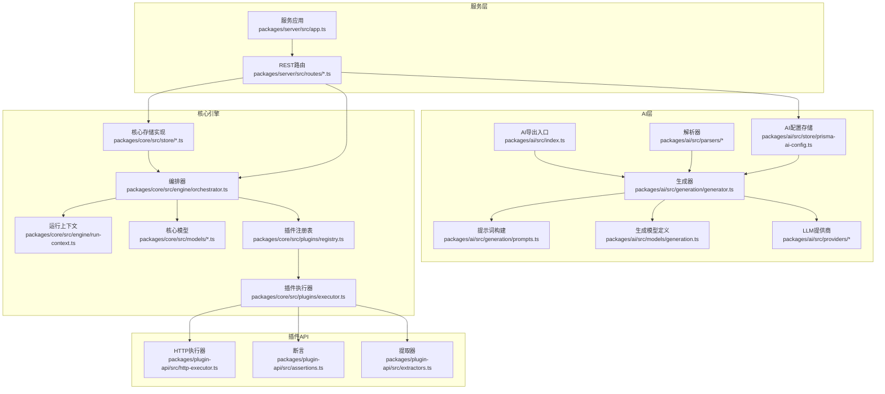
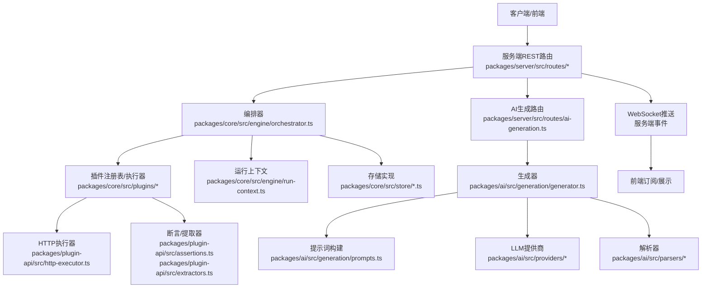
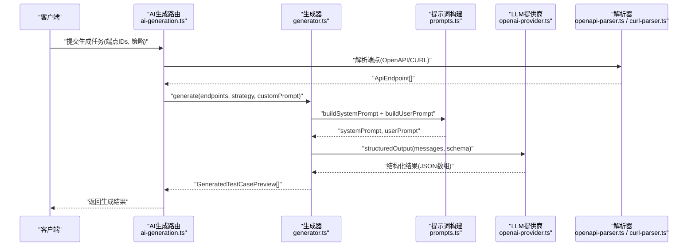
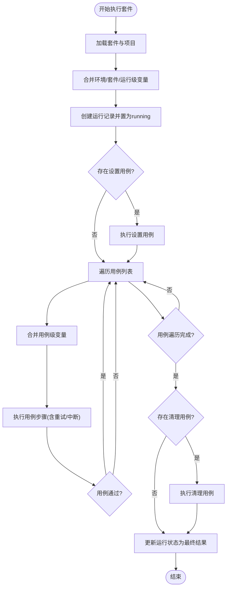
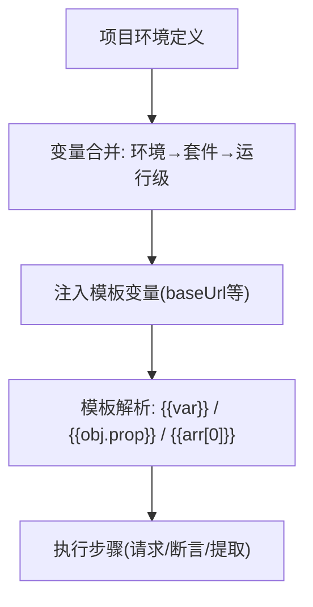
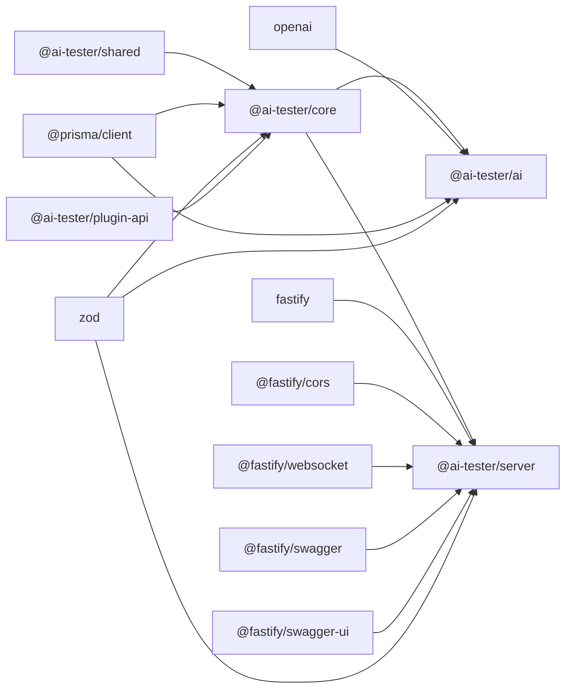

# 核心功能特性

<cite>
**本文引用的文件**
- [packages/ai/src/index.ts](file://packages/ai/src/index.ts)
- [packages/ai/src/generation/generator.ts](file://packages/ai/src/generation/generator.ts)
- [packages/ai/src/generation/prompts.ts](file://packages/ai/src/generation/prompts.ts)
- [packages/ai/src/models/generation.ts](file://packages/ai/src/models/generation.ts)
- [packages/ai/src/providers/openai-provider.ts](file://packages/ai/src/providers/openai-provider.ts)
- [packages/ai/src/providers/provider-factory.ts](file://packages/ai/src/providers/provider-factory.ts)
- [packages/ai/src/parsers/openapi-parser.ts](file://packages/ai/src/parsers/openapi-parser.ts)
- [packages/ai/src/parsers/curl-parser.ts](file://packages/ai/src/parsers/curl-parser.ts)
- [packages/ai/src/store/prisma-ai-config.ts](file://packages/ai/src/store/prisma-ai-config.ts)
- [packages/core/src/engine/orchestrator.ts](file://packages/core/src/engine/orchestrator.ts)
- [packages/core/src/engine/run-context.ts](file://packages/core/src/engine/run-context.ts)
- [packages/core/src/models/test-case.ts](file://packages/core/src/models/test-case.ts)
- [packages/core/src/models/test-suite.ts](file://packages/core/src/models/test-suite.ts)
- [packages/core/src/models/test-dataset.ts](file://packages/core/src/models/test-dataset.ts)
- [packages/core/src/models/test-run.ts](file://packages/core/src/models/test-run.ts)
- [packages/core/src/plugins/registry.ts](file://packages/core/src/plugins/registry.ts)
- [packages/core/src/plugins/executor.ts](file://packages/core/src/plugins/executor.ts)
- [packages/core/src/store/prisma-test-case.ts](file://packages/core/src/store/prisma-test-case.ts)
- [packages/core/src/store/prisma-test-run.ts](file://packages/core/src/store/prisma-test-run.ts)
- [packages/core/src/store/prisma-project.ts](file://packages/core/src/store/prisma-project.ts)
- [packages/server/src/app.ts](file://packages/server/src/app.ts)
- [packages/server/src/routes/ai-generation.ts](file://packages/server/src/routes/ai-generation.ts)
- [packages/server/src/routes/ai-config.ts](file://packages/server/src/routes/ai-config.ts)
- [packages/server/src/routes/ai-endpoints.ts](file://packages/server/src/routes/ai-endpoints.ts)
- [packages/server/src/routes/datasets.ts](file://packages/server/src/routes/datasets.ts)
- [packages/server/src/routes/projects.ts](file://packages/server/src/routes/projects.ts)
- [packages/server/src/routes/runs.ts](file://packages/server/src/routes/runs.ts)
- [packages/server/src/routes/suites.ts](file://packages/server/src/routes/suites.ts)
- [packages/server/src/routes/test-cases.ts](file://packages/server/src/routes/test-cases.ts)
- [packages/shared/src/errors.ts](file://packages/shared/src/errors.ts)
- [packages/shared/src/logger.ts](file://packages/shared/src/logger.ts)
- [packages/plugin-api/src/http-executor.ts](file://packages/plugin-api/src/http-executor.ts)
- [packages/plugin-api/src/assertions.ts](file://packages/plugin-api/src/assertions.ts)
- [packages/plugin-api/src/extractors.ts](file://packages/plugin-api/src/extractors.ts)
</cite>

## 目录
1. [简介](#简介)
2. [项目结构](#项目结构)
3. [核心组件](#核心组件)
4. [架构总览](#架构总览)
5. [详细组件分析](#详细组件分析)
6. [依赖分析](#依赖分析)
7. [性能考虑](#性能考虑)
8. [故障排查指南](#故障排查指南)
9. [结论](#结论)
10. [附录：功能特性对比与使用建议](#附录功能特性对比与使用建议)

## 简介
本项目围绕“智能测试器”目标，构建了从“智能生成测试用例”到“执行与监控”的完整闭环能力。核心包括：
- 智能测试用例生成：基于策略与提示词工程，结合OpenAPI/CURL解析，输出结构化测试步骤与断言。
- 测试套件管理：以套件为单位编排多个测试用例，支持环境变量合并、设置/清理用例、并发度控制。
- 多环境配置：项目级环境定义与运行时变量合并，统一注入模板变量（如baseUrl）。
- 数据驱动测试：数据集加载到上下文变量，支持循环与参数化执行。
- 实时监控与WebSocket通信：通过事件总线与WebSocket推送执行状态，便于前端或外部系统实时感知。

## 项目结构
项目采用多包工作区组织，核心模块如下：
- packages/ai：AI生成、提示词工程、LLM提供商适配、解析器、存储配置。
- packages/core：执行引擎（编排器）、运行上下文、模型定义、插件注册与执行、存储实现。
- packages/server：后端服务（Fastify），提供REST API与WebSocket，路由覆盖AI配置、生成任务、套件、用例、数据集、项目、运行记录。
- packages/plugin-api：插件接口与内置执行器（HTTP、断言、提取）。
- packages/shared：共享错误与日志工具。
- packages/web：前端（React/TanStack Query等），用于展示与交互（当前为私有包，不参与后端核心逻辑）。

图表来源
- [packages/ai/src/index.ts:1-7](file://packages/ai/src/index.ts#L1-L7)
- [packages/ai/src/generation/generator.ts:1-57](file://packages/ai/src/generation/generator.ts#L1-L57)
- [packages/ai/src/generation/prompts.ts:1-73](file://packages/ai/src/generation/prompts.ts#L1-L73)
- [packages/ai/src/models/generation.ts:1-67](file://packages/ai/src/models/generation.ts#L1-L67)
- [packages/ai/src/providers/openai-provider.ts](file://packages/ai/src/providers/openai-provider.ts)
- [packages/ai/src/parsers/openapi-parser.ts](file://packages/ai/src/parsers/openapi-parser.ts)
- [packages/ai/src/parsers/curl-parser.ts](file://packages/ai/src/parsers/curl-parser.ts)
- [packages/ai/src/store/prisma-ai-config.ts](file://packages/ai/src/store/prisma-ai-config.ts)
- [packages/core/src/engine/orchestrator.ts:1-296](file://packages/core/src/engine/orchestrator.ts#L1-L296)
- [packages/core/src/engine/run-context.ts:1-80](file://packages/core/src/engine/run-context.ts#L1-L80)
- [packages/core/src/models/test-case.ts:1-46](file://packages/core/src/models/test-case.ts#L1-L46)
- [packages/core/src/models/test-suite.ts:1-44](file://packages/core/src/models/test-suite.ts#L1-L44)
- [packages/core/src/models/test-dataset.ts:1-48](file://packages/core/src/models/test-dataset.ts#L1-L48)
- [packages/core/src/models/test-run.ts:1-118](file://packages/core/src/models/test-run.ts#L1-L118)
- [packages/core/src/plugins/registry.ts](file://packages/core/src/plugins/registry.ts)
- [packages/core/src/plugins/executor.ts](file://packages/core/src/plugins/executor.ts)
- [packages/core/src/store/prisma-test-case.ts](file://packages/core/src/store/prisma-test-case.ts)
- [packages/core/src/store/prisma-test-run.ts](file://packages/core/src/store/prisma-test-run.ts)
- [packages/core/src/store/prisma-project.ts](file://packages/core/src/store/prisma-project.ts)
- [packages/server/src/app.ts](file://packages/server/src/app.ts)
- [packages/server/src/routes/ai-generation.ts](file://packages/server/src/routes/ai-generation.ts)
- [packages/server/src/routes/ai-config.ts](file://packages/server/src/routes/ai-config.ts)
- [packages/server/src/routes/ai-endpoints.ts](file://packages/server/src/routes/ai-endpoints.ts)
- [packages/server/src/routes/datasets.ts](file://packages/server/src/routes/datasets.ts)
- [packages/server/src/routes/projects.ts](file://packages/server/src/routes/projects.ts)
- [packages/server/src/routes/runs.ts](file://packages/server/src/routes/runs.ts)
- [packages/server/src/routes/suites.ts](file://packages/server/src/routes/suites.ts)
- [packages/server/src/routes/test-cases.ts](file://packages/server/src/routes/test-cases.ts)
- [packages/plugin-api/src/http-executor.ts](file://packages/plugin-api/src/http-executor.ts)
- [packages/plugin-api/src/assertions.ts](file://packages/plugin-api/src/assertions.ts)
- [packages/plugin-api/src/extractors.ts](file://packages/plugin-api/src/extractors.ts)

章节来源
- [packages/ai/src/index.ts:1-7](file://packages/ai/src/index.ts#L1-L7)
- [packages/ai/src/generation/generator.ts:1-57](file://packages/ai/src/generation/generator.ts#L1-L57)
- [packages/ai/src/generation/prompts.ts:1-73](file://packages/ai/src/generation/prompts.ts#L1-L73)
- [packages/ai/src/models/generation.ts:1-67](file://packages/ai/src/models/generation.ts#L1-L67)
- [packages/core/src/engine/orchestrator.ts:1-296](file://packages/core/src/engine/orchestrator.ts#L1-L296)
- [packages/core/src/engine/run-context.ts:1-80](file://packages/core/src/engine/run-context.ts#L1-L80)
- [packages/server/src/app.ts](file://packages/server/src/app.ts)

## 核心组件
- 智能测试用例生成器：接收API端点集合与生成策略，构造系统与用户提示词，调用LLM结构化输出，返回可直接导入的测试用例预览。
- 执行编排器：按套件顺序执行测试用例，支持设置/清理用例、变量合并、重试、失败中断、并发度控制，并产出详细的步骤/用例/运行结果。
- 运行上下文：负责模板变量解析（如{{baseUrl}}、{{token}}等），维护HTTP响应快照，供后续步骤抽取与断言使用。
- 插件体系：通过注册表分发不同类型的步骤（HTTP请求、断言、变量提取、数据集加载、递归调用等），统一执行与结果格式。
- 存储与模型：Prisma实现的持久化，涵盖项目、套件、用例、数据集、运行记录等；模型定义保证输入输出一致性。
- 服务与路由：Fastify提供REST API与Swagger文档，WebSocket用于实时事件推送；路由覆盖AI配置、生成任务、套件、用例、数据集、项目、运行记录等。

章节来源
- [packages/ai/src/generation/generator.ts:20-56](file://packages/ai/src/generation/generator.ts#L20-L56)
- [packages/core/src/engine/orchestrator.ts:25-140](file://packages/core/src/engine/orchestrator.ts#L25-L140)
- [packages/core/src/engine/run-context.ts:11-80](file://packages/core/src/engine/run-context.ts#L11-L80)
- [packages/core/src/plugins/registry.ts](file://packages/core/src/plugins/registry.ts)
- [packages/core/src/plugins/executor.ts](file://packages/core/src/plugins/executor.ts)
- [packages/server/src/routes/ai-generation.ts](file://packages/server/src/routes/ai-generation.ts)
- [packages/server/src/routes/runs.ts](file://packages/server/src/routes/runs.ts)

## 架构总览
下图展示了从“生成测试用例”到“执行与监控”的端到端流程，以及各模块间的依赖关系。

图表来源
- [packages/server/src/routes/ai-generation.ts](file://packages/server/src/routes/ai-generation.ts)
- [packages/server/src/routes/runs.ts](file://packages/server/src/routes/runs.ts)
- [packages/ai/src/generation/generator.ts:1-57](file://packages/ai/src/generation/generator.ts#L1-L57)
- [packages/ai/src/generation/prompts.ts:1-73](file://packages/ai/src/generation/prompts.ts#L1-L73)
- [packages/core/src/engine/orchestrator.ts:1-296](file://packages/core/src/engine/orchestrator.ts#L1-L296)
- [packages/core/src/plugins/registry.ts](file://packages/core/src/plugins/registry.ts)
- [packages/plugin-api/src/http-executor.ts](file://packages/plugin-api/src/http-executor.ts)
- [packages/plugin-api/src/assertions.ts](file://packages/plugin-api/src/assertions.ts)
- [packages/plugin-api/src/extractors.ts](file://packages/plugin-api/src/extractors.ts)

## 详细组件分析

### 组件A：智能测试用例生成（AI）
- 工作原理
  - 输入：API端点集合（OpenAPI/CURL解析得到），生成策略（如happy_path、error_cases、auth_cases、comprehensive），可选自定义提示词。
  - 提示词工程：系统提示词定义输出结构与约束；用户提示词拼接端点上下文；支持追加策略说明与用户指令。
  - 结构化输出：调用LLM提供商，使用Zod模式校验，确保输出为结构化的测试用例预览列表。
- 使用场景
  - 快速覆盖常见路径、异常分支、鉴权场景。
  - 基于已有API文档自动补全测试矩阵。
- 实现要点
  - 生成器封装LLM调用与模式校验。
  - 提示词构建函数负责上下文拼装与指令叠加。
  - 解析器支持OpenAPI与CURL，便于从多种来源获取端点信息。
  - AI配置存储支持持久化LLM提供商与相关参数。
- 典型流程序列图

图表来源
- [packages/server/src/routes/ai-generation.ts](file://packages/server/src/routes/ai-generation.ts)
- [packages/ai/src/generation/generator.ts:27-55](file://packages/ai/src/generation/generator.ts#L27-L55)
- [packages/ai/src/generation/prompts.ts:3,65](file://packages/ai/src/generation/prompts.ts#L3,L65)
- [packages/ai/src/providers/openai-provider.ts](file://packages/ai/src/providers/openai-provider.ts)
- [packages/ai/src/parsers/openapi-parser.ts](file://packages/ai/src/parsers/openapi-parser.ts)
- [packages/ai/src/parsers/curl-parser.ts](file://packages/ai/src/parsers/curl-parser.ts)

章节来源
- [packages/ai/src/generation/generator.ts:20-56](file://packages/ai/src/generation/generator.ts#L20-L56)
- [packages/ai/src/generation/prompts.ts:1-73](file://packages/ai/src/generation/prompts.ts#L1-L73)
- [packages/ai/src/models/generation.ts:1-67](file://packages/ai/src/models/generation.ts#L1-L67)
- [packages/ai/src/store/prisma-ai-config.ts](file://packages/ai/src/store/prisma-ai-config.ts)

### 组件B：测试套件管理与执行编排（Core Engine）
- 工作原理
  - 套件维度：包含用例ID列表、并行度、环境名、套件级变量、设置/清理用例。
  - 执行流程：创建运行记录，合并环境/套件/运行级变量，依次执行用例；支持“call”步骤递归执行其他用例；支持“load-dataset”加载数据集到上下文。
  - 结果聚合：统计每个用例的步骤结果，汇总运行状态与耗时。
- 使用场景
  - 将多个相关用例组合为套件，按顺序或并行执行。
  - 在不同环境（开发/测试/生产）复用同一套套件，仅切换环境变量。
- 实现要点
  - 编排器负责控制流、重试、失败中断、事件发射。
  - 运行上下文负责模板变量解析与HTTP响应快照。
  - 插件注册表与执行器解耦具体步骤类型。
- 执行流程图

图表来源
- [packages/core/src/engine/orchestrator.ts:25-140](file://packages/core/src/engine/orchestrator.ts#L25-L140)
- [packages/core/src/engine/run-context.ts:11-80](file://packages/core/src/engine/run-context.ts#L11-L80)

章节来源
- [packages/core/src/engine/orchestrator.ts:17-296](file://packages/core/src/engine/orchestrator.ts#L17-L296)
- [packages/core/src/engine/run-context.ts:11-80](file://packages/core/src/engine/run-context.ts#L11-L80)
- [packages/core/src/models/test-suite.ts:1-44](file://packages/core/src/models/test-suite.ts#L1-L44)
- [packages/core/src/models/test-case.ts:1-46](file://packages/core/src/models/test-case.ts#L1-L46)
- [packages/core/src/models/test-run.ts:1-118](file://packages/core/src/models/test-run.ts#L1-L118)

### 组件C：多环境配置与变量注入
- 工作原理
  - 项目定义多个环境，每个环境包含名称、基础URL与变量映射。
  - 运行时变量合并顺序：环境变量 → 套件变量 → 运行级变量，形成最终上下文。
  - 上下文模板解析支持嵌套路径访问（如对象属性、数组索引），并自动注入baseUrl。
- 使用场景
  - 在不同环境（dev/staging/prod）快速切换目标地址与认证令牌。
  - 通过变量传递动态值（如token、userId）。
- 最佳实践
  - 将敏感信息放入环境变量，避免硬编码。
  - 使用统一的变量命名规范，减少歧义。
- 变量合并与模板解析流程

图表来源
- [packages/core/src/engine/run-context.ts:18-41](file://packages/core/src/engine/run-context.ts#L18-L41)
- [packages/core/src/engine/orchestrator.ts:29-48](file://packages/core/src/engine/orchestrator.ts#L29-L48)

章节来源
- [packages/core/src/engine/run-context.ts:11-80](file://packages/core/src/engine/run-context.ts#L11-L80)
- [packages/core/src/engine/orchestrator.ts:25-48](file://packages/core/src/engine/orchestrator.ts#L25-L48)

### 组件D：数据驱动测试（数据集加载）
- 工作原理
  - “load-dataset”步骤将指定数据集的所有行加载到上下文变量中，变量名为配置项。
  - 后续步骤可通过模板语法引用该变量，实现参数化执行。
- 使用场景
  - 使用多组输入数据重复执行同一用例，覆盖边界条件。
  - 动态生成测试数据，避免手工维护大量相似用例。
- 最佳实践
  - 数据集字段类型明确，便于断言与提取。
  - 将数据集与用例模块/标签关联，便于追踪与复用。

章节来源
- [packages/core/src/engine/orchestrator.ts:205-237](file://packages/core/src/engine/orchestrator.ts#L205-L237)
- [packages/core/src/models/test-dataset.ts:1-48](file://packages/core/src/models/test-dataset.ts#L1-L48)

### 组件E：实时监控与WebSocket通信
- 工作原理
  - 编排器在关键节点（用例开始/完成、步骤开始/完成、运行完成）发射事件。
  - 服务端通过WebSocket向订阅者推送事件，前端可订阅并展示执行进度与结果。
- 使用场景
  - CI流水线中实时反馈测试进度。
  - 远程调试与可视化监控。
- 最佳实践
  - 事件粒度适中，避免过于频繁导致带宽压力。
  - 对敏感信息进行脱敏处理后再推送。

章节来源
- [packages/core/src/engine/orchestrator.ts:83,109,129](file://packages/core/src/engine/orchestrator.ts#L83,L109,L129)
- [packages/server/src/app.ts](file://packages/server/src/app.ts)

### 组件F：服务与路由（REST + Swagger + WebSocket）
- 工作原理
  - Fastify提供REST API，集成Swagger与UI，便于调试与联调。
  - 路由覆盖AI配置、生成任务、套件、用例、数据集、项目、运行记录等资源。
  - 支持WebSocket事件推送。
- 使用场景
  - 作为CI/CD后端服务，提供统一的测试编排与查询接口。
  - 与前端Web界面配合，提供可视化操作与监控。

章节来源
- [packages/server/src/app.ts](file://packages/server/src/app.ts)
- [packages/server/src/routes/ai-config.ts](file://packages/server/src/routes/ai-config.ts)
- [packages/server/src/routes/ai-generation.ts](file://packages/server/src/routes/ai-generation.ts)
- [packages/server/src/routes/ai-endpoints.ts](file://packages/server/src/routes/ai-endpoints.ts)
- [packages/server/src/routes/datasets.ts](file://packages/server/src/routes/datasets.ts)
- [packages/server/src/routes/projects.ts](file://packages/server/src/routes/projects.ts)
- [packages/server/src/routes/runs.ts](file://packages/server/src/routes/runs.ts)
- [packages/server/src/routes/suites.ts](file://packages/server/src/routes/suites.ts)
- [packages/server/src/routes/test-cases.ts](file://packages/server/src/routes/test-cases.ts)

## 依赖分析
- 包依赖
  - @ai-tester/ai 依赖 @ai-tester/core、@ai-tester/shared、@prisma/client、openai、zod。
  - @ai-tester/core 依赖 @ai-tester/shared、zod、jsonpath-plus、@prisma/client。
  - @ai-tester/server 依赖 @ai-tester/core/@ai-tester/shared/@ai-tester/ai/@ai-tester/plugin-api、fastify、@fastify/cors/@fastify/websocket/@fastify/swagger等。
  - @ai-tester/plugin-api 依赖 @ai-tester/core/@ai-tester/shared、jsonpath-plus、undici。
  - @ai-tester/shared 依赖 @paralleldrive/cuid2、pino。
- 内部耦合
  - 服务层路由依赖核心引擎与存储实现。
  - AI层与服务层通过路由对接，生成结果可被导入到核心存储。
  - 插件API为执行器提供统一接口，降低编排器与具体步骤实现的耦合。

图表来源
- [packages/ai/package.json:21-27](file://packages/ai/package.json#L21-L27)
- [packages/core/package.json:21-26](file://packages/core/package.json#L21-L26)
- [packages/server/package.json:16-28](file://packages/server/package.json#L16-L28)
- [packages/plugin-api/package.json:21-26](file://packages/plugin-api/package.json#L21-L26)
- [packages/shared/package.json:19-22](file://packages/shared/package.json#L19-L22)

章节来源
- [packages/ai/package.json:1-34](file://packages/ai/package.json#L1-L34)
- [packages/core/package.json:1-34](file://packages/core/package.json#L1-L34)
- [packages/server/package.json:1-36](file://packages/server/package.json#L1-L36)
- [packages/plugin-api/package.json:1-33](file://packages/plugin-api/package.json#L1-L33)
- [packages/shared/package.json:1-28](file://packages/shared/package.json#L1-L28)

## 性能考虑
- 并发与重试
  - 套件级并行度可控，避免对目标系统造成瞬时压力。
  - 步骤内重试次数可配置，平衡稳定性与执行时间。
- 变量解析与模板替换
  - 复杂模板解析在运行上下文中集中处理，避免在执行器中重复计算。
- LLM调用
  - 结构化输出与模式校验减少无效重试；合理设计提示词，降低token消耗。
- 存储与查询
  - 使用Prisma进行批量写入与聚合统计，减少网络往返。

## 故障排查指南
- 常见问题
  - 生成阶段：端点为空、策略未知、LLM输出不符合模式。
  - 执行阶段：变量未解析、HTTP请求失败、断言表达式错误、数据集加载失败。
  - 环境配置：变量覆盖顺序错误、模板语法不匹配。
- 定位方法
  - 查看运行记录中的步骤结果与错误详情。
  - 检查事件流（case:start/complete、step:start/complete）定位卡顿点。
  - 校验项目环境变量与套件/用例变量的合并结果。
- 相关实现参考
  - 错误与日志：共享错误与日志工具。
  - 执行器错误捕获与重试逻辑。
  - 提示词与模式校验失败的回退策略。

章节来源
- [packages/shared/src/errors.ts](file://packages/shared/src/errors.ts)
- [packages/shared/src/logger.ts](file://packages/shared/src/logger.ts)
- [packages/core/src/engine/orchestrator.ts:142-294](file://packages/core/src/engine/orchestrator.ts#L142-L294)
- [packages/ai/src/generation/generator.ts:32-39](file://packages/ai/src/generation/generator.ts#L32-L39)

## 结论
本项目通过“AI生成 + 引擎执行 + 多环境变量 + 数据驱动 + 实时监控”的组合，提供了从“智能生成测试用例”到“稳定执行与可观测”的完整能力。AI层负责“质量与覆盖面”，核心引擎负责“稳定性与可扩展性”，服务层负责“易用性与可观测”。三者协同，既适合探索性测试，也适合回归与CI集成。

## 附录：功能特性对比与使用建议
- 功能对比
  - 智能生成：面向“覆盖面与质量”，适合快速补齐测试矩阵；适合与手写用例互补。
  - 套件管理：面向“编排与复用”，适合跨环境与多用例组合。
  - 多环境配置：面向“环境隔离与变量注入”，适合多环境部署。
  - 数据驱动：面向“参数化与规模化”，适合边界条件与回归。
  - 实时监控：面向“可观测与自动化”，适合CI/CD与远程调试。
- 使用建议
  - 优先用AI生成覆盖主流路径与异常分支，再用手工用例完善边界与业务逻辑。
  - 将常用环境变量抽象为项目环境，减少重复配置。
  - 将数据集与用例模块化，提升复用率与可维护性。
  - 在CI中启用WebSocket订阅，结合告警与报告，提升反馈效率。