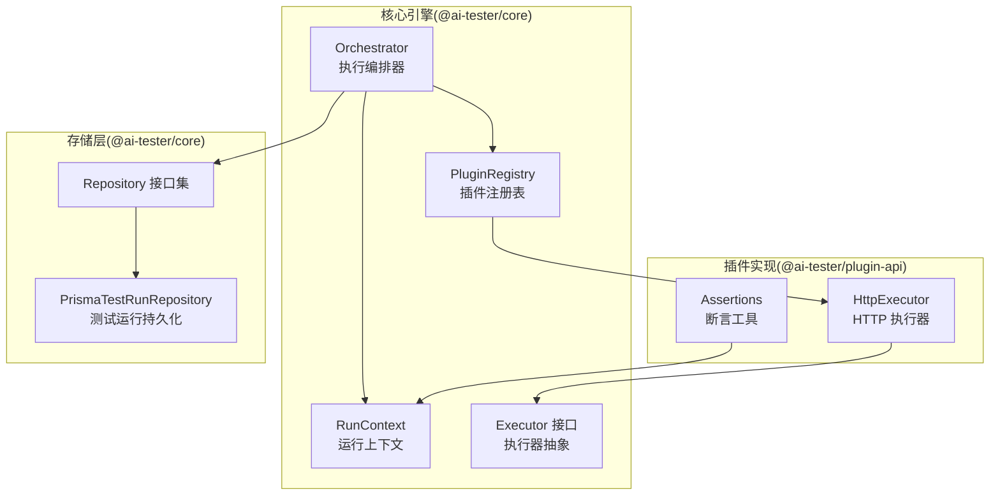
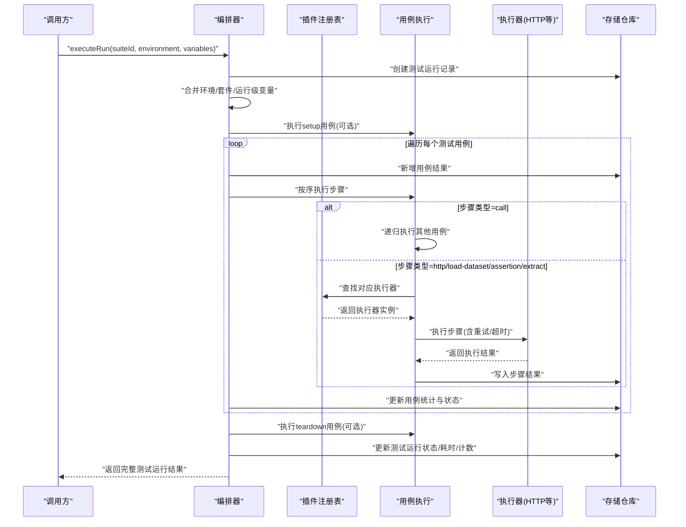
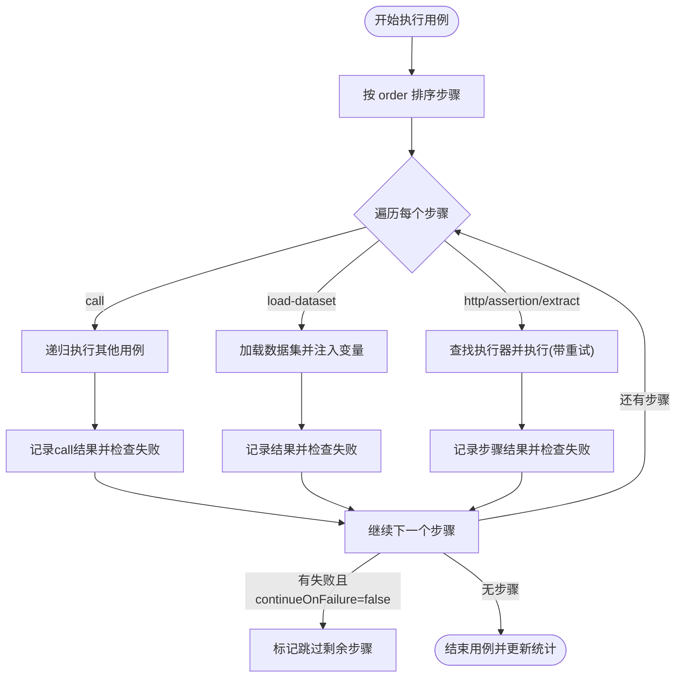
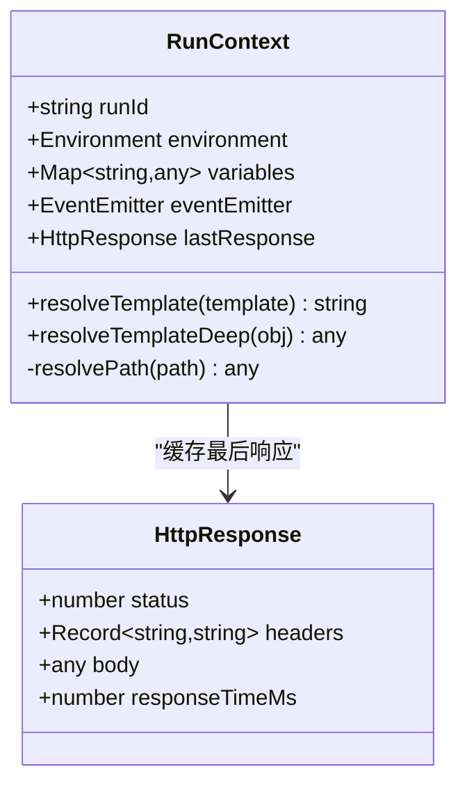
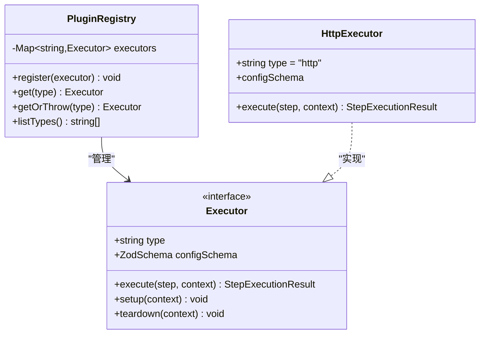
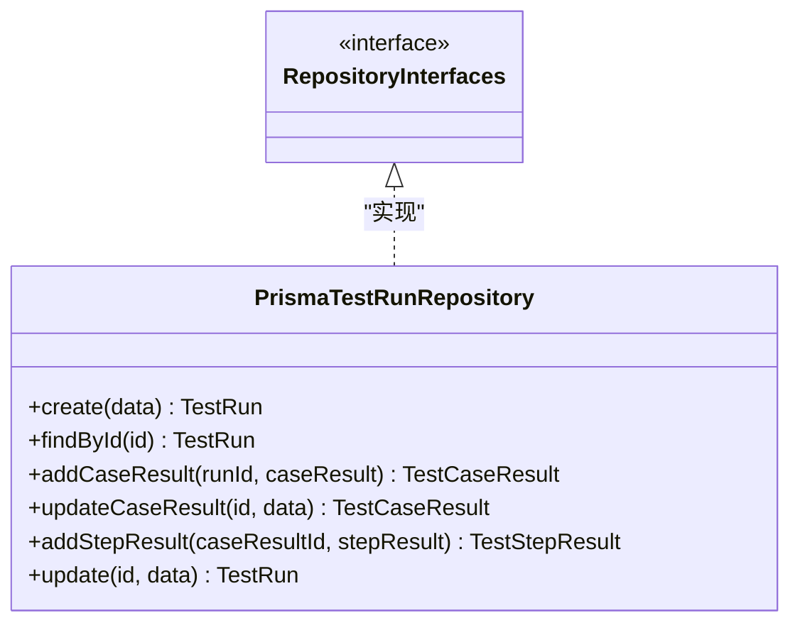
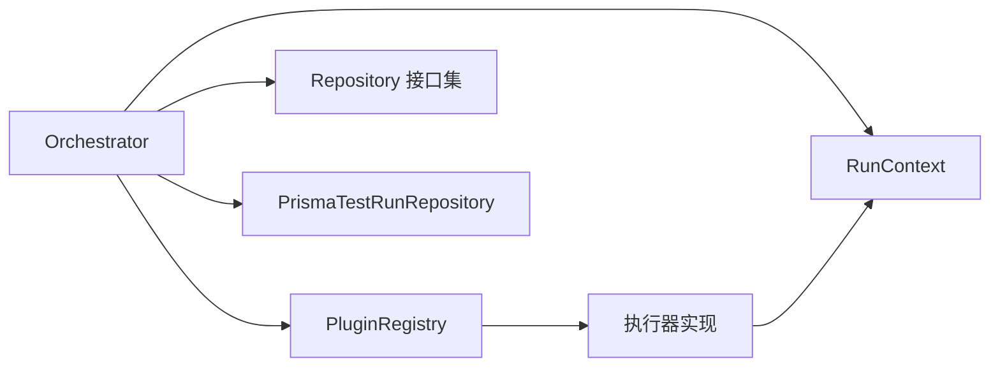

# 测试套件执行管理

<cite>
**本文引用的文件**
- [packages/core/src/engine/orchestrator.ts](file://packages/core/src/engine/orchestrator.ts)
- [packages/core/src/engine/run-context.ts](file://packages/core/src/engine/run-context.ts)
- [packages/core/src/plugins/registry.ts](file://packages/core/src/plugins/registry.ts)
- [packages/core/src/plugins/executor.ts](file://packages/core/src/plugins/executor.ts)
- [packages/plugin-api/src/http-executor.ts](file://packages/plugin-api/src/http-executor.ts)
- [packages/core/src/store/repository.ts](file://packages/core/src/store/repository.ts)
- [packages/core/src/store/prisma-test-run.ts](file://packages/core/src/store/prisma-test-run.ts)
- [packages/plugin-api/src/assertions.ts](file://packages/plugin-api/src/assertions.ts)
</cite>

## 目录
1. [简介](#简介)
2. [项目结构](#项目结构)
3. [核心组件](#核心组件)
4. [架构总览](#架构总览)
5. [详细组件分析](#详细组件分析)
6. [依赖关系分析](#依赖关系分析)
7. [性能考虑](#性能考虑)
8. [故障排除指南](#故障排除指南)
9. [结论](#结论)
10. [附录：执行配置示例](#附录执行配置示例)

## 简介
本文件面向“AI测试器”的测试套件执行管理能力，系统性阐述测试编排器（Orchestrator）的架构设计与执行流程，覆盖以下主题：
- 测试套件调度与执行顺序控制
- 并行执行机制与并发限制
- 错误处理策略与重试机制
- 运行上下文管理与变量解析
- 插件系统集成与扩展点
- 执行配置示例（环境变量合并、重试、超时）
- 生命周期管理、状态跟踪与结果收集
- 性能优化建议与故障排除

## 项目结构
本项目采用多包工作区组织，核心执行逻辑集中在 @ai-tester/core 包中，插件能力在 @ai-tester/plugin-api 中实现，服务端接口在 @ai-tester/server 中暴露。

图表来源
- [packages/core/src/engine/orchestrator.ts:1-296](file://packages/core/src/engine/orchestrator.ts#L1-L296)
- [packages/core/src/engine/run-context.ts:1-80](file://packages/core/src/engine/run-context.ts#L1-L80)
- [packages/core/src/plugins/registry.ts:1-29](file://packages/core/src/plugins/registry.ts#L1-L29)
- [packages/core/src/plugins/executor.ts:1-23](file://packages/core/src/plugins/executor.ts#L1-L23)
- [packages/plugin-api/src/http-executor.ts:1-95](file://packages/plugin-api/src/http-executor.ts#L1-L95)
- [packages/core/src/store/repository.ts:1-96](file://packages/core/src/store/repository.ts#L1-L96)
- [packages/core/src/store/prisma-test-run.ts:64-193](file://packages/core/src/store/prisma-test-run.ts#L64-L193)

章节来源
- [packages/core/src/engine/orchestrator.ts:1-296](file://packages/core/src/engine/orchestrator.ts#L1-L296)
- [packages/core/src/engine/run-context.ts:1-80](file://packages/core/src/engine/run-context.ts#L1-L80)
- [packages/core/src/plugins/registry.ts:1-29](file://packages/core/src/plugins/registry.ts#L1-L29)
- [packages/core/src/plugins/executor.ts:1-23](file://packages/core/src/plugins/executor.ts#L1-L23)
- [packages/plugin-api/src/http-executor.ts:1-95](file://packages/plugin-api/src/http-executor.ts#L1-L95)
- [packages/core/src/store/repository.ts:1-96](file://packages/core/src/store/repository.ts#L1-L96)
- [packages/core/src/store/prisma-test-run.ts:64-193](file://packages/core/src/store/prisma-test-run.ts#L64-L193)

## 核心组件
- 编排器（Orchestrator）：负责测试套件的调度、用例执行、事件分发、状态更新与结果收集。
- 运行上下文（RunContext）：维护运行期变量、模板解析、HTTP响应缓存与事件发射器。
- 插件注册表（PluginRegistry）：集中管理各类执行器（如 http、assertion、extract、call、load-dataset）。
- 执行器接口（Executor）：定义统一的步骤执行契约，支持 setup/teardown 生命周期钩子。
- 存储仓库（Repository）：抽象数据访问层，Prisma 实现负责持久化测试运行、用例与步骤结果。

章节来源
- [packages/core/src/engine/orchestrator.ts:17-140](file://packages/core/src/engine/orchestrator.ts#L17-L140)
- [packages/core/src/engine/run-context.ts:11-80](file://packages/core/src/engine/run-context.ts#L11-L80)
- [packages/core/src/plugins/registry.ts:3-28](file://packages/core/src/plugins/registry.ts#L3-L28)
- [packages/core/src/plugins/executor.ts:15-23](file://packages/core/src/plugins/executor.ts#L15-L23)
- [packages/core/src/store/repository.ts:20-96](file://packages/core/src/store/repository.ts#L20-L96)

## 架构总览
下图展示从一次测试运行请求到结果落库的完整调用链路与数据流。

图表来源
- [packages/core/src/engine/orchestrator.ts:25-140](file://packages/core/src/engine/orchestrator.ts#L25-L140)
- [packages/core/src/plugins/registry.ts:13-23](file://packages/core/src/plugins/registry.ts#L13-L23)
- [packages/plugin-api/src/http-executor.ts:11-94](file://packages/plugin-api/src/http-executor.ts#L11-L94)
- [packages/core/src/store/prisma-test-run.ts:64-193](file://packages/core/src/store/prisma-test-run.ts#L64-L193)

## 详细组件分析

### 组件一：编排器（Orchestrator）
职责与特性
- 套件调度：读取测试套件与项目信息，解析环境配置，合并变量层级。
- 生命周期：支持 setup/teardown 用例，贯穿整个运行周期。
- 步骤执行：按序执行用例中的步骤；支持 call 递归调用、load-dataset 数据集注入、标准执行器步骤。
- 重试机制：基于 step.retryCount 的指数退避式重试（由循环控制）。
- 错误处理：捕获异常并标记运行状态为 error；失败即刻停止后续步骤（除非 continueOnFailure=true）。
- 结果收集：逐用例/逐步骤写入数据库，汇总通过/失败计数与总耗时。

关键流程图（单个用例的步骤执行）

图表来源
- [packages/core/src/engine/orchestrator.ts:142-294](file://packages/core/src/engine/orchestrator.ts#L142-L294)

章节来源
- [packages/core/src/engine/orchestrator.ts:25-140](file://packages/core/src/engine/orchestrator.ts#L25-L140)
- [packages/core/src/engine/orchestrator.ts:142-294](file://packages/core/src/engine/orchestrator.ts#L142-L294)

### 组件二：运行上下文（RunContext）
职责与特性
- 变量管理：以 Map 形式存储键值对，支持深层模板解析与路径式变量提取。
- 模板解析：支持 {{var.path}} 与 {{arr[0].field}} 等表达式，递归解析对象/数组。
- 上下文缓存：保存最近一次 HTTP 响应，供断言/提取使用。
- 事件发射：向外部广播 step/case/run 生命周期事件，便于观察与日志。

类关系图

图表来源
- [packages/core/src/engine/run-context.ts:11-80](file://packages/core/src/engine/run-context.ts#L11-L80)

章节来源
- [packages/core/src/engine/run-context.ts:11-80](file://packages/core/src/engine/run-context.ts#L11-L80)

### 组件三：插件注册表与执行器接口
职责与特性
- 注册表：集中注册/查询执行器，提供不存在时的友好报错与可用类型列表。
- 执行器接口：统一的 type/configSchema/execute/setup/teardown 约定，确保扩展一致性。
- HTTP 执行器：基于 undici 发起请求，内置超时控制、响应体解析与上下文缓存。

类关系图

图表来源
- [packages/core/src/plugins/registry.ts:3-28](file://packages/core/src/plugins/registry.ts#L3-L28)
- [packages/core/src/plugins/executor.ts:15-23](file://packages/core/src/plugins/executor.ts#L15-L23)
- [packages/plugin-api/src/http-executor.ts:7-94](file://packages/plugin-api/src/http-executor.ts#L7-L94)

章节来源
- [packages/core/src/plugins/registry.ts:3-28](file://packages/core/src/plugins/registry.ts#L3-L28)
- [packages/core/src/plugins/executor.ts:15-23](file://packages/core/src/plugins/executor.ts#L15-L23)
- [packages/plugin-api/src/http-executor.ts:7-94](file://packages/plugin-api/src/http-executor.ts#L7-L94)

### 组件四：存储与结果持久化
职责与特性
- Repository 抽象：定义项目、用例、套件、运行、数据集等 CRUD 与查询接口。
- Prisma 实现：将内存模型序列化为 JSON 字段持久化，支持复杂对象（请求/响应/断言/错误）存储。
- 结果聚合：按用例维度统计步骤总数、通过/失败数与耗时；最终汇总到测试运行记录。

类关系图

图表来源
- [packages/core/src/store/repository.ts:55-96](file://packages/core/src/store/repository.ts#L55-L96)
- [packages/core/src/store/prisma-test-run.ts:64-193](file://packages/core/src/store/prisma-test-run.ts#L64-L193)

章节来源
- [packages/core/src/store/repository.ts:55-96](file://packages/core/src/store/repository.ts#L55-L96)
- [packages/core/src/store/prisma-test-run.ts:64-193](file://packages/core/src/store/prisma-test-run.ts#L64-L193)

### 组件五：断言与变量解析（结合插件 API）
- 断言源：支持 status/header/body/jsonpath/variable 等多种断言源，配合 RunContext.lastResponse 与变量表。
- 变量解析：在 HTTP 执行器中对 URL/Headers/Body 进行模板解析，确保动态参数注入。

章节来源
- [packages/plugin-api/src/assertions.ts:42-64](file://packages/plugin-api/src/assertions.ts#L42-L64)
- [packages/plugin-api/src/http-executor.ts:11-94](file://packages/plugin-api/src/http-executor.ts#L11-L94)

## 依赖关系分析
- 编排器依赖：插件注册表、用例/套件/运行/数据集/项目仓库、运行上下文。
- 执行器依赖：RunContext 提供变量解析与事件；插件注册表提供执行器实例。
- 存储依赖：PrismaTestRunRepository 负责测试运行全生命周期的数据落盘。
- 外部依赖：undici 用于 HTTP 请求与超时控制；zod 用于配置校验。

图表来源
- [packages/core/src/engine/orchestrator.ts:1-23](file://packages/core/src/engine/orchestrator.ts#L1-L23)
- [packages/core/src/plugins/registry.ts:1-28](file://packages/core/src/plugins/registry.ts#L1-L28)
- [packages/core/src/plugins/executor.ts:1-23](file://packages/core/src/plugins/executor.ts#L1-L23)
- [packages/core/src/store/repository.ts:1-96](file://packages/core/src/store/repository.ts#L1-L96)
- [packages/core/src/store/prisma-test-run.ts:64-193](file://packages/core/src/store/prisma-test-run.ts#L64-L193)

## 性能考虑
- 并发控制：当前实现按顺序执行用例与步骤，未内置并行执行器。若需提升吞吐，可在“遍历用例”或“遍历步骤”处引入并发池与信号量，但需注意：
  - 变量共享与竞态条件；
  - 事件发射与结果落库的幂等性；
  - 资源限制（如数据库连接、外部服务限流）。
- 重试策略：单步重试已内置，建议：
  - 对瞬时性错误（网络抖动、上游限流）启用重试；
  - 对确定性失败（认证失败、参数错误）避免重试，减少资源浪费。
- 超时设置：HTTP 执行器默认超时可配置，建议：
  - 根据接口 SLA 设置合理超时；
  - 对长耗时场景（上传/下载）单独配置更长超时。
- 模板解析：深层对象解析会带来 CPU 开销，建议：
  - 控制模板嵌套深度；
  - 对静态值避免不必要的模板占位符。
- 数据落库：批量写入与事务边界需评估，避免单条记录过大导致延迟。

## 故障排除指南
常见问题与定位要点
- 套件/用例找不到：检查 suiteId/testCaseId 是否正确，以及仓库实现是否返回空。
- 变量未解析：确认模板语法与变量命名一致，检查 RunContext 变量注入顺序（环境→套件→运行级）。
- 断言失败：核对断言源与表达式，确认 RunContext.lastResponse 是否被正确填充。
- 执行器缺失：检查插件注册表是否已注册对应 type，或 getOrThrow 抛出的可用类型列表。
- 超时/网络错误：调整 HTTP 超时配置，检查目标服务健康状况与限流策略。
- 循环调用：编排器内置最大调用深度保护，若出现错误提示“可能循环调用”，请检查 call 步骤的闭环依赖。

章节来源
- [packages/core/src/engine/orchestrator.ts:142-149](file://packages/core/src/engine/orchestrator.ts#L142-L149)
- [packages/core/src/engine/run-context.ts:35-78](file://packages/core/src/engine/run-context.ts#L35-L78)
- [packages/plugin-api/src/http-executor.ts:29-92](file://packages/plugin-api/src/http-executor.ts#L29-L92)
- [packages/core/src/plugins/registry.ts:17-23](file://packages/core/src/plugins/registry.ts#L17-L23)

## 结论
该测试套件执行管理方案以编排器为核心，结合运行上下文、插件注册表与存储层，实现了清晰的生命周期管理与结果收集。通过模板解析与变量合并，满足动态配置需求；通过重试与超时控制，增强鲁棒性。未来可在保证一致性的前提下引入并发执行与更细粒度的可观测性，进一步提升吞吐与稳定性。

## 附录：执行配置示例
以下为常见配置项与行为说明（不包含具体代码片段），便于在实际环境中落地：

- 环境变量合并优先级
  - 合并顺序：环境变量 → 套件变量 → 运行级变量
  - 最终生效：后出现的同名键覆盖前出现的值
  - 典型用途：不同环境（开发/预发/生产）共享 baseUrl，个别用例覆盖特定参数

- 重试机制
  - 配置字段：step.retryCount（整数，0 表示仅尝试 1 次）
  - 行为：失败或抛错时自动重试，直至成功或达到最大次数
  - 注意：异常堆栈仅保留最后一次尝试的错误信息

- 超时控制
  - HTTP 步骤：默认超时 30 秒，可通过配置覆盖
  - 适用场景：上传/下载、长链路接口、上游限流

- 继续执行策略
  - 配置字段：step.continueOnFailure（布尔）
  - 行为：false 时遇到失败/错误立即跳过剩余步骤；true 则继续执行

- 数据集注入
  - 步骤类型：load-dataset
  - 功能：将数据集 rows 注入为变量，供后续步骤使用
  - 场景：批量参数化测试、动态构造请求体

- 生命周期事件
  - 事件：step:start、step:complete、case:start、case:complete、run:complete
  - 用途：外部监听器可据此实现实时日志、告警与可视化

章节来源
- [packages/core/src/engine/orchestrator.ts:34-48](file://packages/core/src/engine/orchestrator.ts#L34-L48)
- [packages/core/src/engine/orchestrator.ts:242-266](file://packages/core/src/engine/orchestrator.ts#L242-L266)
- [packages/plugin-api/src/http-executor.ts:34-35](file://packages/plugin-api/src/http-executor.ts#L34-L35)
- [packages/core/src/engine/orchestrator.ts:205-237](file://packages/core/src/engine/orchestrator.ts#L205-L237)