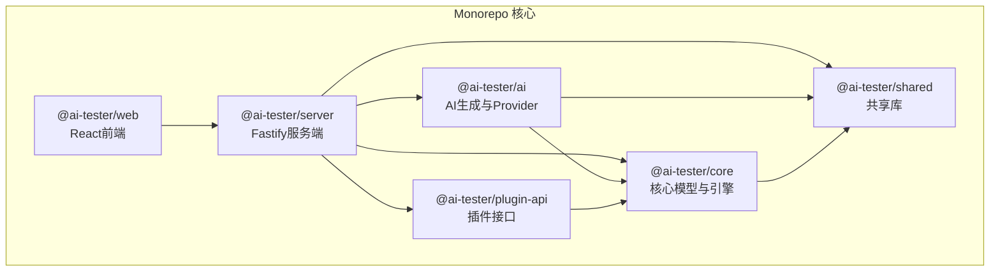
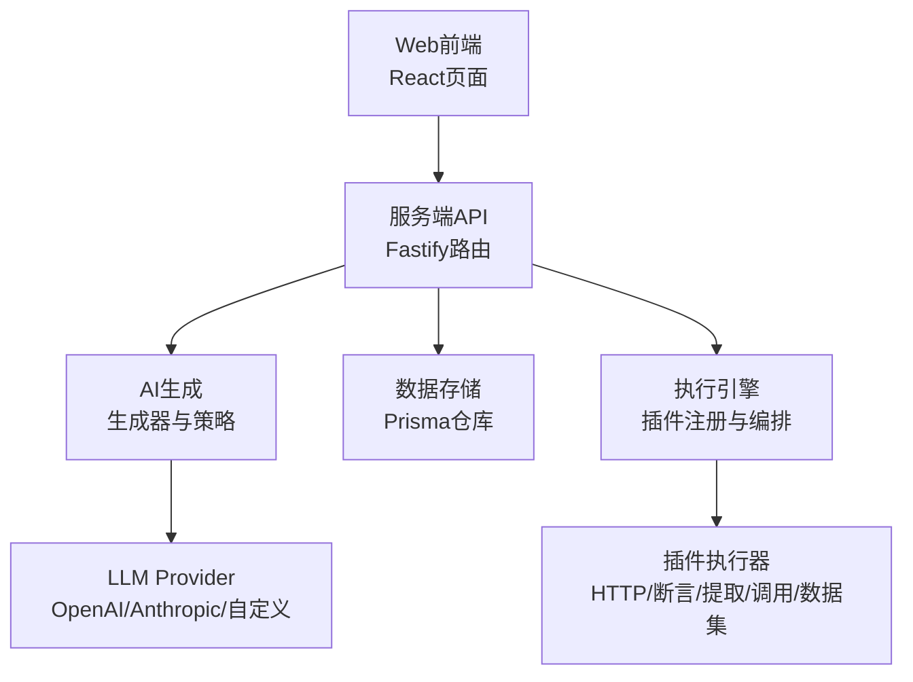
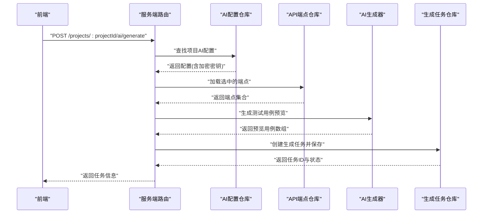
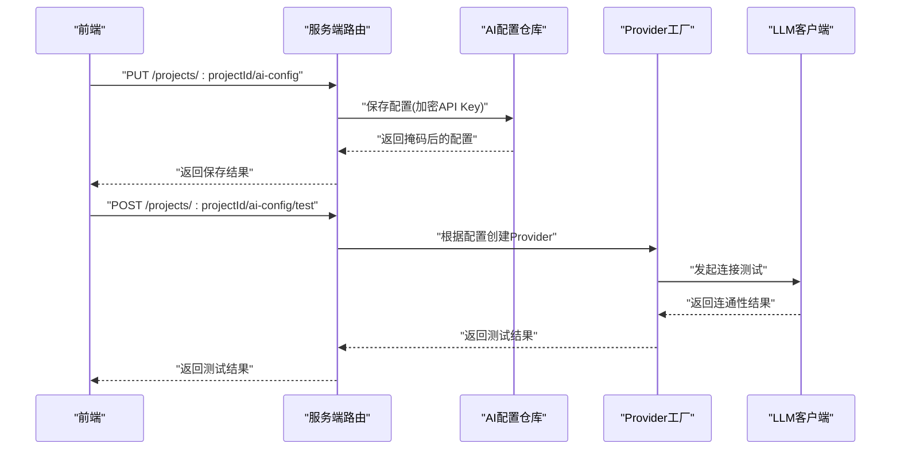
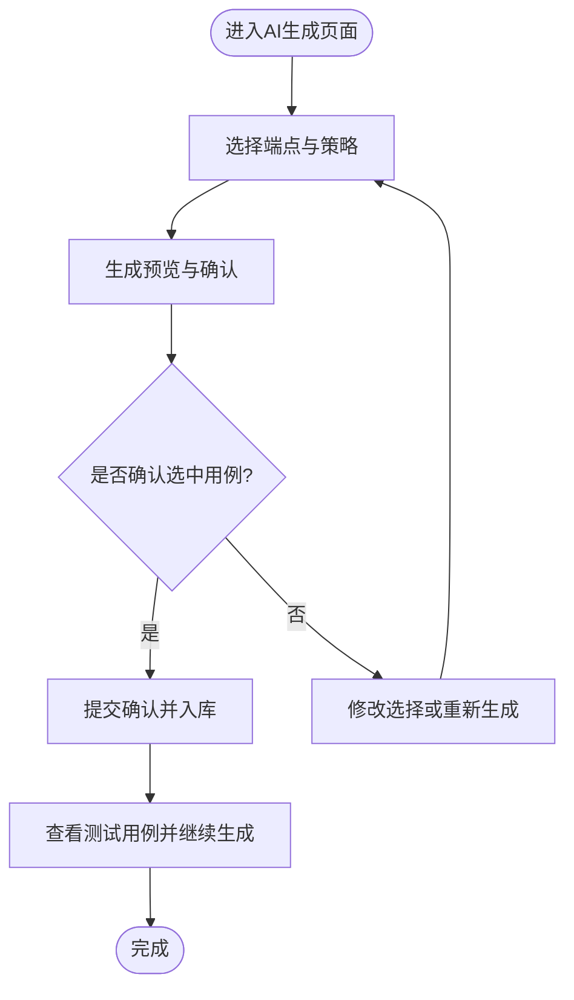
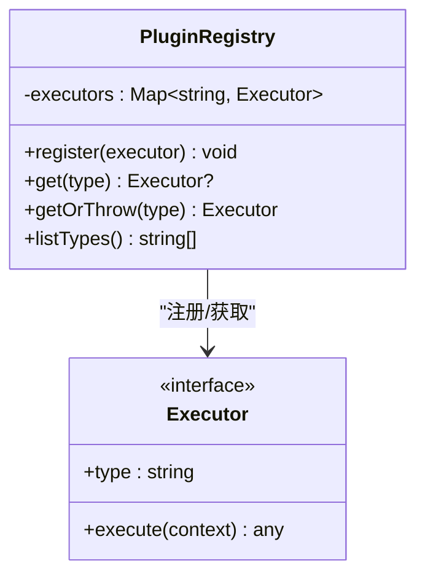
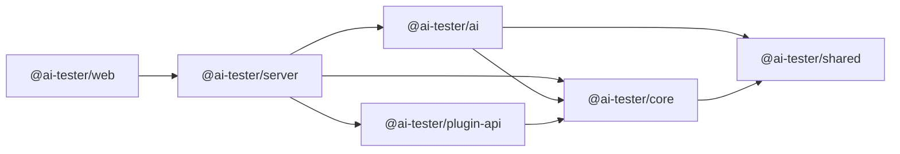

# 项目介绍

<cite>
**本文档引用的文件**
- [package.json](file://package.json)
- [pnpm-workspace.yaml](file://pnpm-workspace.yaml)
- [packages/core/package.json](file://packages/core/package.json)
- [packages/ai/package.json](file://packages/ai/package.json)
- [packages/server/package.json](file://packages/server/package.json)
- [packages/web/package.json](file://packages/web/package.json)
- [packages/shared/package.json](file://packages/shared/package.json)
- [packages/plugin-api/package.json](file://packages/plugin-api/package.json)
- [packages/server/src/app.ts](file://packages/server/src/app.ts)
- [packages/server/src/routes/ai-generation.ts](file://packages/server/src/routes/ai-generation.ts)
- [packages/server/src/routes/ai-config.ts](file://packages/server/src/routes/ai-config.ts)
- [packages/server/src/services/container.ts](file://packages/server/src/services/container.ts)
- [packages/ai/src/generation/generator.ts](file://packages/ai/src/generation/generator.ts)
- [packages/ai/src/providers/openai-provider.ts](file://packages/ai/src/providers/openai-provider.ts)
- [packages/core/src/models/index.ts](file://packages/core/src/models/index.ts)
- [packages/core/src/plugins/registry.ts](file://packages/core/src/plugins/registry.ts)
- [packages/web/src/lib/api.ts](file://packages/web/src/lib/api.ts)
- [packages/web/src/pages/ai-generate.tsx](file://packages/web/src/pages/ai-generate.tsx)
- [packages/web/src/pages/ai-settings.tsx](file://packages/web/src/pages/ai-settings.tsx)
- [docs/review-report/specs-review-2026-04-24.md](file://docs/review-report/specs-review-2026-04-24.md)
</cite>

## 目录
1. [引言](#引言)
2. [项目结构](#项目结构)
3. [核心组件](#核心组件)
4. [架构总览](#架构总览)
5. [详细组件分析](#详细组件分析)
6. [依赖关系分析](#依赖关系分析)
7. [性能考量](#性能考量)
8. [故障排查指南](#故障排查指南)
9. [结论](#结论)
10. [附录](#附录)

## 引言
AI测试器项目旨在通过AI驱动的方式，彻底改变传统手工编写测试用例的模式，构建一个面向现代软件交付的自动化测试平台。项目的核心使命是：以最小的人工干预，最大化测试覆盖与质量，加速回归与集成测试的执行，并降低测试维护成本。其愿景是让测试不再是瓶颈，而是开发流程中的智能加速器。

项目通过“知识源+策略化提示”的双轮驱动，将API规范、cURL示例、自由文本等多源信息转化为可执行的测试步骤与断言，再由AI生成器输出结构化的测试用例预览，经过人工确认后入库，形成“生成-预览-确认-入库”的闭环。这一流程显著提升了测试效率，降低了重复劳动，并增强了测试用例的多样性与稳定性。

主要应用场景包括：
- Web API测试：支持REST风格接口的参数、认证、错误路径与边界条件的自动覆盖
- 移动应用后端接口测试：通过统一的HTTP测试引擎，适配移动端调用链路
- 微服务测试：在复杂服务网格中快速生成跨服务调用与契约验证用例
- 数据集驱动测试：结合测试数据集，批量生成不同输入组合的测试场景

项目解决的核心痛点与带来的价值：
- 提升测试效率：从手工编写到AI一键生成，缩短用例准备周期
- 降低人工成本：减少重复性工作，释放测试工程师专注于策略与分析
- 增强测试覆盖率：系统化策略（幸福路径、错误路径、鉴权路径、全面覆盖）确保边界与异常被充分覆盖
- 提高一致性与可维护性：结构化生成与版本化管理，便于回溯与迭代

创新点与竞争优势：
- 多Provider抽象与统一接口：支持OpenAI、Anthropic及自定义兼容端点，便于企业按需选择与迁移
- 知识源多入口：OpenAPI、cURL、手动录入、自由文本，覆盖不同团队的现状与习惯
- 两步确认流程：生成预览与人工确认，避免垃圾数据入库，兼顾效率与质量
- 插件化执行引擎：可扩展的插件注册机制，支持未来接入更多执行器与协议

面向不同背景读者的定位说明：
- 产品与项目经理：关注测试效率提升与质量保障，可快速评估项目对交付节奏的影响
- 开发工程师：关注与现有工具链的集成与扩展，可利用插件机制与统一模型进行二次开发
- 测试工程师：关注生成质量与可维护性，可通过策略与预览流程把控用例质量
- 平台与运维：关注安全与稳定性，可利用配置加密、健康检查与可观测性接口进行部署与监控

## 项目结构
项目采用monorepo结构，通过workspace统一管理多个包，核心模块划分如下：
- 核心引擎与模型：提供测试用例、套件、运行、数据集等核心模型与执行编排能力
- AI生成与推理：封装LLM Provider抽象、提示工程、生成策略与结构化输出
- 服务器端：基于Fastify的API网关，提供项目、用例、套件、运行、数据集、AI配置与生成等路由
- Web前端：React应用，提供AI设置、用例生成、任务列表与确认等交互界面
- 插件API：定义插件注册与执行器接口，支撑扩展生态
- 共享库：提供通用ID生成、日志等基础能力

图表来源
- [pnpm-workspace.yaml:1-3](file://pnpm-workspace.yaml#L1-L3)
- [packages/server/package.json:16-28](file://packages/server/package.json#L16-L28)
- [packages/ai/package.json:21-27](file://packages/ai/package.json#L21-L27)
- [packages/core/package.json:21-26](file://packages/core/package.json#L21-L26)
- [packages/plugin-api/package.json:21-26](file://packages/plugin-api/package.json#L21-L26)
- [packages/shared/package.json:19-22](file://packages/shared/package.json#L19-L22)
- [packages/web/package.json:13-33](file://packages/web/package.json#L13-L33)

章节来源
- [pnpm-workspace.yaml:1-3](file://pnpm-workspace.yaml#L1-L3)
- [package.json:6-12](file://package.json#L6-L12)

## 核心组件
- 服务器端（@ai-tester/server）
  - 基于Fastify框架，提供REST API与WebSocket支持
  - 路由涵盖项目、测试用例、套件、运行、数据集、AI配置与生成等
  - 通过依赖注入容器统一管理仓库与执行器，保证模块解耦与可测试性

- AI生成模块（@ai-tester/ai）
  - 封装LLM Provider抽象，当前实现OpenAI Provider，支持Anthropic预留与自定义兼容端点
  - 提供结构化输出能力，确保生成结果可解析、可入库
  - 支持多种生成策略（幸福路径、错误路径、鉴权路径、全面覆盖），并允许自定义提示词

- 核心引擎（@ai-tester/core）
  - 定义测试用例、套件、运行、数据集等核心模型
  - 提供插件注册机制与执行编排器，支撑扩展生态
  - 通过Prisma仓库实现数据持久化与查询

- Web前端（@ai-tester/web）
  - React应用，提供AI设置、用例生成、任务确认等交互页面
  - 通过统一API模块对接后端，支持国际化与主题化UI组件

- 插件API（@ai-tester/plugin-api）
  - 定义插件接口与注册流程，支持HTTP、断言、提取、调用、加载数据集等执行器类型
  - 与核心引擎协作，实现测试执行的可扩展性

章节来源
- [packages/server/src/app.ts:45-63](file://packages/server/src/app.ts#L45-L63)
- [packages/ai/src/generation/generator.ts:20-56](file://packages/ai/src/generation/generator.ts#L20-L56)
- [packages/ai/src/providers/openai-provider.ts:14-79](file://packages/ai/src/providers/openai-provider.ts#L14-L79)
- [packages/core/src/models/index.ts:1-7](file://packages/core/src/models/index.ts#L1-L7)
- [packages/core/src/plugins/registry.ts:3-28](file://packages/core/src/plugins/registry.ts#L3-L28)
- [packages/web/src/lib/api.ts:1-325](file://packages/web/src/lib/api.ts#L1-L325)
- [packages/plugin-api/package.json:21-26](file://packages/plugin-api/package.json#L21-L26)

## 架构总览
整体架构分为三层：前端交互层、服务端API层、AI生成与执行层。前端通过HTTP与WebSocket与后端通信；后端负责业务编排与数据持久化；AI层负责结构化生成与Provider抽象；核心引擎负责测试执行与插件扩展。

图表来源
- [packages/server/src/app.ts:45-63](file://packages/server/src/app.ts#L45-L63)
- [packages/server/src/routes/ai-generation.ts:16-60](file://packages/server/src/routes/ai-generation.ts#L16-L60)
- [packages/server/src/services/container.ts:17-42](file://packages/server/src/services/container.ts#L17-L42)
- [packages/ai/src/generation/generator.ts:20-56](file://packages/ai/src/generation/generator.ts#L20-L56)
- [packages/ai/src/providers/openai-provider.ts:14-79](file://packages/ai/src/providers/openai-provider.ts#L14-L79)
- [packages/core/src/plugins/registry.ts:3-28](file://packages/core/src/plugins/registry.ts#L3-L28)

## 详细组件分析

### 组件A：AI生成流程（服务端）
该组件负责接收前端请求，加载项目AI配置与目标API端点，调用AI生成器产出测试用例预览，并将任务状态与结果持久化。

图表来源
- [packages/server/src/routes/ai-generation.ts:16-60](file://packages/server/src/routes/ai-generation.ts#L16-L60)
- [packages/server/src/services/container.ts:24-27](file://packages/server/src/services/container.ts#L24-L27)
- [packages/ai/src/generation/generator.ts:27-55](file://packages/ai/src/generation/generator.ts#L27-L55)

章节来源
- [packages/server/src/routes/ai-generation.ts:16-60](file://packages/server/src/routes/ai-generation.ts#L16-L60)
- [packages/ai/src/generation/generator.ts:20-56](file://packages/ai/src/generation/generator.ts#L20-L56)

### 组件B：AI配置与连接测试（服务端）
该组件负责管理项目级AI配置（Provider、模型、API Key、温度、最大Token等），并对配置进行连接测试与安全处理（加密存储、掩码显示）。

图表来源
- [packages/server/src/routes/ai-config.ts:11-42](file://packages/server/src/routes/ai-config.ts#L11-L42)
- [packages/ai/src/providers/openai-provider.ts:66-77](file://packages/ai/src/providers/openai-provider.ts#L66-L77)

章节来源
- [packages/server/src/routes/ai-config.ts:11-42](file://packages/server/src/routes/ai-config.ts#L11-L42)
- [packages/ai/src/providers/openai-provider.ts:14-79](file://packages/ai/src/providers/openai-provider.ts#L14-L79)

### 组件C：前端AI生成页面（用户交互）
该组件提供三步式生成流程：选择端点与策略、预览与确认、查看结果与继续生成。通过API模块与后端交互，支持国际化与响应式UI。

图表来源
- [packages/web/src/pages/ai-generate.tsx:31-281](file://packages/web/src/pages/ai-generate.tsx#L31-L281)
- [packages/web/src/lib/api.ts:313-324](file://packages/web/src/lib/api.ts#L313-L324)

章节来源
- [packages/web/src/pages/ai-generate.tsx:31-281](file://packages/web/src/pages/ai-generate.tsx#L31-L281)
- [packages/web/src/lib/api.ts:313-324](file://packages/web/src/lib/api.ts#L313-L324)

### 组件D：插件注册与执行器（核心引擎）
该组件负责插件注册、类型校验与执行器获取，确保测试执行的可扩展性与类型安全。

图表来源
- [packages/core/src/plugins/registry.ts:3-28](file://packages/core/src/plugins/registry.ts#L3-L28)

章节来源
- [packages/core/src/plugins/registry.ts:3-28](file://packages/core/src/plugins/registry.ts#L3-L28)

## 依赖关系分析
各包之间的依赖关系体现了清晰的分层与职责分离：
- @ai-tester/server 依赖 @ai-tester/core、@ai-tester/ai、@ai-tester/plugin-api、@ai-tester/shared
- @ai-tester/ai 依赖 @ai-tester/core、@ai-tester/shared
- @ai-tester/core 依赖 @ai-tester/shared
- @ai-tester/plugin-api 依赖 @ai-tester/core、@ai-tester/shared
- @ai-tester/web 依赖 @ai-tester/shared（通过API模块间接依赖）

图表来源
- [packages/server/package.json:16-28](file://packages/server/package.json#L16-L28)
- [packages/ai/package.json:21-27](file://packages/ai/package.json#L21-L27)
- [packages/core/package.json:21-26](file://packages/core/package.json#L21-L26)
- [packages/plugin-api/package.json:21-26](file://packages/plugin-api/package.json#L21-L26)
- [packages/shared/package.json:19-22](file://packages/shared/package.json#L19-L22)

章节来源
- [packages/server/package.json:16-28](file://packages/server/package.json#L16-L28)
- [packages/ai/package.json:21-27](file://packages/ai/package.json#L21-L27)
- [packages/core/package.json:21-26](file://packages/core/package.json#L21-L26)
- [packages/plugin-api/package.json:21-26](file://packages/plugin-api/package.json#L21-L26)
- [packages/shared/package.json:19-22](file://packages/shared/package.json#L19-L22)

## 性能考量
- 生成性能：AI生成过程可能耗时较长，建议采用异步任务与WebSocket推送，避免同步阻塞
- Token预算：建议引入单次/每日Token消耗上限，防止滥用导致费用激增
- 数据库存储：生成预览数据建议结构化存储，避免大体积JSON字符串影响查询与索引
- Prompt安全：对用户输入进行净化或角色隔离，降低prompt注入风险
- Provider扩展：预留Anthropic等Provider实现，便于在不同场景下选择最优模型

章节来源
- [docs/review-report/specs-review-2026-04-24.md:33-51](file://docs/review-report/specs-review-2026-04-24.md#L33-L51)

## 故障排查指南
- AI未配置：若返回“请先配置AI设置”，需前往AI设置页面填写Provider、模型与API Key
- 端点无效：若返回“未找到有效端点”，请检查所选端点是否存在且已导入
- 连接失败：在AI设置中使用“测试连接”功能，验证Provider连通性
- 生成超时：建议优化提示词与策略，或调整模型参数（温度、最大Token）
- 数据库异常：检查Prisma仓库初始化与迁移脚本，确保表结构一致

章节来源
- [packages/server/src/routes/ai-generation.ts:26-44](file://packages/server/src/routes/ai-generation.ts#L26-L44)
- [packages/server/src/routes/ai-config.ts:24-42](file://packages/server/src/routes/ai-config.ts#L24-L42)
- [packages/web/src/pages/ai-settings.tsx:84-96](file://packages/web/src/pages/ai-settings.tsx#L84-L96)

## 结论
AI测试器项目通过AI驱动的自动化测试平台，将测试从“手工劳动”转变为“智能生成+人工确认”的高效模式。其多Provider抽象、多知识源入口、两步确认流程与插件化执行引擎，构成了面向未来的测试基础设施。项目在Web API、移动应用后端、微服务等场景具备广泛适用性，能够显著提升测试效率、降低成本并增强覆盖率。建议在后续版本中完善异步生成、Token预算与密钥管理等能力，进一步提升安全性与稳定性。

## 附录
- 快速开始：安装Node.js与pnpm，克隆仓库后执行安装与启动脚本，访问前端页面进行AI配置与用例生成
- 开发指南：遵循monorepo结构，新增功能优先考虑插件化与模块化，保持与核心模型的一致性