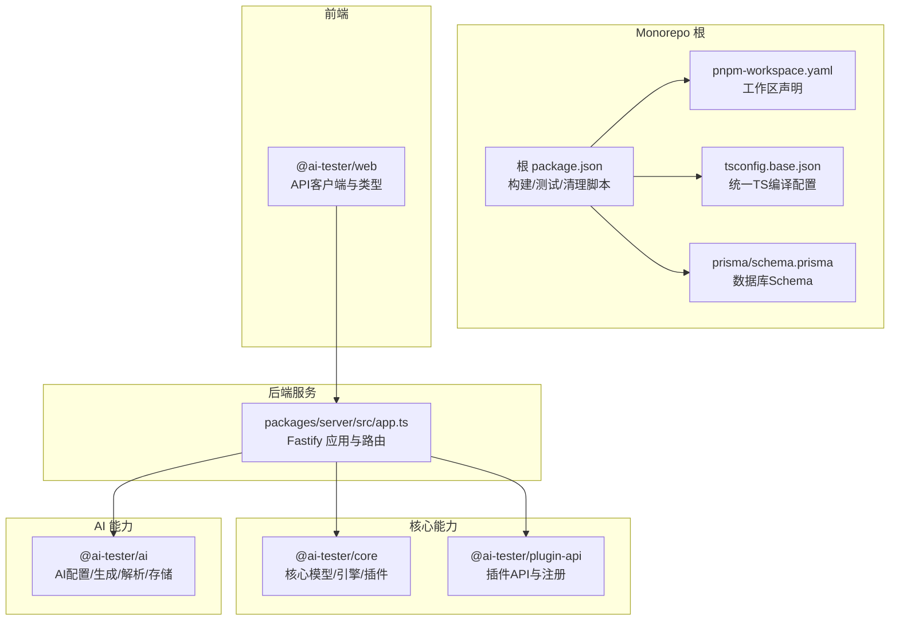
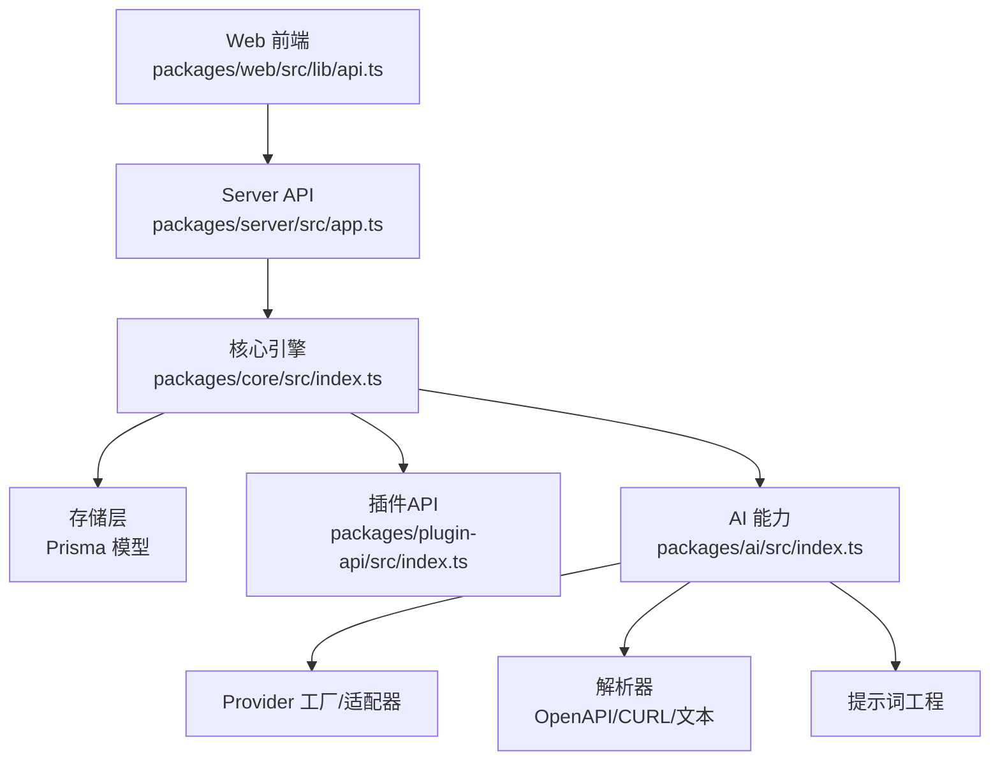
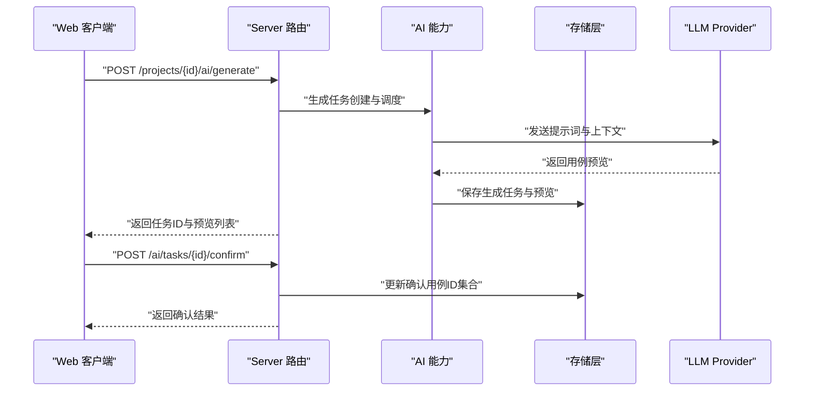
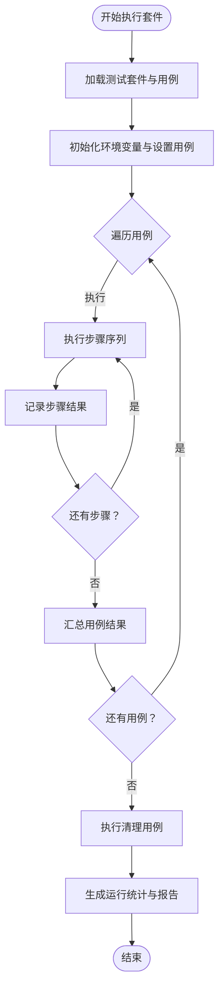
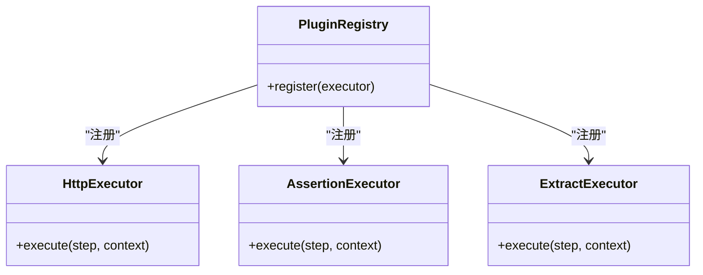
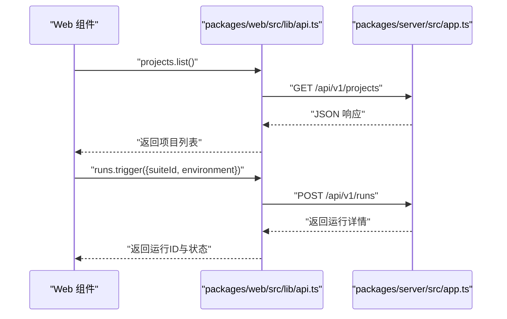
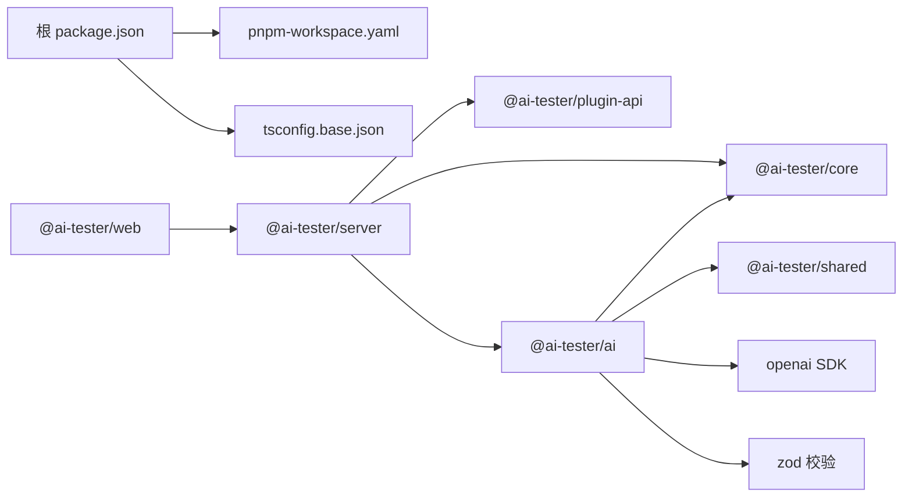

# 项目概述

<cite>
**本文引用的文件**
- [package.json](file://package.json)
- [pnpm-workspace.yaml](file://pnpm-workspace.yaml)
- [tsconfig.base.json](file://tsconfig.base.json)
- [prisma/schema.prisma](file://prisma/schema.prisma)
- [packages/ai/package.json](file://packages/ai/package.json)
- [packages/ai/src/index.ts](file://packages/ai/src/index.ts)
- [packages/core/src/index.ts](file://packages/core/src/index.ts)
- [packages/server/src/app.ts](file://packages/server/src/app.ts)
- [packages/web/src/lib/api.ts](file://packages/web/src/lib/api.ts)
- [packages/plugin-api/src/index.ts](file://packages/plugin-api/src/index.ts)
</cite>

## 目录
1. [引言](#引言)
2. [项目结构](#项目结构)
3. [核心组件](#核心组件)
4. [架构总览](#架构总览)
5. [详细组件分析](#详细组件分析)
6. [依赖分析](#依赖分析)
7. [性能考虑](#性能考虑)
8. [故障排查指南](#故障排查指南)
9. [结论](#结论)
10. [附录](#附录)

## 引言
AI测试器是一个基于Monorepo架构的AI驱动自动化测试平台，旨在通过大模型能力实现智能测试用例生成、测试套件编排与执行、以及测试结果的实时监控与可视化。项目围绕“知识即测试”的理念，将API端点定义、数据集、测试用例与运行状态统一建模，并通过可插拔的执行器体系支持HTTP请求、断言与变量提取等核心步骤类型。

本项目面向希望提升测试效率与质量的团队，尤其适用于需要快速覆盖复杂业务场景、降低手工维护成本、并具备持续集成与可观测性需求的组织。其价值主张包括：以AI辅助生成高质量测试用例、统一管理测试资产、标准化测试执行流程、以及提供Web端与API双入口的易用体验。

## 项目结构
项目采用pnpm工作区（pnpm-workspace）进行多包管理，根目录提供统一的构建、类型检查、测试与清理脚本；数据库Schema由Prisma定义，使用SQLite作为默认存储后端。核心包划分如下：
- packages/ai：AI相关能力封装，包括模型配置、提示词工程、解析器（OpenAPI/CURL/文本）、生成策略与任务管理、加密工具等。
- packages/core：核心引擎与模型层，包含项目、测试用例、测试套件、测试运行、数据集、执行器注册表等基础能力。
- packages/plugin-api：插件API与执行器注册，提供HTTP执行器、断言执行器、提取执行器等标准插件。
- packages/server：基于Fastify的REST服务，提供项目、用例、套件、运行、数据集、AI配置与生成任务等路由。
- packages/web：前端应用，提供API客户端封装与类型定义，用于调用后端接口并展示测试结果。
- shared：共享工具与类型（当前未在上下文中展开）。

**图表来源**
- [package.json:1-31](file://package.json#L1-L31)
- [pnpm-workspace.yaml:1-3](file://pnpm-workspace.yaml#L1-L3)
- [tsconfig.base.json:1-20](file://tsconfig.base.json#L1-L20)
- [prisma/schema.prisma:1-196](file://prisma/schema.prisma#L1-L196)
- [packages/server/src/app.ts:1-78](file://packages/server/src/app.ts#L1-L78)
- [packages/core/src/index.ts:1-5](file://packages/core/src/index.ts#L1-L5)
- [packages/plugin-api/src/index.ts:1-15](file://packages/plugin-api/src/index.ts#L1-L15)
- [packages/ai/src/index.ts:1-7](file://packages/ai/src/index.ts#L1-L7)
- [packages/web/src/lib/api.ts:1-325](file://packages/web/src/lib/api.ts#L1-L325)

**章节来源**
- [package.json:1-31](file://package.json#L1-L31)
- [pnpm-workspace.yaml:1-3](file://pnpm-workspace.yaml#L1-L3)
- [tsconfig.base.json:1-20](file://tsconfig.base.json#L1-L20)
- [prisma/schema.prisma:1-196](file://prisma/schema.prisma#L1-L196)

## 核心组件
- 项目（Project）：测试域的顶层容器，关联环境、测试用例、测试套件、数据集、AI配置与API端点。
- 测试用例（TestCase）：由有序步骤组成，支持模块化分组、标签、优先级与变量注入。
- 测试套件（TestSuite）：对多个测试用例进行编排，支持并行度、环境变量与设置/清理用例。
- 测试运行（TestRun）：一次套件执行的实例，记录状态、统计信息与触发来源。
- 测试用例结果（TestCaseResult）与步骤结果（TestStepResult）：逐粒度记录执行状态、耗时与断言细节。
- 数据集（TestDataSet）：结构化字段与行数据，支持在测试中动态注入参数。
- AI配置（AiConfig）：抽象不同Provider（如OpenAI、Anthropic、自定义）的模型参数与密钥管理。
- API端点（ApiEndpoint）：从OpenAPI/CURL/文本解析或手动录入的接口定义，作为AI生成测试用例的知识来源。
- 生成任务（GenerationTask）：AI生成测试用例的任务实体，支持多种策略与令牌用量统计。

这些组件共同构成测试资产全生命周期的数据模型，支撑从“知识抽取”到“用例生成”，再到“执行与观测”的闭环。

**章节来源**
- [prisma/schema.prisma:10-196](file://prisma/schema.prisma#L10-L196)

## 架构总览
系统采用前后端分离与插件化执行器的分层设计：
- 前端（packages/web）：通过API客户端封装调用后端REST接口，提供项目、用例、套件、运行与AI生成任务的管理界面。
- 后端（packages/server）：基于Fastify提供REST API，统一处理CORS、全局错误、健康检查与路由注册。
- 核心引擎（packages/core）：提供模型、存储、插件注册表与执行器框架，是测试执行的中枢。
- AI能力（packages/ai）：封装AI配置、提示词、解析器、生成策略与任务管理，连接外部LLM Provider。
- 插件API（packages/plugin-api）：定义标准执行器接口并注册HTTP/断言/提取等内置执行器。
- 数据存储（Prisma Schema）：以SQLite为默认后端，统一持久化所有测试资产与运行状态。

**图表来源**
- [packages/web/src/lib/api.ts:1-325](file://packages/web/src/lib/api.ts#L1-L325)
- [packages/server/src/app.ts:1-78](file://packages/server/src/app.ts#L1-L78)
- [packages/core/src/index.ts:1-5](file://packages/core/src/index.ts#L1-L5)
- [packages/plugin-api/src/index.ts:1-15](file://packages/plugin-api/src/index.ts#L1-L15)
- [packages/ai/src/index.ts:1-7](file://packages/ai/src/index.ts#L1-L7)
- [prisma/schema.prisma:1-196](file://prisma/schema.prisma#L1-L196)

## 详细组件分析

### 组件A：AI生成与任务管理
该组件负责将API端点知识转化为可执行的测试用例，支持多种生成策略与任务追踪。核心流程包括：接收端点集合与策略，调用AI Provider生成用例预览，用户确认后落库为正式用例，并记录任务状态与令牌用量。

**图表来源**
- [packages/web/src/lib/api.ts:313-324](file://packages/web/src/lib/api.ts#L313-L324)
- [packages/server/src/app.ts:1-78](file://packages/server/src/app.ts#L1-L78)
- [packages/ai/src/index.ts:1-7](file://packages/ai/src/index.ts#L1-L7)
- [prisma/schema.prisma:177-196](file://prisma/schema.prisma#L177-L196)

**章节来源**
- [packages/web/src/lib/api.ts:277-324](file://packages/web/src/lib/api.ts#L277-L324)
- [packages/ai/src/index.ts:1-7](file://packages/ai/src/index.ts#L1-L7)
- [prisma/schema.prisma:177-196](file://prisma/schema.prisma#L177-L196)

### 组件B：测试套件执行与监控
该组件负责将测试套件编排为可执行的测试运行，支持并行度控制、环境变量注入与设置/清理用例。执行过程中按步骤推进，记录每个步骤的请求、响应、断言与提取结果，并汇总为用例与运行级别的统计指标。

**图表来源**
- [prisma/schema.prisma:46-124](file://prisma/schema.prisma#L46-L124)
- [packages/core/src/index.ts:1-5](file://packages/core/src/index.ts#L1-L5)

**章节来源**
- [prisma/schema.prisma:46-124](file://prisma/schema.prisma#L46-L124)
- [packages/core/src/index.ts:1-5](file://packages/core/src/index.ts#L1-L5)

### 组件C：插件化执行器与扩展
插件API定义了标准的执行器接口，并在核心引擎中注册HTTP、断言与提取等执行器。通过插件机制，系统可以灵活扩展新的执行器类型，满足不同协议与断言需求。

**图表来源**
- [packages/plugin-api/src/index.ts:1-15](file://packages/plugin-api/src/index.ts#L1-L15)
- [packages/core/src/plugins/registry.ts](file://packages/core/src/plugins/registry.ts)

**章节来源**
- [packages/plugin-api/src/index.ts:1-15](file://packages/plugin-api/src/index.ts#L1-L15)

### 组件D：Web API客户端与类型
前端通过统一的API客户端封装调用后端接口，涵盖项目、用例、套件、运行、数据集、AI配置与生成任务等资源。客户端对响应进行标准化处理，并提供分页、错误抛出与类型约束。

**图表来源**
- [packages/web/src/lib/api.ts:1-325](file://packages/web/src/lib/api.ts#L1-L325)
- [packages/server/src/app.ts:1-78](file://packages/server/src/app.ts#L1-L78)

**章节来源**
- [packages/web/src/lib/api.ts:1-325](file://packages/web/src/lib/api.ts#L1-L325)

## 依赖分析
- Monorepo与构建：根package.json提供统一脚本，pnpm-workspace声明工作区，tsconfig.base.json统一编译选项。
- 外部依赖：Prisma用于ORM与Schema定义，OpenAI SDK用于LLM交互，Zod用于请求校验，Fastify用于高性能HTTP服务。
- 包间依赖：@ai-tester/ai依赖@ai-tester/core与@ai-tester/shared，server依赖core、plugin-api与ai，web依赖server提供的API。

**图表来源**
- [package.json:1-31](file://package.json#L1-L31)
- [pnpm-workspace.yaml:1-3](file://pnpm-workspace.yaml#L1-L3)
- [packages/ai/package.json:1-34](file://packages/ai/package.json#L1-L34)
- [packages/server/src/app.ts:1-78](file://packages/server/src/app.ts#L1-L78)

**章节来源**
- [package.json:1-31](file://package.json#L1-L31)
- [pnpm-workspace.yaml:1-3](file://pnpm-workspace.yaml#L1-L3)
- [packages/ai/package.json:1-34](file://packages/ai/package.json#L1-L34)

## 性能考虑
- 并行执行：测试套件支持并行度配置，可在保证稳定性前提下提升吞吐。
- 数据库索引：针对常用查询字段建立索引，减少查询延迟。
- 缓存与重试：对频繁访问的元数据与中间结果进行缓存，结合步骤级重试策略提升鲁棒性。
- 日志与监控：统一日志级别与错误处理，便于定位性能瓶颈与异常。

## 故障排查指南
- 健康检查：通过健康端点确认服务可用性与版本信息。
- 请求校验：Zod错误会统一返回结构化的验证错误，便于前端提示。
- 全局错误处理：非Zod错误会被记录并返回通用错误响应，便于定位问题。
- 环境变量：确保DATABASE_URL、LOG_LEVEL、HOST、PORT等环境变量正确配置。

**章节来源**
- [packages/server/src/app.ts:13-78](file://packages/server/src/app.ts#L13-L78)

## 结论
AI测试器通过Monorepo架构整合AI生成、核心引擎、插件执行器与Web前端，形成从“知识抽取—用例生成—执行监控”的完整链路。其模块化设计与可插拔执行器为后续扩展提供了坚实基础，适合在持续集成与交付场景中规模化落地。

## 附录
- 技术栈概览：TypeScript、Fastify、Prisma、OpenAI SDK、Zod、Vitest、Pnpm Workspaces。
- 数据模型概览：项目、测试用例、测试套件、测试运行、用例/步骤结果、数据集、AI配置、API端点、生成任务。